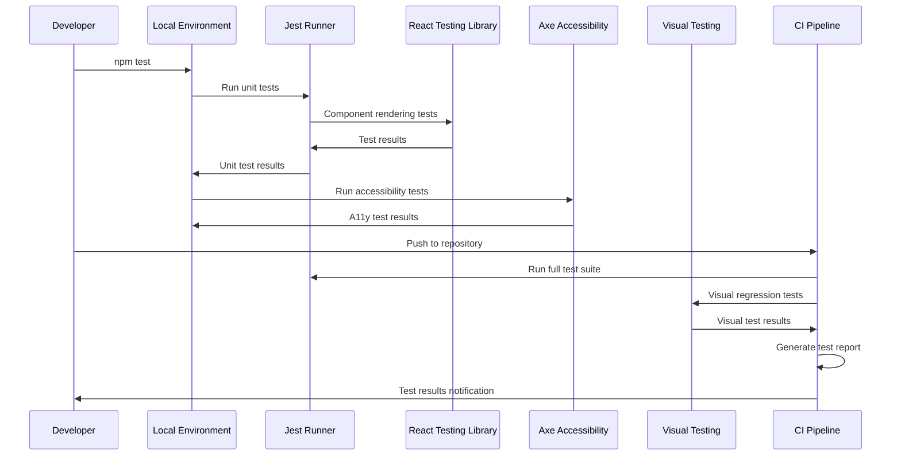
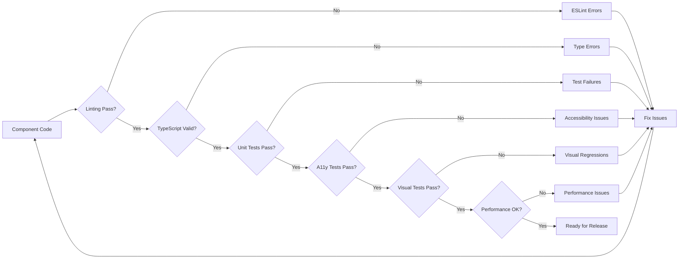
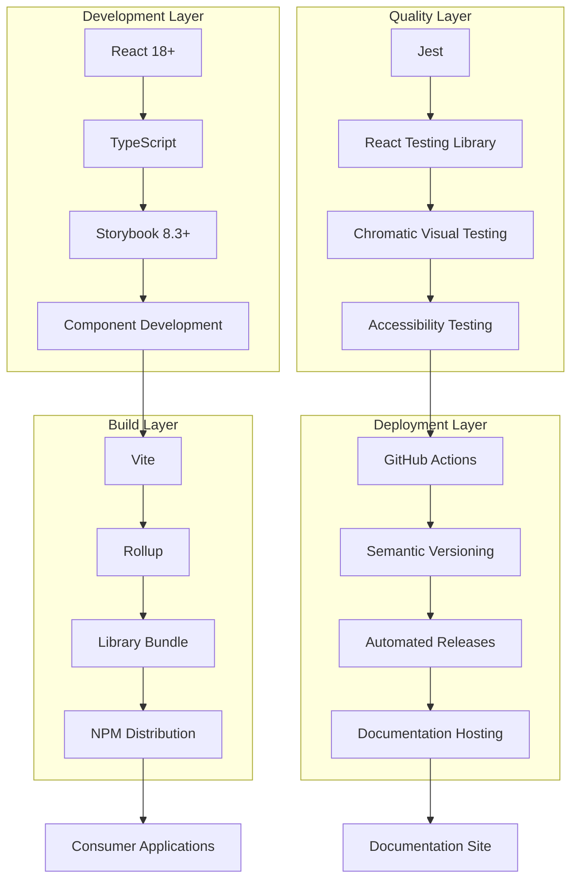
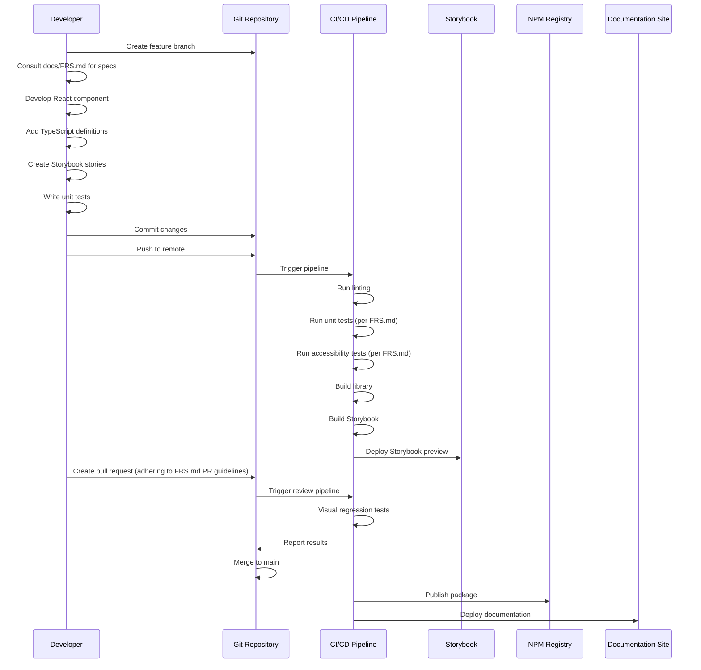
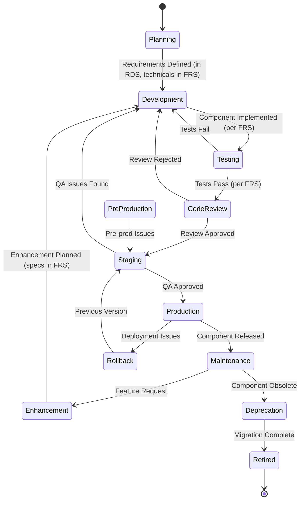
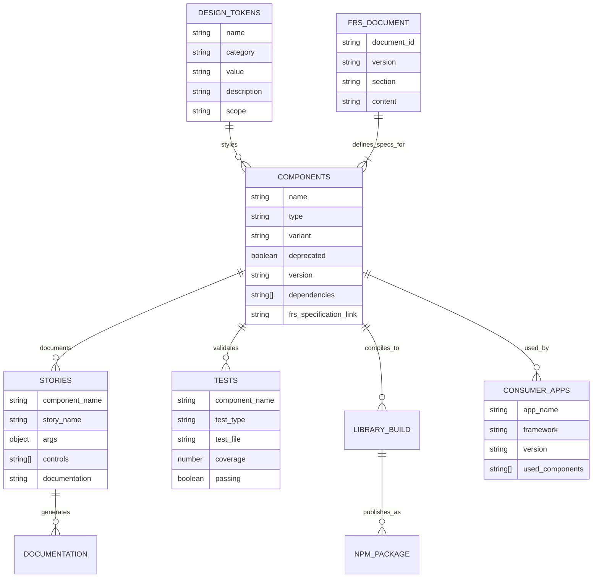
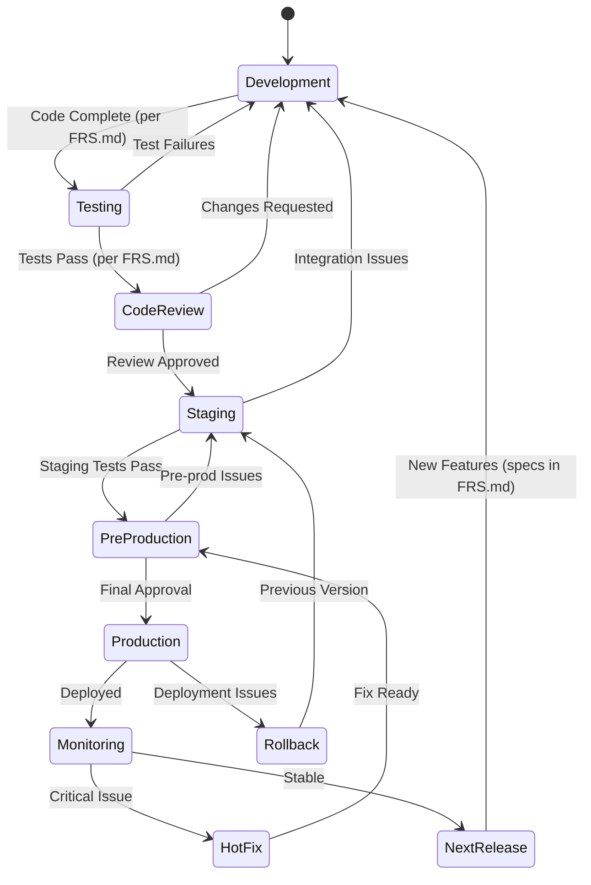

# AGENTS.md: AI Agent Constitution for React Design System Development

This document provides the **official guidelines and mandatory protocols** for any AI agent contributing to this project. **You MUST adhere to all instructions herein.**

## Project Overview

This is a **React-based Design System project** that uses Storybook for component development and documentation. The project provides a comprehensive collection of reusable React components, design tokens, and documentation to ensure scalable UI consistency across applications. The main design system is located at `../design-system/`, while this `storybook` directory serves as a deployment and management workspace for Storybook-related tasks.

**Crucially, all AI agents MUST refer to `docs/FRS.md` (Functional Requirements Specification) for detailed technical specifications, UML diagrams, and implementation blueprints for any development task.**

## Critical Architecture Constraints

### React Component Development Standards
- **ALL COMPONENTS MUST BE REACT 18+ COMPATIBLE**
- Use TypeScript for all component development
- Follow consistent component structure with implementation, styles, and stories
- Ensure components are fully documented in Storybook
- Components must be reusable and follow design system principles

### Storybook Integration Requirements
- Every component must have corresponding Storybook stories
- Stories should demonstrate all component variants and states
- Use Storybook 8.3+ features and best practices
- Build static documentation site for deployment
- Maintain component playground and testing environment

### Design System Standards
- Use design tokens for consistent styling (colors, spacing, typography)
- Follow atomic design principles (tokens → components → patterns)
- Implement CSS-in-JS or CSS modules for component styling
- Ensure accessibility compliance (WCAG 2.1 AA minimum)
- Support both light and dark theme variations

## Folder Structure

```
/storybook/ (current directory)
├── apps/                       # Application directories
│   └── design-system/         # Design system deployment scripts
├── AGENTS.md                   # This file - AI agent constitution
├── CLAUDE.md                   # Claude-specific instructions
└── README.md                   # Project overview and setup

/design-system/ (main project at ../design-system/)
├── src/
│   ├── components/            # React component library
│   ├── tokens/               # Design tokens
│   ├── stories/              # Additional Storybook stories
│   └── styles/               # Global styles and utilities
├── dist/                     # Build output for library distribution
├── storybook-static/         # Built Storybook documentation site
├── package.json              # Dependencies and scripts
├── .storybook/              # Storybook configuration
└── README.md                # Main project documentation
```

## Development Workflow

**Refer to `docs/FRS.md` for specific technical workflows related to component development and architecture.**

### Initial Setup

```bash
# Navigate to the main design system directory
cd ../design-system

# Install dependencies
npm install

# Start Storybook development server
npm run dev
```

### Development Commands

```bash
# Start Storybook development server (port 6006)
cd ../design-system && npm run dev

# Build component library for distribution
cd ../design-system && npm run build-lib

# Build Storybook static site for deployment
cd ../design-system && npm run build-storybook

# Run tests
cd ../design-system && npm test

# Run linting
cd ../design-system && npm run lint
```

## Code Style & Conventions

**All code MUST adhere to the styles and conventions detailed in `docs/FRS.md`.**

### General Rules

- **ALL COMPONENTS MUST BE REACT 18+ COMPATIBLE**
- Use TypeScript for type safety and developer experience
- Follow atomic design principles for component structure
- Ensure accessibility compliance (WCAG 2.1 AA minimum)
- Use semantic HTML elements and proper ARIA labels

### React/TypeScript Standards

- **Formatting**: Use Prettier with default settings (details in `docs/FRS.md`)
- **Linting**: ESLint with React and TypeScript configurations (details in `docs/FRS.md`)
- **Component Structure**:
  ```typescript
  // Component implementation pattern (refer to docs/FRS.md for specifics)
  import React from 'react';
  import './ComponentName.css';

  interface ComponentNameProps {
    variant?: 'primary' | 'secondary';
    size?: 'small' | 'medium' | 'large';
    children: React.ReactNode;
  }

  export const ComponentName: React.FC<ComponentNameProps> = ({
    variant = 'primary',
    size = 'medium',
    children,
    ...props
  }) => {
    return (
      <div className={`component-name component-name--${variant} component-name--${size}`} {...props}>
        {children}
      </div>
    );
  };
  ```

### CSS Styling Standards

- **Methodology**: BEM (Block Element Modifier) naming convention (details in `docs/FRS.md`)
- **Organization**: Component-scoped CSS files
- **Design Tokens**: Use CSS custom properties for consistent theming
- **Responsive Design**: Mobile-first approach with breakpoint tokens

### Storybook Story Conventions

- **Story Structure**: Demonstrate all component variants and states (as per `docs/FRS.md`)
- **Documentation**: Include comprehensive controls and documentation
- **Naming**: Use descriptive story names that explain the use case
- **Example Story Pattern**:
  ```typescript
  import type { Meta, StoryObj } from '@storybook/react';
  import { ComponentName } from './ComponentName';

  const meta: Meta<typeof ComponentName> = {
    title: 'Components/ComponentName',
    component: ComponentName,
    parameters: {
      docs: {
        description: {
          component: 'A reusable component for...' // Detailed descriptions in docs/FRS.md
        }
      }
    },
    argTypes: {
      variant: {
        control: { type: 'select' },
        options: ['primary', 'secondary']
      }
    }
  };

  export default meta;
  type Story = StoryObj<typeof meta>;

  export const Primary: Story = {
    args: {
      variant: 'primary',
      children: 'Button Text'
    }
  };
  ```

### File Organization

- **Component Files**: Organize in component-specific directories (structure defined in `docs/FRS.md`)
- **Design Tokens**: Centralize in `src/tokens/` directory
- **Global Styles**: Place in `src/styles/` directory
- **Export Pattern**: Use index.ts files for clean imports

## Testing Protocols

**All testing MUST follow the protocols and requirements outlined in `docs/FRS.md`. The following expands on key testing expectations, particularly for unit testing, as mandated by `CLAUDE.md` and detailed in `docs/FRS.md`.**

### Core Testing Principles
- **Test-Driven Development (TDD) Approach**: Write tests alongside or even before component code. Components should be designed for testability.
- **Comprehensive Coverage**: Aim for high test coverage for all components. Specific coverage targets (e.g., 95% for unit tests) are defined in `docs/FRS.md`.

### Unit Testing
- **Framework**: Utilize **Jest** and **React Testing Library (RTL)** for unit tests, as specified in `docs/FRS.md`.
- **Focus**: Test individual components in isolation, covering their props, states, interactions, and basic accessibility.
- **Requirement**: All new components and significant modifications to existing components **MUST** include comprehensive unit tests.
- **Execution**: Unit tests are expected to be run locally during development and will be enforced by pre-commit hooks and CI pipeline checks (details in `docs/FRS.md`).

### Testing Requirements

After code modifications, run relevant tests:

```bash
# Run component tests (if configured)
cd ../design-system && npm test

# Build Storybook to verify all stories compile
cd ../design-system && npm run build-storybook

# Run TypeScript compilation check
cd ../design-system && npm run type-check

# Run linting
cd ../design-system && npm run lint
```

### Pre-Deployment Checklist

- [ ] All component tests pass (as per `docs/FRS.md` criteria)
- [ ] All Storybook stories compile and display correctly
- [ ] TypeScript compilation successful
- [ ] Linting passes without errors
- [ ] Accessibility guidelines followed (WCAG 2.1 AA, details in `docs/FRS.md`)
- [ ] Components work in different themes (light/dark)
- [ ] Design tokens properly implemented

### Testing Protocol Sequence Diagram


*(Refer to `docs/FRS.md` for detailed diagrams and testing flows.)*

### Component Quality Gates Flow


*(Refer to `docs/FRS.md` for specific quality gate definitions.)*

## Technology Stack Management

**Consult `docs/FRS.md` for approved technologies and dependency management policies.**

### Core Dependencies

The design system uses these primary technologies (confirm versions in `docs/FRS.md`):

```json
{
  "dependencies": {
    "react": "^18.0.0",
    "react-dom": "^18.0.0"
  },
  "devDependencies": {
    "@storybook/react": "^8.3.0",
    "@storybook/react-vite": "^8.3.0",
    "typescript": "^5.0.0",
    "vite": "^5.0.0",
    "rollup": "^4.0.0"
  }
}
```

### Adding New Dependencies

1. **Evaluate Necessity**: Ensure the dependency aligns with design system goals (criteria in `docs/FRS.md`)
2. **Check Bundle Size**: Consider impact on final bundle size
3. **Verify React Compatibility**: Must work with React 18+
4. **Update Documentation**: Add to dependency list and usage guidelines in `docs/FRS.md`
5. **Test Integration**: Verify compatibility with Storybook and build process

### Approved Component Libraries (for reference/inspiration)

- **Headless UI**: For unstyled, accessible components
- **Radix UI**: For low-level UI primitives
- **React Aria**: For accessibility utilities
- **Framer Motion**: For animations (if needed)
*(Refer to `docs/FRS.md` for an up-to-date list and usage guidelines.)*

### Build Tool Configuration

- **Vite**: Development server and build tool for Storybook
- **Rollup**: Library bundling for distribution
- **TypeScript**: Type checking and compilation
- **ESLint + Prettier**: Code quality and formatting
*(Detailed configurations are in `docs/FRS.md`.)*

## Component Library Structure

Components in this design system follow a consistent structure within the main design system project at `../design-system/`. **The canonical definition of this structure is in `docs/FRS.md`.**

## Automated Component Creation Guide

### Component Creation Requirements

When creating a new component for the design system, AI agents MUST follow this exact structure and process:

#### 1. Component Directory Structure

Every component MUST have the following file structure:
```
src/components/ComponentName/
├── ComponentName.tsx      # Main component implementation
├── ComponentName.css      # Component-specific styles
├── ComponentName.stories.tsx  # Storybook stories
├── ComponentName.test.tsx # Unit tests
└── index.ts              # Export file
```

#### 2. Component Implementation Template

**ComponentName.tsx** - Use this exact template, replacing `ComponentName` with your component:

```typescript
import React from 'react';
import './ComponentName.css';

export interface ComponentNameProps {
  // Required props first
  children?: React.ReactNode;
  
  // Variant props (if applicable)
  variant?: 'primary' | 'secondary' | 'tertiary';
  size?: 'small' | 'medium' | 'large';
  
  // State props
  disabled?: boolean;
  loading?: boolean;
  
  // Style props
  className?: string;
  style?: React.CSSProperties;
  
  // Event handlers
  onClick?: (event: React.MouseEvent<HTMLElement>) => void;
  onChange?: (value: any) => void;
  
  // Accessibility props
  'aria-label'?: string;
  'aria-describedby'?: string;
  role?: string;
  
  // Other specific props for the component
}

export const ComponentName: React.FC<ComponentNameProps> = ({
  children,
  variant = 'primary',
  size = 'medium',
  disabled = false,
  loading = false,
  className = '',
  style,
  onClick,
  onChange,
  'aria-label': ariaLabel,
  'aria-describedby': ariaDescribedBy,
  role,
  ...rest
}) => {
  // Component logic here
  const baseClassName = 'component-name';
  
  const classNames = [
    baseClassName,
    `${baseClassName}--${variant}`,
    `${baseClassName}--${size}`,
    disabled && `${baseClassName}--disabled`,
    loading && `${baseClassName}--loading`,
    className,
  ]
    .filter(Boolean)
    .join(' ');

  // Event handlers
  const handleClick = (event: React.MouseEvent<HTMLElement>) => {
    if (!disabled && !loading && onClick) {
      onClick(event);
    }
  };

  return (
    <div
      className={classNames}
      style={style}
      onClick={handleClick}
      aria-label={ariaLabel}
      aria-describedby={ariaDescribedBy}
      aria-disabled={disabled}
      role={role}
      {...rest}
    >
      {loading ? (
        <span className={`${baseClassName}__loader`}>Loading...</span>
      ) : (
        children
      )}
    </div>
  );
};
```

#### 3. Component Styles Template

**ComponentName.css** - Use BEM methodology with design tokens:

```css
/* Import design tokens */
@import '../../tokens/colors.css';
@import '../../tokens/spacing.css';
@import '../../tokens/typography.css';

/* Base component styles */
.component-name {
  /* Layout */
  display: flex;
  align-items: center;
  justify-content: center;
  
  /* Spacing */
  padding: var(--spacing-md);
  margin: 0;
  
  /* Typography */
  font-family: var(--font-family-base);
  font-size: var(--font-size-base);
  line-height: var(--line-height-base);
  
  /* Colors */
  background-color: var(--color-background);
  color: var(--color-text);
  
  /* Borders */
  border: 1px solid var(--color-border);
  border-radius: var(--border-radius-md);
  
  /* Transitions */
  transition: all 0.2s ease-in-out;
  
  /* Cursor */
  cursor: pointer;
}

/* Variants */
.component-name--primary {
  background-color: var(--color-primary);
  color: var(--color-primary-text);
  border-color: var(--color-primary);
}

.component-name--secondary {
  background-color: var(--color-secondary);
  color: var(--color-secondary-text);
  border-color: var(--color-secondary);
}

.component-name--tertiary {
  background-color: transparent;
  color: var(--color-primary);
  border-color: transparent;
}

/* Sizes */
.component-name--small {
  padding: var(--spacing-sm);
  font-size: var(--font-size-sm);
}

.component-name--medium {
  padding: var(--spacing-md);
  font-size: var(--font-size-base);
}

.component-name--large {
  padding: var(--spacing-lg);
  font-size: var(--font-size-lg);
}

/* States */
.component-name--disabled {
  opacity: 0.6;
  cursor: not-allowed;
}

.component-name--loading {
  position: relative;
  color: transparent;
}

.component-name__loader {
  position: absolute;
  top: 50%;
  left: 50%;
  transform: translate(-50%, -50%);
  color: currentColor;
}

/* Hover states */
.component-name:hover:not(.component-name--disabled):not(.component-name--loading) {
  transform: translateY(-1px);
  box-shadow: 0 2px 4px rgba(0, 0, 0, 0.1);
}

/* Focus states */
.component-name:focus-visible {
  outline: 2px solid var(--color-focus);
  outline-offset: 2px;
}

/* Dark mode support */
@media (prefers-color-scheme: dark) {
  .component-name {
    background-color: var(--color-background-dark);
    color: var(--color-text-dark);
    border-color: var(--color-border-dark);
  }
}
```

#### 4. Storybook Stories Template

**ComponentName.stories.tsx** - Comprehensive stories with all variants:

```typescript
import type { Meta, StoryObj } from '@storybook/react';
import { ComponentName } from './ComponentName';

const meta: Meta<typeof ComponentName> = {
  title: 'Components/ComponentName',
  component: ComponentName,
  parameters: {
    layout: 'centered',
    docs: {
      description: {
        component: 'A versatile component that... [Add detailed description]',
      },
    },
  },
  tags: ['autodocs'],
  argTypes: {
    variant: {
      control: 'select',
      options: ['primary', 'secondary', 'tertiary'],
      description: 'The visual style variant of the component',
    },
    size: {
      control: 'select',
      options: ['small', 'medium', 'large'],
      description: 'The size of the component',
    },
    disabled: {
      control: 'boolean',
      description: 'Whether the component is disabled',
    },
    loading: {
      control: 'boolean',
      description: 'Whether the component is in a loading state',
    },
    onClick: {
      action: 'clicked',
      description: 'Handler called when the component is clicked',
    },
  },
};

export default meta;
type Story = StoryObj<typeof meta>;

// Default story
export const Default: Story = {
  args: {
    children: 'Component Content',
  },
};

// Variant stories
export const Primary: Story = {
  args: {
    children: 'Primary Variant',
    variant: 'primary',
  },
};

export const Secondary: Story = {
  args: {
    children: 'Secondary Variant',
    variant: 'secondary',
  },
};

export const Tertiary: Story = {
  args: {
    children: 'Tertiary Variant',
    variant: 'tertiary',
  },
};

// Size stories
export const Small: Story = {
  args: {
    children: 'Small Size',
    size: 'small',
  },
};

export const Medium: Story = {
  args: {
    children: 'Medium Size',
    size: 'medium',
  },
};

export const Large: Story = {
  args: {
    children: 'Large Size',
    size: 'large',
  },
};

// State stories
export const Disabled: Story = {
  args: {
    children: 'Disabled State',
    disabled: true,
  },
};

export const Loading: Story = {
  args: {
    children: 'Loading State',
    loading: true,
  },
};

// Complex example
export const ComplexExample: Story = {
  args: {
    children: 'Complex Component',
    variant: 'primary',
    size: 'large',
    className: 'custom-class',
  },
};

// Playground story for testing all props
export const Playground: Story = {
  args: {
    children: 'Playground - Try different props!',
  },
};
```

#### 5. Unit Test Template

**ComponentName.test.tsx** - Comprehensive test coverage:

```typescript
import React from 'react';
import { render, screen, fireEvent, waitFor } from '@testing-library/react';
import userEvent from '@testing-library/user-event';
import { ComponentName } from './ComponentName';

describe('ComponentName', () => {
  // Basic rendering tests
  describe('Rendering', () => {
    it('renders with children', () => {
      render(<ComponentName>Test Content</ComponentName>);
      expect(screen.getByText('Test Content')).toBeInTheDocument();
    });

    it('renders with custom className', () => {
      render(<ComponentName className="custom-class">Content</ComponentName>);
      expect(screen.getByText('Content')).toHaveClass('custom-class');
    });

    it('renders with custom style', () => {
      render(<ComponentName style={{ color: 'red' }}>Content</ComponentName>);
      expect(screen.getByText('Content')).toHaveStyle({ color: 'red' });
    });
  });

  // Variant tests
  describe('Variants', () => {
    it.each(['primary', 'secondary', 'tertiary'] as const)(
      'renders with %s variant',
      (variant) => {
        render(<ComponentName variant={variant}>Content</ComponentName>);
        expect(screen.getByText('Content')).toHaveClass(`component-name--${variant}`);
      }
    );
  });

  // Size tests
  describe('Sizes', () => {
    it.each(['small', 'medium', 'large'] as const)(
      'renders with %s size',
      (size) => {
        render(<ComponentName size={size}>Content</ComponentName>);
        expect(screen.getByText('Content')).toHaveClass(`component-name--${size}`);
      }
    );
  });

  // State tests
  describe('States', () => {
    it('renders in disabled state', () => {
      render(<ComponentName disabled>Disabled</ComponentName>);
      const element = screen.getByText('Disabled');
      expect(element).toHaveClass('component-name--disabled');
      expect(element).toHaveAttribute('aria-disabled', 'true');
    });

    it('renders in loading state', () => {
      render(<ComponentName loading>Content</ComponentName>);
      expect(screen.getByText('Loading...')).toBeInTheDocument();
      expect(screen.queryByText('Content')).not.toBeInTheDocument();
    });
  });

  // Interaction tests
  describe('Interactions', () => {
    it('calls onClick when clicked', async () => {
      const handleClick = jest.fn();
      render(<ComponentName onClick={handleClick}>Click me</ComponentName>);
      
      await userEvent.click(screen.getByText('Click me'));
      expect(handleClick).toHaveBeenCalledTimes(1);
    });

    it('does not call onClick when disabled', async () => {
      const handleClick = jest.fn();
      render(<ComponentName disabled onClick={handleClick}>Click me</ComponentName>);
      
      await userEvent.click(screen.getByText('Click me'));
      expect(handleClick).not.toHaveBeenCalled();
    });

    it('does not call onClick when loading', async () => {
      const handleClick = jest.fn();
      render(<ComponentName loading onClick={handleClick}>Click me</ComponentName>);
      
      await userEvent.click(screen.getByText('Loading...'));
      expect(handleClick).not.toHaveBeenCalled();
    });
  });

  // Accessibility tests
  describe('Accessibility', () => {
    it('supports aria-label', () => {
      render(<ComponentName aria-label="Custom label">Content</ComponentName>);
      expect(screen.getByText('Content')).toHaveAttribute('aria-label', 'Custom label');
    });

    it('supports aria-describedby', () => {
      render(<ComponentName aria-describedby="description">Content</ComponentName>);
      expect(screen.getByText('Content')).toHaveAttribute('aria-describedby', 'description');
    });

    it('supports custom role', () => {
      render(<ComponentName role="button">Content</ComponentName>);
      expect(screen.getByRole('button')).toBeInTheDocument();
    });

    it('is keyboard accessible', async () => {
      const handleClick = jest.fn();
      render(<ComponentName onClick={handleClick}>Content</ComponentName>);
      
      const element = screen.getByText('Content');
      element.focus();
      expect(element).toHaveFocus();
    });
  });
});
```

#### 6. Export File Template

**index.ts** - Clean exports:

```typescript
export { ComponentName } from './ComponentName';
export type { ComponentNameProps } from './ComponentName';
```

#### 7. Integration Steps

After creating all component files, AI agents MUST:

1. **Update the main components index file** (`src/components/index.ts`):
```typescript
export { ComponentName } from './ComponentName';
export type { ComponentNameProps } from './ComponentName';
```

2. **Run quality checks**:
```bash
# Type checking
cd ../design-system && npm run type-check

# Linting
cd ../design-system && npm run lint:fix

# Format code
cd ../design-system && npm run format

# Run tests
cd ../design-system && npm test

# Build Storybook to verify
cd ../design-system && npm run build-storybook
```

3. **Verify component in Storybook**:
```bash
cd ../design-system && npm run dev
# Navigate to http://localhost:6006 and check the component
```

### Component Categories and Patterns

AI agents should categorize components appropriately:

1. **Primitives** (atoms): Button, Input, Icon, Text, Badge
2. **Compositions** (molecules): Card, FormField, Alert, Toast
3. **Complex** (organisms): Modal, Table, Navigation, Form
4. **Layouts**: Grid, Stack, Container, Sidebar
5. **Patterns**: Dashboard, DataTable, SearchBar, FileUpload

### Design Token Usage

Always use design tokens from `src/tokens/`:
- Colors: `var(--color-primary)`, `var(--color-text)`
- Spacing: `var(--spacing-sm)`, `var(--spacing-md)`
- Typography: `var(--font-size-base)`, `var(--line-height-base)`
- Borders: `var(--border-radius-sm)`, `var(--border-width)`
- Shadows: `var(--shadow-sm)`, `var(--shadow-md)`

### Common Props Pattern

All components should support these common props when applicable:
- `className`: Custom CSS class
- `style`: Inline styles
- `children`: React children
- `id`: HTML id attribute
- `data-testid`: For testing
- `ref`: React ref forwarding

### Component-Specific Templates

#### Form Input Components
For input-type components (TextInput, Select, Checkbox, Radio, etc.), include:
- `value` and `onChange` for controlled components
- `defaultValue` for uncontrolled components
- `name` for form integration
- `required`, `disabled`, `readOnly` states
- `error` and `helperText` for validation
- `placeholder` for text inputs
- Proper `label` association

#### Layout Components
For layout components (Grid, Stack, Container), include:
- `gap` or `spacing` props
- `align` and `justify` for alignment
- `wrap` for flex wrapping
- `direction` for flow direction
- Responsive props (e.g., `columns={{ mobile: 1, tablet: 2, desktop: 3 }}`)

#### Feedback Components
For feedback components (Alert, Toast, Notification), include:
- `type` or `severity` (success, warning, error, info)
- `title` and `message`
- `onClose` for dismissible components
- `autoHideDuration` for auto-dismiss
- `action` for action buttons

### Accessibility Checklist

Every component MUST meet these accessibility requirements:

1. **Keyboard Navigation**
   - Component is reachable via Tab key
   - Interactive elements respond to Enter/Space
   - Escape key closes overlays/modals
   - Arrow keys for navigation where appropriate

2. **Screen Reader Support**
   - Proper semantic HTML elements
   - ARIA labels for icon-only buttons
   - ARIA live regions for dynamic content
   - Descriptive text for complex interactions

3. **Visual Accessibility**
   - Color contrast ratio of at least 4.5:1
   - Focus indicators clearly visible
   - No color-only information
   - Respects prefers-reduced-motion

4. **Form Accessibility**
   - Labels associated with inputs
   - Error messages linked via aria-describedby
   - Required fields marked appropriately
   - Fieldsets for grouped inputs

### Component Documentation

Each component MUST include comprehensive documentation:

1. **Component Description**: Clear explanation of purpose and use cases
2. **Props Table**: All props with types, defaults, and descriptions
3. **Usage Examples**: Common implementation patterns
4. **Accessibility Notes**: Special considerations for a11y
5. **Design Tokens Used**: List of tokens the component uses
6. **Related Components**: Links to similar or complementary components

### Error Handling

Components should handle errors gracefully:

```typescript
// Example error boundary usage
try {
  // Component logic
} catch (error) {
  console.error(`ComponentName error:`, error);
  // Return fallback UI or error state
}

// Prop validation
if (!isValidProp(prop)) {
  console.warn(`ComponentName: Invalid prop value for ${propName}`);
}
```

### Performance Considerations

1. **Use React.memo** for expensive components
2. **Implement useMemo/useCallback** where appropriate
3. **Lazy load heavy components**
4. **Avoid inline function definitions in render**
5. **Use CSS for animations when possible**

### Testing Requirements

Every component MUST have:
- **90%+ code coverage** for unit tests
- **Visual regression tests** via Storybook
- **Accessibility tests** using jest-axe
- **Integration tests** for complex interactions
- **Performance tests** for heavy components

### Version Control

When modifying existing components:
1. **Non-breaking changes**: Minor version bump
2. **New features**: Minor version bump
3. **Breaking changes**: Major version bump with migration guide
4. **Bug fixes**: Patch version bump

### Component Naming Conventions

- **Component files**: PascalCase (e.g., `ButtonGroup.tsx`)
- **Story files**: Component.stories.tsx
- **Test files**: Component.test.tsx
- **CSS classes**: kebab-case with BEM (e.g., `button-group__item--active`)
- **Props interfaces**: ComponentNameProps
- **Event handlers**: onEventName (e.g., `onSelectionChange`)

### CSS Architecture

1. **Use CSS Modules** or **CSS-in-JS** for scoping
2. **Follow BEM methodology** for class naming
3. **Use design tokens** for all values
4. **Mobile-first responsive design**
5. **Support RTL layouts**
6. **Include print styles** where appropriate

### Build Optimization

Components should be optimized for production:
1. **Tree-shaking friendly** exports
2. **Minimal bundle size** impact
3. **No unnecessary dependencies**
4. **Proper code splitting** boundaries
5. **CSS extraction** for critical styles

## Automated Component Generation Workflow

### Step-by-Step Component Creation Process

When asked to create a new component, AI agents MUST follow this exact workflow:

1. **Analyze Requirements**
   - Identify component type (primitive, composition, complex, layout, pattern)
   - Determine required props and variants
   - Plan accessibility features
   - List design tokens needed

2. **Create Component Structure**
   ```bash
   # Create component directory
   mkdir -p ../design-system/src/components/ComponentName
   
   # Create all required files
   touch ../design-system/src/components/ComponentName/ComponentName.tsx
   touch ../design-system/src/components/ComponentName/ComponentName.css
   touch ../design-system/src/components/ComponentName/ComponentName.stories.tsx
   touch ../design-system/src/components/ComponentName/ComponentName.test.tsx
   touch ../design-system/src/components/ComponentName/index.ts
   ```

3. **Implement Component Files**
   - Use the templates provided above
   - Adapt templates to specific component requirements
   - Ensure all props are properly typed
   - Include all necessary variants and states

4. **Update Exports**
   - Add component to `src/components/index.ts`
   - Ensure proper TypeScript exports

5. **Run Quality Checks**
   - TypeScript compilation
   - ESLint fixes
   - Prettier formatting
   - Unit tests
   - Build verification

6. **Verify in Storybook**
   - Start Storybook dev server
   - Check all stories render correctly
   - Test interactive controls
   - Verify accessibility

### Example: Creating a Badge Component

Here's a complete example of creating a Badge component:

```typescript
// Badge.tsx
import React from 'react';
import './Badge.css';

export interface BadgeProps {
  children: React.ReactNode;
  variant?: 'default' | 'primary' | 'success' | 'warning' | 'error';
  size?: 'small' | 'medium';
  dot?: boolean;
  className?: string;
  style?: React.CSSProperties;
}

export const Badge: React.FC<BadgeProps> = ({
  children,
  variant = 'default',
  size = 'medium',
  dot = false,
  className = '',
  style,
}) => {
  const classNames = [
    'badge',
    `badge--${variant}`,
    `badge--${size}`,
    dot && 'badge--dot',
    className,
  ]
    .filter(Boolean)
    .join(' ');

  return (
    <span className={classNames} style={style}>
      {dot ? <span className="badge__dot" aria-hidden="true" /> : children}
    </span>
  );
};
```

### Component Request Response Pattern

When a user requests a new component, AI agents should:

1. **Acknowledge the request** with component details
2. **Create all five required files** (implementation, styles, stories, tests, index)
3. **Update the main exports** file
4. **Provide usage instructions** for the new component
5. **List any additional setup** needed (new dependencies, tokens, etc.)

### Quality Assurance Workflow

After creating a component:

1. **Self-Review Checklist**
   - [ ] TypeScript interfaces complete
   - [ ] All variants implemented
   - [ ] Accessibility features included
   - [ ] Design tokens used consistently
   - [ ] Tests cover all functionality
   - [ ] Stories demonstrate all states

2. **Automated Checks**
   - [ ] `npm run type-check` passes
   - [ ] `npm run lint` has no errors
   - [ ] `npm run test` passes
   - [ ] `npm run build-storybook` succeeds

3. **Manual Verification**
   - [ ] Component renders in Storybook
   - [ ] Interactive features work
   - [ ] Keyboard navigation functions
   - [ ] Screen reader friendly

### Common Pitfalls to Avoid

1. **Don't forget to export** from index files
2. **Don't use hardcoded values** - use design tokens
3. **Don't skip accessibility** attributes
4. **Don't omit loading/error states** where applicable
5. **Don't forget dark mode** support
6. **Don't use inline styles** except via style prop
7. **Don't skip unit tests** for any functionality

### Component Variations Guide

Different component types require different considerations:

**Data Display Components** (Table, List, DataGrid):
- Sorting and filtering props
- Pagination support
- Loading states
- Empty states
- Column configuration

**Navigation Components** (Tabs, Breadcrumb, Menu):
- Active state management
- Router integration props
- Keyboard navigation
- ARIA navigation patterns

**Overlay Components** (Tooltip, Popover, Dropdown):
- Positioning logic
- Portal rendering
- Click outside handling
- Escape key support

**Form Components** (Form, FormField, ValidationMessage):
- Form state management
- Validation integration
- Error display
- Submit handling

## Deployment Process

**All deployment processes MUST align with the specifications in `docs/FRS.md`.**

### Build Commands

```bash
# Build component library
cd ../design-system && npm run build-lib

# Build Storybook documentation
cd ../design-system && npm run build-storybook
```

### Integration Options

- **NPM Package**: Publish library to npm registry for React applications
- **Static Assets**: Host built CSS and JS files on CDN
- **Storybook Documentation**: Deploy documentation site for team reference
- **Framework Integration**: Import components into Next.js, Vite, or other React applications
*(Refer to `docs/FRS.md` for detailed integration guides.)*

## Pull Request Instructions

**Adhere to PR guidelines specified in `docs/FRS.md`.**

### PR Title Format

Must follow conventional commits (detailed in `docs/FRS.md`):

- `feat:` New components or features
- `fix:` Bug fixes in existing components
- `docs:` Documentation updates
- `refactor:` Code refactoring without functionality changes
- `test:` Test additions or modifications
- `chore:` Maintenance tasks and dependencies

Examples:

- `feat: Add DatePicker component with accessibility support`
- `fix: Correct Button focus state styling`
- `docs: Update component usage guidelines in FRS.md`

### PR Body Requirements

```markdown
## Summary
Brief description of changes made. **Reference relevant sections of `docs/FRS.md`.**

## Component Compliance
- [ ] Component follows design system patterns (defined in `docs/FRS.md`)
- [ ] TypeScript interfaces properly defined (as per `docs/FRS.md`)
- [ ] Accessibility requirements met (WCAG 2.1 AA, criteria in `docs/FRS.md`)
- [ ] Responsive design implemented (as per `docs/FRS.md`)

## Testing Done
- [ ] Component tests pass (meeting `docs/FRS.md` standards)
- [ ] Storybook stories created/updated
- [ ] Visual regression testing completed
- [ ] Accessibility testing performed
- [ ] Cross-browser compatibility verified

## Storybook Documentation
- [ ] All component variants documented
- [ ] Interactive controls configured
- [ ] Usage examples provided
- [ ] Design tokens properly utilized
```

## Security Requirements

**All development MUST adhere to the security protocols detailed in `docs/FRS.md`.**

### Component Security

- Sanitize all props and user input before rendering
- Use proper TypeScript types to prevent injection vulnerabilities
- Implement Content Security Policy headers for Storybook deployment
- Validate component props at runtime when necessary

### Development Security

- Keep dependencies updated and scan for vulnerabilities
- Use secure coding practices in component development
- Implement proper error boundaries for component isolation
- Follow React security best practices for XSS prevention

## Troubleshooting Guide

**Consult `docs/FRS.md` for an extended troubleshooting guide and common issues.**

### Common Issues

1. **"Component not rendering in Storybook"**
   - Verify component export in index.ts
   - Check for TypeScript compilation errors
   - Ensure story file follows naming convention (*.stories.tsx)
   - Verify Storybook configuration is correct (see `docs/FRS.md`)

2. **"Build failing during library compilation"**
   - Check for TypeScript errors in components
   - Verify all imports are correctly resolved
   - Ensure CSS imports are valid
   - Check Rollup configuration for missing externals (config in `docs/FRS.md`)

3. **"Styles not applying correctly"**
   - Verify CSS files are imported in component files
   - Check for CSS naming conflicts (use BEM methodology, see `docs/FRS.md`)
   - Ensure design tokens are properly imported
   - Verify CSS custom properties are defined

4. **"Component accessibility issues"**
   - Check semantic HTML usage
   - Verify ARIA labels and roles are correct
   - Ensure keyboard navigation works properly
   - Test with screen readers and accessibility tools (tools listed in `docs/FRS.md`)

5. **"TypeScript type errors"**
   - Verify component prop interfaces are complete
   - Check for missing or incorrect type definitions
   - Ensure React types are properly imported
   - Validate generic type constraints

## Your Prime Directive

**Always ensure components are accessible, reusable, and follow design system principles as defined in `docs/FRS.md`.** Every component must work seamlessly across different applications and maintain consistency with the established design tokens and patterns. When in doubt, prioritize accessibility and user experience over visual complexity, and **always consult `docs/FRS.md` for authoritative guidance.**

Remember: This design system serves as the foundation for consistent UI experiences across multiple applications. Design and develop accordingly, with `docs/FRS.md` as your technical constitution.

## Architecture Flows and Rules

**All architectural diagrams, flows, and rules are maintained in `docs/FRS.md`. You MUST refer to `docs/FRS.md` for the authoritative versions of these.** The diagrams below are illustrative examples and may not be up-to-date.

### Design System Architecture Flow


*(See `docs/FRS.md` for the definitive version.)*

### Component Development Sequence Diagram


*(See `docs/FRS.md` for the definitive version.)*

### Component Lifecycle State Flow


*(See `docs/FRS.md` for the definitive version.)*

### Design System Entity Relationship Diagram


*(See `docs/FRS.md` for the definitive version.)*

### Development Workflow Rules Engine

```mermaid
flowchart TD
    A[Code Change] --> B{Consult docs/FRS.md for specs?}
    B --> |No| Z[STOP: Must adhere to FRS.md]
    B --> |Yes| BA[TypeScript Valid (per FRS.md)?]
    BA -->|No| C[Block: Fix TypeScript Errors]
    BA -->|Yes| D{Tests Pass (per FRS.md)?}
    D -->|No| E[Block: Fix Failing Tests]
    D -->|Yes| F{Accessibility OK (per FRS.md)?}
    F -->|No| G[Block: Fix A11y Issues]
    F -->|Yes| H{Stories Updated (per FRS.md)?}
    H -->|No| I[Block: Add/Update Stories]
    H -->|Yes| J{Breaking Changes (check FRS.md for policy)?}
    J -->|Yes| K[Require: Version Bump + Migration Guide (per FRS.md)]
    J -->|No| L{Visual Regression?}
    L -->|Yes| M[Block: Review Visual Changes]
    L -->|No| N[Allow: Merge to Main]

    C --> A
    E --> A
    G --> A
    I --> A
    K --> N
    M --> O{Approved?}
    O -->|Yes| N
    O -->|No| A
    Z --> A
```
*(See `docs/FRS.md` for the definitive version.)*

### Deployment State Machine


*(See `docs/FRS.md` for the definitive version.)*

### Component Dependency Graph

```mermaid
graph TD
    DT[Design Tokens (defined in FRS.md)] --> BC[Base Components (specs in FRS.md)]
    BC --> Button
    BC --> Input
    BC --> Icon
    BC --> Text

    Button --> Form[Form Components (specs in FRS.md)]
    Input --> Form
    Text --> Form

    Form --> Modal[Modal Components (specs in FRS.md)]
    Form --> Card[Card Components (specs in FRS.md)]

    Modal --> Layout[Layout Components (specs in FRS.md)]
    Card --> Layout

    Icon --> Navigation[Navigation Components (specs in FRS.md)]
    Button --> Navigation

    Layout --> Templates[Page Templates (concepts in FRS.md)]
    Navigation --> Templates

    Templates --> Applications[Consumer Applications]
```
*(See `docs/FRS.md` for the definitive version.)*

### Error Handling Flow

```mermaid
flowchart TD
    A[Component Error] --> B{Error Type (categories in FRS.md)}
    B -->|Runtime Error| C[Error Boundary]
    B -->|Prop Validation| D[PropTypes Warning]
    B -->|TypeScript Error| E[Compile-time Error]
    B -->|Accessibility Error| F[A11y Warning]

    C --> G[Fallback UI]
    D --> H[Console Warning]
    E --> I[Build Failure]
    F --> J[A11y Report]

    G --> K[Log Error (logging strategy in FRS.md)]
    H --> L[Dev Notification]
    I --> M[Block Deployment]
    J --> N[Quality Gate Failure]

    K --> O[Error Tracking]
    L --> P[Fix in Development (refer to FRS.md)]
    M --> P
    N --> P
      P --> Q[Error Resolution]
    Q --> A
```
*(See `docs/FRS.md` for the definitive version.)*

## Prime Directive Reinforcement

**Always ensure components are accessible, reusable, and follow design system principles as defined in `docs/FRS.md`.** Every component must work seamlessly across different applications and maintain consistency with the established design tokens and patterns. When in doubt, prioritize accessibility and user experience over visual complexity, and **always consult `docs/FRS.md` for authoritative guidance.**

Remember: This design system serves as the foundation for consistent UI experiences across multiple applications. Design and develop accordingly, with `docs/FRS.md` as your technical constitution.

**File Encoding: This AGENTS.md file MUST be maintained in UTF-8 encoding.**
