# AGENTS.md: AI Agent Constitution for React Design System Development

This document provides the **official guidelines and mandatory protocols** for any AI agent contributing to this project. **You MUST adhere to all instructions herein.**

## Project Overview

This is a **React-based Design System project** that uses Storybook for component development and documentation. The project provides a comprehensive collection of reusable React components, design tokens, and documentation to ensure scalable UI consistency across applications. The main design system is located at `../design-system/`, while this `storybook` directory serves as a deployment and management workspace for Storybook-related tasks.

**Crucially, all AI agents MUST refer to `docs/FRS.md` (Functional Requirements Specification) for detailed technical specifications, UML diagrams, and implementation blueprints for any development task.**

## Critical Architecture Constraints

### React Component Development Standards
- **ALL COMPONENTS MUST BE REACT 18+ COMPATIBLE**
- Use TypeScript for all component development
- Follow consistent component structure with implementation, styles, and stories
- Ensure components are fully documented in Storybook
- Components must be reusable and follow design system principles

### Storybook Integration Requirements
- Every component must have corresponding Storybook stories
- Stories should demonstrate all component variants and states
- Use Storybook 8.3+ features and best practices
- Build static documentation site for deployment
- Maintain component playground and testing environment

### Design System Standards
- Use design tokens for consistent styling (colors, spacing, typography)
- Follow atomic design principles (tokens → components → patterns)
- Implement CSS-in-JS or CSS modules for component styling
- Ensure accessibility compliance (WCAG 2.1 AA minimum)
- Support both light and dark theme variations

## Folder Structure

```
/storybook/ (current directory)
├── apps/                       # Application directories
│   └── design-system/         # Design system deployment scripts
├── AGENTS.md                   # This file - AI agent constitution
├── CLAUDE.md                   # Claude-specific instructions
└── README.md                   # Project overview and setup

/design-system/ (main project at ../design-system/)
├── src/
│   ├── components/            # React component library
│   ├── tokens/               # Design tokens
│   ├── stories/              # Additional Storybook stories
│   └── styles/               # Global styles and utilities
├── dist/                     # Build output for library distribution
├── storybook-static/         # Built Storybook documentation site
├── package.json              # Dependencies and scripts
├── .storybook/              # Storybook configuration
└── README.md                # Main project documentation
```

## Development Workflow

**Refer to `docs/FRS.md` for specific technical workflows related to component development and architecture.**

### Initial Setup

```bash
# Navigate to the main design system directory
cd ../design-system

# Install dependencies
npm install

# Start Storybook development server
npm run dev
```

### Development Commands

```bash
# Start Storybook development server (port 6006)
cd ../design-system && npm run dev

# Build component library for distribution
cd ../design-system && npm run build-lib

# Build Storybook static site for deployment
cd ../design-system && npm run build-storybook

# Run tests
cd ../design-system && npm test

# Run linting
cd ../design-system && npm run lint
```

## Code Style & Conventions

**All code MUST adhere to the styles and conventions detailed in `docs/FRS.md`.**

### General Rules

- **ALL COMPONENTS MUST BE REACT 18+ COMPATIBLE**
- Use TypeScript for type safety and developer experience
- Follow atomic design principles for component structure
- Ensure accessibility compliance (WCAG 2.1 AA minimum)
- Use semantic HTML elements and proper ARIA labels

### React/TypeScript Standards

- **Formatting**: Use Prettier with default settings (details in `docs/FRS.md`)
- **Linting**: ESLint with React and TypeScript configurations (details in `docs/FRS.md`)
- **Component Structure**:
  ```typescript
  // Component implementation pattern (refer to docs/FRS.md for specifics)
  import React from 'react';
  import './ComponentName.css';

  interface ComponentNameProps {
    variant?: 'primary' | 'secondary';
    size?: 'small' | 'medium' | 'large';
    children: React.ReactNode;
  }

  export const ComponentName: React.FC<ComponentNameProps> = ({
    variant = 'primary',
    size = 'medium',
    children,
    ...props
  }) => {
    return (
      <div className={`component-name component-name--${variant} component-name--${size}`} {...props}>
        {children}
      </div>
    );
  };
  ```

### CSS Styling Standards

- **Methodology**: BEM (Block Element Modifier) naming convention (details in `docs/FRS.md`)
- **Organization**: Component-scoped CSS files
- **Design Tokens**: Use CSS custom properties for consistent theming
- **Responsive Design**: Mobile-first approach with breakpoint tokens

### Storybook Story Conventions

- **Story Structure**: Demonstrate all component variants and states (as per `docs/FRS.md`)
- **Documentation**: Include comprehensive controls and documentation
- **Naming**: Use descriptive story names that explain the use case
- **Example Story Pattern**:
  ```typescript
  import type { Meta, StoryObj } from '@storybook/react';
  import { ComponentName } from './ComponentName';

  const meta: Meta<typeof ComponentName> = {
    title: 'Components/ComponentName',
    component: ComponentName,
    parameters: {
      docs: {
        description: {
          component: 'A reusable component for...' // Detailed descriptions in docs/FRS.md
        }
      }
    },
    argTypes: {
      variant: {
        control: { type: 'select' },
        options: ['primary', 'secondary']
      }
    }
  };

  export default meta;
  type Story = StoryObj<typeof meta>;

  export const Primary: Story = {
    args: {
      variant: 'primary',
      children: 'Button Text'
    }
  };
  ```

### File Organization

- **Component Files**: Organize in component-specific directories (structure defined in `docs/FRS.md`)
- **Design Tokens**: Centralize in `src/tokens/` directory
- **Global Styles**: Place in `src/styles/` directory
- **Export Pattern**: Use index.ts files for clean imports

## Testing Protocols

**All testing MUST follow the protocols and requirements outlined in `docs/FRS.md`.**

### Testing Requirements

After code modifications, run relevant tests:

```bash
# Run component tests (if configured)
cd ../design-system && npm test

# Build Storybook to verify all stories compile
cd ../design-system && npm run build-storybook

# Run TypeScript compilation check
cd ../design-system && npm run type-check

# Run linting
cd ../design-system && npm run lint
```

### Pre-Deployment Checklist

- [ ] All component tests pass (as per `docs/FRS.md` criteria)
- [ ] All Storybook stories compile and display correctly
- [ ] TypeScript compilation successful
- [ ] Linting passes without errors
- [ ] Accessibility guidelines followed (WCAG 2.1 AA, details in `docs/FRS.md`)
- [ ] Components work in different themes (light/dark)
- [ ] Design tokens properly implemented

### Testing Protocol Sequence Diagram


*(Refer to `docs/FRS.md` for detailed diagrams and testing flows.)*

### Component Quality Gates Flow


*(Refer to `docs/FRS.md` for specific quality gate definitions.)*

## Technology Stack Management

**Consult `docs/FRS.md` for approved technologies and dependency management policies.**

### Core Dependencies

The design system uses these primary technologies (confirm versions in `docs/FRS.md`):

```json
{
  "dependencies": {
    "react": "^18.0.0",
    "react-dom": "^18.0.0"
  },
  "devDependencies": {
    "@storybook/react": "^8.3.0",
    "@storybook/react-vite": "^8.3.0",
    "typescript": "^5.0.0",
    "vite": "^5.0.0",
    "rollup": "^4.0.0"
  }
}
```

### Adding New Dependencies

1. **Evaluate Necessity**: Ensure the dependency aligns with design system goals (criteria in `docs/FRS.md`)
2. **Check Bundle Size**: Consider impact on final bundle size
3. **Verify React Compatibility**: Must work with React 18+
4. **Update Documentation**: Add to dependency list and usage guidelines in `docs/FRS.md`
5. **Test Integration**: Verify compatibility with Storybook and build process

### Approved Component Libraries (for reference/inspiration)

- **Headless UI**: For unstyled, accessible components
- **Radix UI**: For low-level UI primitives
- **React Aria**: For accessibility utilities
- **Framer Motion**: For animations (if needed)
*(Refer to `docs/FRS.md` for an up-to-date list and usage guidelines.)*

### Build Tool Configuration

- **Vite**: Development server and build tool for Storybook
- **Rollup**: Library bundling for distribution
- **TypeScript**: Type checking and compilation
- **ESLint + Prettier**: Code quality and formatting
*(Detailed configurations are in `docs/FRS.md`.)*

## Component Library Structure

Components in this design system follow a consistent structure within the main design system project at `../design-system/`. **The canonical definition of this structure is in `docs/FRS.md`.**

## Deployment Process

**All deployment processes MUST align with the specifications in `docs/FRS.md`.**

### Build Commands

```bash
# Build component library
cd ../design-system && npm run build-lib

# Build Storybook documentation
cd ../design-system && npm run build-storybook
```

### Integration Options

- **NPM Package**: Publish library to npm registry for React applications
- **Static Assets**: Host built CSS and JS files on CDN
- **Storybook Documentation**: Deploy documentation site for team reference
- **Framework Integration**: Import components into Next.js, Vite, or other React applications
*(Refer to `docs/FRS.md` for detailed integration guides.)*

## Pull Request Instructions

**Adhere to PR guidelines specified in `docs/FRS.md`.**

### PR Title Format

Must follow conventional commits (detailed in `docs/FRS.md`):

- `feat:` New components or features
- `fix:` Bug fixes in existing components
- `docs:` Documentation updates
- `refactor:` Code refactoring without functionality changes
- `test:` Test additions or modifications
- `chore:` Maintenance tasks and dependencies

Examples:

- `feat: Add DatePicker component with accessibility support`
- `fix: Correct Button focus state styling`
- `docs: Update component usage guidelines in FRS.md`

### PR Body Requirements

```markdown
## Summary
Brief description of changes made. **Reference relevant sections of `docs/FRS.md`.**

## Component Compliance
- [ ] Component follows design system patterns (defined in `docs/FRS.md`)
- [ ] TypeScript interfaces properly defined (as per `docs/FRS.md`)
- [ ] Accessibility requirements met (WCAG 2.1 AA, criteria in `docs/FRS.md`)
- [ ] Responsive design implemented (as per `docs/FRS.md`)

## Testing Done
- [ ] Component tests pass (meeting `docs/FRS.md` standards)
- [ ] Storybook stories created/updated
- [ ] Visual regression testing completed
- [ ] Accessibility testing performed
- [ ] Cross-browser compatibility verified

## Storybook Documentation
- [ ] All component variants documented
- [ ] Interactive controls configured
- [ ] Usage examples provided
- [ ] Design tokens properly utilized
```

## Security Requirements

**All development MUST adhere to the security protocols detailed in `docs/FRS.md`.**

### Component Security

- Sanitize all props and user input before rendering
- Use proper TypeScript types to prevent injection vulnerabilities
- Implement Content Security Policy headers for Storybook deployment
- Validate component props at runtime when necessary

### Development Security

- Keep dependencies updated and scan for vulnerabilities
- Use secure coding practices in component development
- Implement proper error boundaries for component isolation
- Follow React security best practices for XSS prevention

## Troubleshooting Guide

**Consult `docs/FRS.md` for an extended troubleshooting guide and common issues.**

### Common Issues

1. **"Component not rendering in Storybook"**
   - Verify component export in index.ts
   - Check for TypeScript compilation errors
   - Ensure story file follows naming convention (*.stories.tsx)
   - Verify Storybook configuration is correct (see `docs/FRS.md`)

2. **"Build failing during library compilation"**
   - Check for TypeScript errors in components
   - Verify all imports are correctly resolved
   - Ensure CSS imports are valid
   - Check Rollup configuration for missing externals (config in `docs/FRS.md`)

3. **"Styles not applying correctly"**
   - Verify CSS files are imported in component files
   - Check for CSS naming conflicts (use BEM methodology, see `docs/FRS.md`)
   - Ensure design tokens are properly imported
   - Verify CSS custom properties are defined

4. **"Component accessibility issues"**
   - Check semantic HTML usage
   - Verify ARIA labels and roles are correct
   - Ensure keyboard navigation works properly
   - Test with screen readers and accessibility tools (tools listed in `docs/FRS.md`)

5. **"TypeScript type errors"**
   - Verify component prop interfaces are complete
   - Check for missing or incorrect type definitions
   - Ensure React types are properly imported
   - Validate generic type constraints

## Your Prime Directive

**Always ensure components are accessible, reusable, and follow design system principles as defined in `docs/FRS.md`.** Every component must work seamlessly across different applications and maintain consistency with the established design tokens and patterns. When in doubt, prioritize accessibility and user experience over visual complexity, and **always consult `docs/FRS.md` for authoritative guidance.**

Remember: This design system serves as the foundation for consistent UI experiences across multiple applications. Design and develop accordingly, with `docs/FRS.md` as your technical constitution.

## Architecture Flows and Rules

**All architectural diagrams, flows, and rules are maintained in `docs/FRS.md`. You MUST refer to `docs/FRS.md` for the authoritative versions of these.** The diagrams below are illustrative examples and may not be up-to-date.

### Design System Architecture Flow


*(See `docs/FRS.md` for the definitive version.)*

### Component Development Sequence Diagram


*(See `docs/FRS.md` for the definitive version.)*

### Component Lifecycle State Flow


*(See `docs/FRS.md` for the definitive version.)*

### Design System Entity Relationship Diagram

```mermaid
erDiagram
    DESIGN_TOKENS ||--o{ COMPONENTS : "styles"
    COMPONENTS ||--o{ STORIES : "documents"
    COMPONENTS ||--o{ TESTS : "validates"
    STORIES ||--o{ DOCUMENTATION : "generates"
    COMPONENTS ||--o{ LIBRARY_BUILD : "compiles_to"
    LIBRARY_BUILD ||--o{ NPM_PACKAGE : "publishes_as"
    COMPONENTS ||--o{ CONSUMER_APPS : "used_by"
    FRS_DOCUMENT ||--|{ COMPONENTS : "defines_specs_for"

    DESIGN_TOKENS {
        string name
        string category
        string value
        string description
        string scope
    }

    COMPONENTS {
        string name
        string type
        string variant
        boolean deprecated
        string version
        string[] dependencies
        string frs_specification_link
    }

    STORIES {
        string component_name
        string story_name
        object args
        string[] controls
        string documentation
    }

    TESTS {
        string component_name
        string test_type
        string test_file
        number coverage
        boolean passing
    }

    CONSUMER_APPS {
        string app_name
        string framework
        string version
        string[] used_components
    }

    FRS_DOCUMENT {
        string document_id
        string version
        string section
        string content
    }
```


*(See `docs/FRS.md` for the definitive version.)*

### Development Workflow Rules Engine

```mermaid
flowchart TD
    A[Code Change] --> B{Consult docs/FRS.md for specs?}
    B --> |No| Z[STOP: Must adhere to FRS.md]
    B --> |Yes| BA[TypeScript Valid (per FRS.md)?]
    BA -->|No| C[Block: Fix TypeScript Errors]
    BA -->|Yes| D{Tests Pass (per FRS.md)?}
    D -->|No| E[Block: Fix Failing Tests]
    D -->|Yes| F{Accessibility OK (per FRS.md)?}
    F -->|No| G[Block: Fix A11y Issues]
    F -->|Yes| H{Stories Updated (per FRS.md)?}
    H -->|No| I[Block: Add/Update Stories]
    H -->|Yes| J{Breaking Changes (check FRS.md for policy)?}
    J -->|Yes| K[Require: Version Bump + Migration Guide (per FRS.md)]
    J -->|No| L{Visual Regression?}
    L -->|Yes| M[Block: Review Visual Changes]
    L -->|No| N[Allow: Merge to Main]

    C --> A
    E --> A
    G --> A
    I --> A
    K --> N
    M --> O{Approved?}
    O -->|Yes| N
    O -->|No| A
    Z --> A
```
*(See `docs/FRS.md` for the definitive version.)*

### Deployment State Machine


*(See `docs/FRS.md` for the definitive version.)*

### Component Dependency Graph

```mermaid
graph TD
    DT[Design Tokens (defined in FRS.md)] --> BC[Base Components (specs in FRS.md)]
    BC --> Button
    BC --> Input
    BC --> Icon
    BC --> Text

    Button --> Form[Form Components (specs in FRS.md)]
    Input --> Form
    Text --> Form

    Form --> Modal[Modal Components (specs in FRS.md)]
    Form --> Card[Card Components (specs in FRS.md)]

    Modal --> Layout[Layout Components (specs in FRS.md)]
    Card --> Layout

    Icon --> Navigation[Navigation Components (specs in FRS.md)]
    Button --> Navigation

    Layout --> Templates[Page Templates (concepts in FRS.md)]
    Navigation --> Templates

    Templates --> Applications[Consumer Applications]
```
*(See `docs/FRS.md` for the definitive version.)*

### Error Handling Flow

```mermaid
flowchart TD
    A[Component Error] --> B{Error Type (categories in FRS.md)}
    B -->|Runtime Error| C[Error Boundary]
    B -->|Prop Validation| D[PropTypes Warning]
    B -->|TypeScript Error| E[Compile-time Error]
    B -->|Accessibility Error| F[A11y Warning]

    C --> G[Fallback UI]
    D --> H[Console Warning]
    E --> I[Build Failure]
    F --> J[A11y Report]

    G --> K[Log Error (logging strategy in FRS.md)]
    H --> L[Dev Notification]
    I --> M[Block Deployment]
    J --> N[Quality Gate Failure]

    K --> O[Error Tracking]
    L --> P[Fix in Development (refer to FRS.md)]
    M --> P
    N --> P
      P --> Q[Error Resolution]
    Q --> A
```
*(See `docs/FRS.md` for the definitive version.)*

## Prime Directive Reinforcement

**Always ensure components are accessible, reusable, and follow design system principles as defined in `docs/FRS.md`.** Every component must work seamlessly across different applications and maintain consistency with the established design tokens and patterns. When in doubt, prioritize accessibility and user experience over visual complexity, and **always consult `docs/FRS.md` for authoritative guidance.**

Remember: This design system serves as the foundation for consistent UI experiences across multiple applications. Design and develop accordingly, with `docs/FRS.md` as your technical constitution.

**File Encoding: This AGENTS.md file MUST be maintained in UTF-8 encoding.**
