# CLAUDE.md - Design System Architecture Definition

This file defines the comprehensive architecture of the React Design System solution based on persona analysis and requirements from the RDS.md documentation.

## Architecture Overview

The architecture is designed to address the specific pain points of five key personas: [Frontend Developers](docs/persona-frontend-developer.md), [UI/UX Designers](docs/persona-ui-designer.md), [Product Managers](docs/persona-product-manager.md), [QA Engineers](docs/persona-qa-engineer.md), and [DevOps Engineers](docs/persona-devops-engineer.md). Each architectural decision directly correlates to solving real user problems identified in the persona analysis.

## Persona-Driven Architecture Principles

This architecture is designed around five key user personas. For detailed persona analysis, see:
- [Frontend Developer](docs/persona-frontend-developer.md)
- [UI/UX Designer](docs/persona-ui-designer.md) 
- [Product Manager](docs/persona-product-manager.md)
- [QA Engineer](docs/persona-qa-engineer.md)
- [DevOps Engineer](docs/persona-devops-engineer.md)

### 1. Developer-Centric Component Architecture
**Addressing [Frontend Developer](docs/persona-frontend-developer.md) Requirements:**

```typescript
// Type-First Component Design Pattern
interface ComponentProps {
  variant: 'primary' | 'secondary' | 'outline' | 'ghost';
  size: 'sm' | 'md' | 'lg';
  state?: 'default' | 'loading' | 'disabled';
  children: React.ReactNode;
}

// Tree-shakable export structure
export { Button } from './Button';
export { Input } from './Input';
export { Card } from './Card';
export type { ComponentProps } from './types';
```

**Architecture Solution:**
- **Atomic Component Structure**: Each component is self-contained with TypeScript definitions
- **Predictable API Design**: Consistent prop patterns across all components
- **Zero-Config Integration**: Drop-in compatibility with existing React applications

### 2. Design-Implementation Bridge Architecture
**Addressing [UI/UX Designer](docs/persona-ui-designer.md) Requirements:**

```css
/* Design Token Architecture */
:root {
  /* Semantic color tokens */
  --color-primary-50: #eff6ff;
  --color-primary-500: #3b82f6;
  --color-primary-900: #1e3a8a;
  
  /* Spacing scale */
  --spacing-xs: 4px;
  --spacing-sm: 8px;
  --spacing-md: 16px;
  --spacing-lg: 24px;
  
  /* Typography system */
  --font-size-sm: 0.875rem;
  --font-size-base: 1rem;
  --font-size-lg: 1.125rem;
}
```

**Architecture Solution:**
- **Single Source of Truth**: Design tokens synchronized between design tools and code
- **Visual Documentation Platform**: Storybook serves as living style guide
- **Component State Mapping**: Every design state has corresponding code implementation

### 3. Business Value Architecture
**Addressing [Product Manager](docs/persona-product-manager.md) Requirements:**

```typescript
// Component Usage Analytics Integration
interface ComponentMetrics {
  adoptionRate: number;        // % of teams using component
  usageFrequency: number;      // Monthly component renders
  timeToImplementation: number; // Days from design to code
  bugReportCount: number;      // Quality metrics
}

// ROI Tracking Architecture
interface BusinessMetrics {
  developmentEfficiency: number; // % reduction in dev time
  codeReuse: number;            // % of UI from design system
  brandConsistency: number;     // Design compliance score
  costSavings: number;          // Annual savings from reuse
}
```

**Architecture Solution:**
- **Metrics-Driven Development**: Built-in analytics for business value measurement
- **Scalable Component Library**: Architecture supports 100+ components
- **Governance Framework**: Clear ownership and evolution strategy

### 4. Quality Assurance Architecture
**Addressing [QA Engineer](docs/persona-qa-engineer.md) Requirements:**

```typescript
// Comprehensive Testing Architecture
interface TestingFramework {
  unit: {
    framework: 'Jest + React Testing Library';
    coverage: '95% code coverage requirement';
    automation: 'Pre-commit hooks + CI pipeline';
  };
  
  visual: {
    tool: 'Chromatic for visual regression';
    browsers: ['Chrome', 'Firefox', 'Safari', 'Edge'];
    viewports: ['mobile', 'tablet', 'desktop'];
  };
  
  accessibility: {
    automated: 'axe-core integration';
    standards: 'WCAG 2.1 AA compliance';
    testing: 'Screen reader validation';
  };
  
  integration: {
    storybook: 'Interactive component testing';
    crossBrowser: 'BrowserStack integration';
    performance: 'Lighthouse CI monitoring';
  };
}
```

**Architecture Solution:**
- **Test-Driven Component Development**: Tests written alongside components
- **Automated Quality Gates**: No releases without passing all quality checks
- **Continuous Accessibility Monitoring**: Built-in a11y validation

### 5. Infrastructure and Deployment Architecture
**Addressing [DevOps Engineer](docs/persona-devops-engineer.md) Requirements:**

```yaml
# Multi-Target Deployment Architecture
deployment:
  npm:
    registry: 'https://registry.npmjs.org/'
    versioning: 'semantic-release'
    automation: true
    
  documentation:
    platform: 'Netlify/Vercel'
    domain: 'designsystem.company.com'
    deployment: 'atomic'
    
  cdn:
    provider: 'CloudFront'
    assets: 'CSS/JS bundles'
    caching: 'aggressive'
    
  monitoring:
    uptime: 'Pingdom'
    performance: 'New Relic'
    errors: 'Sentry'
```

**Architecture Solution:**
- **Automated CI/CD Pipeline**: Zero-touch deployments with rollback capability
- **Multi-Environment Strategy**: Development, staging, and production environments
- **Comprehensive Monitoring**: Real-time visibility into system health

## System Architecture Layers

### Layer 1: Foundation (Design Tokens)
```
tokens/
├── colors.ts          # Color palette and semantic colors
├── spacing.ts         # Spacing scale and layout tokens
├── typography.ts      # Font families, sizes, and weights
├── borders.ts         # Border radius and width tokens
├── shadows.ts         # Box shadow definitions
└── index.ts          # Consolidated token exports
```

**Purpose**: Provides atomic design values that ensure visual consistency

### Layer 2: Primitives (Base Components)
```
primitives/
├── Box/              # Layout primitive with spacing props
├── Text/             # Typography primitive with token integration
├── Icon/             # Icon system with SVG management
├── Button/           # Interaction primitive with all variants
└── Input/            # Form primitive with validation states
```

**Purpose**: Building blocks that combine tokens into functional UI elements

### Layer 3: Composed Components (Complex UI)
```
components/
├── Card/             # Content container with header/body/footer
├── Modal/            # Overlay component with focus management
├── Table/            # Data display with sorting and filtering
├── Navigation/       # App navigation with responsive behavior
└── Forms/            # Form compositions with validation
```

**Purpose**: Higher-level components that solve specific user interface patterns

### Layer 4: Patterns (Application Templates)
```
patterns/
├── Dashboard/        # Admin dashboard layouts
├── Marketing/        # Landing page patterns
├── E-commerce/       # Product listing and detail patterns
└── Documentation/    # Content documentation layouts
```

**Purpose**: Complete page templates and complex interaction patterns

## Technology Architecture Stack

### Core Development Stack
```typescript
interface TechnologyStack {
  runtime: {
    react: '^18.0.0';           // Component framework
    typescript: '^5.0.0';       // Type safety
  };
  
  development: {
    storybook: '^8.3.0';        // Component development
    vite: '^5.0.0';             // Dev server and HMR
    rollup: '^4.0.0';           // Library bundling
  };
  
  testing: {
    jest: '^29.0.0';            // Unit testing
    rtl: '^14.0.0';             // Component testing
    chromatic: 'latest';        // Visual testing
    axe: '^4.0.0';              // Accessibility testing
  };
  
  infrastructure: {
    github: 'Version control + CI/CD';
    npm: 'Package distribution';
    netlify: 'Documentation hosting';
    sentry: 'Error monitoring';
  };
}
```

### Build Architecture
```bash
# Multi-target build system
npm run build:tokens     # Generate design tokens
npm run build:components # Build component library
npm run build:storybook  # Generate documentation
npm run build:types      # Generate TypeScript definitions
npm run build:all        # Complete build pipeline
```

## Integration Architecture

### Application Integration Patterns
```typescript
// Design System Consumer Integration
import { 
  Button, 
  Card, 
  Input,
  ThemeProvider,
  tokens 
} from '@company/design-system';

// Theme integration
const App = () => (
  <ThemeProvider theme={tokens}>
    <Card>
      <Input placeholder="Search..." />
      <Button variant="primary">Submit</Button>
    </Card>
  </ThemeProvider>
);
```

### Framework Compatibility
- **Next.js**: Server-side rendering support with CSS-in-JS
- **Vite**: Optimized bundling and tree-shaking
- **Create React App**: Zero-config integration
- **Custom Webpack**: Modular CSS and JS imports

## Performance Architecture

### Bundle Optimization Strategy
```typescript
// Tree-shakable architecture
export { Button } from './Button';
export { Input } from './Input';
// Individual imports: import { Button } from '@company/design-system/Button';

// CSS optimization
import '@company/design-system/Button/Button.css';
// Or full stylesheet: import '@company/design-system/dist/styles.css';
```

## Documentation Requirements

### Each folder must contain a README.md
- The README.md file contains the following information:
    - What the folder structure is about
    - Description of the folder structure
    - A mermaid script depicting a visual understanding of the folder structure and sub folders
    - How to use the application inside the folder and sub folders

### Each folder contains AGENTS.md file
The AGENTS.md file contains the following elements:
- **Project Overview**: Clear description of the project's purpose and architecture
- **Critical Architecture Constraints**: Mandatory technical limitations and requirements
- **Folder Structure**: Complete directory tree with explanations
- **Development Workflow**: Step-by-step setup and development processes
- **Code Style & Conventions**: Formatting, linting, and structural requirements
- **Testing Protocols**: Mandatory testing procedures and checklists
- **Technology Stack Management**: Guidelines for dependencies and libraries
- **Pull Request Instructions**: PR format and review requirements
- **Security Requirements**: Security protocols and best practices
- **Troubleshooting Guide**: Common issues and solutions
- **Prime Directive**: Core principles that override all other considerations

**IMPORTANT**: AGENTS.md files must be created to enable automated development of specifications. They serve as the constitutional document for AI agents working on the project, ensuring consistent adherence to project standards and requirements.

## Governance Architecture

### Design System Evolution Strategy
```typescript
interface GovernanceModel {
  ownership: {
    coreTeam: 'Design System Team';
    contributors: 'Product Teams';
    approvers: 'Design System Council';
  };
  
  decisionMaking: {
    componentAddition: 'RFC process with stakeholder review';
    breakingChanges: '30-day notice with migration guide';
    tokenUpdates: 'Design team approval required';
  };
  
  communication: {
    updates: 'Monthly newsletter + Slack channel';
    training: 'Quarterly workshops + office hours';
    feedback: 'GitHub issues + user research';
  };
}
```

### Version Management Strategy
```json
{
  "versioning": {
    "strategy": "semantic-versioning",
    "schedule": "bi-weekly releases",
    "branches": {
      "main": "stable production releases",
      "develop": "integration branch for features",
      "feature/*": "individual feature development"
    }
  },
  "compatibility": {
    "policy": "18-month LTS support",
    "migration": "automated codemods where possible",
    "deprecation": "6-month deprecation cycle"
  }
}
```

## Success Measurement Framework

### Component Adoption Metrics
```typescript
interface AdoptionMetrics {
  usage: {
    componentsFromSystem: number;  // % of UI from design system
    teamsAdopted: number;         // % of teams using system
    newComponentRequests: number;  // Monthly new component requests
  };
  
  efficiency: {
    developmentTimeReduction: number; // % faster development
    codeReuseRate: number;           // % reduction in duplicate code
    maintenanceEffort: number;       // % reduction in UI maintenance
  };
  
  quality: {
    accessibilityCompliance: number; // % WCAG 2.1 AA compliance
    visualConsistency: number;       // Brand consistency score
    bugReduction: number;            // % reduction in UI bugs
  };
}
```

### Business Impact Tracking
```typescript
interface BusinessImpact {
  financial: {
    developmentCostSavings: number;   // Annual savings from reuse
    timeToMarketImprovement: number;  // % faster feature delivery
    maintenanceCostReduction: number; // % reduction in support costs
  };
  
  user: {
    satisfactionScore: number;        // User experience consistency
    taskCompletionRate: number;       // Improved usability metrics
    accessibilityScore: number;       // Inclusive design metrics
  };
  
  developer: {
    satisfactionRating: number;       // Developer experience score
    productivityGains: number;        // % improvement in velocity
    onboardingTime: number;           // % faster new dev onboarding
  };
}
```

## Current State and Next Steps

This `storybook` directory serves as the central coordination point for design system architecture. The actual implementation is located at `../design-system/`, while this space contains:

1. **Architectural Documentation**: Design decisions and system specifications
2. **Persona Analysis**: User-centered requirements driving architecture
3. **Governance Guidelines**: Rules and processes for system evolution
4. **Integration Examples**: How the system integrates with various frameworks

### Implementation Priorities

1. **Phase 1**: Core component library with design tokens
2. **Phase 2**: Advanced components and patterns
3. **Phase 3**: Automated tooling and analytics integration
4. **Phase 4**: Multi-framework support and advanced features

### Key Development Commands

```bash
# Main development workflow (run in design-system directory)
cd ../design-system

# Install dependencies
npm install

# Start Storybook development server (port 6006)
npm run dev

# Build component library for distribution
npm run build-lib

# Build Storybook static site for deployment
npm run build-storybook

# Run complete build pipeline
npm run build

# Run test suite
npm run test

# Run accessibility audits
npm run test:a11y

# Run visual regression tests
npm run test:visual
```

This architecture document serves as the foundation for all development decisions, ensuring that the design system effectively serves all personas while maintaining technical excellence and business value.

## Architectural Diagrams and Flows

### Persona-Driven Architecture Overview

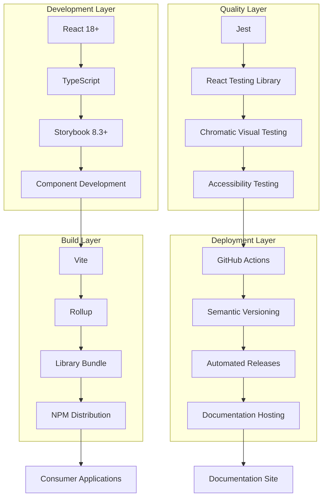

### Persona Interaction Sequence Diagram

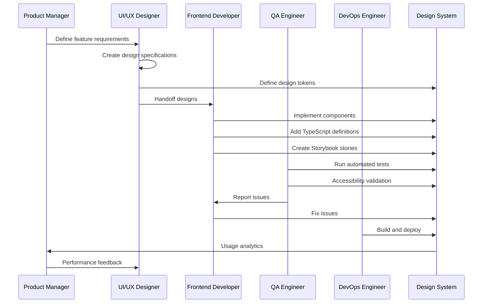

### Component Development State Flow

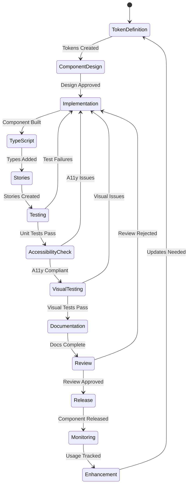

### Design System Entity Relationships

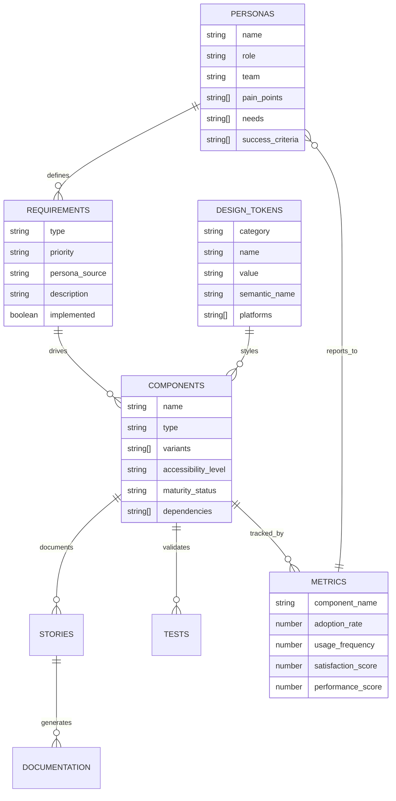

### Business Value Flow Diagram

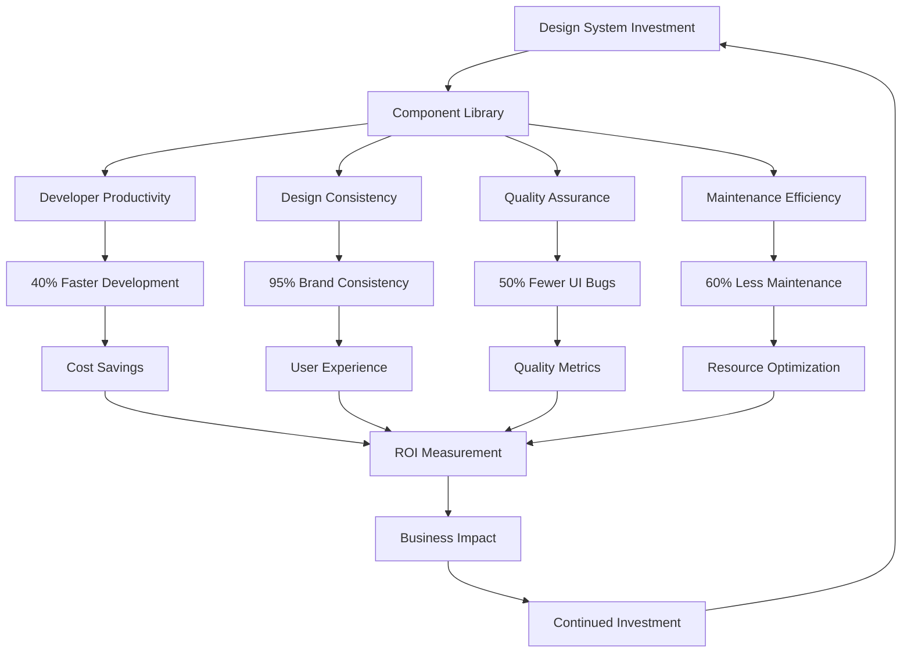

### Technology Stack Decision Tree

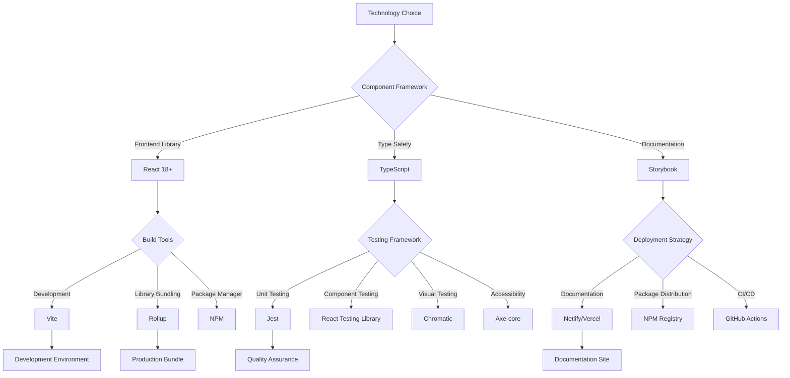

### Component Maturity Model

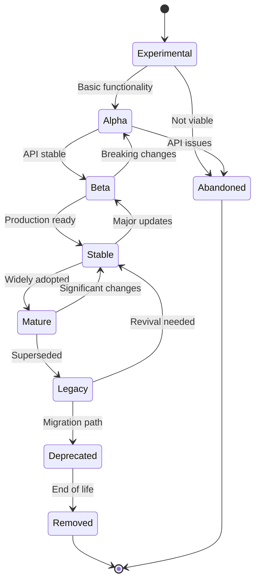

### Integration Architecture Flow

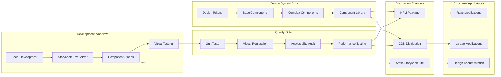

### Governance Process Flow

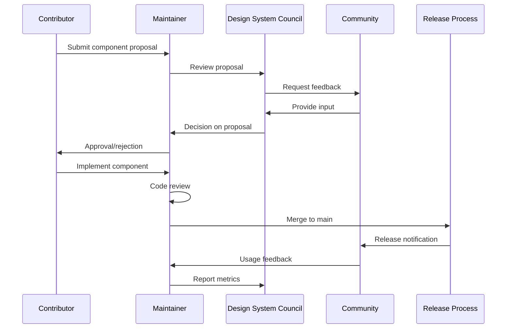

### Performance Monitoring Flow

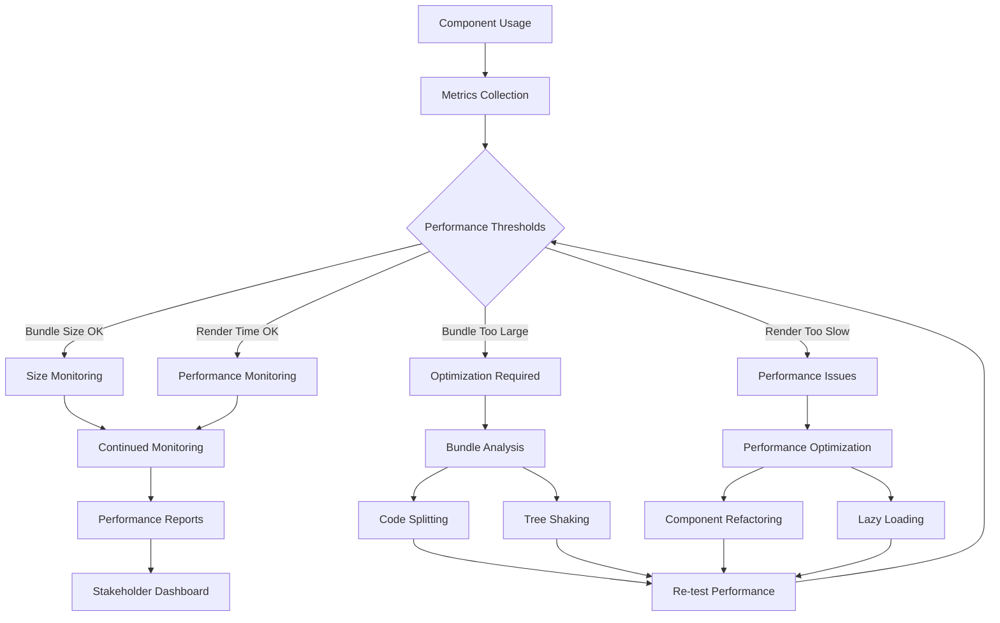

### Success Metrics Tracking System

```mermaid
graph TB
    subgraph "Measurement Categories"
        A[Developer Experience] --> A1[Implementation Time]
        A --> A2[Adoption Rate]
        A --> A3[Satisfaction Scores]
        A --> A4[Documentation Usage]
        
        B[Design Consistency] --> B1[Visual Audit Scores]
        B --> B2[Brand Compliance]
        B --> B3[Accessibility Results]
        B --> B4[Cross-platform Consistency]
        
        C[System Performance] --> C1[Bundle Size Impact]
        C --> C2[Render Performance]
        C --> C3[Build Time]
        C --> C4[Documentation Performance]
        
        D[Quality Metrics] --> D1[Test Coverage]
        D --> D2[Bug Frequency]
        D --> D3[Security Vulnerabilities]
        D --> D4[Deployment Success]
    end
    
    subgraph "KPI Targets"
        E[80% Time Reduction] --> A1
        F[95% Team Adoption] --> A2
        G[100% Brand Consistency] --> B2
        H[WCAG 2.1 AA Compliance] --> B3
        I[<5% Bundle Impact] --> C1
        J[100% Test Coverage] --> D1
        K[99.9% Deploy Success] --> D4
    end
    
    subgraph "Reporting Dashboard"
        L[Real-time Metrics]
        M[Monthly Reports]
        N[Quarterly Reviews]
        O[Annual Assessment]
    end
    
    A1 --> L
    A2 --> L
    B1 --> M
    C1 --> M
    D1 --> N
    N --> O
```

### Multi-Framework Integration Strategy

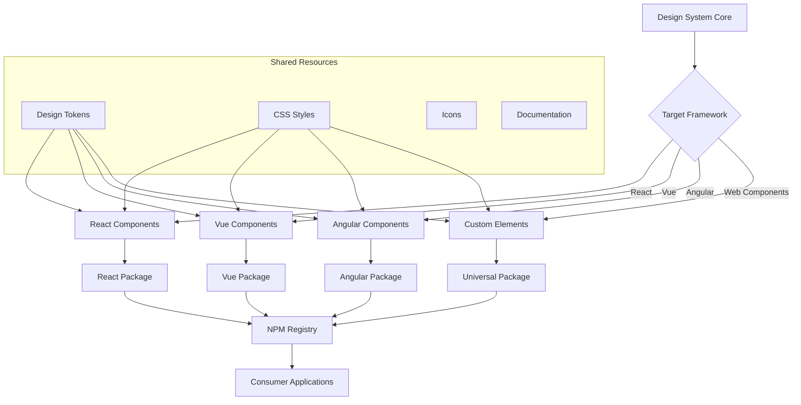

### CI/CD Pipeline Detailed Flow

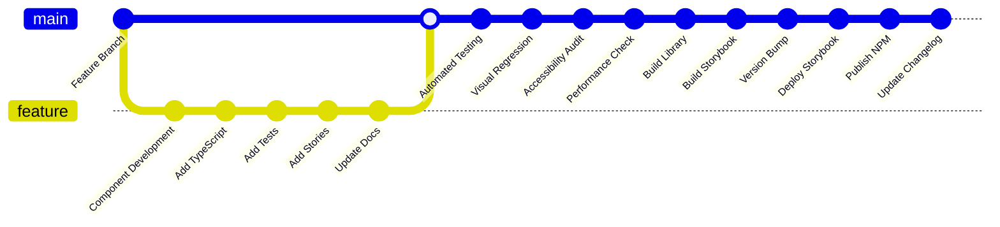

### Component API Design Rules

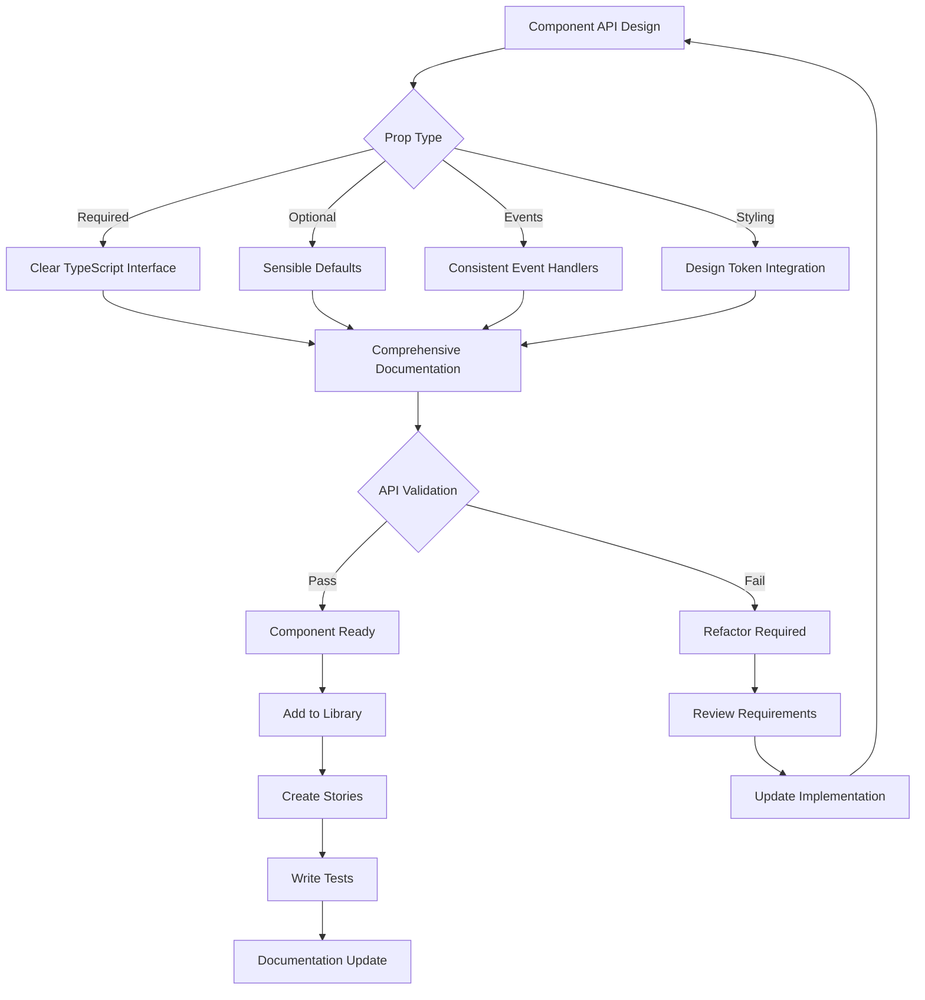
