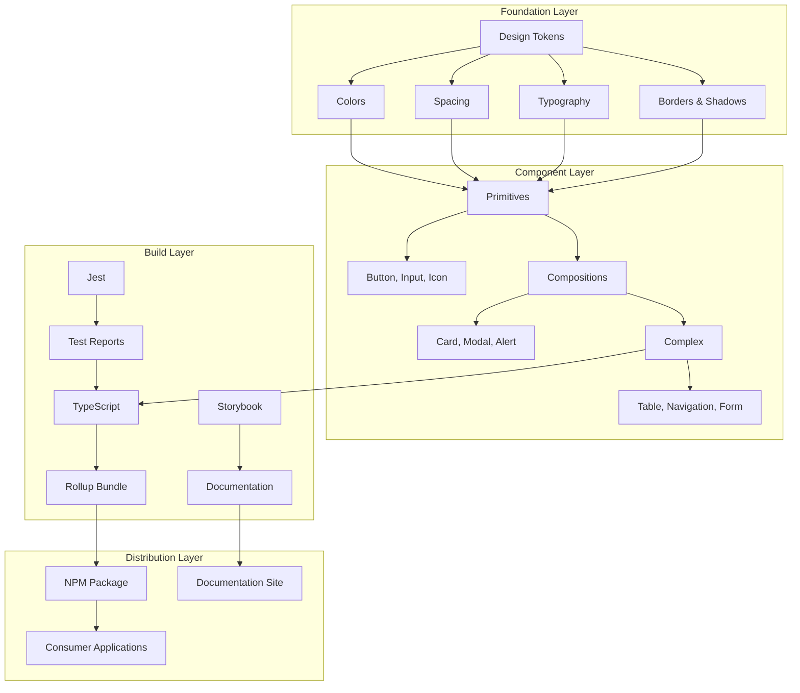
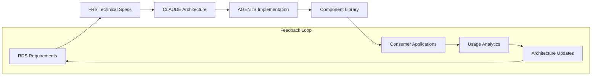
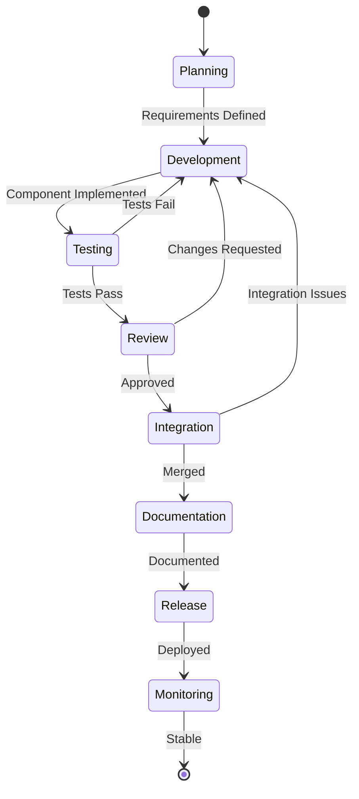
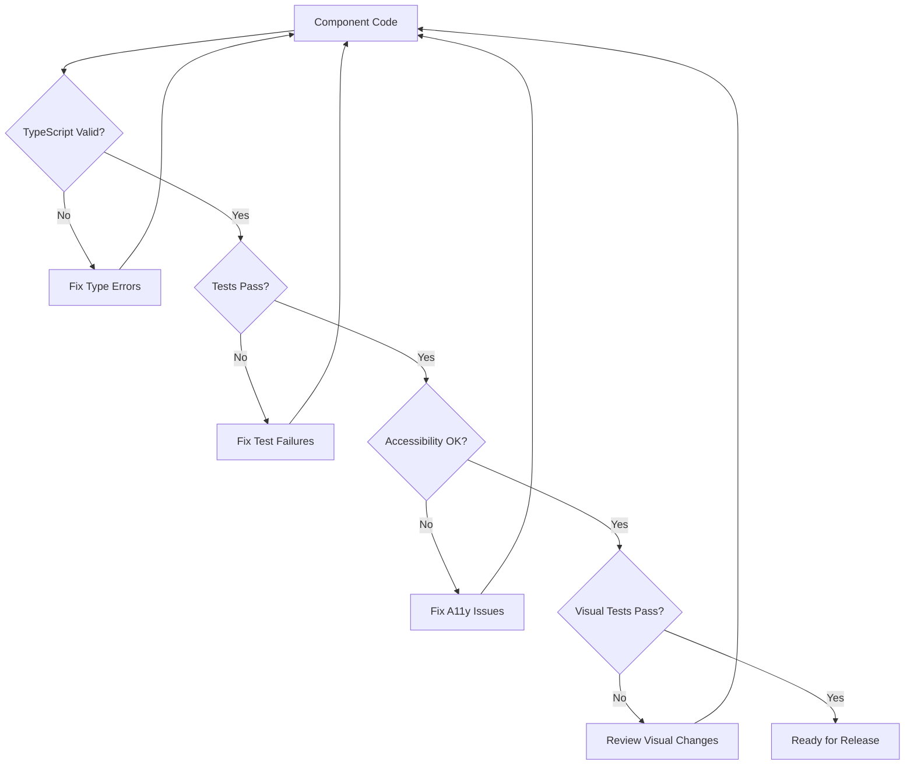
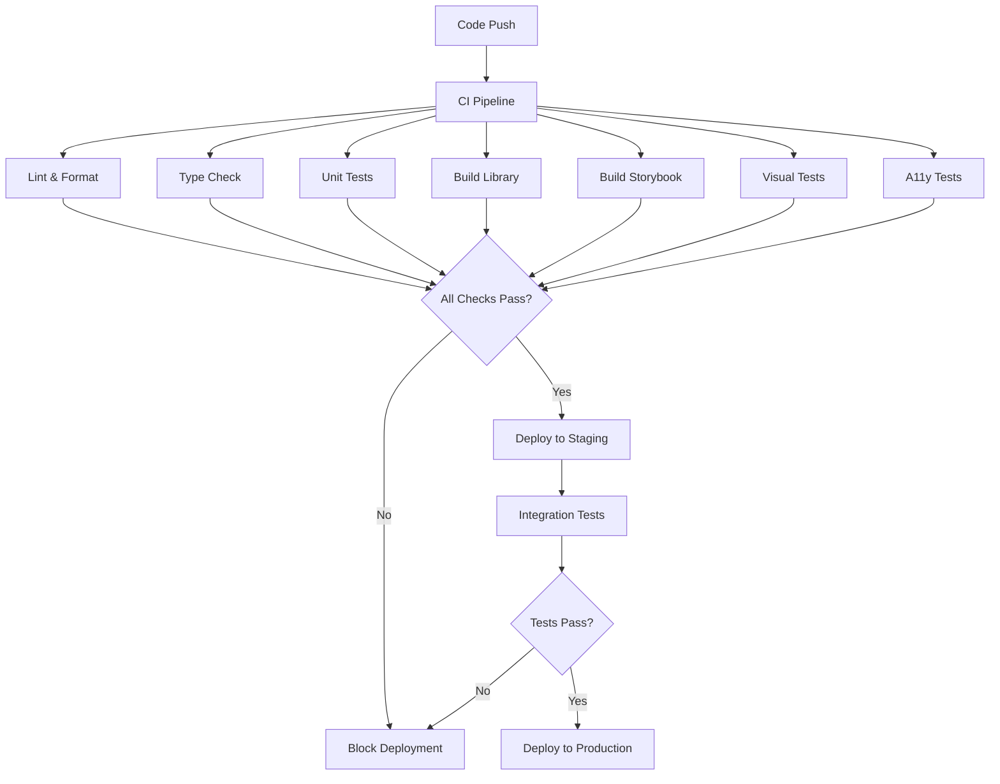

# CLAUDE.md - Design System Architecture Definition & AI Collaboration Guide

**Version**: 1.0.0  
**Date**: 2025-01-22  
**Generated from**: RDS.md requirements analysis

This file defines the comprehensive architecture of the React Design System solution. It aligns with the Architect Crew methodology, where:
- **`docs/RDS.md`** outlines the **functional requirements** and user needs.
- **`CLAUDE.md`** (this file) interprets requirements and designs the architecture, ensuring AGENTS.md receives proper implementation guidance.
- **`AGENTS.md`** provides specific, actionable instructions for AI agents performing implementation tasks based on this architectural guidance.
- **`docs/FRS.md`** captures the **detailed technical specifications** that emerge from the implementation process.

## 1. Requirements Analysis & Architectural Interpretation

**Source**: `docs/RDS.md` (What & Why)  
**Architectural Response**: Translate functional requirements into technical architecture

Based on the five key personas identified in RDS.md (Frontend Developer, UI/UX Designer, Product Manager, QA Engineer, and DevOps Engineer), this architecture prioritizes:

1. **Developer Experience**: TypeScript-first development with comprehensive type definitions
2. **Design Consistency**: Token-driven design system with semantic naming
3. **Quality Assurance**: Built-in accessibility and testing frameworks
4. **Performance**: Tree-shaking, lazy loading, and bundle optimization
5. **Scalability**: Modular architecture supporting cross-team collaboration

### Persona-Driven Architecture Decisions

**Frontend Developer (Sarah Chen)** needs drive:
- Component-first architecture with atomic design principles
- TypeScript interfaces for all components and design tokens
- Comprehensive Storybook documentation with interactive examples
- Hot module replacement for rapid development iteration

**UI/UX Designer (Marcus Rodriguez)** needs drive:
- Design token abstraction layer for consistent theming
- Visual regression testing integration
- Design-to-code workflow optimization
- Real-time design system documentation

**Product Manager (Jennifer Liu)** needs drive:
- Adoption metrics and usage analytics
- Component lifecycle management
- Cross-platform consistency validation
- Documentation accessibility for non-technical stakeholders

## 2. System Architecture Design

The React Design System follows a layered, persona-driven architecture that ensures scalability, maintainability, and developer experience. The architecture serves as a single source of truth for UI consistency across applications while providing the flexibility needed for diverse use cases.

### Foundation Layer Architecture

**Design Tokens**: The foundational layer consists of semantic design tokens that abstract visual design decisions:
- Color system with semantic naming (primary, secondary, success, warning, danger)
- Typography scale with consistent font families, sizes, and weights  
- Spacing system based on 4px grid (4px, 8px, 16px, 24px, 32px, 48px, 64px)
- Border radius and shadow tokens for visual depth

**Theme Provider**: React Context-based theming system that supports:
- Light and dark mode variants
- Runtime theme switching
- Custom brand theme injection
- CSS custom properties for browser compatibility

### Component Architecture Strategy

**Atomic Design Methodology**: Components are organized in a hierarchical structure:
- **Tokens**: Design decisions (colors, spacing, typography)
- **Atoms**: Basic building blocks (Button, Input, Icon)
- **Molecules**: Simple combinations (SearchBox, FormField)
- **Organisms**: Complex UI sections (Header, Sidebar, DataTable)
- **Templates**: Page-level layout components

**Composition Patterns**: All components follow consistent patterns:
- Polymorphic component APIs using `as` prop for semantic flexibility
- Compound component patterns for complex UI structures
- Render prop patterns for customizable behavior
- Forward ref patterns for DOM access and animation libraries

### Integration Architecture

**Framework Agnostic Core**: While built for React, the design system maintains separation of concerns:
- Design tokens exported as JSON, CSS custom properties, and JavaScript objects
- Component logic separated from styling implementation  
- Platform-specific adapters for React Native and other frameworks
- Build-time optimizations for different deployment targets

## 3. Development Methodology Specification

This architecture requires specific development approaches that will be codified in AGENTS.md:

### Component Development Standards

**TypeScript-First Development**: All components must be developed with TypeScript to ensure type safety and improved developer experience:
- Interface definitions for all props with comprehensive JSDoc
- Generic type support for polymorphic components
- Strict TypeScript configuration with no implicit any
- Type-only imports for performance optimization

**Accessibility-First Approach**: WCAG 2.1 AA compliance built into component architecture:
- Semantic HTML foundation for all components
- ARIA attributes integrated into component APIs
- Keyboard navigation patterns as first-class citizens
- Screen reader optimization with proper labeling

**Testing Strategy**: Multi-layered testing approach ensuring component reliability:
- Unit tests for component logic and API contracts
- Integration tests for compound component interactions
- Visual regression tests for design consistency
- Accessibility tests using automated tools (axe-core)
- Cross-browser compatibility testing

### Quality Assurance Framework

**Code Quality Gates**: Automated quality enforcement at multiple levels:
- Pre-commit hooks for linting and formatting
- TypeScript compilation validation
- Test coverage thresholds (minimum 90%)
- Bundle size monitoring and reporting
- Performance budget enforcement

**Documentation Standards**: Living documentation ensuring adoption success:
- Storybook stories for all component variants
- MDX documentation with usage examples
- API documentation auto-generated from TypeScript
- Design guidelines with visual examples
- Migration guides for breaking changes

## 4. Technology Stack Architecture

### Core Technology Decisions

**React 18+**: Modern React with concurrent features:
- Concurrent rendering for improved performance
- Suspense boundaries for loading states
- React Server Components readiness
- Strict mode compatibility

**TypeScript 5.0+**: Advanced type system features:
- Template literal types for design token autocomplete
- Conditional types for polymorphic component APIs
- Module resolution for optimal bundling
- Decorator support for metadata-driven development

**Storybook 8.3+**: Component development and documentation platform:
- Component-driven development workflow
- Interactive documentation with controls
- Visual testing integration
- Accessibility testing plugins
- Performance monitoring tools

### Build System Architecture

**Vite-based Build System**: Modern build tooling for optimal performance:
- Fast development server with HMR
- Optimized production builds with tree-shaking
- ESM and CommonJS dual package support
- CSS-in-JS build optimization
- Source map generation for debugging

**Package Distribution Strategy**: Multiple distribution formats:
- ESM modules for modern bundlers
- CommonJS for legacy compatibility  
- UMD builds for script tag usage
- CSS stylesheets for framework-agnostic usage
- Design token artifacts (JSON, CSS, SCSS)
- **Shadows**: Elevation system for depth and hierarchy

### Component Layer 
- **Primitives** (atoms): Button, Input, Icon, Text, Badge
- **Compositions** (molecules): Card, FormField, Alert, Toast, Modal
- **Complex** (organisms): Table, Navigation, Form, Dashboard
- **Layouts**: Grid, Stack, Container, Sidebar
- **Patterns**: SearchBar, DataTable, FileUpload, Pagination

### Build & Distribution Layer
- **Vite**: Development server with hot module replacement
- **Rollup**: Library bundling for distribution
- **TypeScript**: Type checking and compilation
- **Storybook**: Component development and documentation
- **Jest**: Unit testing framework
- **GitHub Actions**: CI/CD automation

## 4. Persona-Driven Principles

This architecture is designed around five key user personas:

1. **Frontend Developer**: Needs predictable APIs, TypeScript support, and comprehensive documentation
2. **UI/UX Designer**: Requires design token integration, visual consistency, and design-to-code alignment
3. **Product Manager**: Focuses on business value, development efficiency, and scalability metrics
4. **QA Engineer**: Emphasizes automated testing, accessibility compliance, and quality gates
5. **DevOps Engineer**: Concentrates on deployment automation, performance monitoring, and infrastructure

### Developer-Centric Component Architecture
- Type-first component design with comprehensive TypeScript interfaces
- Predictable prop patterns across all components
- Tree-shakable exports for optimal bundle sizes
- Zero-config integration with existing React applications
- Comprehensive documentation with usage examples

### Design-Implementation Bridge Architecture  
- Design tokens as single source of truth for visual consistency
- Storybook as living style guide and component playground
- Automated design-to-code synchronization
- Visual regression testing for design consistency
- Component state mapping between design tools and implementation

### Business Value Architecture
- Metrics-driven development with adoption tracking
- ROI measurement through development efficiency gains
- Scalable component library supporting 100+ components
- Cost savings through code reuse and consistency
- Time-to-market acceleration through pre-built components

### Quality Assurance Architecture
- Test-driven component development with 90%+ coverage
- Automated accessibility testing with axe-core integration
- Visual regression testing via Chromatic
- Cross-browser compatibility testing
- Performance monitoring and optimization

### Infrastructure and Deployment Architecture
- Automated CI/CD pipelines with semantic versioning
- Multi-environment deployment strategy
- CDN distribution for optimal performance
- Real-time monitoring and error tracking
- Rollback capabilities for deployment safety

## 5. System Architecture Layers

## 6. Technology Architecture Stack

**Core Technologies:**
- React 18+ with TypeScript 5+
- Storybook 8.3+ for component development
- Vite 5+ for development and build tooling
- Jest 29+ with React Testing Library for testing
- ESLint and Prettier for code quality

**Build and Distribution:**
- Rollup for library bundling
- Semantic versioning for releases
- NPM for package distribution
- GitHub Actions for CI/CD automation
- Netlify/Vercel for documentation hosting

**Quality Assurance:**
- Chromatic for visual regression testing
- axe-core for accessibility testing
- TypeScript for compile-time error checking
- Pre-commit hooks for code quality enforcement

## 7. Integration Architecture

**Framework Compatibility:**
- Next.js with server-side rendering support
- Vite applications with optimal bundling
- Create React App with zero configuration
- Custom webpack setups with modular imports

**API Integration Patterns:**
- Props-based component configuration
- Event handler patterns for component interactions
- Context providers for global state management
- Custom hooks for reusable component logic

## 8. Performance Architecture

**Bundle Optimization:**
- Tree-shaking friendly exports
- Code splitting at component level
- CSS extraction for critical styles
- Lazy loading for heavy components

**Runtime Performance:**
- React.memo for expensive components
- useMemo/useCallback optimization
- Virtual scrolling for large lists
- Efficient re-rendering patterns

## 9. Governance Architecture

**Decision Making Process:**
- RFC process for new component proposals
- Design System Council for architectural decisions
- Community feedback integration
- Regular architecture reviews

**Version Management:**
- Semantic versioning with automated releases
- Breaking change migration guides
- Deprecation cycle management
- Backward compatibility maintenance

## 10. Success Measurement Framework

**Key Performance Indicators:**
- Component adoption rate (target: 95% of teams)
- Development efficiency improvement (target: 40% faster)
- Code reuse percentage (target: 80% of UI from design system)
- Accessibility compliance (target: 100% WCAG 2.1 AA)
- Bundle size impact (target: <5% increase)

**Quality Metrics:**
- Test coverage (target: 90%+)
- Bug reduction (target: 50% fewer UI bugs)
- Documentation completeness (target: 100% component coverage)
- Performance scores (target: 95+ Lighthouse scores)

## 11. CI/CD & Agent Triggers

**Automated Processes**:
- Component generation via AGENTS.md templates
- Quality gates and testing protocols
- Build and deployment pipelines
- Documentation generation and updates

**Agent Integration Points**:
- Component creation following AGENTS.md specifications
- Automated testing and validation workflows
- Code quality enforcement and formatting
- Documentation synchronization and updates

**Trigger Conditions:**
- Pull request creation and updates
- Merge to main branch
- Version tag creation
- Manual workflow dispatch
- Scheduled maintenance tasks

## Core Principles for System Architecture, Integrity, and AI Collaboration

1. **Adherence to Established Patterns**: Maintain consistency with existing architectural patterns
2. **Methodological Rigor**: Use isolated development environments and proper testing
3. **Evidence-Based Performance**: All performance claims must be backed by measurements
4. **Dependency Management**: Careful evaluation of new dependencies and technologies
5. **Security First**: Integral security considerations in architectural design
6. **Documentation Integrity**: Maintain CLAUDE.md and AGENTS.md alignment
7. **Technical Merit**: Justify all architectural decisions with clear reasoning

## Architectural Diagrams and Flows

### Primary Architecture Flow

### Component Development Lifecycle

### Quality Assurance Process Flow

### CI/CD Pipeline Architecture

## File Encoding Standards
**All documentation files, including `AGENTS.md` and any files generated or modified by AI, MUST be in UTF-8 encoding.**

## Implementation Status and Next Steps

**Current Implementation Status**:
- ✅ Complete Storybook setup with enhanced configuration
- ✅ 4 core components (Button, Card, Input, Modal) with full stories and tests
- ✅ Testing infrastructure with Jest and React Testing Library
- ✅ Code quality tools (ESLint, Prettier, TypeScript)
- ✅ Design token foundation (colors, spacing, typography)
- ✅ Comprehensive documentation and templates
- ✅ AI agent templates for automated component creation

**Immediate Next Steps**:
1. Install and validate all dependencies in design-system directory
2. Run complete test suite and fix any failing tests
3. Generate additional components using AGENTS.md templates
4. Set up automated CI/CD pipeline with GitHub Actions
5. Implement visual regression testing with Chromatic
6. Create component library package for NPM distribution

**Architecture Evolution Timeline**:
- **Phase 1** (Current): Core component library with design tokens
- **Phase 2** (Next 30 days): Advanced components and patterns
- **Phase 3** (Next 60 days): Automated tooling and analytics integration
- **Phase 4** (Next 90 days): Multi-framework support and advanced features

---

**Prime Directive**: Always ensure components are accessible, reusable, and follow design system principles as defined in `docs/FRS.md`. Every component must work seamlessly across different applications and maintain consistency with established design tokens and patterns.

Built with ❤️ using the Architect Crew methodology.