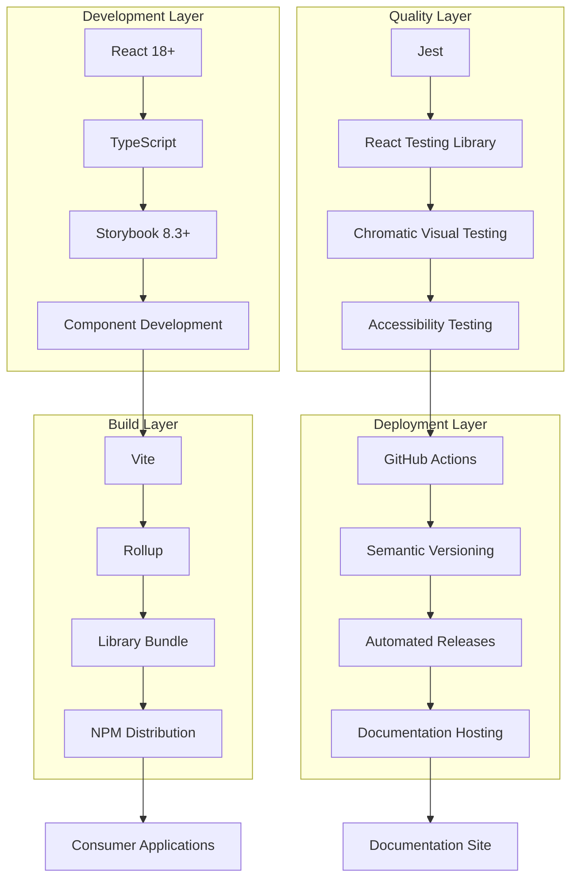
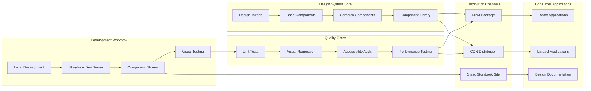
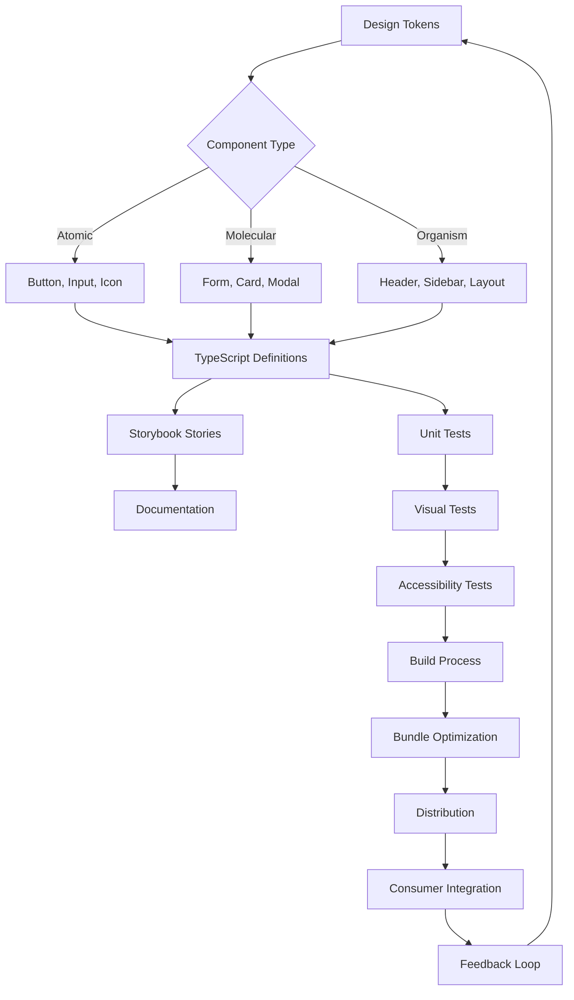
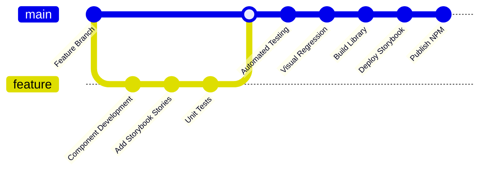
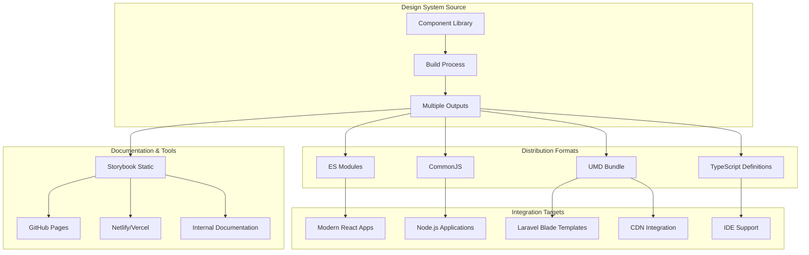

# Design System - Storybook

A comprehensive React-based design system built with Storybook for component development, documentation, and scalable UI consistency.

## Overview

This design system provides a collection of reusable React components, design tokens, and documentation built on top of the Storybook JavaScript library. It serves as the foundation for building consistent, scalable user interfaces across applications.

## Repository Structure

```
├── apps/                    # Application directories
│   └── design-system/      # Main design system application
├── docs/                   # Documentation
│   ├── persona-brand-manager.md        # Brand Manager persona requirements
│   ├── persona-copywriter.md           # Copywriter persona requirements
│   ├── persona-devops-engineer.md      # DevOps Engineer persona requirements
│   ├── persona-frontend-developer.md   # Frontend Developer persona requirements
│   ├── persona-product-manager.md      # Product Manager persona requirements
│   ├── persona-product-owner.md        # Product Owner persona requirements
│   ├── persona-qa-engineer.md          # QA Engineer persona requirements
│   ├── persona-ui-designer.md          # UI Designer persona requirements
│   └── RDS.md                         # Requirements Document Specification
├── AGENTS.md              # AI agents configuration
├── CLAUDE.md              # AI assistant instructions
└── README.md              # This file
```

## Stakeholders & Personas

This design system is built to serve multiple personas across the development and design lifecycle. Each persona has specific needs and requirements that drive the system's architecture and features:

### Primary Stakeholders

- **Product Owner** - Voice of the customer, articulating priorities and customer pain points
- **Brand Manager** - Voice of the brand, ensuring consistent brand identity and visual representation
- **Copywriter** - Voice of tone and messaging, maintaining consistent brand voice across all content
- **Frontend Developers** - Building consistent, reusable components with TypeScript support
- **UI/UX Designers** - Ensuring design-to-code consistency and accessibility compliance
- **Product Managers** - Driving brand consistency and faster feature delivery
- **QA Engineers** - Implementing automated testing and quality assurance
- **DevOps Engineers** - Managing CI/CD pipelines and deployment infrastructure

For detailed persona requirements and specifications, see the individual persona files in the `docs/` directory and the comprehensive [Requirements Document Specification (RDS)](docs/RDS.md).

## BDD Requirements Flow

The design system follows a structured Behavior-Driven Development (BDD) approach where requirements flow from high-level specifications down to executable test cases:

```mermaid
stateDiagram-v2
    [*] --> RDS : Requirements Document Specification
    
    RDS --> Features : Articulate Features
    Features --> Scenarios : Break down into Scenarios
    
    state Features {
        [*] --> FeatureDefinition
        FeatureDefinition --> FeatureDescription
        FeatureDescription --> [*]
    }
    
    state Scenarios {
        [*] --> ScenarioIdentification
        ScenarioIdentification --> AcceptanceCriteria
        AcceptanceCriteria --> GherkinNotation
        GherkinNotation --> [*]
    }
    
    Scenarios --> UserStories : Each Scenario becomes User Story
    
    state UserStories {
        [*] --> StoryNaming
        StoryNaming --> StoryDescription
        StoryDescription --> BDDFormat
        BDDFormat --> StoryAcceptanceCriteria
        
        note right of BDDFormat : As a {persona}\nI want to {action}\nSo that {outcome}
        note right of StoryAcceptanceCriteria : Gherkin notation:\nGiven/When/Then
    }
    
    UserStories --> TestCases : Acceptance Criteria → Test Cases
    
    state TestCases {
        [*] --> UnitTests
        [*] --> IntegrationTests
        [*] --> E2ETests
        [*] --> AccessibilityTests
        
        UnitTests --> TestExecution
        IntegrationTests --> TestExecution
        E2ETests --> TestExecution
        AccessibilityTests --> TestExecution
        
        TestExecution --> [*]
    }
    
    TestCases --> Implementation : Drive Component Development
    Implementation --> Validation : Verify against Acceptance Criteria
    Validation --> [*] : Requirements Satisfied
    
    note left of RDS : Central source of truth\nfor all requirements
    note right of TestCases : Executable specifications\nderived from Gherkin
```

### BDD Methodology Implementation

1. **Requirements Document Specification (RDS)**: Central source of truth defining all system requirements
2. **Features**: High-level capabilities articulated from RDS requirements  
3. **Scenarios**: Specific situations broken down from each feature
4. **Acceptance Criteria**: Gherkin notation (Given/When/Then) defining scenario success conditions
5. **User Stories**: Each scenario converted to user story format with BDD structure
6. **Test Cases**: Executable tests derived directly from acceptance criteria
7. **Implementation**: Component development driven by test cases
8. **Validation**: Verification that implementation satisfies original acceptance criteria

This approach ensures traceability from high-level requirements through to implementation and testing, maintaining alignment with stakeholder needs throughout the development process.

## Architecture Overview

### Technology Stack Overview



### System Integration Design



### Component Architecture Flow



## Technology Stack

- **React 18+** - Component library framework
- **TypeScript** - Type safety and developer experience
- **Storybook 8.3+** - Component development and documentation
- **Rollup** - Library bundling and distribution
- **Vite** - Development server and build tooling
- **CSS** - Component styling

## Deployment & Integration Architecture

### CI/CD Pipeline



### Multi-Platform Integration



## Installation

### Prerequisites

- Node.js (v18 or higher)
- npm or yarn package manager
- Git

### Initial Setup

1. **Clone the repository:**
   ```bash
   git clone https://github.com/DementedWeasel1971/storybook.git
   cd storybook
   ```

2. **Navigate to the design system application:**
   ```bash
   cd apps/design-system
   ```

3. **Install dependencies:**
   ```bash
   npm install
   ```

## Development

### Running Storybook

Start the Storybook development server on port 6006:

```bash
cd apps/design-system
npm run dev
```

Visit `http://localhost:6006` to view the component library and documentation.

### Building the Library

Build the component library for distribution:

```bash
cd apps/design-system
npm run build-lib
```

### Building Storybook Static Site

Generate a static Storybook site for deployment:

```bash
cd apps/design-system
npm run build-storybook
```

### Build Everything

Build both the library and Storybook static site:

```bash
cd apps/design-system
npm run build
```

## Component Architecture

### Component Structure

Each component follows a consistent structure:

```text
ComponentName/
├── ComponentName.tsx         # Component implementation
├── ComponentName.css         # Component styles
├── ComponentName.stories.tsx # Storybook stories
└── index.ts                 # Export file
```

### Design System Layers

1. **Design Tokens** (`src/tokens/`)
   - Colors, spacing, typography definitions
   - Consistent design language foundation

2. **Components** (`src/components/`)
   - Reusable React components (Button, Card, Input, etc.)
   - Fully typed with TypeScript

3. **Stories** (`src/stories/`)
   - Storybook stories and usage examples
   - Component documentation and testing

4. **Global Styles** (`src/styles/`)
   - CSS utilities and global styling
   - Theme configuration

## Build Outputs

- **Library**: `apps/design-system/dist/`
  - CommonJS, ESM, and TypeScript definitions
  - Ready for npm distribution

- **Storybook**: `apps/design-system/storybook-static/`
  - Static site for documentation hosting
  - Deployable to any web server

## Contributing

1. Create feature branches from `main`
2. Follow the existing component structure
3. Add Storybook stories for new components
4. Test components in Storybook before submitting
5. Update documentation as needed

## Deployment

The design system can be deployed in multiple ways:

- **NPM Package**: Distribute the built library
- **Static Site**: Deploy Storybook documentation
- **Laravel Integration**: Import components into PHP applications via CDN or build process

## License

[Add your license information here]

## Support

For questions and support, please refer to the documentation in the `docs/` directory or create an issue in the repository.