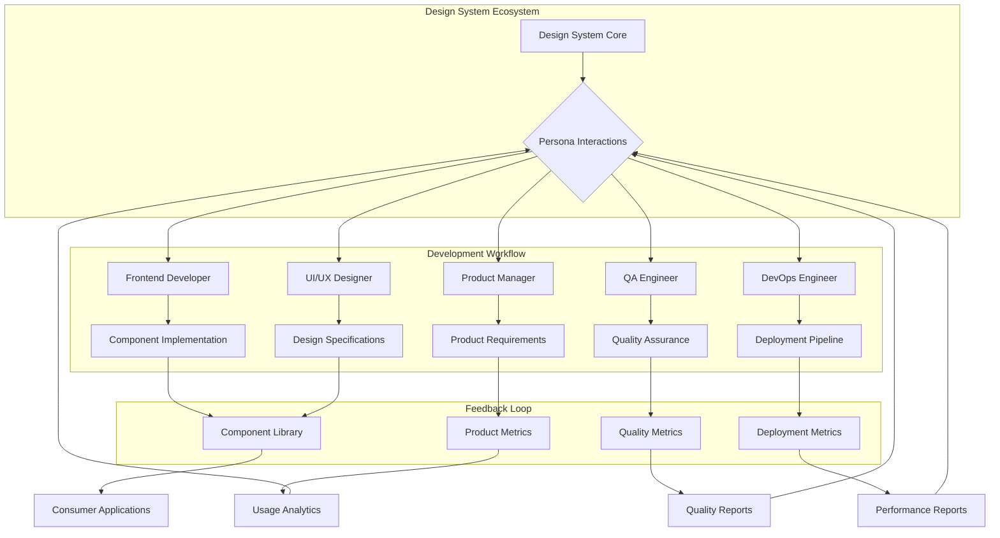
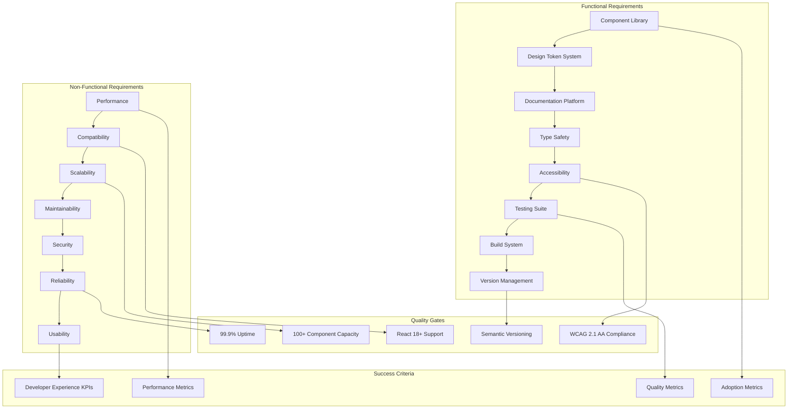
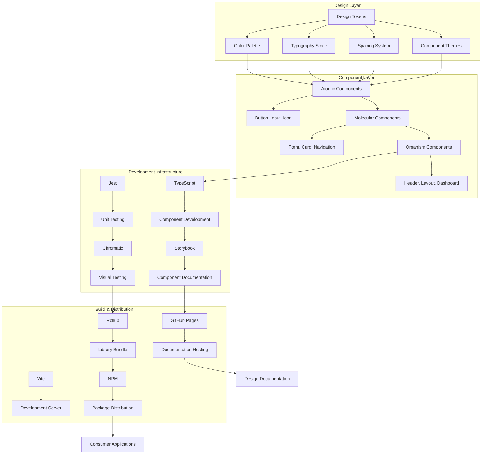
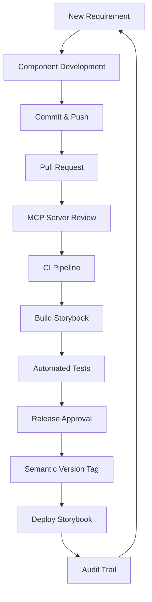

# Functional Requirements Specification (FRS) - Design System

This document provides the detailed technical specifications and Unified Modeling Language (UML) descriptions for the React Design System. It serves as the primary technical guide for implementation, complementing the functional requirements outlined in the [Requirements Document Specification (RDS)](./RDS.md).

This FRS is a core component of the Architect Crew methodology employed in this repository. It ensures that all technical implementations are based on a clearly defined and agreed-upon design.

## Technical Implementation Details

This section will house all Mermaid UML diagrams and other specific technical details that were previously located in `docs/RDS.md` or that are newly created. AI Agents (as per `AGENTS.md`) and human developers should refer to this document for the authoritative technical design.

Claude (as per `CLAUDE.md`) is responsible for ensuring this document is kept up-to-date with accurate technical specifications and that `AGENTS.md` correctly references this FRS for implementation guidance.

---

## System Architecture Diagrams

### Target Personas Interaction Model

This diagram illustrates how different user personas interact with the design system and the overall development workflow.

### System Requirements Overview

This flowchart outlines the functional and non-functional requirements of the design system, along with quality gates and success criteria.

### Detailed Technical Architecture

This graph details the layers of the design system, from design tokens to build and distribution.

### Success Metrics Framework

This diagram illustrates the categories for measuring the success of the design system and the Key Performance Indicators (KPIs).

```mermaid
graph TB
    subgraph "Measurement Categories"
        A[Developer Experience] --> A1[Implementation Time]
        A --> A2[Adoption Rate]
        A --> A3[Satisfaction Scores]
        A --> A4[Documentation Usage]

        B[Design Consistency] --> B1[Visual Audit Scores]
        B --> B2[Brand Compliance]
        B --> B3[Accessibility Results]
        B --> B4[Cross-platform Consistency]

        C[System Performance] --> C1[Bundle Size Impact]
        C --> C2[Render Performance]
        C --> C3[Build Time]
        C --> C4[Documentation Performance]

        D[Quality Metrics] --> D1[Test Coverage]
        D --> D2[Bug Frequency]
        D --> D3[Security Vulnerabilities]
        D --> D4[Deployment Success]
    end

    subgraph "KPI Targets"
        E[80% Time Reduction] --> A1
        F[95% Team Adoption] --> A2
        G[100% Brand Consistency] --> B2
        H[WCAG 2.1 AA Compliance] --> B3
        I[<5% Bundle Impact] --> C1
        J[100% Test Coverage] --> D1
        K[99.9% Deploy Success] --> D4
    end

    subgraph "Reporting Dashboard"
        L[Real-time Metrics]
        M[Monthly Reports]
        N[Quarterly Reviews]
        O[Annual Assessment]
    end

    A1 --> L
    A2 --> L
    B1 --> M
    C1 --> M
    D1 --> N
    N --> O
```

### Change Management, Security, and Governance Flow

This flowchart depicts the process for managing changes, ensuring security, and maintaining governance within the design system.

---
*(Further technical details and specifications will be added here as the system evolves.)*
---
