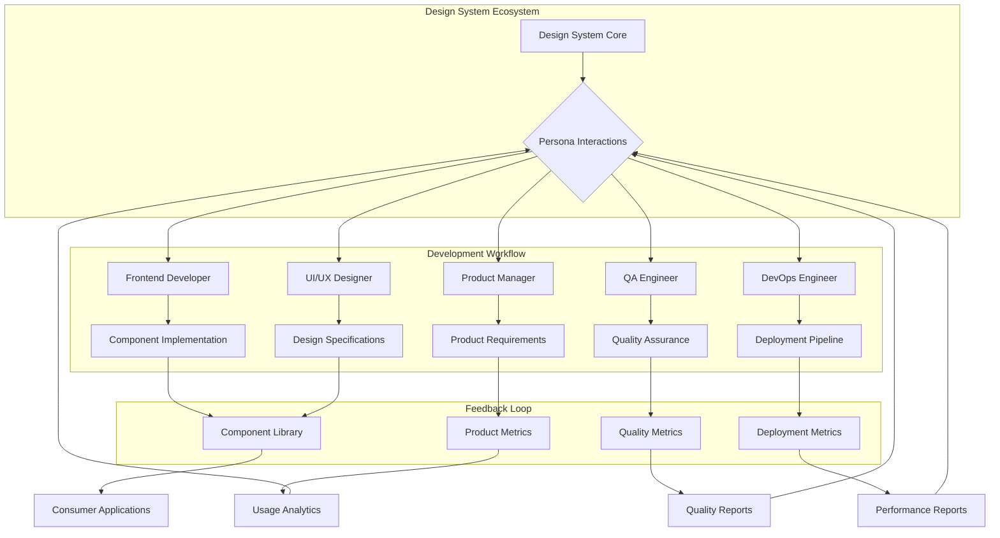
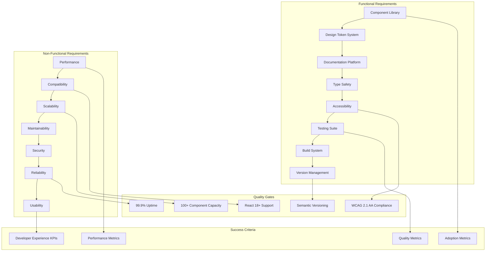
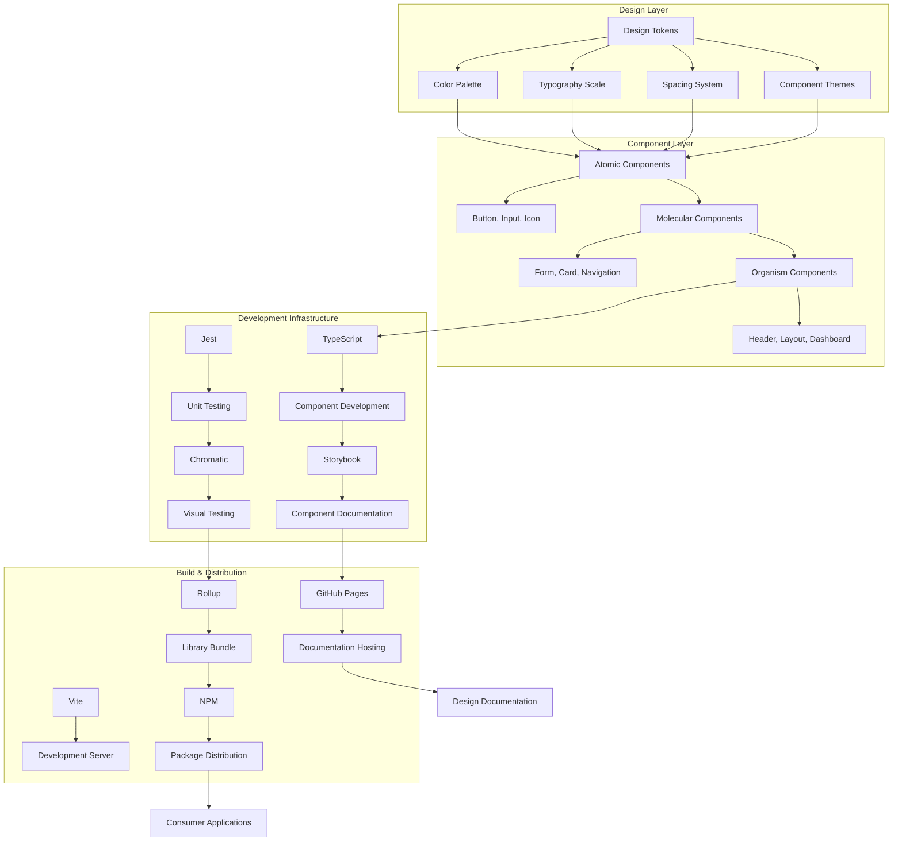
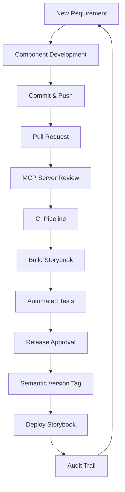

# Requirements Document Specification (RDS)
## React Design System Project

### Project Overview
This document defines the requirements for a comprehensive React-based Design System that addresses the needs of multiple personas across the development and design lifecycle. The system provides reusable components, design tokens, and documentation to ensure scalable UI consistency.

### Target Personas

#### 1. Frontend Developer (Primary User)
**Name**: Sarah Chen  
**Role**: Senior Frontend Developer  
**Team**: Product Development  

**Pain Points**:
- Inconsistent UI components across different projects
- Time spent recreating similar components
- Difficulty maintaining design consistency
- Lack of standardized component APIs
- Poor documentation for component usage
- No clear guidelines for component customization

**Needs**:
- Well-documented, reusable React components
- TypeScript support for type safety
- Clear API documentation with examples
- Consistent design tokens (colors, spacing, typography)
- Easy integration with existing React applications
- Component variants for different use cases

**Success Criteria**:
- 80% reduction in time spent building common UI components
- Zero design inconsistencies across applications
- All components have comprehensive TypeScript definitions
- 100% component coverage in Storybook documentation

#### 2. UI/UX Designer (Secondary User)
**Name**: Marcus Rodriguez  
**Role**: Lead UI/UX Designer  
**Team**: Design Systems  

**Pain Points**:
- Disconnect between design specifications and implemented components
- Difficulty communicating design intent to developers
- No single source of truth for design tokens
- Inconsistent spacing and typography across products
- Limited ability to test designs with real components

**Needs**:
- Visual component library accessible via Storybook
- Design tokens that match implementation exactly
- Interactive component playground for testing designs
- Documentation showing all component states and variants
- Accessibility guidelines and compliance indicators
- Design-to-code workflow integration

**Success Criteria**:
- 100% design-implementation consistency
- All components meet WCAG 2.1 AA accessibility standards
- Design tokens are directly consumable by design tools
- Visual regression testing prevents design drift

#### 3. Product Manager (Stakeholder)
**Name**: Jennifer Kim  
**Role**: Senior Product Manager  
**Team**: Platform Strategy  

**Pain Points**:
- Inconsistent user experience across products
- Slow feature development due to component rebuilding
- Difficulty scaling design across multiple teams
- No metrics on component usage and effectiveness
- Brand consistency challenges across product suite

**Needs**:
- Consistent brand representation across all products
- Faster feature delivery through component reuse
- Usage analytics for component adoption
- Clear governance model for design system evolution
- Documentation for non-technical stakeholders
- Roadmap visibility for design system features

**Success Criteria**:
- 40% faster feature delivery through component reuse
- 95% brand consistency score across products
- 100% team adoption of design system components
- Clear ROI metrics for design system investment

#### 4. Quality Assurance Engineer (Quality Gatekeeper)
**Name**: David Park  
**Role**: Senior QA Engineer  
**Team**: Quality Engineering  

**Pain Points**:
- Inconsistent component behavior across different implementations
- Difficulty testing components in isolation
- No automated accessibility testing
- Manual testing overhead for component variations
- Lack of visual regression testing capabilities

**Needs**:
- Automated testing suite for all components
- Visual regression testing pipeline
- Accessibility testing automation
- Component testing documentation and guidelines
- Cross-browser compatibility testing
- Performance testing for component library

**Success Criteria**:
- 100% automated test coverage for all components
- Zero accessibility violations in production
- Automated visual regression testing prevents UI bugs
- 50% reduction in manual testing effort

#### 5. DevOps Engineer (Infrastructure Support)
**Name**: Alex Thompson  
**Role**: Senior DevOps Engineer  
**Team**: Platform Infrastructure  

**Pain Points**:
- Complex deployment pipeline for multiple component versions
- No automated versioning strategy
- Difficulty maintaining backward compatibility
- Manual deployment processes prone to errors
- No rollback strategy for component updates

**Needs**:
- Automated CI/CD pipeline for component library
- Semantic versioning with automated changelog generation
- Container-based deployment for Storybook documentation
- Monitoring and alerting for component library health
- Automated security scanning for dependencies
- Blue-green deployment strategy for updates

**Success Criteria**:
- 100% automated deployment pipeline
- Zero-downtime deployments for component updates
- Automated dependency vulnerability scanning
- 99.9% uptime for Storybook documentation site

### System Requirements

#### Functional Requirements
1. **Component Library**: Comprehensive set of reusable React components
2. **Design Token System**: Centralized design tokens for colors, typography, spacing
3. **Documentation Platform**: Interactive Storybook-based documentation
4. **Type Safety**: Full TypeScript support with exported type definitions
5. **Accessibility**: WCAG 2.1 AA compliance for all components
6. **Testing Suite**: Automated testing with visual regression capabilities
7. **Build System**: Optimized build pipeline for library distribution
8. **Version Management**: Semantic versioning with automated releases

#### Non-Functional Requirements
1. **Performance**: Components must not impact application bundle size significantly
2. **Compatibility**: Support for React 18+ and modern browsers
3. **Scalability**: Architecture must support 100+ components
4. **Maintainability**: Clear code organization and contribution guidelines
5. **Security**: Regular dependency updates and vulnerability scanning
6. **Reliability**: 99.9% uptime for documentation and distribution
7. **Usability**: Intuitive component APIs and comprehensive documentation

### Technical Architecture

#### Component Development
- React 18+ with TypeScript
- CSS-in-JS or CSS Modules for styling
- Atomic design principles (tokens → components → patterns)
- Storybook for component development and documentation

#### Build and Distribution
- Rollup for library bundling
- Multiple output formats (CJS, ESM, UMD)
- TypeScript declaration files
- NPM package distribution

#### Documentation and Testing
- Storybook for interactive documentation
- Jest and React Testing Library for unit tests
- Chromatic for visual regression testing
- Automated accessibility testing with axe-core

#### Development Infrastructure
- Git-based version control
- Automated CI/CD with GitHub Actions
- Semantic versioning with conventional commits
- Automated dependency updates with Dependabot

### Success Metrics

```mermaid
graph TB
    subgraph "Measurement Categories"
        A[Developer Experience] --> A1[Implementation Time]
        A --> A2[Adoption Rate]
        A --> A3[Satisfaction Scores]
        A --> A4[Documentation Usage]
        
        B[Design Consistency] --> B1[Visual Audit Scores]
        B --> B2[Brand Compliance]
        B --> B3[Accessibility Results]
        B --> B4[Cross-platform Consistency]
        
        C[System Performance] --> C1[Bundle Size Impact]
        C --> C2[Render Performance]
        C --> C3[Build Time]
        C --> C4[Documentation Performance]
        
        D[Quality Metrics] --> D1[Test Coverage]
        D --> D2[Bug Frequency]
        D --> D3[Security Vulnerabilities]
        D --> D4[Deployment Success]
    end
    
    subgraph "KPI Targets"
        E[80% Time Reduction] --> A1
        F[95% Team Adoption] --> A2
        G[100% Brand Consistency] --> B2
        H[WCAG 2.1 AA Compliance] --> B3
        I[<5% Bundle Impact] --> C1
        J[100% Test Coverage] --> D1
        K[99.9% Deploy Success] --> D4
    end
    
    subgraph "Reporting Dashboard"
        L[Real-time Metrics]
        M[Monthly Reports]
        N[Quarterly Reviews]
        O[Annual Assessment]
    end
    
    A1 --> L
    A2 --> L
    B1 --> M
    C1 --> M
    D1 --> N
    N --> O
```

#### Developer Experience
- Time to implement new features using design system
- Component adoption rate across teams
- Developer satisfaction scores
- Documentation usage analytics

#### Design Consistency
- Visual consistency audit scores
- Brand compliance metrics
- Accessibility audit results
- Cross-platform consistency ratings

#### System Performance
- Bundle size impact measurements
- Component render performance
- Build time optimization
- Documentation site performance

#### Quality Metrics
- Test coverage percentages
- Bug report frequency
- Security vulnerability count
- Deployment success rate

This RDS serves as the foundation for architectural decisions and ensures the design system addresses real user needs across all stakeholder personas.
### Change Management, Security, and Governance Requirements

These requirements aggregate insights from the persona files and additional repository documentation. They ensure that Storybook remains the single source for interactive documentation while maintaining strict control over how changes are introduced and validated.

#### Governance and Audit
- Automated audit trails recording who changed each component and when
- Approval workflows enforced through an MCP server for high–risk changes
- Risk assessment and mitigation steps captured before merge
- Regulatory compliance checks integrated with Storybook builds

#### Security Controls
- Continuous security scanning of components and dependencies
- Secure development workflow with mandatory security checkpoints
- Dependency risk management with automated alerts
- Version rollback strategy for rapid mitigation of security issues

#### Change & Version Management
- Git-based source control with branch protection rules
- Semantic versioning for both component library and Storybook site
- Automated CI/CD pipeline publishing Storybook and npm packages
- MCP server gates releases and maintains change history

These governance and security practices keep the design system reliable while allowing the Storybook documentation to evolve safely over time.
