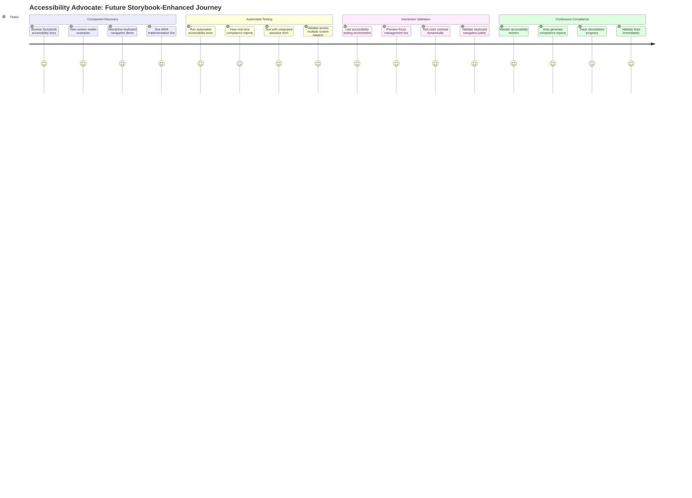
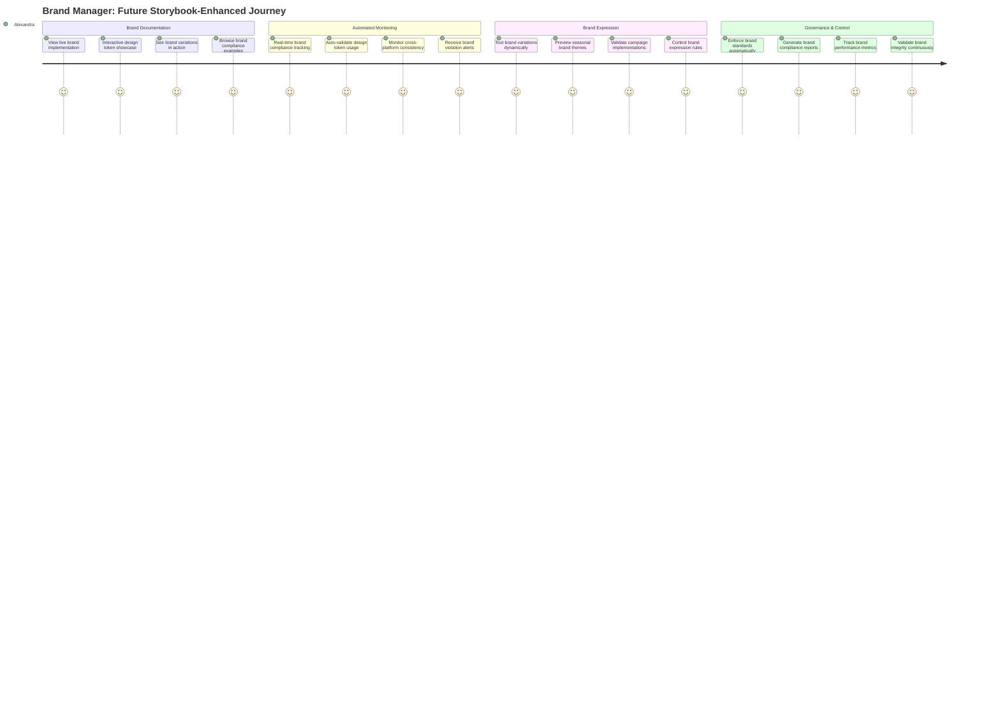
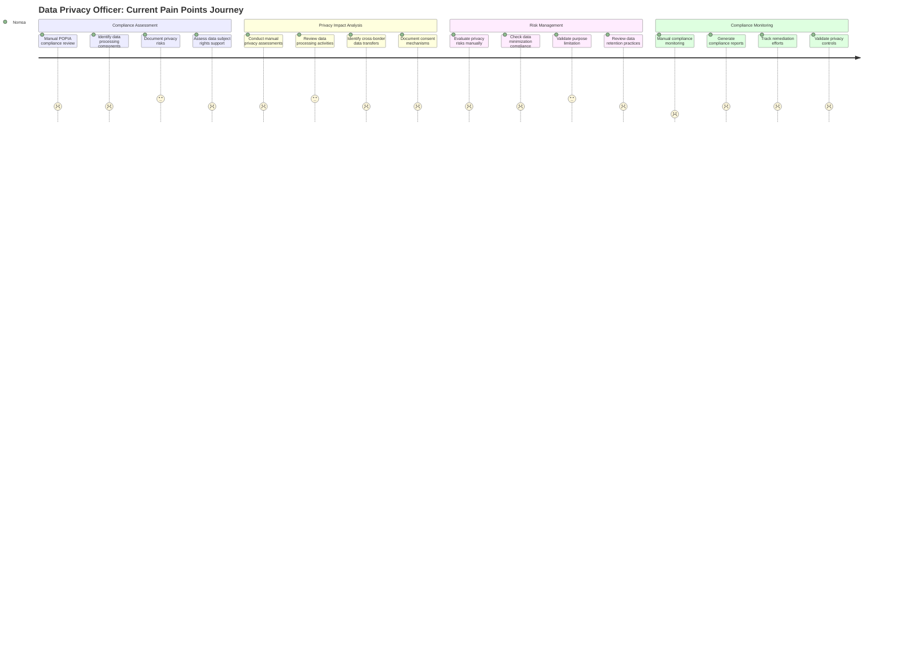
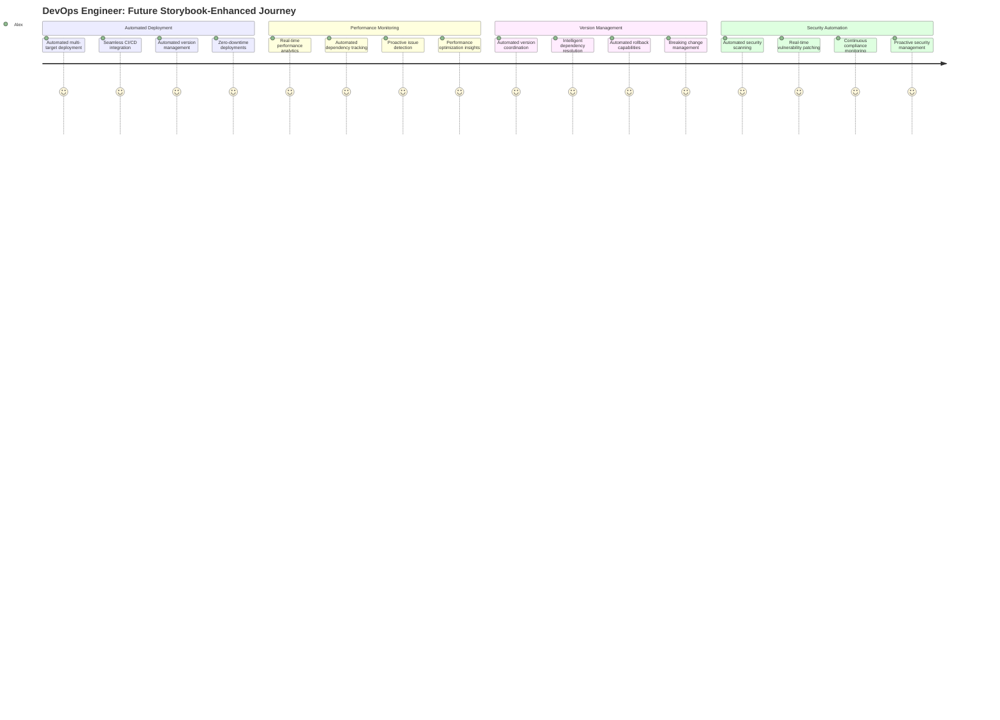
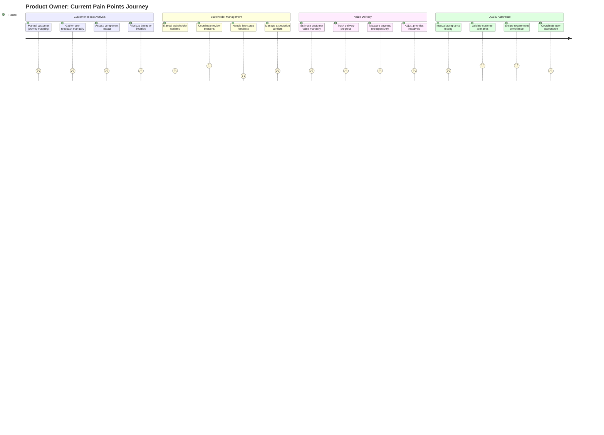

# Persona Journey Maps: Current Pain Points vs. Future Storybook Solution

## Table of Contents

- [Accessibility Advocate Journey](#accessibility-advocate-journey)
- [Brand Manager Journey](#brand-manager-journey)
- [Copywriter Journey](#copywriter-journey)
- [Data Privacy Officer Journey](#data-privacy-officer-journey)
- [Data Security Engineer Journey](#data-security-engineer-journey)
- [DevOps Engineer Journey](#devops-engineer-journey)
- [Frontend Developer Journey](#frontend-developer-journey)
- [Internal Auditor Journey](#internal-auditor-journey)
- [Product Manager Journey](#product-manager-journey)
- [Product Owner Journey](#product-owner-journey)
- [QA Engineer Journey](#qa-engineer-journey)
- [UI Designer Journey](#ui-designer-journey)

---

## Accessibility Advocate Journey

### Current State: Pain Points Journey


### Future State: Storybook-Enhanced Journey



---

## Brand Manager Journey

### Current State: Pain Points Journey


### Future State: Storybook-Enhanced Journey



---

## Copywriter Journey

### Current State: Pain Points Journey


### Future State: Storybook-Enhanced Journey


---

## Data Privacy Officer Journey

### Current State: Pain Points Journey



### Future State: Storybook-Enhanced Journey


---

## Data Security Engineer Journey

### Current State: Pain Points Journey


### Future State: Storybook-Enhanced Journey


---

## DevOps Engineer Journey

### Current State: Pain Points Journey


### Future State: Storybook-Enhanced Journey



---

## Frontend Developer Journey

### Current State: Pain Points Journey


### Future State: Storybook-Enhanced Journey


---

## Internal Auditor Journey

### Current State: Pain Points Journey


### Future State: Storybook-Enhanced Journey


---

## Product Manager Journey

### Current State: Pain Points Journey


### Future State: Storybook-Enhanced Journey


---

## Product Owner Journey

### Current State: Pain Points Journey



### Future State: Storybook-Enhanced Journey


---

## QA Engineer Journey

### Current State: Pain Points Journey

```mermaid
journey
    title QA Engineer: Current Pain Points Journey
    section Test Planning
      Manual component analysis: 2: David
      Create test cases manually: 3: David
      Plan accessibility testing: 2: David
      Design regression tests: 3: David
    section Test Execution
      Manual component testing: 2: David
      Cross-browser testing manually: 2: David
      Manual accessibility validation: 2: David
      Visual regression checks: 1: David
    section Bug Management
      Document issues manually: 3: David
      Track bug resolution: 2: David
      Coordinate with developers: 3: David
      Verify fixes manually: 2: David
    section Quality Reporting
      Generate test reports manually: 2: David
      Compile coverage metrics: 2: David
      Create quality dashboards: 2: David
      Present quality status: 3: David
```

### Future State: Storybook-Enhanced Journey

```mermaid
journey
    title QA Engineer: Future Storybook-Enhanced Journey
    section Automated Test Planning
      Auto-generate test scenarios: 5: David
      Interactive test documentation: 5: David
      Automated accessibility planning: 5: David
      Smart regression testing: 5: David
    section Comprehensive Testing
      Automated component testing: 5: David
      Cross-browser test automation: 5: David
      Built-in accessibility validation: 5: David
      Automated visual regression: 5: David
    section Intelligent Bug Management
      Auto-detect quality issues: 5: David
      Integrated bug tracking: 5: David
      Real-time developer feedback: 5: David
      Automated fix validation: 5: David
    section Quality Intelligence
      Real-time quality dashboards: 5: David
      Automated coverage reporting: 5: David
      Predictive quality analytics: 5: David
      Continuous quality monitoring: 5: David
```

---

## UI Designer Journey

### Current State: Pain Points Journey

```mermaid
journey
    title UI Designer: Current Journey Pain Points
    section Design Process
      Search for existing components: 2: Marcus
      Create designs with uncertain tokens: 2: Marcus
      Manual design-to-dev handoff: 2: Marcus
      Guess at implementation feasibility: 2: Marcus
    section Design Validation
      Manual design token verification: 2: Marcus
      Limited component state visibility: 1: Marcus
      No real-time implementation preview: 1: Marcus
      Manual accessibility checking: 2: Marcus
    section Collaboration
      Async feedback cycles: 2: Marcus
      Manual specification creation: 2: Marcus
      Design-dev miscommunication: 1: Marcus
      Late-stage implementation changes: 1: Marcus
    section Quality Control
      Manual brand compliance checks: 2: Marcus
      Limited cross-platform validation: 2: Marcus
      No automated design consistency: 1: Marcus
      Reactive quality management: 2: Marcus
```

### Future State: Storybook-Enhanced Journey

```mermaid
journey
    title UI Designer: Future Storybook-Enhanced Journey
    section Design Excellence
      Browse interactive component library: 5: Marcus
      Design with synchronized tokens: 5: Marcus
      Real-time implementation preview: 5: Marcus
      Validate designs interactively: 5: Marcus
    section Design Intelligence
      Auto-sync design tokens: 5: Marcus
      Complete component state visibility: 5: Marcus
      Live design-to-code validation: 5: Marcus
      Built-in accessibility checking: 5: Marcus
    section Seamless Collaboration
      Real-time design collaboration: 5: Marcus
      Auto-generated specifications: 5: Marcus
      Integrated design-dev workflow: 5: Marcus
      Proactive change management: 5: Marcus
    section Quality Automation
      Automated brand compliance: 5: Marcus
      Cross-platform validation tools: 5: Marcus
      Continuous design consistency: 5: Marcus
      Proactive quality assurance: 5: Marcus
```

---

## Summary

These journey maps illustrate the transformation from current pain points to future enhanced workflows with Storybook solutions. The key improvements include:

### Common Transformation Themes

1. **Manual → Automated**: Moving from manual processes to automated workflows
2. **Reactive → Proactive**: Shifting from reactive problem-solving to proactive prevention
3. **Fragmented → Integrated**: Replacing fragmented tools with integrated solutions
4. **Limited Visibility → Real-time Insights**: Providing comprehensive real-time visibility
5. **Individual → Collaborative**: Enabling seamless team collaboration

### Storybook Solution Benefits

- **Centralized Documentation**: Single source of truth for all stakeholders
- **Interactive Testing**: Real-time component testing and validation
- **Automated Compliance**: Built-in accessibility, security, and governance
- **Real-time Collaboration**: Seamless stakeholder communication and feedback
- **Continuous Monitoring**: Proactive quality and performance management
