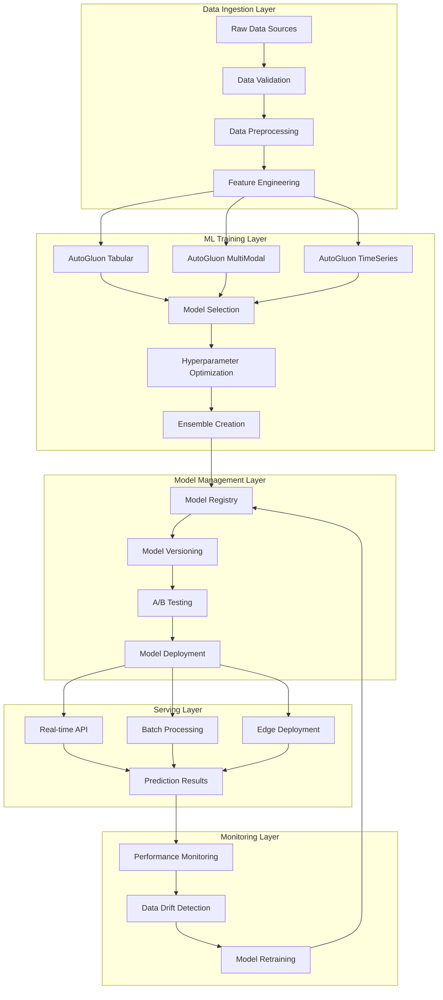
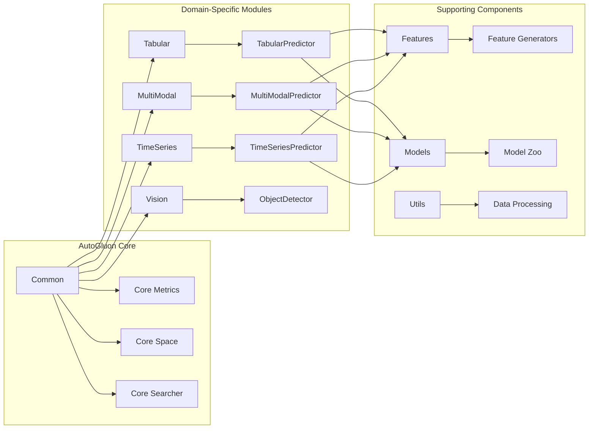
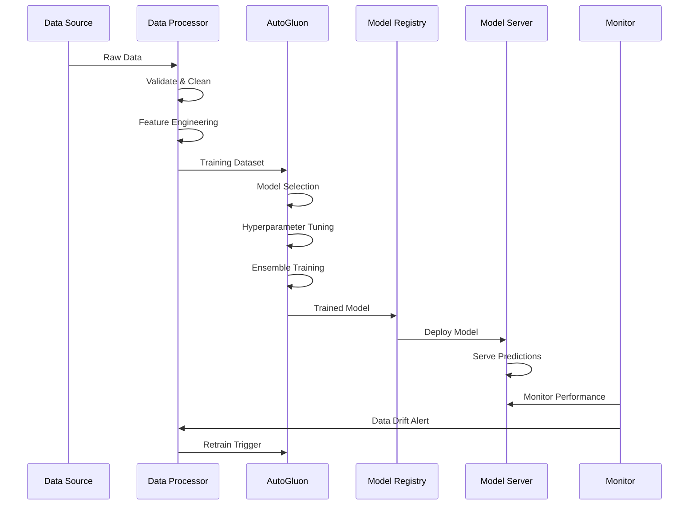
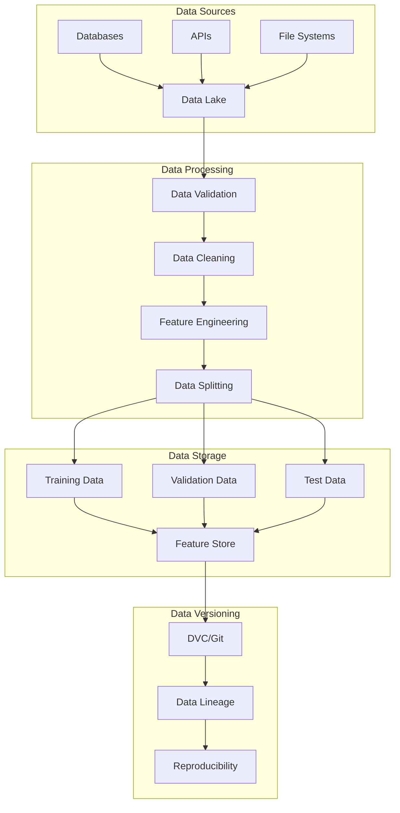
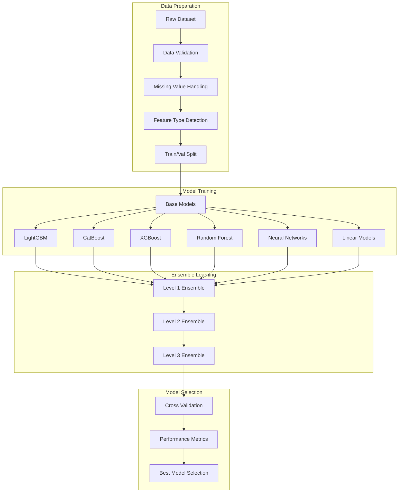
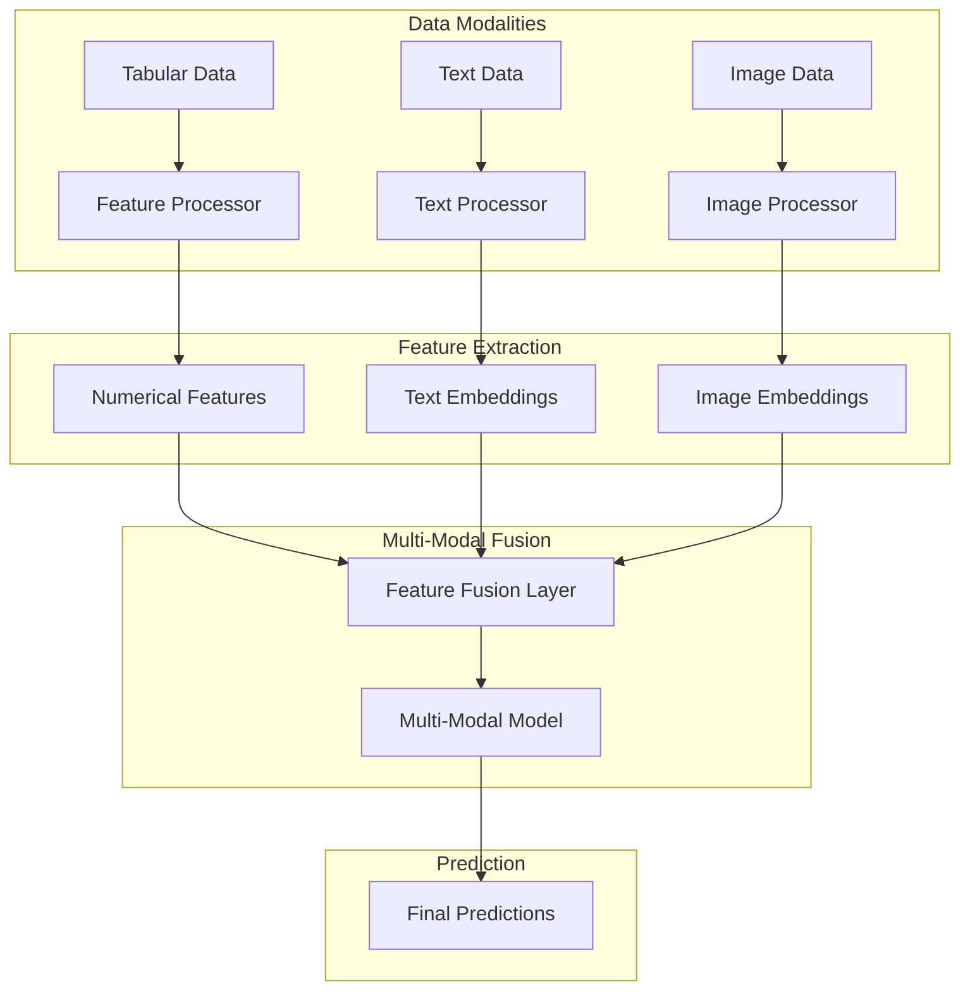
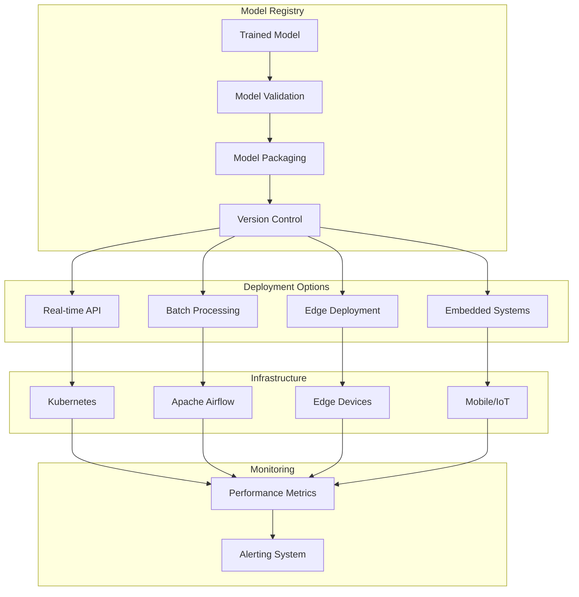

# CLAUDE.md - AutoGluon ML Architecture Definition & AI Collaboration Guide

**Version**: {{claudeVersion}}  
**Date**: {{date}}  
**Generated from**: RDS.md requirements analysis  
**Technology Stack**: AutoGluon (AutoML Framework)

This file defines the comprehensive architecture of the AutoGluon machine learning solution. It aligns with the Architect Crew methodology, where:
- **`docs/RDS.md`** outlines the **functional requirements** and user needs.
- **`docs/FRS.md`** provides the **detailed technical specifications**, including all UML diagrams (Mermaid) and specific implementation blueprints.
- **`CLAUDE.md`** (this file) instructs Claude (and similar AI) on how to interpret these documents, contribute to the architecture, and ensure `AGENTS.md` is correctly aligned.
- **`AGENTS.md`** provides specific, actionable instructions for AI agents performing implementation tasks.

## 1. From RDS → FRS Validation

**Source**: `docs/RDS.md` (What & Why)  
**Ensure**: Every RDS requirement appears in FRS diagrams/contracts.

{{rdsToFrsValidation}}

## 2. AutoGluon ML Architecture Overview

{{autogluonMLArchitectureOverview}}

### Core AutoML Principles

1. **Automated Machine Learning Pipeline**
   - Automated feature engineering
   - Model selection and hyperparameter optimization
   - Ensemble learning with stacking
   - Cross-validation and model evaluation

2. **Multi-Modal Learning Support**
   - Tabular data processing
   - Text classification and regression
   - Image classification
   - Time series forecasting
   - Multi-modal fusion

3. **Production-Ready Deployment**
   - Model serving APIs
   - Batch processing pipelines
   - Model monitoring and drift detection
   - Automated retraining workflows

4. **Scalable Architecture**
   - Distributed training capabilities
   - Cloud-native deployment
   - Resource optimization
   - MLOps integration

## 3. System Architecture Layers



## 4. AutoGluon Framework Integration

{{autogluonFrameworkIntegration}}

### AutoGluon Modules Architecture



### Technology Stack Integration

```python
# Core AutoGluon stack
from autogluon.tabular import TabularDataset, TabularPredictor
from autogluon.multimodal import MultiModalPredictor
from autogluon.timeseries import TimeSeriesDataFrame, TimeSeriesPredictor

# MLOps and monitoring
import mlflow
import wandb
from evidently import ColumnMapping
from evidently.report import Report
from evidently.metric_preset import DataDriftPreset

# Deployment and serving
from flask import Flask
from celery import Celery
import docker
from kubernetes import client, config

# Data processing and visualization
import pandas as pd
import numpy as np
import matplotlib.pyplot as plt
import seaborn as sns
import plotly.express as px
```

## 5. ML Pipeline Architecture

{{mlPipelineArchitecture}}

### End-to-End ML Workflow



### Data Processing Pipeline

```python
class MLPipeline:
    """Comprehensive ML pipeline with AutoGluon."""
    
    def __init__(self, config: Dict[str, Any]):
        self.config = config
        self.data_processor = DataProcessor(config['data'])
        self.model_trainer = ModelTrainer(config['training'])
        self.evaluator = ModelEvaluator(config['evaluation'])
        self.deployer = ModelDeployer(config['deployment'])
    
    def run_pipeline(self, data_path: str) -> Dict[str, Any]:
        """Execute complete ML pipeline."""
        
        # 1. Data Processing
        train_data, test_data = self.data_processor.process_data(data_path)
        
        # 2. Model Training
        predictor = self.model_trainer.train(
            train_data, 
            label=self.config['training']['label_column']
        )
        
        # 3. Model Evaluation
        evaluation_results = self.evaluator.evaluate(predictor, test_data)
        
        # 4. Model Deployment
        if evaluation_results['metrics']['primary_metric'] > self.config['deployment']['threshold']:
            deployment_info = self.deployer.deploy(predictor)
        else:
            deployment_info = {'status': 'rejected', 'reason': 'performance_threshold'}
        
        return {
            'training_results': evaluation_results,
            'deployment_info': deployment_info,
            'model_path': predictor.path
        }
```

## 6. Data Architecture

{{dataArchitecture}}

### Data Flow and Management



### Feature Store Architecture

```python
class FeatureStore:
    """Centralized feature management for ML pipelines."""
    
    def __init__(self, config: Dict[str, Any]):
        self.config = config
        self.storage_backend = self._init_storage()
        self.feature_registry = {}
    
    def register_feature_set(
        self, 
        name: str, 
        features: List[str],
        data_source: str,
        update_frequency: str
    ) -> None:
        """Register a new feature set."""
        
        feature_set = {
            'name': name,
            'features': features,
            'data_source': data_source,
            'update_frequency': update_frequency,
            'created_at': datetime.utcnow(),
            'version': self._get_next_version(name)
        }
        
        self.feature_registry[name] = feature_set
        self._persist_registry()
    
    def get_features(
        self, 
        feature_names: List[str],
        entity_ids: List[str],
        timestamp: Optional[datetime] = None
    ) -> pd.DataFrame:
        """Retrieve features for given entities."""
        
        # Point-in-time feature retrieval
        if timestamp is None:
            timestamp = datetime.utcnow()
        
        features_data = []
        
        for feature_name in feature_names:
            feature_set = self._find_feature_set(feature_name)
            if feature_set:
                data = self._retrieve_feature_data(
                    feature_set, 
                    entity_ids, 
                    timestamp
                )
                features_data.append(data)
        
        # Combine features
        if features_data:
            return pd.concat(features_data, axis=1)
        else:
            return pd.DataFrame()
    
    def compute_features(
        self, 
        raw_data: pd.DataFrame,
        feature_definitions: Dict[str, Any]
    ) -> pd.DataFrame:
        """Compute features from raw data."""
        
        computed_features = raw_data.copy()
        
        for feature_name, definition in feature_definitions.items():
            if definition['type'] == 'aggregation':
                computed_features[feature_name] = self._compute_aggregation(
                    raw_data, definition
                )
            elif definition['type'] == 'transformation':
                computed_features[feature_name] = self._apply_transformation(
                    raw_data, definition
                )
            elif definition['type'] == 'interaction':
                computed_features[feature_name] = self._create_interaction(
                    raw_data, definition
                )
        
        return computed_features
```

## 7. Model Training Architecture

{{modelTrainingArchitecture}}

### AutoGluon Training Strategy



### Advanced Training Configuration

```python
class AutoGluonTrainingManager:
    """Advanced AutoGluon training management."""
    
    def __init__(self, config: Dict[str, Any]):
        self.config = config
        self.experiment_tracker = ExperimentTracker(config['tracking'])
    
    def train_with_optimization(
        self, 
        train_data: TabularDataset,
        label: str,
        optimization_metric: str = 'auto'
    ) -> TabularPredictor:
        """Train with advanced optimization strategies."""
        
        # Start experiment tracking
        with self.experiment_tracker.start_run():
            
            # Configure hyperparameter space
            hyperparameters = self._get_optimized_hyperparameters()
            
            # Set up predictor with advanced configuration
            predictor = TabularPredictor(
                label=label,
                problem_type=self.config.get('problem_type', 'auto'),
                eval_metric=optimization_metric,
                path=self.config.get('model_path', './models/'),
                verbosity=self.config.get('verbosity', 2),
                sample_weight=self.config.get('sample_weight'),
                weight_evaluation=self.config.get('weight_evaluation', True)
            )
            
            # Advanced training with custom presets
            predictor.fit(
                train_data,
                time_limit=self.config.get('time_limit', 3600),
                presets=self._get_training_presets(),
                hyperparameters=hyperparameters,
                num_bag_folds=self.config.get('num_bag_folds', 8),
                num_bag_sets=self.config.get('num_bag_sets', 1),
                num_stack_levels=self.config.get('num_stack_levels', 1),
                auto_stack=self.config.get('auto_stack', True),
                feature_metadata=self._get_feature_metadata(train_data),
                excluded_model_types=self.config.get('excluded_models', []),
                included_model_types=self.config.get('included_models'),
                holdout_frac=self.config.get('holdout_frac', 0.1),
                num_cpus=self.config.get('num_cpus', 'auto'),
                num_gpus=self.config.get('num_gpus', 'auto')
            )
            
            # Log training results
            self._log_training_metrics(predictor, train_data)
            
            return predictor
    
    def _get_optimized_hyperparameters(self) -> Dict[str, Any]:
        """Get optimized hyperparameter configurations."""
        
        return {
            'GBM': [
                # Fast configuration
                {
                    'extra_trees': True,
                    'ag_args': {
                        'name_suffix': 'XT',
                        'priority': 0
                    }
                },
                # Accurate configuration
                {
                    'num_boost_round': 10000,
                    'learning_rate': ag.space.Real(0.01, 0.2, log=True),
                    'num_leaves': ag.space.Int(26, 66),
                    'feature_fraction': ag.space.Real(0.4, 1.0),
                    'min_data_in_leaf': ag.space.Int(5, 25),
                    'ag_args': {
                        'name_suffix': 'Opt',
                        'priority': 1
                    }
                }
            ],
            'CAT': [
                {
                    'iterations': 10000,
                    'learning_rate': ag.space.Real(0.01, 0.2, log=True),
                    'depth': ag.space.Int(4, 10),
                    'l2_leaf_reg': ag.space.Real(1, 10, log=True),
                    'bootstrap_type': ag.space.Categorical(['Bayesian', 'Bernoulli']),
                    'ag_args': {
                        'name_suffix': 'Opt',
                        'priority': 1
                    }
                }
            ],
            'XGB': [
                {
                    'n_estimators': 10000,
                    'learning_rate': ag.space.Real(0.01, 0.2, log=True),
                    'max_depth': ag.space.Int(3, 10),
                    'subsample': ag.space.Real(0.5, 1.0),
                    'colsample_bytree': ag.space.Real(0.5, 1.0),
                    'ag_args': {
                        'name_suffix': 'Opt',
                        'priority': 1
                    }
                }
            ],
            'NN_TORCH': [
                {
                    'num_epochs': 200,
                    'learning_rate': ag.space.Real(1e-4, 1e-2, log=True),
                    'weight_decay': ag.space.Real(1e-6, 1e-2, log=True),
                    'dropout_prob': ag.space.Real(0.0, 0.5),
                    'hidden_size': ag.space.Int(64, 512),
                    'ag_args': {
                        'name_suffix': 'Opt',
                        'priority': 2
                    }
                }
            ]
        }
    
    def _get_training_presets(self) -> Union[str, List[str]]:
        """Get training presets based on configuration."""
        
        preset_map = {
            'fast': 'fast_baseline',
            'good': 'good_quality',
            'best': 'best_quality',
            'interpretable': 'interpretable',
            'ignore_text': 'ignore_text'
        }
        
        preset = self.config.get('preset', 'good')
        
        if isinstance(preset, list):
            return [preset_map.get(p, p) for p in preset]
        else:
            return preset_map.get(preset, preset)
```

## 8. Multi-Modal Learning Architecture

{{multiModalLearningArchitecture}}

### Multi-Modal Data Integration



### Multi-Modal Implementation

```python
class MultiModalMLPipeline:
    """Multi-modal machine learning pipeline with AutoGluon."""
    
    def __init__(self, config: Dict[str, Any]):
        self.config = config
        self.modality_processors = {
            'tabular': TabularProcessor(config.get('tabular', {})),
            'text': TextProcessor(config.get('text', {})),
            'image': ImageProcessor(config.get('image', {}))
        }
    
    def train_multimodal_model(
        self, 
        data_path: str,
        label_column: str
    ) -> MultiModalPredictor:
        """Train multi-modal model with AutoGluon."""
        
        # Load and validate multi-modal data
        data = self._load_multimodal_data(data_path)
        
        # Configure multi-modal predictor
        predictor = MultiModalPredictor(
            label=label_column,
            problem_type=self.config.get('problem_type', 'auto'),
            eval_metric=self.config.get('eval_metric', 'auto'),
            path=self.config.get('model_path', './multimodal_models/'),
            verbosity=self.config.get('verbosity', 2)
        )
        
        # Advanced hyperparameter configuration
        hyperparameters = self._get_multimodal_hyperparameters()
        
        # Train model
        predictor.fit(
            data,
            time_limit=self.config.get('time_limit', 7200),
            hyperparameters=hyperparameters,
            holdout_frac=self.config.get('holdout_frac', 0.1),
            num_cpus=self.config.get('num_cpus', 'auto'),
            num_gpus=self.config.get('num_gpus', 'auto')
        )
        
        return predictor
    
    def _load_multimodal_data(self, data_path: str) -> pd.DataFrame:
        """Load and prepare multi-modal data."""
        
        # Load base dataset
        data = pd.read_csv(data_path)
        
        # Process each modality
        for modality, processor in self.modality_processors.items():
            if modality in self.config and self.config[modality].get('enabled', False):
                data = processor.process(data)
        
        return data
    
    def _get_multimodal_hyperparameters(self) -> Dict[str, Any]:
        """Get multi-modal specific hyperparameters."""
        
        return {
            'model.names': ['fusion_mlp', 'fusion_transformer'],
            'model.fusion_mlp.hidden_size': 128,
            'model.fusion_mlp.num_layers': 3,
            'model.fusion_mlp.dropout': 0.1,
            'model.fusion_transformer.num_layers': 4,
            'model.fusion_transformer.num_heads': 8,
            'model.fusion_transformer.hidden_size': 256,
            'optimization.learning_rate': 1e-4,
            'optimization.weight_decay': 1e-5,
            'optimization.num_epochs': 50,
            'data.categorical.convert_to_text': False,
            'data.numerical.normalize': True,
            'data.text.max_length': 512,
            'data.image.size': 224
        }

class TextProcessor:
    """Text data processor for multi-modal learning."""
    
    def __init__(self, config: Dict[str, Any]):
        self.config = config
        self.text_columns = config.get('text_columns', [])
        self.max_length = config.get('max_length', 512)
    
    def process(self, data: pd.DataFrame) -> pd.DataFrame:
        """Process text data for multi-modal learning."""
        
        processed_data = data.copy()
        
        for column in self.text_columns:
            if column in data.columns:
                # Clean text
                processed_data[column] = data[column].astype(str)
                processed_data[column] = processed_data[column].str.lower()
                processed_data[column] = processed_data[column].str.replace(r'[^\w\s]', '', regex=True)
                
                # Truncate to max length
                processed_data[column] = processed_data[column].str[:self.max_length]
        
        return processed_data

class ImageProcessor:
    """Image data processor for multi-modal learning."""
    
    def __init__(self, config: Dict[str, Any]):
        self.config = config
        self.image_columns = config.get('image_columns', [])
        self.image_root = config.get('image_root', './images/')
    
    def process(self, data: pd.DataFrame) -> pd.DataFrame:
        """Process image data for multi-modal learning."""
        
        processed_data = data.copy()
        
        for column in self.image_columns:
            if column in data.columns:
                # Convert image paths to absolute paths
                processed_data[column] = data[column].apply(
                    lambda x: os.path.join(self.image_root, x) if pd.notna(x) else x
                )
                
                # Validate image files exist
                processed_data[column] = processed_data[column].apply(
                    lambda x: x if os.path.exists(x) else None
                )
        
        return processed_data
```

## 9. Model Deployment Architecture

{{modelDeploymentArchitecture}}

### Deployment Strategy



### Cloud-Native Deployment

```python
class CloudMLDeployment:
    """Cloud-native ML model deployment with AutoGluon."""
    
    def __init__(self, config: Dict[str, Any]):
        self.config = config
        self.cloud_provider = config['cloud_provider']
        self.deployment_strategy = config['deployment_strategy']
    
    def deploy_to_kubernetes(
        self, 
        model_path: str,
        service_name: str
    ) -> Dict[str, Any]:
        """Deploy AutoGluon model to Kubernetes."""
        
        # Create model serving container
        container_image = self._build_serving_container(model_path)
        
        # Generate Kubernetes manifests
        manifests = self._generate_k8s_manifests(
            service_name, 
            container_image
        )
        
        # Deploy to cluster
        deployment_result = self._deploy_to_cluster(manifests)
        
        return {
            'service_name': service_name,
            'container_image': container_image,
            'endpoint': deployment_result.get('endpoint'),
            'status': deployment_result.get('status')
        }
    
    def deploy_serverless(
        self, 
        model_path: str,
        function_name: str
    ) -> Dict[str, Any]:
        """Deploy as serverless function."""
        
        if self.cloud_provider == 'aws':
            return self._deploy_to_lambda(model_path, function_name)
        elif self.cloud_provider == 'gcp':
            return self._deploy_to_cloud_functions(model_path, function_name)
        elif self.cloud_provider == 'azure':
            return self._deploy_to_azure_functions(model_path, function_name)
        else:
            raise ValueError(f"Unsupported cloud provider: {self.cloud_provider}")
    
    def _build_serving_container(self, model_path: str) -> str:
        """Build Docker container for model serving."""
        
        dockerfile_content = f"""
        FROM python:3.9-slim
        
        WORKDIR /app
        
        # Install dependencies
        COPY requirements.txt .
        RUN pip install -r requirements.txt
        
        # Copy model
        COPY {model_path} ./model/
        
        # Copy serving code
        COPY serving/ ./serving/
        
        # Health check
        HEALTHCHECK --interval=30s --timeout=10s --start-period=5s --retries=3 \\
            CMD curl -f http://localhost:8080/health || exit 1
        
        # Run server
        CMD ["python", "serving/app.py"]
        """
        
        # Build and push container
        container_tag = f"{self.config['registry']}/{self.config['image_name']}:latest"
        
        # This would integrate with Docker API or CI/CD system
        return container_tag
    
    def _generate_k8s_manifests(
        self, 
        service_name: str, 
        container_image: str
    ) -> Dict[str, Any]:
        """Generate Kubernetes deployment manifests."""
        
        deployment_manifest = {
            'apiVersion': 'apps/v1',
            'kind': 'Deployment',
            'metadata': {
                'name': f"{service_name}-deployment",
                'labels': {'app': service_name}
            },
            'spec': {
                'replicas': self.config.get('replicas', 3),
                'selector': {'matchLabels': {'app': service_name}},
                'template': {
                    'metadata': {'labels': {'app': service_name}},
                    'spec': {
                        'containers': [{
                            'name': service_name,
                            'image': container_image,
                            'ports': [{'containerPort': 8080}],
                            'resources': {
                                'requests': {
                                    'cpu': self.config.get('cpu_request', '100m'),
                                    'memory': self.config.get('memory_request', '256Mi')
                                },
                                'limits': {
                                    'cpu': self.config.get('cpu_limit', '500m'),
                                    'memory': self.config.get('memory_limit', '1Gi')
                                }
                            },
                            'livenessProbe': {
                                'httpGet': {'path': '/health', 'port': 8080},
                                'initialDelaySeconds': 30,
                                'periodSeconds': 10
                            },
                            'readinessProbe': {
                                'httpGet': {'path': '/ready', 'port': 8080},
                                'initialDelaySeconds': 5,
                                'periodSeconds': 5
                            }
                        }]
                    }
                }
            }
        }
        
        service_manifest = {
            'apiVersion': 'v1',
            'kind': 'Service',
            'metadata': {'name': f"{service_name}-service"},
            'spec': {
                'selector': {'app': service_name},
                'ports': [{
                    'protocol': 'TCP',
                    'port': 80,
                    'targetPort': 8080
                }],
                'type': 'LoadBalancer'
            }
        }
        
        return {
            'deployment': deployment_manifest,
            'service': service_manifest
        }
```

## 10. MLOps and Monitoring Architecture

{{mlopsMonitoringArchitecture}}

### MLOps Workflow

```mermaid
graph LR
    subgraph "Development"
        A[Data Scientists] --> B[Experiment Tracking]
        B --> C[Model Development]
        C --> D[Model Validation]
    end
    
    subgraph "CI/CD Pipeline"
        D --> E[Automated Testing]
        E --> F[Model Packaging]
        F --> G[Deployment Staging]
        G --> H[Production Deployment]
    end
    
    subgraph "Production Monitoring"
        H --> I[Performance Monitoring]
        I --> J[Data Drift Detection]
        J --> K[Model Degradation]
        K --> L[Automated Retraining]
    end
    
    subgraph "Feedback Loop"
        L --> M[New Training Data]
        M --> C
    end
```



### Comprehensive Monitoring System

```python
class MLOpsMonitoringSystem:
    """Comprehensive MLOps monitoring for AutoGluon models."""
    
    def __init__(self, config: Dict[str, Any]):
        self.config = config
        self.metrics_store = MetricsStore(config['metrics'])
        self.alerting_system = AlertingSystem(config['alerting'])
        self.retraining_trigger = RetrainingTrigger(config['retraining'])
    
    def monitor_model_performance(
        self, 
        model_name: str,
        predictions: np.ndarray,
        ground_truth: np.ndarray,
        timestamp: datetime
    ) -> Dict[str, float]:
        """Monitor real-time model performance."""
        
        # Calculate performance metrics
        metrics = self._calculate_performance_metrics(
            predictions, 
            ground_truth
        )
        
        # Store metrics
        self.metrics_store.store_metrics(
            model_name, 
            metrics, 
            timestamp
        )
        
        # Check for performance degradation
        degradation_score = self._check_performance_degradation(
            model_name, 
            metrics
        )
        
        if degradation_score > self.config['degradation_threshold']:
            self.alerting_system.send_alert(
                'model_degradation',
                {
                    'model_name': model_name,
                    'degradation_score': degradation_score,
                    'current_metrics': metrics
                }
            )
        
        return metrics
    
    def monitor_data_drift(
        self, 
        model_name: str,
        reference_data: pd.DataFrame,
        current_data: pd.DataFrame
    ) -> Dict[str, float]:
        """Monitor data drift using statistical tests."""
        
        drift_report = self._generate_drift_report(
            reference_data, 
            current_data
        )
        
        # Calculate overall drift score
        drift_score = np.mean([
            result['drift_score'] 
            for result in drift_report.values()
        ])
        
        # Store drift metrics
        self.metrics_store.store_drift_metrics(
            model_name, 
            drift_report, 
            datetime.utcnow()
        )
        
        # Check drift threshold
        if drift_score > self.config['drift_threshold']:
            self.alerting_system.send_alert(
                'data_drift',
                {
                    'model_name': model_name,
                    'drift_score': drift_score,
                    'drift_report': drift_report
                }
            )
            
            # Trigger retraining if necessary
            if self.config.get('auto_retrain', False):
                self.retraining_trigger.schedule_retraining(
                    model_name, 
                    reason='data_drift',
                    priority='high'
                )
        
        return drift_report
    
    def _generate_drift_report(
        self, 
        reference_data: pd.DataFrame,
        current_data: pd.DataFrame
    ) -> Dict[str, Dict[str, float]]:
        """Generate comprehensive drift report."""
        
        from evidently.report import Report
        from evidently.metric_preset import DataDriftPreset
        
        # Create Evidently report
        report = Report(metrics=[DataDriftPreset()])
        report.run(
            reference_data=reference_data,
            current_data=current_data
        )
        
        # Extract drift metrics
        drift_results = {}
        
        for column in reference_data.columns:
            if column in current_data.columns:
                if pd.api.types.is_numeric_dtype(reference_data[column]):
                    # KS test for numerical features
                    from scipy.stats import ks_2samp
                    statistic, p_value = ks_2samp(
                        reference_data[column].dropna(),
                        current_data[column].dropna()
                    )
                    drift_results[column] = {
                        'test': 'ks_test',
                        'statistic': statistic,
                        'p_value': p_value,
                        'drift_score': 1 - p_value
                    }
                else:
                    # Chi-square test for categorical features
                    ref_dist = reference_data[column].value_counts(normalize=True)
                    curr_dist = current_data[column].value_counts(normalize=True)
                    
                    # Population Stability Index (PSI)
                    psi = self._calculate_psi(ref_dist, curr_dist)
                    
                    drift_results[column] = {
                        'test': 'psi',
                        'psi_score': psi,
                        'drift_score': min(psi / 0.25, 1.0)  # Normalize to 0-1
                    }
        
        return drift_results
    
    def _calculate_psi(
        self, 
        reference_dist: pd.Series,
        current_dist: pd.Series
    ) -> float:
        """Calculate Population Stability Index."""
        
        # Align distributions
        all_categories = set(reference_dist.index) | set(current_dist.index)
        
        ref_probs = np.array([reference_dist.get(cat, 1e-6) for cat in all_categories])
        curr_probs = np.array([current_dist.get(cat, 1e-6) for cat in all_categories])
        
        # Normalize to ensure they sum to 1
        ref_probs = ref_probs / ref_probs.sum()
        curr_probs = curr_probs / curr_probs.sum()
        
        # Calculate PSI
        psi = np.sum((curr_probs - ref_probs) * np.log(curr_probs / ref_probs))
        
        return psi

class AutomatedRetraining:
    """Automated model retraining system."""
    
    def __init__(self, config: Dict[str, Any]):
        self.config = config
        self.training_scheduler = TrainingScheduler(config['scheduler'])
    
    def schedule_retraining(
        self, 
        model_name: str,
        trigger_reason: str,
        priority: str = 'medium'
    ) -> Dict[str, Any]:
        """Schedule automated model retraining."""
        
        retraining_job = {
            'model_name': model_name,
            'trigger_reason': trigger_reason,
            'priority': priority,
            'scheduled_at': datetime.utcnow(),
            'config': self._get_retraining_config(model_name),
            'data_sources': self._get_updated_data_sources(model_name)
        }
        
        # Submit to training queue
        job_id = self.training_scheduler.submit_job(retraining_job)
        
        return {
            'job_id': job_id,
            'status': 'scheduled',
            'estimated_completion': self._estimate_completion_time(retraining_job)
        }
    
    def execute_retraining(self, job_id: str) -> Dict[str, Any]:
        """Execute automated retraining job."""
        
        job = self.training_scheduler.get_job(job_id)
        
        try:
            # Load updated training data
            training_data = self._load_updated_training_data(job['data_sources'])
            
            # Initialize training pipeline
            pipeline = MLPipeline(job['config'])
            
            # Execute training
            results = pipeline.run_pipeline(training_data)
            
            # Validate new model
            if self._validate_new_model(results):
                # Deploy new model
                deployment_info = self._deploy_retrained_model(results)
                
                return {
                    'status': 'completed',
                    'model_performance': results['training_results']['metrics'],
                    'deployment_info': deployment_info
                }
            else:
                return {
                    'status': 'failed',
                    'reason': 'validation_failed',
                    'model_performance': results['training_results']['metrics']
                }
                
        except Exception as e:
            return {
                'status': 'error',
                'error_message': str(e)
            }
```

## 11. Performance Optimization Architecture

{{performanceOptimizationArchitecture}}

### Resource Optimization Strategy

```python
class AutoGluonOptimizer:
    """Performance optimization for AutoGluon models."""
    
    def __init__(self, config: Dict[str, Any]):
        self.config = config
        self.optimization_strategies = {
            'memory': MemoryOptimizer(config.get('memory', {})),
            'compute': ComputeOptimizer(config.get('compute', {})),
            'storage': StorageOptimizer(config.get('storage', {}))
        }
    
    def optimize_training(
        self, 
        training_config: Dict[str, Any]
    ) -> Dict[str, Any]:
        """Optimize training configuration for performance."""
        
        optimized_config = training_config.copy()
        
        # Memory optimization
        memory_config = self.optimization_strategies['memory'].optimize(
            optimized_config
        )
        optimized_config.update(memory_config)
        
        # Compute optimization
        compute_config = self.optimization_strategies['compute'].optimize(
            optimized_config
        )
        optimized_config.update(compute_config)
        
        # Storage optimization
        storage_config = self.optimization_strategies['storage'].optimize(
            optimized_config
        )
        optimized_config.update(storage_config)
        
        return optimized_config
    
    def optimize_inference(
        self, 
        predictor: TabularPredictor
    ) -> TabularPredictor:
        """Optimize model for faster inference."""
        
        # Model compression
        if self.config.get('enable_compression', False):
            predictor = self._compress_model(predictor)
        
        # Feature selection
        if self.config.get('enable_feature_selection', False):
            predictor = self._optimize_features(predictor)
        
        # Model distillation
        if self.config.get('enable_distillation', False):
            predictor = self._distill_model(predictor)
        
        return predictor
    
    def _compress_model(self, predictor: TabularPredictor) -> TabularPredictor:
        """Compress model for reduced memory footprint."""
        
        # Remove unnecessary models from ensemble
        leaderboard = predictor.leaderboard(silent=True)
        
        # Keep only top performing models
        top_models = leaderboard.head(
            self.config.get('max_models_in_ensemble', 5)
        )['model'].tolist()
        
        # Create compressed predictor with selected models
        compressed_predictor = predictor.clone()
        compressed_predictor.delete_models(
            models_to_keep=top_models,
            dry_run=False
        )
        
        return compressed_predictor
    
    def _optimize_features(self, predictor: TabularPredictor) -> TabularPredictor:
        """Optimize feature set for faster inference."""
        
        # Get feature importance
        feature_importance = predictor.feature_importance(silent=True)
        
        # Select top features
        top_features = feature_importance.head(
            self.config.get('max_features', 50)
        )['feature'].tolist()
        
        # This would require retraining with selected features
        # For now, return original predictor
        return predictor

class DistributedTraining:
    """Distributed training support for AutoGluon."""
    
    def __init__(self, config: Dict[str, Any]):
        self.config = config
        self.cluster_config = config.get('cluster', {})
    
    def setup_distributed_training(self) -> Dict[str, Any]:
        """Set up distributed training environment."""
        
        if self.cluster_config.get('type') == 'ray':
            import ray
            
            ray.init(
                address=self.cluster_config.get('address'),
                num_cpus=self.cluster_config.get('num_cpus'),
                num_gpus=self.cluster_config.get('num_gpus')
            )
            
            return {'framework': 'ray', 'status': 'initialized'}
        
        elif self.cluster_config.get('type') == 'dask':
            from dask.distributed import Client
            
            client = Client(self.cluster_config.get('address'))
            
            return {'framework': 'dask', 'status': 'initialized', 'client': client}
        
        else:
            return {'framework': 'local', 'status': 'single_machine'}
    
    def train_distributed(
        self, 
        train_data: TabularDataset,
        label: str
    ) -> TabularPredictor:
        """Train model using distributed computing."""
        
        # Set up distributed environment
        distributed_setup = self.setup_distributed_training()
        
        # Configure distributed training
        predictor = TabularPredictor(
            label=label,
            path=self.config.get('model_path', './distributed_models/'),
            verbosity=self.config.get('verbosity', 2)
        )
        
        # Use distributed training if available
        training_config = {
            'num_cpus': self.cluster_config.get('num_cpus', 'auto'),
            'num_gpus': self.cluster_config.get('num_gpus', 'auto'),
            'time_limit': self.config.get('time_limit', 7200)
        }
        
        predictor.fit(
            train_data,
            **training_config
        )
        
        return predictor
```

## Agent Collaboration Instructions

When implementing AutoGluon ML solutions:

1. **Follow AutoML Best Practices**
   - Leverage AutoGluon's automated capabilities
   - Implement proper data validation and preprocessing
   - Use ensemble methods effectively
   - Monitor model performance continuously

2. **Ensure Production Readiness**
   - Implement comprehensive monitoring
   - Set up automated retraining pipelines
   - Use proper MLOps practices
   - Design for scalability

3. **Maintain Code Quality**
   - Write modular, testable code
   - Use type hints and documentation
   - Implement proper error handling
   - Follow configuration management best practices

4. **Optimize for Performance**
   - Use distributed training when appropriate
   - Implement model compression techniques
   - Optimize data pipelines
   - Monitor resource usage

## Success Metrics

1. **Model Performance**
   - Accuracy/F1-score improvement over baseline
   - Training time optimization
   - Inference latency < 100ms
   - Resource utilization efficiency

2. **Operational Excellence**
   - 99.9% model serving uptime
   - Automated drift detection
   - Mean time to retrain < 4 hours
   - Zero-downtime deployments

3. **Development Velocity**
   - Experiment tracking coverage
   - Automated testing pipeline
   - Time to production < 1 week
   - Model reproducibility

---

**Remember**: This architecture promotes automated, scalable, and production-ready machine learning solutions. Every implementation decision should align with AutoML principles while meeting the business requirements defined in RDS.md.