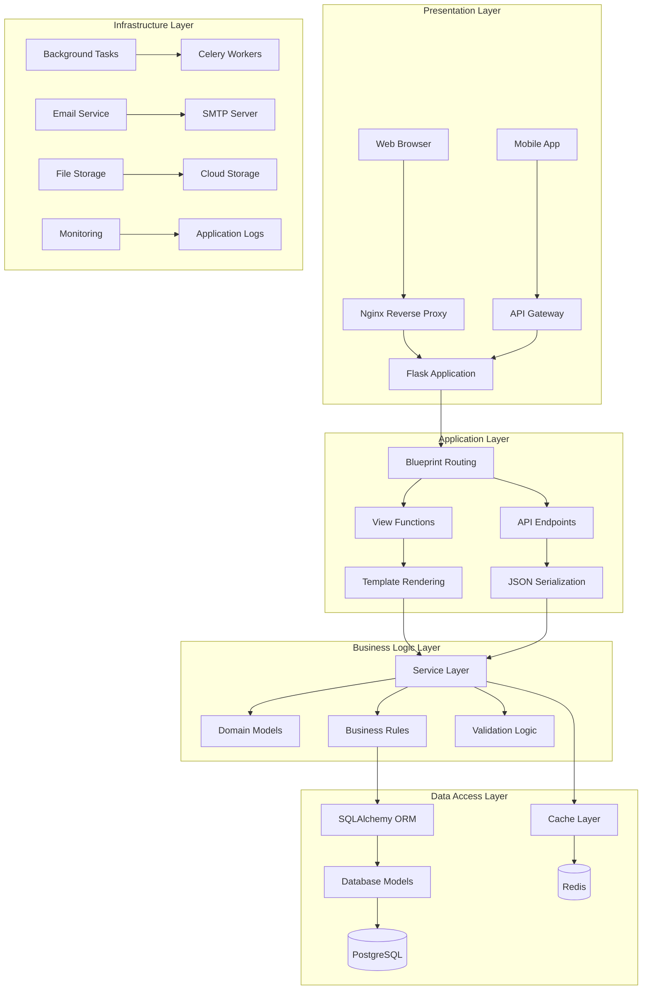
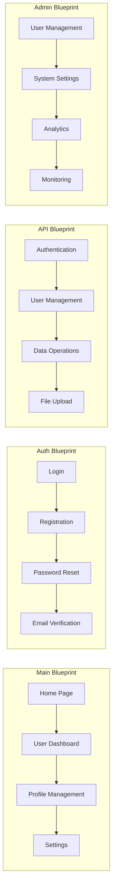
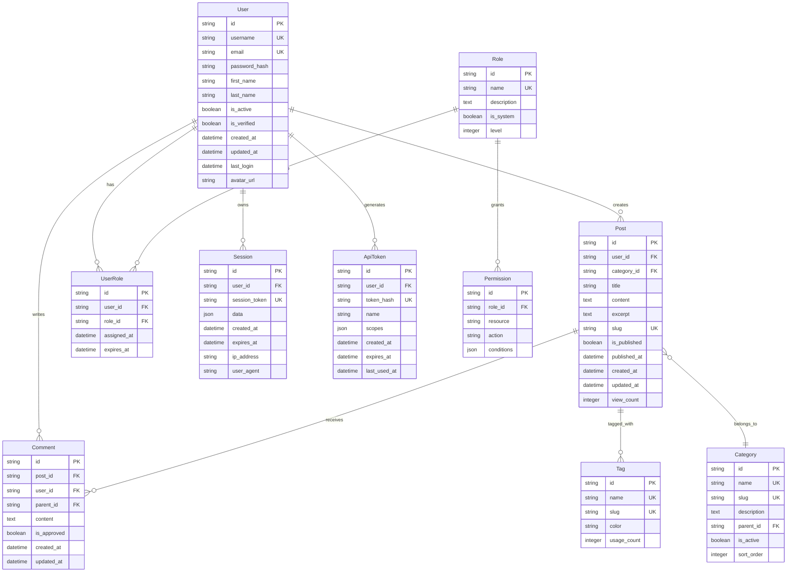
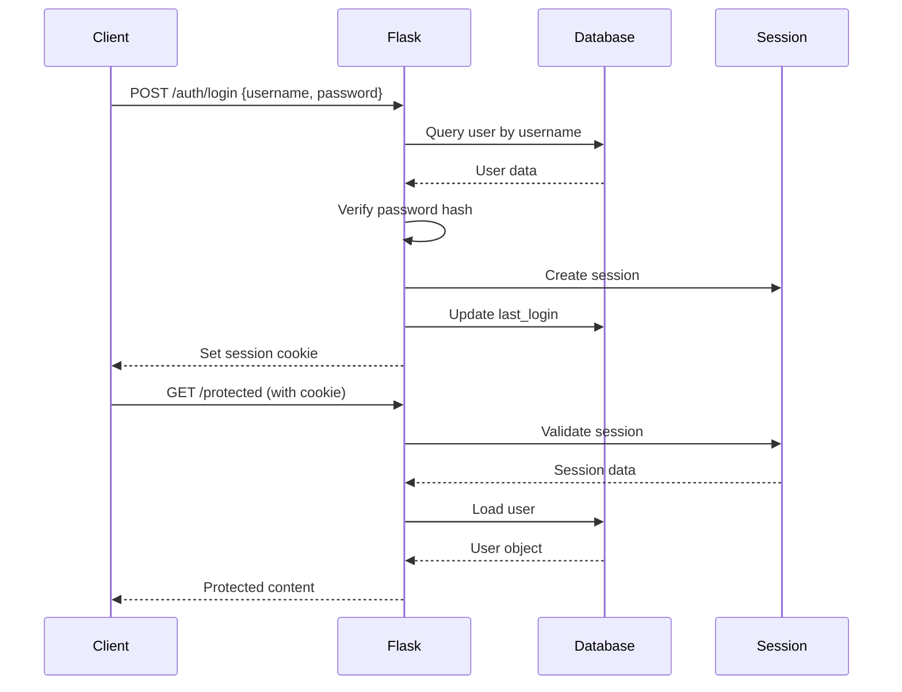
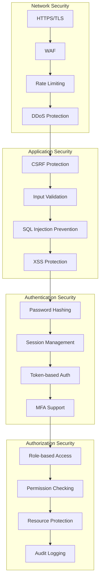

# CLAUDE.md - Flask Web Application Architecture Definition & AI Collaboration Guide

**Version**: {{claudeVersion}}  
**Date**: {{date}}  
**Generated from**: RDS.md requirements analysis  
**Technology Stack**: Flask (Python Web Framework)

This file defines the comprehensive architecture of the Flask web application solution. It aligns with the Architect Crew methodology, where:
- **`docs/RDS.md`** outlines the **functional requirements** and user needs.
- **`docs/FRS.md`** provides the **detailed technical specifications**, including all UML diagrams (Mermaid) and specific implementation blueprints.
- **`CLAUDE.md`** (this file) instructs Claude (and similar AI) on how to interpret these documents, contribute to the architecture, and ensure `AGENTS.md` is correctly aligned.
- **`AGENTS.md`** provides specific, actionable instructions for AI agents performing implementation tasks.

## 1. From RDS → FRS Validation

**Source**: `docs/RDS.md` (What & Why)  
**Ensure**: Every RDS requirement appears in FRS diagrams/contracts.

{{rdsToFrsValidation}}

## 2. Flask Architectural Overview

{{flaskArchitecturalOverview}}

### Core Flask Architecture Principles

1. **Application Factory Pattern**
   - Centralized application configuration
   - Support for multiple environments
   - Easy testing and deployment
   - Extension initialization

2. **Blueprint Organization**
   - Modular application structure
   - Separation of concerns
   - Scalable codebase
   - Team collaboration

3. **MVC Pattern Implementation**
   - Models: SQLAlchemy ORM
   - Views: Jinja2 templates
   - Controllers: Route handlers

4. **RESTful API Design**
   - Resource-based URLs
   - HTTP method semantics
   - Stateless communication
   - JSON data exchange

## 3. System Architecture Layers



## 4. Flask Application Structure

{{flaskApplicationStructure}}

### Directory Architecture

```
flask_project/
├── app/                        # Main application package
│   ├── __init__.py            # Application factory
│   ├── config.py              # Configuration classes
│   ├── extensions.py          # Flask extensions
│   ├── models/                # Database models
│   │   ├── __init__.py
│   │   ├── user.py
│   │   ├── post.py
│   │   └── mixins.py
│   ├── auth/                  # Authentication blueprint
│   │   ├── __init__.py
│   │   ├── routes.py
│   │   ├── forms.py
│   │   └── utils.py
│   ├── main/                  # Main blueprint
│   │   ├── __init__.py
│   │   ├── routes.py
│   │   ├── forms.py
│   │   └── utils.py
│   ├── api/                   # API blueprint
│   │   ├── __init__.py
│   │   ├── auth.py
│   │   ├── users.py
│   │   ├── posts.py
│   │   └── errors.py
│   ├── admin/                 # Admin blueprint
│   │   ├── __init__.py
│   │   ├── routes.py
│   │   └── forms.py
│   ├── errors/                # Error handling
│   │   ├── __init__.py
│   │   └── handlers.py
│   ├── email/                 # Email functionality
│   │   ├── __init__.py
│   │   └── utils.py
│   ├── cli/                   # CLI commands
│   │   ├── __init__.py
│   │   └── commands.py
│   ├── templates/             # Jinja2 templates
│   │   ├── base.html
│   │   ├── auth/
│   │   ├── main/
│   │   ├── admin/
│   │   └── errors/
│   ├── static/                # Static files
│   │   ├── css/
│   │   ├── js/
│   │   ├── img/
│   │   └── vendor/
│   └── utils/                 # Utility functions
│       ├── __init__.py
│       ├── decorators.py
│       ├── helpers.py
│       └── validators.py
├── migrations/                # Database migrations
├── tests/                     # Test suite
│   ├── __init__.py
│   ├── conftest.py
│   ├── test_auth.py
│   ├── test_main.py
│   ├── test_api.py
│   └── test_models.py
├── docs/                      # Documentation
├── logs/                      # Application logs
├── requirements/              # Dependencies
│   ├── base.txt
│   ├── dev.txt
│   ├── prod.txt
│   └── test.txt
├── .env.example              # Environment variables template
├── .flaskenv                 # Flask environment variables
├── wsgi.py                   # WSGI entry point
├── gunicorn.conf.py          # Gunicorn configuration
└── Dockerfile                # Container configuration
```

## 5. Blueprint Architecture

{{blueprintArchitecture}}

### Blueprint Responsibilities



### Blueprint Configuration

```python
# app/auth/__init__.py
from flask import Blueprint

bp = Blueprint('auth', __name__)

from app.auth import routes, forms, utils

# app/main/__init__.py
from flask import Blueprint

bp = Blueprint('main', __name__)

from app.main import routes, forms, utils

# app/api/__init__.py
from flask import Blueprint

bp = Blueprint('api', __name__)

from app.api import auth, users, posts, errors
```

## 6. Database Architecture

{{databaseArchitecture}}

### Entity Relationship Model



### SQLAlchemy Model Implementation

```python
# app/models/base.py
from datetime import datetime
import uuid
from app import db

class TimestampMixin:
    """Mixin for created_at and updated_at timestamps."""
    created_at = db.Column(db.DateTime, default=datetime.utcnow, nullable=False)
    updated_at = db.Column(
        db.DateTime, 
        default=datetime.utcnow, 
        onupdate=datetime.utcnow, 
        nullable=False
    )

class UUIDMixin:
    """Mixin for UUID primary keys."""
    id = db.Column(
        db.String(36), 
        primary_key=True, 
        default=lambda: str(uuid.uuid4())
    )

# app/models/user.py
from flask_sqlalchemy import SQLAlchemy
from flask_login import UserMixin
from werkzeug.security import generate_password_hash, check_password_hash
from app.models.base import TimestampMixin, UUIDMixin

class User(UserMixin, TimestampMixin, UUIDMixin, db.Model):
    """User model with authentication and profile information."""
    __tablename__ = 'users'
    
    # Basic information
    username = db.Column(db.String(64), index=True, unique=True, nullable=False)
    email = db.Column(db.String(120), index=True, unique=True, nullable=False)
    password_hash = db.Column(db.String(128), nullable=False)
    
    # Profile information
    first_name = db.Column(db.String(64))
    last_name = db.Column(db.String(64))
    avatar_url = db.Column(db.String(255))
    bio = db.Column(db.Text)
    
    # Account status
    is_active = db.Column(db.Boolean, default=True, nullable=False)
    is_verified = db.Column(db.Boolean, default=False, nullable=False)
    last_login = db.Column(db.DateTime)
    
    # Relationships
    posts = db.relationship('Post', backref='author', lazy='dynamic', cascade='all, delete-orphan')
    comments = db.relationship('Comment', backref='author', lazy='dynamic', cascade='all, delete-orphan')
    roles = db.relationship('UserRole', backref='user', lazy='dynamic', cascade='all, delete-orphan')
    sessions = db.relationship('Session', backref='user', lazy='dynamic', cascade='all, delete-orphan')
    api_tokens = db.relationship('ApiToken', backref='user', lazy='dynamic', cascade='all, delete-orphan')
    
    def __repr__(self):
        return f'<User {self.username}>'
    
    def set_password(self, password):
        """Hash and set password."""
        self.password_hash = generate_password_hash(password)
    
    def check_password(self, password):
        """Check password against hash."""
        return check_password_hash(self.password_hash, password)
    
    def get_full_name(self):
        """Get user's full name."""
        if self.first_name and self.last_name:
            return f"{self.first_name} {self.last_name}"
        return self.username
    
    def has_role(self, role_name):
        """Check if user has specific role."""
        return self.roles.join(Role).filter(Role.name == role_name).first() is not None
    
    def can(self, permission):
        """Check if user has specific permission."""
        for user_role in self.roles:
            if user_role.role.has_permission(permission):
                return True
        return False
    
    def to_dict(self, include_email=False):
        """Convert to dictionary for API responses."""
        data = {
            'id': self.id,
            'username': self.username,
            'first_name': self.first_name,
            'last_name': self.last_name,
            'full_name': self.get_full_name(),
            'avatar_url': self.avatar_url,
            'bio': self.bio,
            'is_active': self.is_active,
            'is_verified': self.is_verified,
            'created_at': self.created_at.isoformat() if self.created_at else None,
            'last_login': self.last_login.isoformat() if self.last_login else None
        }
        
        if include_email:
            data['email'] = self.email
        
        return data
```

## 7. API Architecture

{{apiArchitecture}}

### RESTful API Design

```yaml
# OpenAPI 3.0 Specification
openapi: 3.0.0
info:
  title: Flask Application API
  version: 1.0.0
  description: RESTful API for Flask web application

servers:
  - url: https://api.example.com/v1
    description: Production server
  - url: https://staging-api.example.com/v1
    description: Staging server

paths:
  /auth/login:
    post:
      summary: Authenticate user
      tags: [Authentication]
      requestBody:
        required: true
        content:
          application/json:
            schema:
              type: object
              required: [username, password]
              properties:
                username:
                  type: string
                password:
                  type: string
                remember_me:
                  type: boolean
                  default: false
      responses:
        200:
          description: Authentication successful
          content:
            application/json:
              schema:
                type: object
                properties:
                  access_token:
                    type: string
                  refresh_token:
                    type: string
                  token_type:
                    type: string
                    default: Bearer
                  expires_in:
                    type: integer
                  user:
                    $ref: '#/components/schemas/User'
        401:
          $ref: '#/components/responses/UnauthorizedError'

  /users:
    get:
      summary: List users
      tags: [Users]
      security:
        - BearerAuth: []
      parameters:
        - name: page
          in: query
          schema:
            type: integer
            minimum: 1
            default: 1
        - name: per_page
          in: query
          schema:
            type: integer
            minimum: 1
            maximum: 100
            default: 20
        - name: search
          in: query
          schema:
            type: string
        - name: role
          in: query
          schema:
            type: string
      responses:
        200:
          description: List of users
          content:
            application/json:
              schema:
                type: object
                properties:
                  users:
                    type: array
                    items:
                      $ref: '#/components/schemas/User'
                  pagination:
                    $ref: '#/components/schemas/Pagination'
        403:
          $ref: '#/components/responses/ForbiddenError'

    post:
      summary: Create user
      tags: [Users]
      security:
        - BearerAuth: []
      requestBody:
        required: true
        content:
          application/json:
            schema:
              $ref: '#/components/schemas/UserCreate'
      responses:
        201:
          description: User created
          content:
            application/json:
              schema:
                $ref: '#/components/schemas/User'
        400:
          $ref: '#/components/responses/ValidationError'
        403:
          $ref: '#/components/responses/ForbiddenError'

components:
  schemas:
    User:
      type: object
      properties:
        id:
          type: string
          format: uuid
        username:
          type: string
        email:
          type: string
          format: email
        first_name:
          type: string
        last_name:
          type: string
        full_name:
          type: string
        avatar_url:
          type: string
          format: uri
        bio:
          type: string
        is_active:
          type: boolean
        is_verified:
          type: boolean
        created_at:
          type: string
          format: date-time
        last_login:
          type: string
          format: date-time
    
    UserCreate:
      type: object
      required: [username, email, password]
      properties:
        username:
          type: string
          minLength: 3
          maxLength: 64
        email:
          type: string
          format: email
          maxLength: 120
        password:
          type: string
          minLength: 8
        first_name:
          type: string
          maxLength: 64
        last_name:
          type: string
          maxLength: 64
        is_admin:
          type: boolean
          default: false
    
    Pagination:
      type: object
      properties:
        page:
          type: integer
        pages:
          type: integer
        per_page:
          type: integer
        total:
          type: integer
        has_next:
          type: boolean
        has_prev:
          type: boolean
    
    Error:
      type: object
      properties:
        error:
          type: string
        message:
          type: string
        details:
          type: array
          items:
            type: object
            properties:
              field:
                type: string
              message:
                type: string
              code:
                type: string
        timestamp:
          type: string
          format: date-time
        request_id:
          type: string

  responses:
    UnauthorizedError:
      description: Authentication required
      content:
        application/json:
          schema:
            $ref: '#/components/schemas/Error'
    
    ForbiddenError:
      description: Insufficient permissions
      content:
        application/json:
          schema:
            $ref: '#/components/schemas/Error'
    
    ValidationError:
      description: Validation failed
      content:
        application/json:
          schema:
            $ref: '#/components/schemas/Error'

  securitySchemes:
    BearerAuth:
      type: http
      scheme: bearer
      bearerFormat: JWT
```

## 8. Authentication & Authorization Architecture

{{authenticationAuthorizationArchitecture}}

### Authentication Flow



### Role-Based Access Control

```python
# app/models/role.py
class Role(TimestampMixin, UUIDMixin, db.Model):
    """Role model for RBAC."""
    __tablename__ = 'roles'
    
    name = db.Column(db.String(64), unique=True, nullable=False)
    description = db.Column(db.Text)
    is_system = db.Column(db.Boolean, default=False, nullable=False)
    level = db.Column(db.Integer, default=0, nullable=False)
    
    # Relationships
    users = db.relationship('UserRole', backref='role', lazy='dynamic')
    permissions = db.relationship('Permission', backref='role', lazy='dynamic', cascade='all, delete-orphan')
    
    def __repr__(self):
        return f'<Role {self.name}>'
    
    def has_permission(self, resource, action):
        """Check if role has specific permission."""
        return self.permissions.filter_by(
            resource=resource, 
            action=action
        ).first() is not None
    
    @staticmethod
    def get_user_role():
        """Get default user role."""
        return Role.query.filter_by(name='user').first()
    
    @staticmethod
    def get_admin_role():
        """Get admin role."""
        return Role.query.filter_by(name='admin').first()

# app/models/permission.py
class Permission(TimestampMixin, UUIDMixin, db.Model):
    """Permission model for fine-grained access control."""
    __tablename__ = 'permissions'
    
    role_id = db.Column(db.String(36), db.ForeignKey('roles.id'), nullable=False)
    resource = db.Column(db.String(64), nullable=False)
    action = db.Column(db.String(32), nullable=False)
    conditions = db.Column(db.JSON)
    
    __table_args__ = (
        db.UniqueConstraint('role_id', 'resource', 'action'),
    )
    
    def __repr__(self):
        return f'<Permission {self.resource}:{self.action}>'

# app/utils/decorators.py
from functools import wraps
from flask import abort
from flask_login import current_user

def permission_required(resource, action):
    """Decorator to check user permissions."""
    def decorator(f):
        @wraps(f)
        def decorated_function(*args, **kwargs):
            if not current_user.is_authenticated:
                abort(401)
            
            if not current_user.can(f"{resource}:{action}"):
                abort(403)
            
            return f(*args, **kwargs)
        return decorated_function
    return decorator

def admin_required(f):
    """Decorator to require admin access."""
    @wraps(f)
    def decorated_function(*args, **kwargs):
        if not current_user.is_authenticated:
            abort(401)
        
        if not current_user.has_role('admin'):
            abort(403)
        
        return f(*args, **kwargs)
    return decorated_function
```

## 9. Security Architecture

{{securityArchitecture}}

### Security Layers



### Security Implementation

```python
# app/utils/security.py
from flask import request, current_app
from werkzeug.security import safe_str_cmp
import hashlib
import secrets
import time

class SecurityUtils:
    """Security utility functions."""
    
    @staticmethod
    def generate_csrf_token():
        """Generate CSRF token."""
        return secrets.token_hex(16)
    
    @staticmethod
    def validate_csrf_token(token, expected):
        """Validate CSRF token with timing attack protection."""
        return safe_str_cmp(token, expected)
    
    @staticmethod
    def hash_password(password, salt=None):
        """Hash password with salt."""
        if salt is None:
            salt = secrets.token_hex(16)
        
        password_hash = hashlib.pbkdf2_hmac(
            'sha256',
            password.encode('utf-8'),
            salt.encode('utf-8'),
            100000  # iterations
        )
        return f"{salt}${password_hash.hex()}"
    
    @staticmethod
    def verify_password(password, password_hash):
        """Verify password against hash."""
        try:
            salt, hash_value = password_hash.split('$')
            return SecurityUtils.hash_password(password, salt) == password_hash
        except ValueError:
            return False
    
    @staticmethod
    def get_client_ip():
        """Get client IP address."""
        if request.headers.get('X-Forwarded-For'):
            return request.headers.get('X-Forwarded-For').split(',')[0].strip()
        elif request.headers.get('X-Real-IP'):
            return request.headers.get('X-Real-IP')
        else:
            return request.remote_addr
    
    @staticmethod
    def rate_limit_key(identifier):
        """Generate rate limit key."""
        return f"rate_limit:{identifier}:{int(time.time() // 60)}"

# Security headers middleware
class SecurityHeadersMiddleware:
    """Add security headers to responses."""
    
    def __init__(self, app):
        self.app = app
        app.after_request(self.after_request)
    
    def after_request(self, response):
        """Add security headers."""
        # Content Security Policy
        response.headers['Content-Security-Policy'] = (
            "default-src 'self'; "
            "script-src 'self' 'unsafe-inline' 'unsafe-eval'; "
            "style-src 'self' 'unsafe-inline'; "
            "img-src 'self' data: https:; "
            "font-src 'self' https:; "
            "connect-src 'self'; "
            "frame-ancestors 'none';"
        )
        
        # Other security headers
        response.headers['X-Content-Type-Options'] = 'nosniff'
        response.headers['X-Frame-Options'] = 'DENY'
        response.headers['X-XSS-Protection'] = '1; mode=block'
        response.headers['Strict-Transport-Security'] = 'max-age=31536000; includeSubDomains'
        response.headers['Referrer-Policy'] = 'strict-origin-when-cross-origin'
        
        return response
```

## 10. Performance Architecture

{{performanceArchitecture}}

### Caching Strategy

```mermaid
graph LR
    subgraph "Client Side"
        A[Browser Cache] --> B[Service Worker]
        B --> C[Local Storage]
    end
    
    subgraph "CDN Layer"
        D[CloudFlare] --> E[Static Assets]
        E --> F[Image Optimization]
    end
    
    subgraph "Application Layer"
        G[Template Caching] --> H[Fragment Caching]
        H --> I[Query Result Cache]
        I --> J[Session Cache]
    end
    
    subgraph "Database Layer"
        K[Query Cache] --> L[Connection Pool]
        L --> M[Read Replicas]
    end
    
    C --> D
    F --> G
    J --> K
```



### Caching Implementation

```python
# app/utils/cache.py
from functools import wraps
from flask import request, current_app
from app import cache
import hashlib
import json

class CacheManager:
    """Advanced caching utilities."""
    
    @staticmethod
    def make_cache_key(*args, **kwargs):
        """Generate cache key from arguments."""
        key_data = {
            'args': args,
            'kwargs': kwargs,
            'endpoint': request.endpoint if request else None
        }
        key_string = json.dumps(key_data, sort_keys=True)
        return hashlib.md5(key_string.encode()).hexdigest()
    
    @staticmethod
    def cached_view(timeout=300, key_prefix='view'):
        """Decorator for caching view responses."""
        def decorator(f):
            @wraps(f)
            def decorated_function(*args, **kwargs):
                cache_key = f"{key_prefix}:{CacheManager.make_cache_key(*args, **kwargs)}"
                
                # Try to get from cache
                result = cache.get(cache_key)
                if result is not None:
                    return result
                
                # Generate and cache result
                result = f(*args, **kwargs)
                cache.set(cache_key, result, timeout=timeout)
                
                return result
            return decorated_function
        return decorator
    
    @staticmethod
    def cached_template(template_name, timeout=600):
        """Cache rendered template."""
        def decorator(f):
            @wraps(f)
            def decorated_function(*args, **kwargs):
                cache_key = f"template:{template_name}:{CacheManager.make_cache_key(*args, **kwargs)}"
                
                result = cache.get(cache_key)
                if result is not None:
                    return result
                
                result = f(*args, **kwargs)
                cache.set(cache_key, result, timeout=timeout)
                
                return result
            return decorated_function
        return decorator
    
    @staticmethod
    def invalidate_pattern(pattern):
        """Invalidate cache keys matching pattern."""
        # Implementation depends on cache backend
        if hasattr(cache.cache, 'delete_many'):
            keys = cache.cache.cache.keys(pattern)
            cache.cache.delete_many(keys)

# Usage in routes
from app.utils.cache import CacheManager

@bp.route('/posts')
@CacheManager.cached_view(timeout=300, key_prefix='posts_list')
def posts():
    """Cached posts listing."""
    page = request.args.get('page', 1, type=int)
    posts = Post.query.paginate(page=page, per_page=20)
    return render_template('posts/index.html', posts=posts)
```

## 11. Background Tasks Architecture

{{backgroundTasksArchitecture}}

### Celery Integration

```python
# app/celery_app.py
from celery import Celery
from app import create_app
from config import Config

def make_celery(app):
    """Create Celery instance."""
    celery = Celery(
        app.import_name,
        backend=app.config['CELERY_RESULT_BACKEND'],
        broker=app.config['CELERY_BROKER_URL']
    )
    
    celery.conf.update(app.config)
    
    class ContextTask(celery.Task):
        """Make celery tasks work with Flask app context."""
        def __call__(self, *args, **kwargs):
            with app.app_context():
                return self.run(*args, **kwargs)
    
    celery.Task = ContextTask
    return celery

# Create Celery app
flask_app = create_app()
celery = make_celery(flask_app)

# app/tasks.py
from app.celery_app import celery
from app.email import send_email
from app.models.user import User
from app import db

@celery.task
def send_async_email(to, subject, template, **kwargs):
    """Send email asynchronously."""
    send_email(to, subject, template, **kwargs)

@celery.task
def process_user_data(user_id):
    """Process user data in background."""
    user = User.query.get(user_id)
    if user:
        # Perform heavy processing
        result = expensive_operation(user)
        
        # Update user with results
        user.processing_status = 'completed'
        user.processing_result = result
        db.session.commit()
        
        return f"Processed user {user.username}"

@celery.task(bind=True)
def long_running_task(self, user_id):
    """Long running task with progress updates."""
    total_steps = 100
    
    for i in range(total_steps):
        # Perform step
        time.sleep(0.1)
        
        # Update progress
        self.update_state(
            state='PROGRESS',
            meta={'current': i, 'total': total_steps}
        )
    
    return {'status': 'Task completed!', 'result': 42}
```

## 12. Testing Architecture

{{testingArchitecture}}

### Test Structure

```python
# tests/conftest.py
import pytest
from app import create_app, db
from config import TestingConfig
from app.models.user import User

@pytest.fixture(scope='session')
def app():
    """Create application for testing."""
    app = create_app(TestingConfig)
    
    with app.app_context():
        db.create_all()
        yield app
        db.drop_all()

@pytest.fixture
def client(app):
    """Test client."""
    return app.test_client()

@pytest.fixture
def runner(app):
    """Test CLI runner."""
    return app.test_cli_runner()

@pytest.fixture
def test_user(app):
    """Create test user."""
    user = User(
        username='testuser',
        email='test@example.com',
        first_name='Test',
        last_name='User'
    )
    user.set_password('testpassword')
    
    db.session.add(user)
    db.session.commit()
    
    return user

@pytest.fixture
def auth_client(client, test_user):
    """Authenticated test client."""
    client.post('/auth/login', data={
        'username': test_user.username,
        'password': 'testpassword'
    })
    return client

# tests/test_auth.py
def test_login_page(client):
    """Test login page loads."""
    response = client.get('/auth/login')
    assert response.status_code == 200
    assert b'Sign In' in response.data

def test_login_success(client, test_user):
    """Test successful login."""
    response = client.post('/auth/login', data={
        'username': test_user.username,
        'password': 'testpassword',
        'submit': 'Sign In'
    })
    assert response.status_code == 302  # Redirect after login

def test_login_invalid_password(client, test_user):
    """Test login with invalid password."""
    response = client.post('/auth/login', data={
        'username': test_user.username,
        'password': 'wrongpassword',
        'submit': 'Sign In'
    })
    assert response.status_code == 200
    assert b'Invalid username or password' in response.data

def test_logout(auth_client):
    """Test user logout."""
    response = auth_client.get('/auth/logout')
    assert response.status_code == 302  # Redirect after logout
```

## 13. Monitoring & Observability

{{monitoringObservability}}

### Application Monitoring

```python
# app/monitoring.py
from flask import request, g
from datetime import datetime
import time
import logging
import uuid

logger = logging.getLogger(__name__)

class RequestMonitoring:
    """Monitor request performance and errors."""
    
    def __init__(self, app=None):
        if app:
            self.init_app(app)
    
    def init_app(self, app):
        """Initialize monitoring with Flask app."""
        app.before_request(self.before_request)
        app.after_request(self.after_request)
        app.teardown_appcontext(self.teardown_request)
    
    def before_request(self):
        """Track request start time."""
        g.start_time = time.time()
        g.request_id = str(uuid.uuid4())
        
        logger.info(
            "Request started",
            extra={
                'request_id': g.request_id,
                'method': request.method,
                'path': request.path,
                'remote_addr': request.remote_addr,
                'user_agent': request.headers.get('User-Agent')
            }
        )
    
    def after_request(self, response):
        """Track request completion."""
        duration = time.time() - g.get('start_time', time.time())
        
        logger.info(
            "Request completed",
            extra={
                'request_id': g.get('request_id'),
                'method': request.method,
                'path': request.path,
                'status_code': response.status_code,
                'duration': duration,
                'content_length': response.content_length
            }
        )
        
        # Add request ID to response headers
        response.headers['X-Request-ID'] = g.get('request_id', '')
        
        return response
    
    def teardown_request(self, exception):
        """Handle request errors."""
        if exception:
            logger.error(
                "Request failed",
                extra={
                    'request_id': g.get('request_id'),
                    'method': request.method,
                    'path': request.path,
                    'exception': str(exception)
                },
                exc_info=True
            )

# Health check endpoints
@bp.route('/health')
def health_check():
    """Health check endpoint."""
    return {
        'status': 'healthy',
        'timestamp': datetime.utcnow().isoformat(),
        'version': current_app.config.get('VERSION', '1.0.0')
    }

@bp.route('/ready')
def readiness_check():
    """Readiness check endpoint."""
    try:
        # Check database connection
        db.session.execute('SELECT 1')
        
        # Check cache connection
        cache.get('health_check')
        
        return {
            'status': 'ready',
            'timestamp': datetime.utcnow().isoformat(),
            'checks': {
                'database': 'ok',
                'cache': 'ok'
            }
        }
    except Exception as e:
        return {
            'status': 'not_ready',
            'timestamp': datetime.utcnow().isoformat(),
            'error': str(e)
        }, 503
```

## 14. Deployment Architecture

{{deploymentArchitecture}}

### Production Deployment

```yaml
# docker-compose.yml
version: '3.8'

services:
  web:
    build: .
    ports:
      - "5000:5000"
    environment:
      - FLASK_ENV=production
      - DATABASE_URL=postgresql://user:pass@db:5432/appdb
      - REDIS_URL=redis://redis:6379/0
    depends_on:
      - db
      - redis
    volumes:
      - ./logs:/app/logs
    restart: unless-stopped
  
  worker:
    build: .
    command: celery -A app.celery_app:celery worker --loglevel=info
    environment:
      - FLASK_ENV=production
      - DATABASE_URL=postgresql://user:pass@db:5432/appdb
      - REDIS_URL=redis://redis:6379/0
    depends_on:
      - db
      - redis
    restart: unless-stopped
  
  beat:
    build: .
    command: celery -A app.celery_app:celery beat --loglevel=info
    environment:
      - FLASK_ENV=production
      - DATABASE_URL=postgresql://user:pass@db:5432/appdb
      - REDIS_URL=redis://redis:6379/0
    depends_on:
      - db
      - redis
    restart: unless-stopped
  
  db:
    image: postgres:13
    environment:
      - POSTGRES_DB=appdb
      - POSTGRES_USER=user
      - POSTGRES_PASSWORD=pass
    volumes:
      - postgres_data:/var/lib/postgresql/data
    restart: unless-stopped
  
  redis:
    image: redis:6-alpine
    restart: unless-stopped
  
  nginx:
    image: nginx:alpine
    ports:
      - "80:80"
      - "443:443"
    volumes:
      - ./nginx.conf:/etc/nginx/nginx.conf
      - ./ssl:/etc/nginx/ssl
    depends_on:
      - web
    restart: unless-stopped

volumes:
  postgres_data:
```

### Nginx Configuration

```nginx
# nginx.conf
events {
    worker_connections 1024;
}

http {
    upstream flask_app {
        server web:5000;
    }
    
    # Rate limiting
    limit_req_zone $binary_remote_addr zone=api:10m rate=10r/s;
    limit_req_zone $binary_remote_addr zone=login:10m rate=1r/s;
    
    server {
        listen 80;
        server_name example.com;
        return 301 https://$server_name$request_uri;
    }
    
    server {
        listen 443 ssl http2;
        server_name example.com;
        
        ssl_certificate /etc/nginx/ssl/cert.pem;
        ssl_certificate_key /etc/nginx/ssl/key.pem;
        
        # Security headers
        add_header X-Frame-Options DENY;
        add_header X-Content-Type-Options nosniff;
        add_header X-XSS-Protection "1; mode=block";
        add_header Strict-Transport-Security "max-age=31536000; includeSubDomains";
        
        # Static files
        location /static/ {
            alias /app/app/static/;
            expires 1y;
            add_header Cache-Control "public, immutable";
        }
        
        # API rate limiting
        location /api/ {
            limit_req zone=api burst=20 nodelay;
            proxy_pass http://flask_app;
            proxy_set_header Host $host;
            proxy_set_header X-Real-IP $remote_addr;
            proxy_set_header X-Forwarded-For $proxy_add_x_forwarded_for;
            proxy_set_header X-Forwarded-Proto $scheme;
        }
        
        # Login rate limiting
        location /auth/login {
            limit_req zone=login burst=5 nodelay;
            proxy_pass http://flask_app;
            proxy_set_header Host $host;
            proxy_set_header X-Real-IP $remote_addr;
            proxy_set_header X-Forwarded-For $proxy_add_x_forwarded_for;
            proxy_set_header X-Forwarded-Proto $scheme;
        }
        
        # All other requests
        location / {
            proxy_pass http://flask_app;
            proxy_set_header Host $host;
            proxy_set_header X-Real-IP $remote_addr;
            proxy_set_header X-Forwarded-For $proxy_add_x_forwarded_for;
            proxy_set_header X-Forwarded-Proto $scheme;
        }
    }
}
```

## 15. Development Guidelines

### Code Organization Principles

1. **Single Responsibility**: Each module should have one reason to change
2. **Dependency Injection**: Use Flask's dependency injection features
3. **Configuration Management**: Externalize all configuration
4. **Error Handling**: Implement comprehensive error handling
5. **Logging**: Use structured logging throughout the application
6. **Testing**: Write tests for all functionality
7. **Documentation**: Document all public interfaces

### Development Workflow

1. **Feature Development**
   - Create feature branch
   - Write tests first (TDD)
   - Implement functionality
   - Update documentation
   - Create pull request

2. **Code Review Process**
   - Automated testing must pass
   - Security review required
   - Performance impact assessed
   - Documentation updated
   - Two-person approval required

3. **Deployment Process**
   - Staging deployment first
   - Integration testing
   - Performance testing
   - Security scanning
   - Production deployment

## Agent Collaboration Instructions

When working on this Flask application:

1. **Architecture Compliance**
   - Follow the blueprint organization
   - Use the application factory pattern
   - Implement proper error handling
   - Follow security best practices

2. **Code Quality**
   - Write comprehensive tests
   - Follow PEP 8 style guidelines
   - Use type hints where appropriate
   - Document all public interfaces

3. **Documentation Updates**
   - Update FRS.md with implementation details
   - Document API changes in OpenAPI spec
   - Update deployment documentation
   - Maintain changelog

4. **Security Considerations**
   - Validate all user input
   - Implement proper authentication
   - Use CSRF protection
   - Follow OWASP guidelines

## Success Metrics

1. **Performance**
   - Response time < 200ms for 95% of requests
   - Database queries optimized
   - Caching implemented effectively
   - Background tasks processing efficiently

2. **Security**
   - No security vulnerabilities
   - Proper authentication/authorization
   - Input validation implemented
   - Security headers configured

3. **Reliability**
   - 99.9% uptime
   - Graceful error handling
   - Proper monitoring/alerting
   - Automated backups

4. **Maintainability**
   - Test coverage > 90%
   - Clear documentation
   - Modular architecture
   - Easy deployment process

---

**Remember**: This architecture promotes scalability, maintainability, and security. Every implementation decision should align with these principles while meeting the business requirements defined in RDS.md.