# CLAUDE.md - Google Maps API MCP Service Architecture Definition & AI Collaboration Guide

**Version**: {{claudeVersion}}  
**Date**: {{date}}  
**Generated from**: RDS.md requirements analysis  
**Technology Stack**: Google Maps API + Model Context Protocol + Node.js/TypeScript

This file defines the comprehensive architecture of the Google Maps API MCP service solution. It aligns with the Architect Crew methodology, where:
- **`docs/RDS.md`** outlines the **functional requirements** and user needs.
- **`docs/FRS.md`** provides the **detailed technical specifications**, including all UML diagrams (Mermaid) and specific implementation blueprints.
- **`CLAUDE.md`** (this file) instructs Claude (and similar AI) on how to interpret these documents, contribute to the architecture, and ensure `AGENTS.md` is correctly aligned.
- **`AGENTS.md`** provides specific, actionable instructions for AI agents performing implementation tasks.

## 1. From RDS → FRS Validation

**Source**: `docs/RDS.md` (What & Why)  
**Ensure**: Every RDS requirement appears in FRS diagrams/contracts.

{{rdsToFrsValidation}}

## 2. Google Maps API MCP Service Architectural Overview

{{googlemapsMcpArchitecturalOverview}}

### Core Integration Principles

1. **Location-Aware AI Services**
   - Comprehensive Google Maps API integration for all location services
   - Natural language interfaces for complex geographic queries
   - Real-time location data processing and analysis
   - Context-aware place recommendations and routing

2. **Model Context Protocol Integration**
   - Standardized tool definitions for LLM interaction
   - Type-safe parameter validation using Zod schemas
   - Efficient request/response handling with caching
   - Seamless integration with Claude Desktop and other MCP clients

3. **Production-Ready Architecture**
   - Scalable Node.js/TypeScript implementation
   - Comprehensive error handling and retry logic
   - Performance optimization with Redis caching
   - Security features including API key management

4. **Extensible Service Framework**
   - Modular architecture for easy service additions
   - Plugin system for custom location-based tools
   - Configurable rate limiting and quota management
   - Comprehensive monitoring and logging

## 3. System Architecture Layers

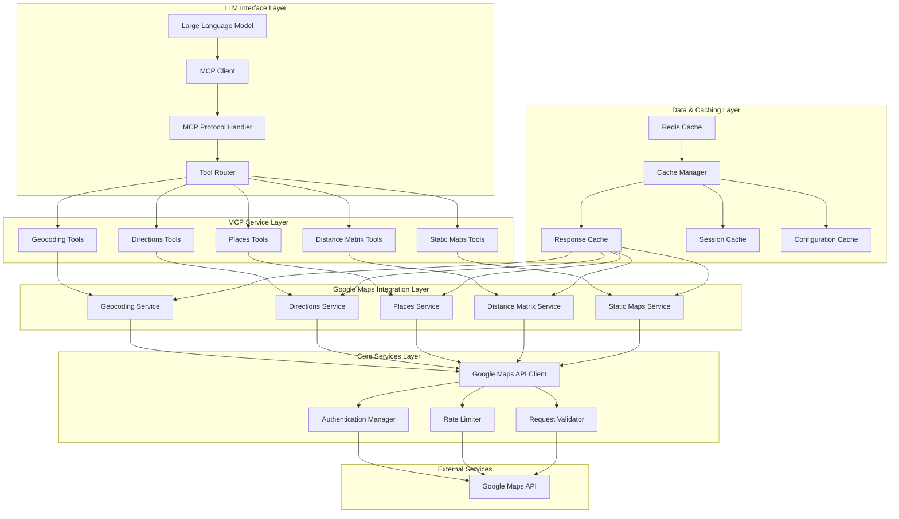

### Service Integration Flow

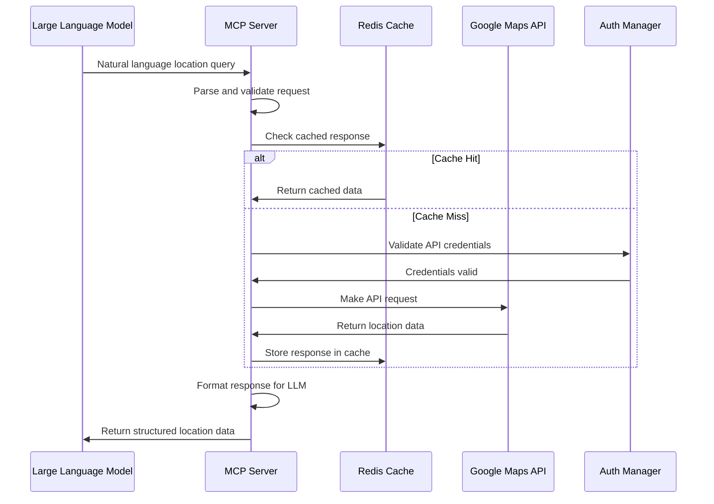

## 4. Core Technology Integration Patterns

### Google Maps API Service Architecture

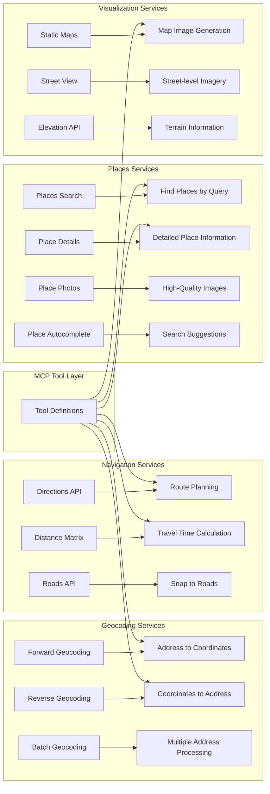

## 5. MCP Tool Architecture

### Core MCP Tools for Location Services

1. **Geocoding Tools**
   - `geocode_address`: Convert addresses to coordinates with place details
   - `reverse_geocode`: Convert coordinates to formatted addresses
   - `batch_geocode`: Process multiple addresses efficiently
   - `validate_address`: Verify and standardize address formats

2. **Places Discovery Tools**
   - `find_places`: Search for places by text query or category
   - `search_nearby`: Find places within specified radius
   - `get_place_details`: Retrieve comprehensive place information
   - `get_place_photos`: Access high-quality place imagery
   - `autocomplete_places`: Provide search suggestions as user types

3. **Navigation and Routing Tools**
   - `calculate_directions`: Get turn-by-turn directions between locations
   - `optimize_waypoints`: Find optimal route through multiple stops
   - `calculate_distance_matrix`: Compute travel times/distances for multiple origins/destinations
   - `estimate_travel_time`: Predict travel duration with traffic data

4. **Visualization Tools**
   - `generate_static_map`: Create custom map images with markers and paths
   - `get_street_view`: Retrieve street-level imagery for locations
   - `create_map_url`: Generate interactive map URLs for sharing

5. **Advanced Analysis Tools**
   - `analyze_area`: Get demographic and geographic insights for regions
   - `find_optimal_location`: Suggest best locations based on criteria
   - `calculate_service_area`: Determine reachable areas within time/distance limits
   - `compare_locations`: Side-by-side comparison of multiple places

## 6. Data Architecture and Caching Strategy

### Caching Architecture

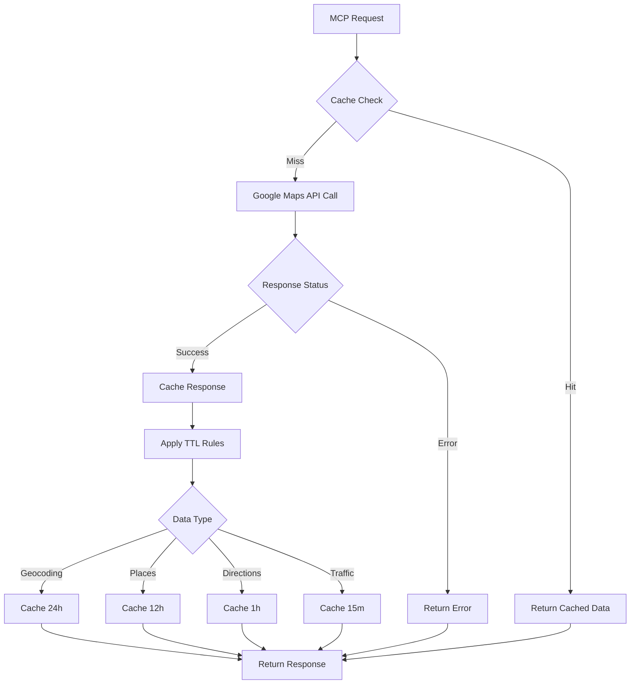

### Data Flow Architecture

```mermaid
graph LR
    subgraph "Input Processing"
        A[LLM Request] --> B[Parameter Validation]
        B --> C[Input Sanitization]
        C --> D[Request Enrichment]
    end
    
    subgraph "Service Routing"
        D --> E[Tool Selection]
        E --> F[Service Mapping]
        F --> G[API Endpoint Selection]
    end
    
    subgraph "External API Integration"
        G --> H[Rate Limiting Check]
        H --> I[Authentication]
        I --> J[Google Maps API Call]
        J --> K[Response Processing]
    end
    
    subgraph "Response Enhancement"
        K --> L[Data Enrichment]
        L --> M[Format Conversion]
        M --> N[Response Validation]
        N --> O[LLM-Friendly Output]
    end
```

## 7. Security and Authentication Architecture

### API Security Framework

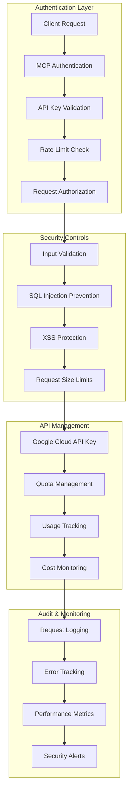

## 8. Performance and Scalability Architecture

### Performance Optimization Strategies

1. **Intelligent Caching**
   - Multi-tiered caching with Redis
   - Location-based cache keys
   - Predictive cache warming
   - Cache invalidation strategies

2. **Request Optimization**
   - Batch processing for multiple requests
   - Connection pooling and keep-alive
   - Compression for large responses
   - Lazy loading for optional data

3. **Resource Management**
   - Connection limits and timeouts
   - Memory usage monitoring
   - CPU utilization optimization
   - Disk I/O minimization

4. **Scalability Features**
   - Horizontal scaling with load balancers
   - Auto-scaling based on demand
   - Geographic distribution support
   - Microservice architecture readiness

### Monitoring and Observability

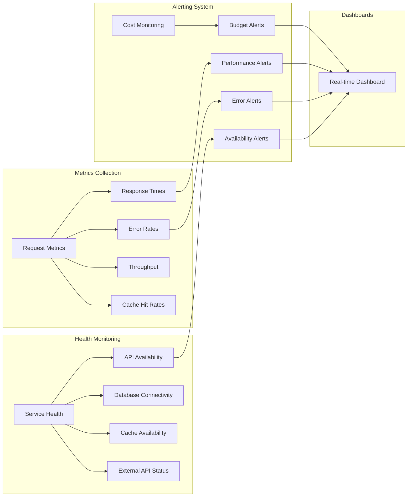

## 9. Integration Patterns and Use Cases

### Common Integration Patterns

1. **Location-Based Search**
   - "Find coffee shops near Central Park"
   - "What are the best restaurants within 2 miles of Times Square?"
   - "Show me gas stations along my route from Boston to New York"

2. **Route Planning and Optimization**
   - "Plan the fastest route visiting these 5 addresses"
   - "How long will it take to drive from here to JFK airport during rush hour?"
   - "Find the shortest walking route through these tourist attractions"

3. **Geographic Analysis**
   - "Compare the demographics of these three neighborhoods"
   - "What's the population density of downtown Seattle?"
   - "Find areas with high foot traffic for a retail location"

4. **Real-time Location Services**
   - "Where is the nearest hospital from my current location?"
   - "Alert me when I'm within 5 minutes of my destination"
   - "What's the current traffic situation on my commute route?"

### Advanced Use Case Scenarios

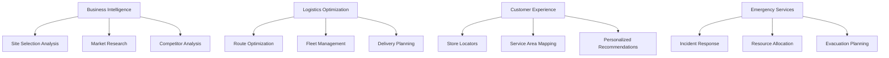

## 10. Development and Deployment Architecture

### Development Workflow

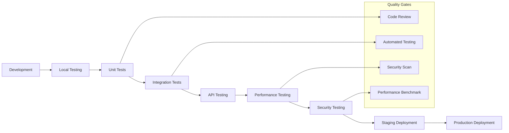

### Deployment Strategies

1. **Containerized Deployment**
   - Docker containers for consistent environments
   - Kubernetes orchestration for scaling
   - Health checks and auto-restart capabilities
   - Rolling updates with zero downtime

2. **Cloud Native Architecture**
   - Support for major cloud providers (AWS, GCP, Azure)
   - Serverless deployment options
   - Auto-scaling based on demand
   - Geographic distribution for low latency

3. **Monitoring and Maintenance**
   - Real-time performance monitoring
   - Automated error detection and reporting
   - Proactive maintenance scheduling
   - Capacity planning and optimization

## Core Principles for System Architecture, Integrity, and AI Collaboration

1. **Adherence to Established Patterns**: Maintain consistency with Google Maps API best practices and MCP specifications
2. **Methodological Rigor**: Use comprehensive testing and validation for all location services
3. **Evidence-Based Performance**: All performance claims backed by measurements and benchmarks
4. **Dependency Management**: Careful evaluation of Google Maps API quotas and rate limits
5. **Security First**: Integral security considerations including API key protection and input validation
6. **Documentation Integrity**: Maintain CLAUDE.md and AGENTS.md alignment with implementation
7. **Technical Merit**: Justify all architectural decisions with clear reasoning and location service requirements

## Architectural Diagrams and Flows

### Primary Architecture Flow
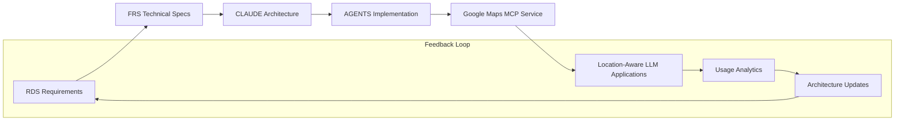

### MCP Tool Interaction Flow
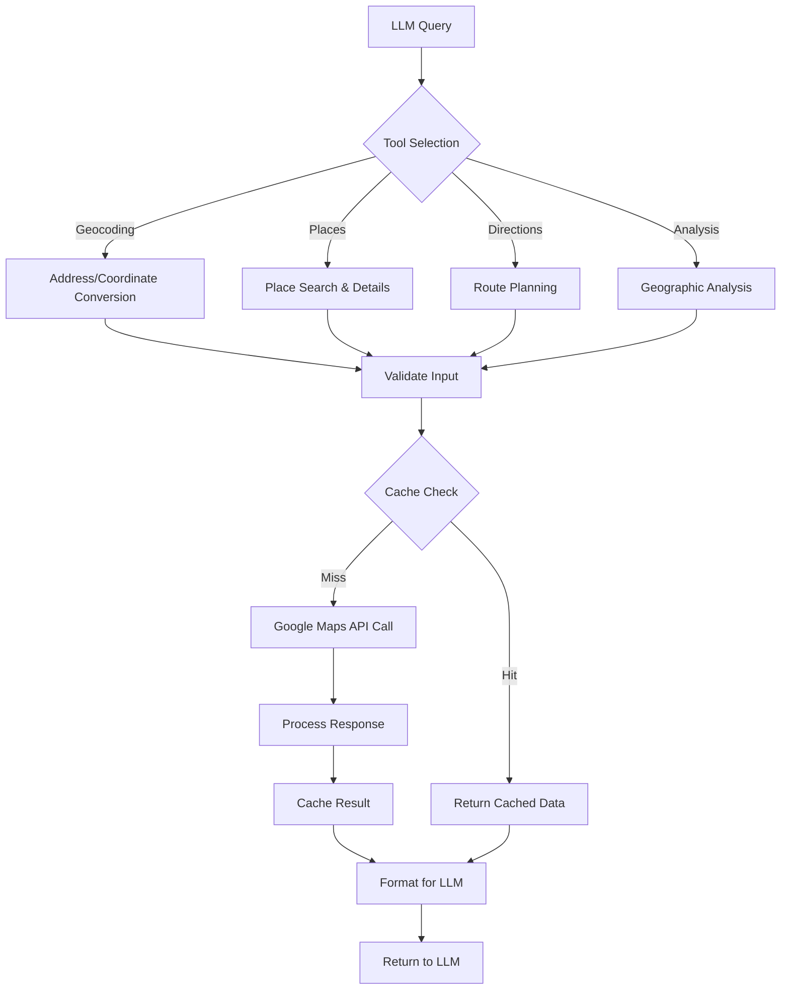

## File Encoding Standards
**All documentation files, including `AGENTS.md` and any files generated or modified by AI, MUST be in UTF-8 encoding.**

## Implementation Status and Next Steps

**Current Implementation Status**:
- ⏳ Template creation in progress
- ⏳ Core architecture definition complete
- ⏳ Integration patterns defined
- ⏳ MCP tool specifications ready

**Immediate Next Steps**:
1. Complete AGENTS.md implementation guidelines
2. Generate FRS.md technical specifications
3. Set up Node.js/TypeScript project structure
4. Implement Google Maps API service wrappers
5. Create MCP server with tool definitions
6. Add caching layer and performance optimization
7. Implement authentication and security features

**Architecture Evolution Timeline**:
- **Phase 1** (Current): Core architecture and templates
- **Phase 2** (Next 30 days): Basic Google Maps API integration
- **Phase 3** (Next 60 days): Advanced MCP tools and caching
- **Phase 4** (Next 90 days): Performance optimization and production features

---

**Prime Directive**: Always ensure seamless integration between Google Maps API services and Model Context Protocol while providing natural language interfaces for LLM-assisted location-based queries and analysis.

Built with ❤️ using the Architect Crew methodology.