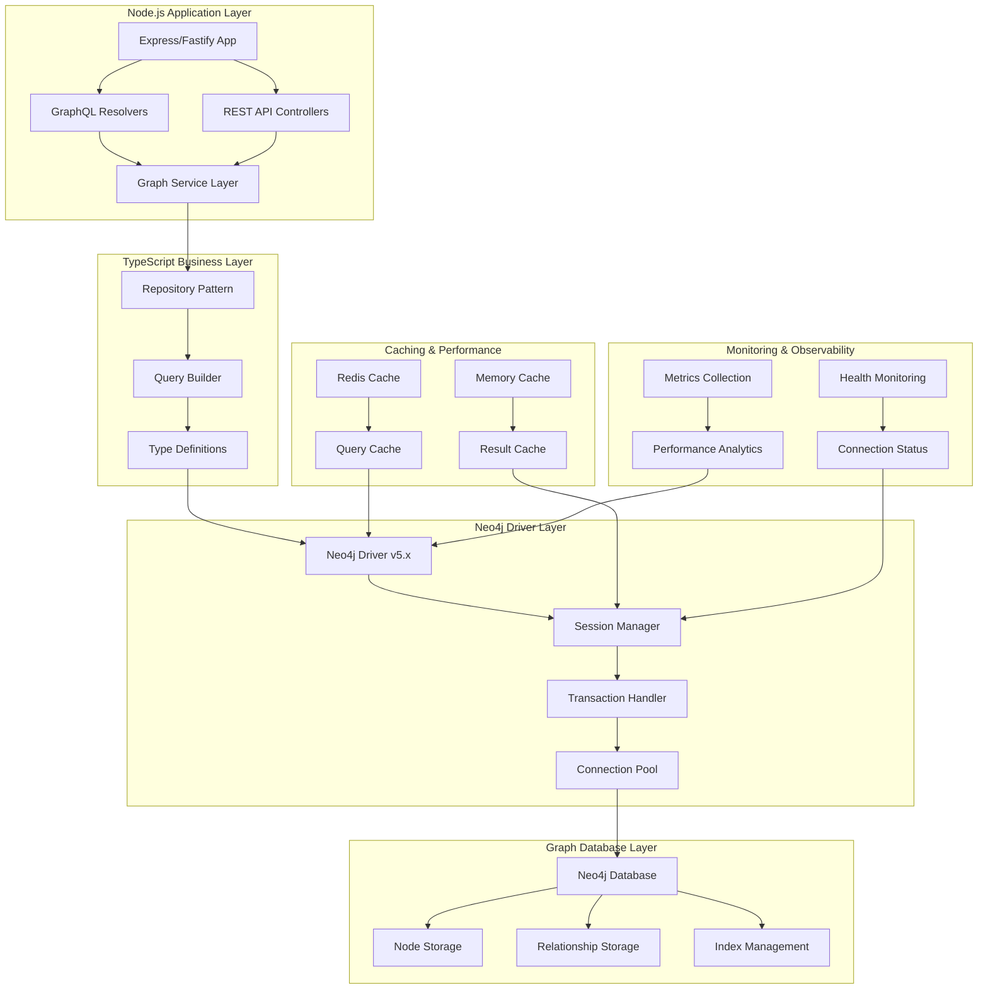
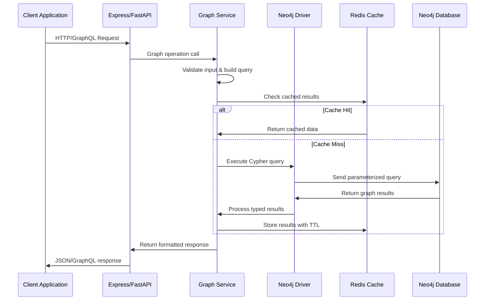
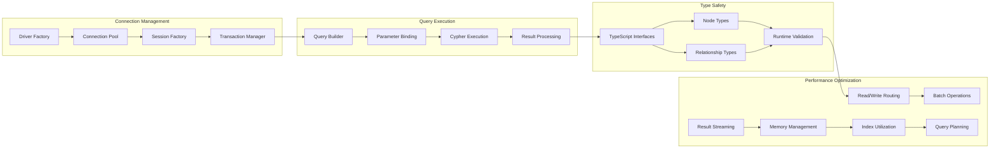
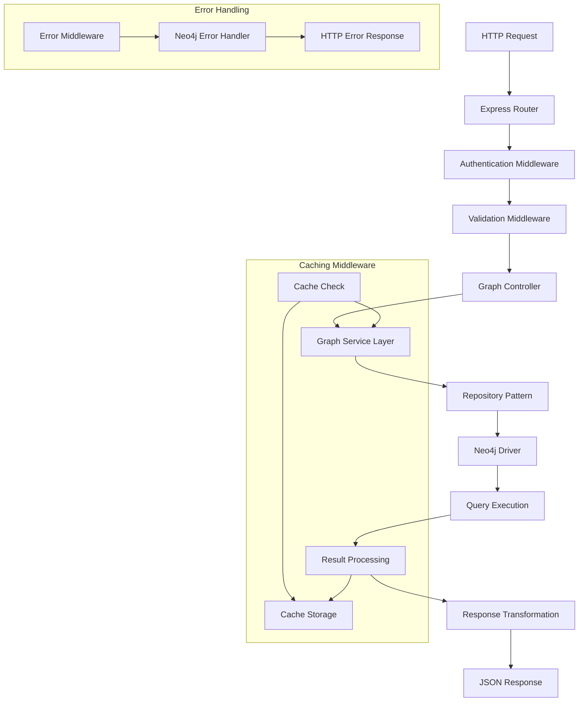
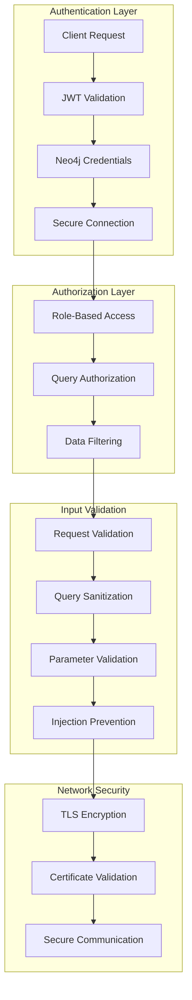
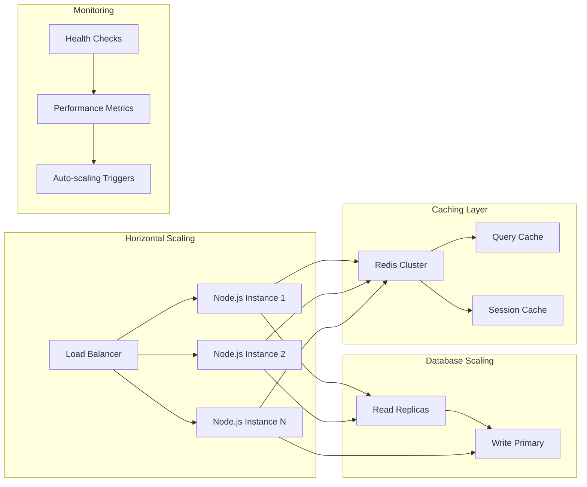
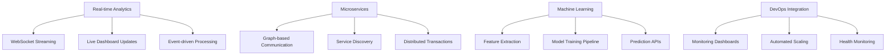
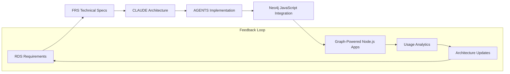
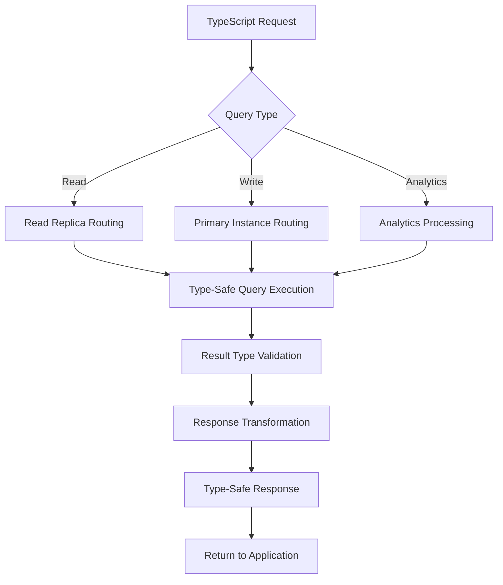

# CLAUDE.md - Neo4j JavaScript/Node.js Integration Architecture Definition & AI Collaboration Guide

**Version**: {{claudeVersion}}  
**Date**: {{date}}  
**Generated from**: RDS.md requirements analysis  
**Technology Stack**: Neo4j Graph Database + JavaScript/Node.js + TypeScript

This file defines the comprehensive architecture of the Neo4j JavaScript/Node.js integration solution. It aligns with the Architect Crew methodology, where:
- **`docs/RDS.md`** outlines the **functional requirements** and user needs.
- **`docs/FRS.md`** provides the **detailed technical specifications**, including all UML diagrams (Mermaid) and specific implementation blueprints.
- **`CLAUDE.md`** (this file) instructs Claude (and similar AI) on how to interpret these documents, contribute to the architecture, and ensure `AGENTS.md` is correctly aligned.
- **`AGENTS.md`** provides specific, actionable instructions for AI agents performing implementation tasks.

## 1. From RDS → FRS Validation

**Source**: `docs/RDS.md` (What & Why)  
**Ensure**: Every RDS requirement appears in FRS diagrams/contracts.

{{rdsToFrsValidation}}

## 2. Neo4j JavaScript/Node.js Integration Architectural Overview

{{neo4jJavaScriptArchitecturalOverview}}

### Core Integration Principles

1. **Type-Safe Graph Applications**
   - Comprehensive Neo4j database integration with TypeScript applications
   - Natural graph modeling with strongly-typed interfaces
   - Real-time graph analytics with async/await patterns
   - Context-aware graph traversal and relationship mapping

2. **Modern JavaScript Architecture**
   - Official neo4j-driver with TypeScript 5+ support
   - Async/await patterns for non-blocking operations
   - Scalable connection management and session handling
   - Comprehensive error handling and retry logic

3. **Performance-Optimized Operations**
   - Efficient Cypher query execution with parameter binding
   - Batch processing with UNWIND operations
   - Connection pooling and session reuse
   - Query optimization and performance monitoring

4. **Enterprise Node.js Framework**
   - Modular architecture following Node.js best practices
   - Service layer patterns for graph operations
   - Configurable authentication and security
   - Comprehensive monitoring and observability

## 3. System Architecture Layers



### TypeScript Graph Service Integration Flow



## 4. TypeScript Neo4j Driver Architecture

### Driver Integration Patterns



## 5. Graph Data Modeling and TypeScript Integration

### TypeScript Interface Definitions

1. **Node Type Definitions**
   - `NodeInterface<T>`: Generic node interface with typed properties
   - `PersonNode`, `CompanyNode`: Specific typed node interfaces
   - `NodeWithRelationships<T>`: Nodes with relationship metadata
   - `IndexedNode<T>`: Nodes with optimized property access

2. **Relationship Type Definitions**
   - `RelationshipInterface<T>`: Generic relationship interface
   - `WorksAtRelationship`, `KnowsRelationship`: Specific typed relationships
   - `WeightedRelationship<T>`: Relationships with numeric weights
   - `TemporalRelationship<T>`: Time-based relationship properties

3. **Graph Pattern Operations**
   - `PathResult<T>`: Typed path traversal results
   - `SubgraphResult<T>`: Subgraph extraction with type safety
   - `AnalyticsResult<T>`: Graph analytics with typed outcomes
   - `PatternMatch<T>`: Complex pattern matching results

4. **Query Builder Integration**
   - `TypedQueryBuilder<T>`: Type-safe query construction
   - `ParameterizedQuery<T>`: Parameterized queries with type validation
   - `BatchQuery<T>`: Type-safe batch operations
   - `StreamingQuery<T>`: Streaming results with type preservation

## 6. Node.js Framework Integration Architecture

### Express.js Integration Pattern



### GraphQL Integration Architecture

```mermaid
graph LR
    subgraph "GraphQL Layer"
        A[GraphQL Schema] --> B[Type Definitions]
        B --> C[Resolver Functions]
        C --> D[DataLoader Pattern]
    end
    
    subgraph "Graph Service Integration"
        D --> E[Graph Service]
        E --> F[Repository Layer]
        F --> G[Query Optimization]
    end
    
    subgraph "Performance Features"
        G --> H[Query Batching]
        H --> I[N+1 Problem Solution]
        I --> J[Caching Strategy]
    end
    
    subgraph "Type Safety"
        J --> K[Schema Validation]
        K --> L[Runtime Type Checking]
        L --> M[Error Handling]
    end
```



## 7. Security and Authentication Architecture

### Node.js Security Framework



## 8. Performance and Scalability Architecture

### JavaScript Performance Optimization Strategies

1. **Async/Await Optimization**
   - Non-blocking Neo4j operations with proper async patterns
   - Concurrent query execution for independent operations
   - Stream processing for large result sets
   - Memory-efficient result handling

2. **Connection Pool Management**
   - Intelligent connection pooling with configurable limits
   - Connection health monitoring and automatic recovery
   - Session lifecycle management with cleanup
   - Resource optimization for high-concurrency applications

3. **Query Performance Patterns**
   - Parameter-based query execution for query cache utilization
   - Batch operations using UNWIND for bulk processing
   - Index-aware query planning and execution
   - Result streaming for large dataset handling

4. **Caching Architecture**
   - Multi-level caching with Redis and Node.js memory
   - Query result caching with intelligent invalidation
   - Session caching for connection reuse
   - Schema caching for metadata operations

### Node.js Scalability Features



## 9. Integration Patterns and Use Cases

### Common JavaScript Graph Application Patterns

1. **Real-time Applications**
   - "Live social media feed with relationship filtering"
   - "Real-time recommendation updates based on user interactions"
   - "Dynamic graph visualization with WebSocket updates"

2. **API-First Development**
   - "RESTful APIs for graph data with OpenAPI documentation"
   - "GraphQL APIs with efficient resolver patterns"
   - "Microservice architecture with graph-based communication"

3. **E-commerce and Recommendations**
   - "Product recommendation systems using collaborative filtering"
   - "Customer journey analysis through purchase graphs"
   - "Inventory management with supply chain relationships"

4. **Social Networks and Community Platforms**
   - "Social graph analysis with influence metrics"
   - "Community detection and clustering algorithms"
   - "Content recommendation based on social connections"

### Advanced JavaScript Use Case Scenarios



## 10. Development and Testing Architecture

### Node.js Development Workflow

```mermaid
graph LR
    A[Development] --> B[TypeScript Compilation]
    B --> C[Unit Testing (Jest)]
    C --> D[Integration Testing]
    D --> E[Performance Testing]
    E --> F[Security Testing]
    F --> G[Docker Build]
    G --> H[Staging Deployment]
    H --> I[Production Deployment]
    
    subgraph "Quality Gates"
        J[ESLint/Prettier]
        K[Type Checking]
        L[Test Coverage]
        M[Performance Benchmarks]
    end
    
    B --> J
    C --> K
    D --> L
    E --> M
```

### Testing Strategies

1. **Unit Testing with Jest**
   - Mock Neo4j driver for isolated testing
   - Test business logic and graph models
   - Verify query generation and parameter binding
   - Test error handling and edge cases

2. **Integration Testing**
   - Use testcontainers for containerized Neo4j testing
   - Test complete API workflows with real database
   - Verify transaction handling and rollback scenarios
   - Test connection pool behavior under load

3. **Performance Testing**
   - Benchmark query execution times with Artillery.js
   - Test concurrent connection handling
   - Measure memory usage and garbage collection
   - Validate caching effectiveness and hit rates

4. **End-to-End Testing**
   - Test complete user workflows with Playwright
   - Verify graph data consistency across operations
   - Test real-time features with WebSocket connections
   - Validate API documentation with contract testing

## Core Principles for System Architecture, Integrity, and AI Collaboration

1. **Type-First Development**: Architecture prioritizes TypeScript type safety and compile-time error detection
2. **Async Best Practices**: Follow Node.js async/await patterns for optimal performance and scalability
3. **Performance Evidence**: All optimizations backed by benchmarks and profiling data
4. **Security Integration**: Built-in security with JWT authentication and query validation
5. **Scalability Planning**: Design for horizontal scaling and microservice architecture
6. **Documentation Integrity**: Maintain CLAUDE.md and AGENTS.md alignment with implementation
7. **Technical Merit**: Justify architectural decisions with Node.js and graph database best practices

## Architectural Diagrams and Flows

### Primary Architecture Flow


### TypeScript Data Flow Architecture


## File Encoding Standards
**All documentation files, including `AGENTS.md` and any files generated or modified by AI, MUST be in UTF-8 encoding.**

## Implementation Status and Next Steps

**Current Implementation Status**:
- ⏳ Template creation in progress
- ⏳ Core Neo4j JavaScript architecture definition complete
- ⏳ TypeScript integration patterns defined
- ⏳ Performance optimization strategies ready

**Immediate Next Steps**:
1. Complete AGENTS.md implementation guidelines
2. Generate FRS.md technical specifications
3. Set up Node.js project with Neo4j driver and TypeScript
4. Implement graph service layer with repository patterns
5. Create comprehensive testing framework with Jest
6. Add authentication, caching, and monitoring layers
7. Implement performance optimization and scaling features

**Architecture Evolution Timeline**:
- **Phase 1** (Current): Core architecture and TypeScript templates
- **Phase 2** (Next 30 days): Basic Neo4j driver integration with type safety
- **Phase 3** (Next 60 days): Advanced graph operations and API patterns
- **Phase 4** (Next 90 days): Production features and microservice architecture

---

**Prime Directive**: Always ensure seamless integration between Neo4j graph database and JavaScript/Node.js applications while leveraging TypeScript type safety for optimal development experience and runtime reliability.

Built with ❤️ using the Architect Crew methodology and Neo4j graph database excellence.