# CLAUDE.md - Neo4j MCP Service Integration Architecture Definition & AI Collaboration Guide

**Version**: {{claudeVersion}}  
**Date**: {{date}}  
**Generated from**: RDS.md requirements analysis  
**Technology Stack**: Neo4j Graph Database + Model Context Protocol (MCP) + TypeScript + Node.js

This file defines the comprehensive architecture of the Neo4j MCP service integration solution. It aligns with the Architect Crew methodology, where:
- **`docs/RDS.md`** outlines the **functional requirements** and user needs.
- **`docs/FRS.md`** provides the **detailed technical specifications**, including all UML diagrams (Mermaid) and specific implementation blueprints.
- **`CLAUDE.md`** (this file) instructs Claude (and similar AI) on how to interpret these documents, contribute to the architecture, and ensure `AGENTS.md` is correctly aligned.
- **`AGENTS.md`** provides specific, actionable instructions for AI agents performing implementation tasks.

## 1. From RDS → FRS Validation

**Source**: `docs/RDS.md` (What & Why)  
**Ensure**: Every RDS requirement appears in FRS diagrams/contracts.

{{rdsToFrsValidation}}

## 2. Neo4j MCP Service Integration Architectural Overview

{{neo4jMcpArchitecturalOverview}}

### Core Integration Principles

1. **LLM-Assisted Graph Operations**
   - Comprehensive Neo4j database integration exposed through MCP protocol
   - Natural language to Cypher query translation for LLM consumption
   - Context-aware graph exploration and pattern discovery
   - Real-time graph analytics accessible to LLM reasoning systems

2. **Production-Ready MCP Architecture**
   - Official @modelcontextprotocol/sdk integration with TypeScript
   - Scalable connection management and session handling
   - Comprehensive error handling and retry logic
   - Security-first design with authentication and authorization

3. **Graph Context Protocol Integration**
   - Efficient graph data serialization for LLM context windows
   - Intelligent graph sampling and summarization
   - Multi-hop relationship traversal with context preservation
   - Graph pattern matching exposed as MCP tools and resources

4. **Enterprise Graph MCP Framework**
   - Modular architecture following MCP and Node.js best practices
   - Service layer patterns for graph operations
   - Configurable authentication and security
   - Comprehensive monitoring and observability

## 3. System Architecture Layers

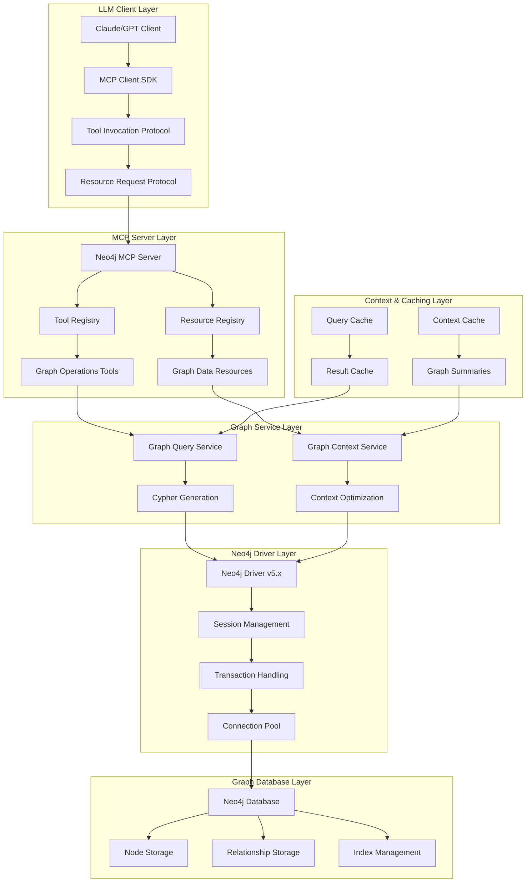

### LLM-Graph Integration Flow

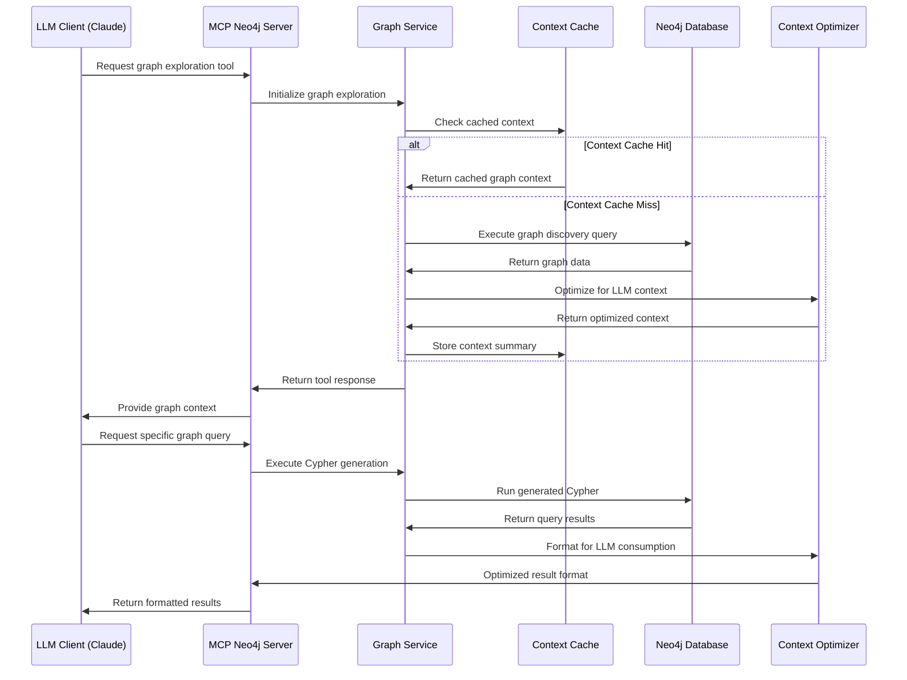

## 4. MCP Protocol Architecture for Graph Databases

### MCP Server Implementation Patterns

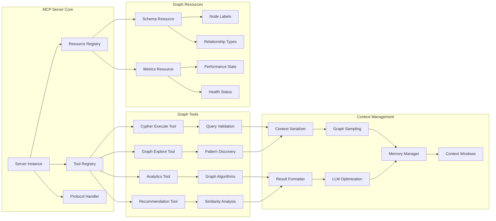

### MCP Tool Definitions for Graph Operations

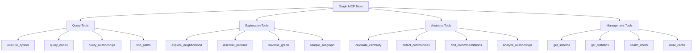

## 5. Graph Context Protocol and LLM Integration

### Context Optimization Strategies

1. **Graph Sampling for LLM Context**
   - `intelligent_sampling`: Select representative nodes and relationships
   - `importance_scoring`: Weight nodes by centrality and relevance
   - `context_windowing`: Fit graph data within LLM context limits
   - `hierarchical_summarization`: Multi-level graph abstractions

2. **Natural Language Graph Interface**
   - `cypher_translation`: Convert natural language to Cypher queries
   - `result_narration`: Translate graph results to natural language
   - `pattern_explanation`: Explain discovered graph patterns
   - `relationship_description`: Describe relationship semantics

3. **Intelligent Graph Exploration**
   - `guided_traversal`: LLM-directed graph exploration
   - `question_answering`: Graph-based question answering
   - `hypothesis_testing`: Test graph-based hypotheses
   - `insight_generation`: Generate insights from graph patterns

4. **Context-Aware Caching**
   - `semantic_caching`: Cache based on query semantics
   - `context_invalidation`: Smart cache invalidation
   - `preemptive_loading`: Anticipate LLM context needs
   - `compression_algorithms`: Efficient context compression

## 6. TypeScript MCP SDK Integration Architecture

### MCP Server Framework Integration

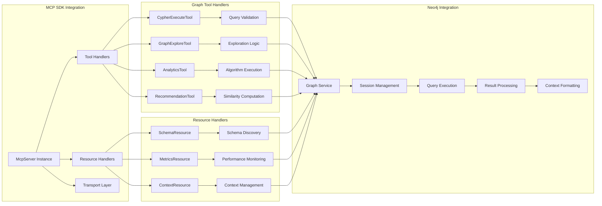

### LLM Context Serialization Pattern

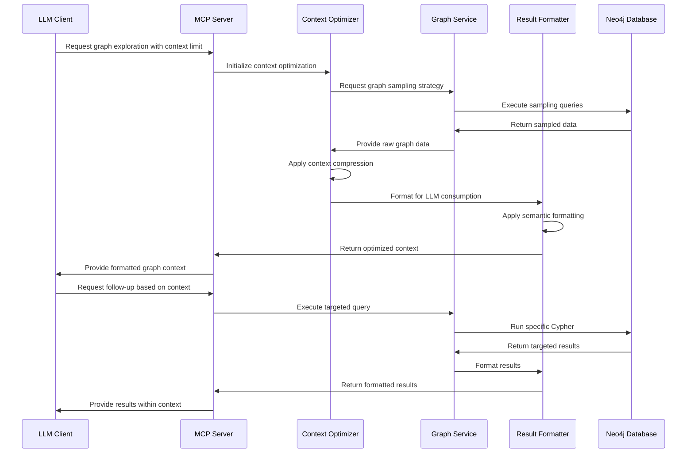

## 7. Security and Authentication Architecture

### MCP Security Framework

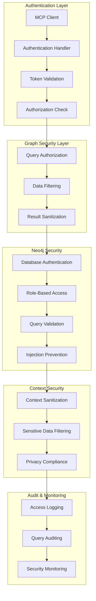

### MCP Tool Security Patterns

1. **Tool Authorization**
   - `role_based_tools`: Different tools for different user roles
   - `query_complexity_limits`: Prevent expensive operations
   - `data_access_controls`: Control access to sensitive data
   - `rate_limiting`: Prevent abuse and DoS attacks

2. **Query Security**
   - `cypher_sanitization`: Prevent Cypher injection attacks
   - `parameter_validation`: Validate all query parameters
   - `result_filtering`: Filter sensitive data from results
   - `audit_logging`: Log all query execution

3. **Context Security**
   - `data_anonymization`: Anonymize sensitive data in context
   - `privacy_preserving`: Maintain privacy in graph exploration
   - `content_filtering`: Filter inappropriate content
   - `compliance_checks`: Ensure regulatory compliance

## 8. Performance and Scalability Architecture

### MCP Performance Optimization Strategies

1. **Context Window Optimization**
   - Intelligent graph sampling to maximize information density
   - Hierarchical summarization for multi-scale context
   - Compression algorithms for efficient context utilization
   - Adaptive context sizing based on query complexity

2. **Caching Architecture**
   - Multi-level caching (query, context, schema)
   - Semantic caching based on query intent
   - Preemptive caching for common patterns
   - Distributed caching for scalability

3. **Query Optimization**
   - Query plan caching and optimization
   - Parallel query execution for complex operations
   - Result streaming for large datasets
   - Index-aware query generation

4. **Scalability Features**
   - Horizontal scaling with load balancing
   - Connection pooling and session management
   - Async processing for non-blocking operations
   - Resource management and throttling

### Performance Monitoring and Observability

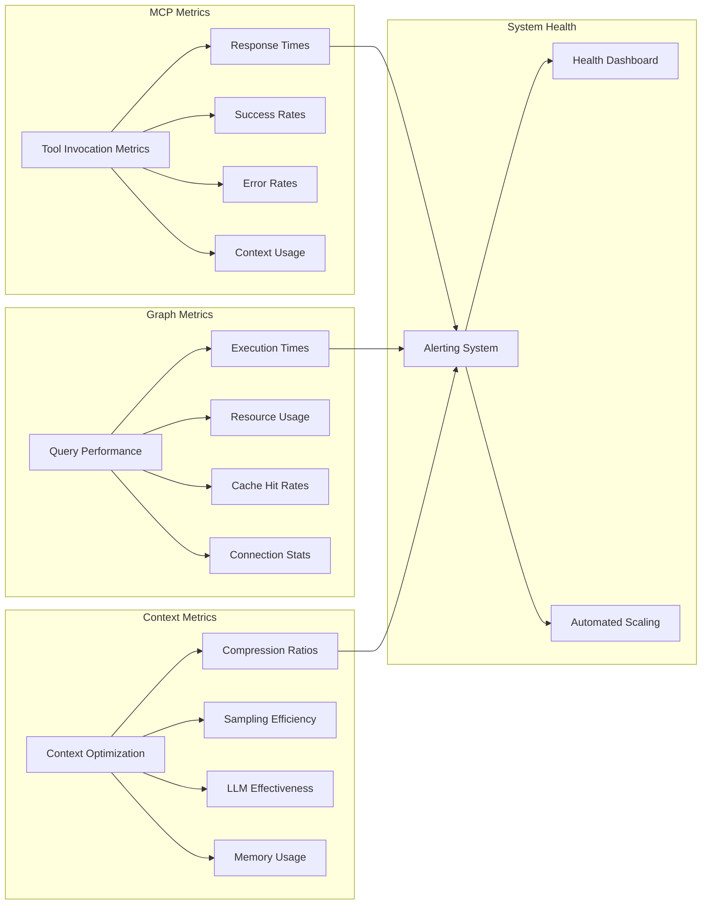

## 9. Integration Patterns and Use Cases

### Common LLM-Graph Integration Patterns

1. **Conversational Graph Exploration**
   - "Find connections between Person A and Company B"
   - "Discover influential nodes in the social network"
   - "Explain the relationship patterns in this dataset"
   - "Recommend similar entities based on graph structure"

2. **Knowledge Graph Question Answering**
   - "What is the shortest path between these concepts?"
   - "Which entities are most similar to this one?"
   - "Find all entities with these specific properties"
   - "Analyze the community structure of this graph"

3. **Graph-Guided Content Generation**
   - "Generate a summary of this entity's connections"
   - "Create a narrative about relationship patterns"
   - "Explain the significance of this graph structure"
   - "Describe the role of this node in the network"

4. **Analytical Graph Insights**
   - "Identify anomalous patterns in the graph"
   - "Find emerging communities or clusters"
   - "Detect influential spreaders in the network"
   - "Analyze temporal changes in graph structure"

### Advanced MCP Graph Use Cases

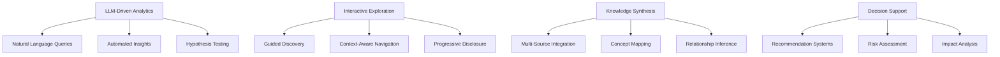

## 10. Development and Testing Architecture

### MCP Development Workflow

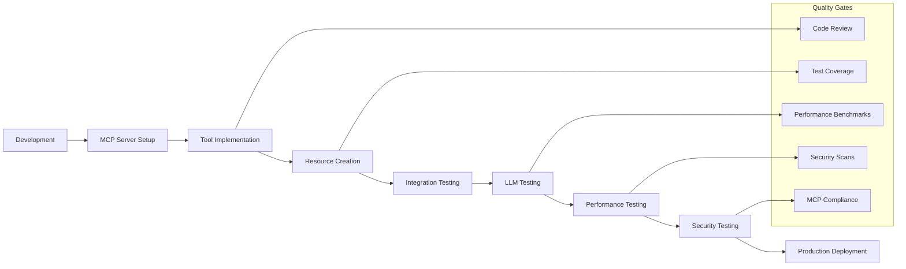

### Testing Strategies for MCP Graph Integration

1. **Unit Testing Patterns**
   - Mock MCP client interactions
   - Test graph operation logic in isolation
   - Verify context optimization algorithms
   - Test security and validation functions

2. **Integration Testing**
   - Test complete MCP tool workflows
   - Verify Neo4j integration functionality
   - Test context serialization and formatting
   - Validate error handling and recovery

3. **LLM Integration Testing**
   - Test with actual LLM clients (Claude, GPT)
   - Verify context window optimization
   - Test tool discovery and invocation
   - Validate result interpretation

4. **Performance Testing**
   - Benchmark tool response times
   - Test with large graph datasets
   - Measure context optimization efficiency
   - Validate scalability under load

## Core Principles for System Architecture, Integrity, and AI Collaboration

1. **Context-First Design**: Architecture decisions prioritize LLM context efficiency and effectiveness
2. **MCP Protocol Compliance**: Follow official MCP specifications and best practices
3. **Graph Performance**: Optimize for graph database performance while maintaining context clarity
4. **Security Integration**: Built-in security at every layer including query validation and data filtering
5. **Scalability Planning**: Design for horizontal scaling and high-availability deployments
6. **Documentation Integrity**: Maintain CLAUDE.md and AGENTS.md alignment with implementation
7. **Technical Merit**: Justify all architectural decisions with graph database and MCP best practices

## Architectural Diagrams and Flows

### Primary Architecture Flow
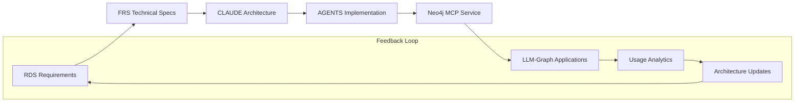

### MCP Graph Data Flow Architecture
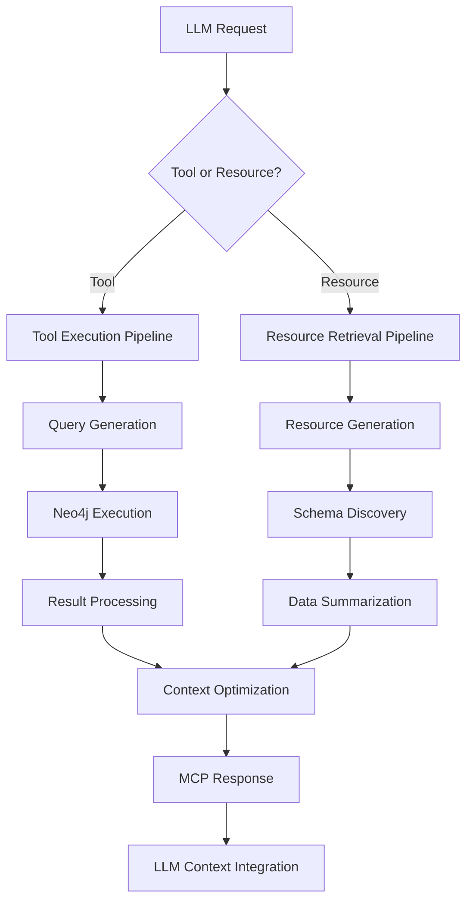

### Context Optimization Flow
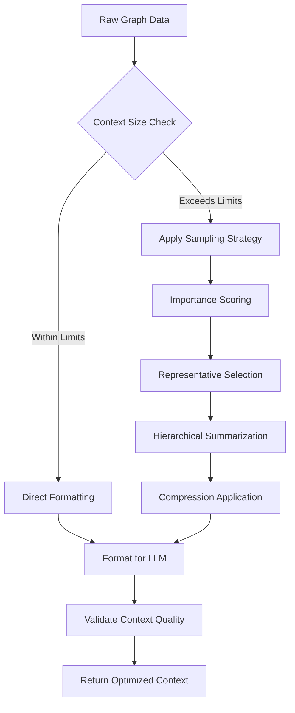

## File Encoding Standards
**All documentation files, including `AGENTS.md` and any files generated or modified by AI, MUST be in UTF-8 encoding.**

## Implementation Status and Next Steps

**Current Implementation Status**:
- ⏳ Template creation in progress
- ⏳ Core Neo4j MCP architecture definition complete
- ⏳ MCP protocol integration patterns defined
- ⏳ LLM context optimization strategies ready

**Immediate Next Steps**:
1. Complete AGENTS.md implementation guidelines
2. Generate FRS.md technical specifications
3. Set up Node.js project with MCP SDK and Neo4j driver
4. Implement MCP tools and resources for graph operations
5. Create comprehensive testing framework with LLM integration
6. Add authentication, caching, and monitoring layers
7. Implement context optimization and performance features

**Architecture Evolution Timeline**:
- **Phase 1** (Current): Core architecture and MCP templates
- **Phase 2** (Next 30 days): Basic MCP server with Neo4j integration
- **Phase 3** (Next 60 days): Advanced context optimization and LLM features
- **Phase 4** (Next 90 days): Production features and enterprise patterns

---

**Prime Directive**: Always ensure seamless integration between Neo4j graph database and LLM systems through the Model Context Protocol while maximizing context efficiency and maintaining high performance for graph operations.

Built with ❤️ using the Architect Crew methodology, Neo4j graph database excellence, and MCP protocol standards.