# CLAUDE.md - Neo4j Python Integration Architecture Definition & AI Collaboration Guide

**Version**: {{claudeVersion}}  
**Date**: {{date}}  
**Generated from**: RDS.md requirements analysis  
**Technology Stack**: Neo4j Graph Database + Python + Driver Integration

This file defines the comprehensive architecture of the Neo4j Python integration solution. It aligns with the Architect Crew methodology, where:
- **`docs/RDS.md`** outlines the **functional requirements** and user needs.
- **`docs/FRS.md`** provides the **detailed technical specifications**, including all UML diagrams (Mermaid) and specific implementation blueprints.
- **`CLAUDE.md`** (this file) instructs Claude (and similar AI) on how to interpret these documents, contribute to the architecture, and ensure `AGENTS.md` is correctly aligned.
- **`AGENTS.md`** provides specific, actionable instructions for AI agents performing implementation tasks.

## 1. From RDS → FRS Validation

**Source**: `docs/RDS.md` (What & Why)  
**Ensure**: Every RDS requirement appears in FRS diagrams/contracts.

{{rdsToFrsValidation}}

## 2. Neo4j Python Integration Architectural Overview

{{neo4jPythonArchitecturalOverview}}

### Core Integration Principles

1. **Graph-First Application Design**
   - Comprehensive Neo4j database integration with Python applications
   - Natural graph modeling and relationship-based data access
   - Real-time graph analytics and pattern detection
   - Context-aware graph traversal and recommendation systems

2. **Production-Ready Python Architecture**
   - Official neo4j-driver for high-performance applications
   - py2neo integration for OGM and rapid development
   - Scalable connection management and session handling
   - Comprehensive error handling and retry logic

3. **Performance-Optimized Graph Operations**
   - Efficient Cypher query execution and parameter usage
   - Batch processing with UNWIND operations
   - Intelligent caching and connection pooling
   - Query optimization and performance monitoring

4. **Enterprise Graph Framework**
   - Modular architecture following Python best practices
   - Service layer patterns for graph operations
   - Configurable authentication and security
   - Comprehensive monitoring and observability

## 3. System Architecture Layers

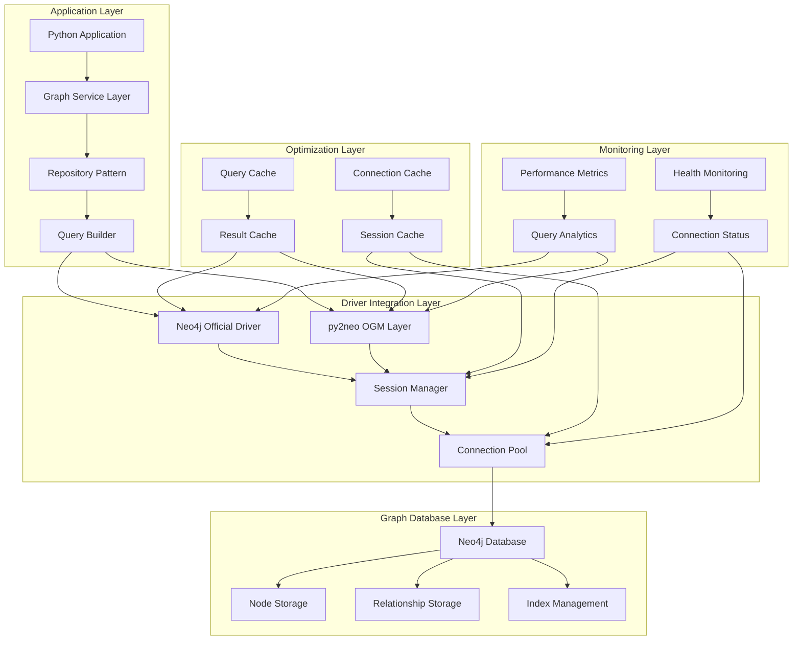

### Python Graph Service Integration Flow

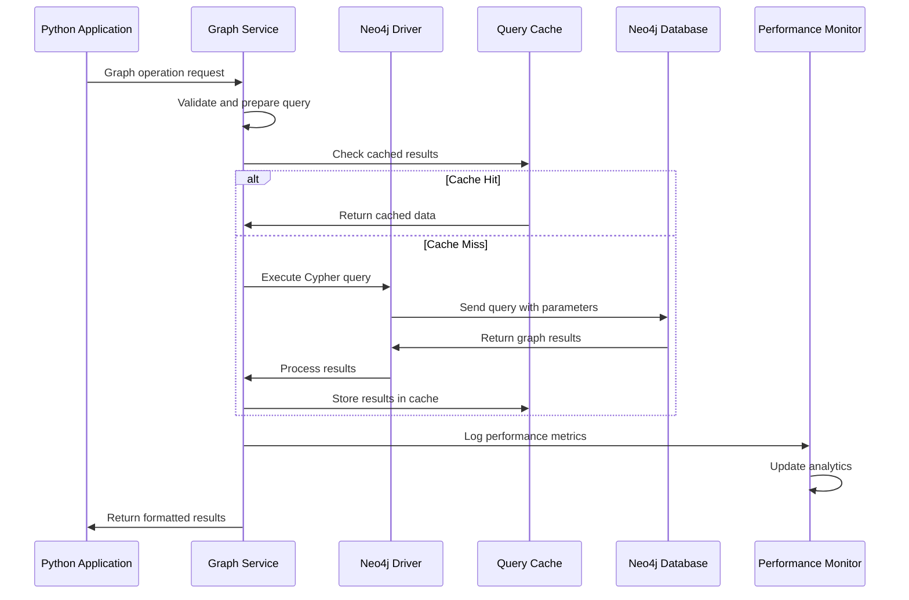

## 4. Neo4j Python Driver Architecture

### Official Driver Integration Patterns

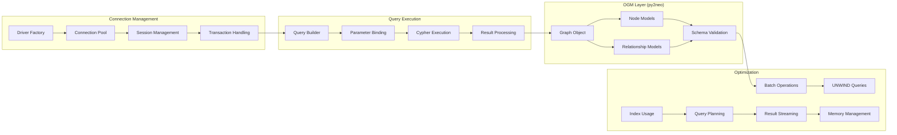

## 5. Graph Data Architecture and Modeling

### Graph Schema Design Patterns

1. **Node Type Definitions**
   - `create_node_with_labels`: Create nodes with multiple labels and properties
   - `bulk_node_creation`: Efficient batch node creation with UNWIND
   - `node_property_validation`: Schema validation and constraint enforcement
   - `node_indexing_strategy`: Performance optimization through proper indexing

2. **Relationship Modeling**
   - `create_relationships`: Define and create typed relationships
   - `relationship_properties`: Manage relationship metadata and weights
   - `bidirectional_traversal`: Optimize for both direction graph traversal
   - `relationship_aggregation`: Compute relationship statistics and metrics

3. **Graph Pattern Operations**
   - `pattern_matching`: Complex graph pattern detection and matching
   - `path_finding`: Shortest path, all paths, and weighted path algorithms
   - `subgraph_extraction`: Extract meaningful subgraphs based on criteria
   - `graph_analytics`: Centrality measures, community detection, and clustering

4. **Data Integrity and Constraints**
   - `uniqueness_constraints`: Ensure node and relationship uniqueness
   - `existence_constraints`: Validate required properties and relationships
   - `schema_evolution`: Manage graph schema changes and migrations
   - `data_validation`: Runtime validation of graph data integrity

## 6. Python Framework Integration Architecture

### Web Framework Integration

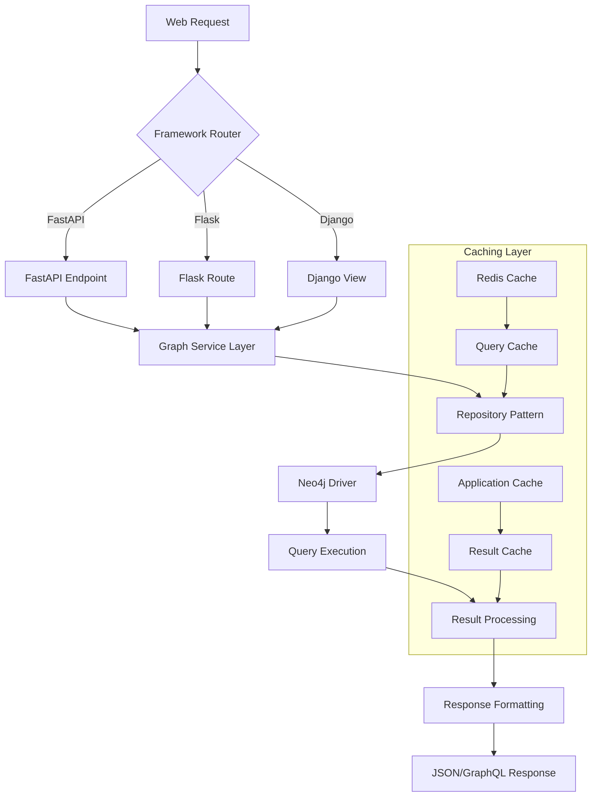

### Async/Await Integration Patterns

```mermaid
graph LR
    subgraph "Async Neo4j Operations"
        A[Async Driver] --> B[Async Session]
        B --> C[Async Transactions]
        C --> D[Concurrent Queries]
    end
    
    subgraph "Python Async Framework"
        E[asyncio Event Loop] --> F[Async Context Manager]
        F --> G[Connection Pooling]
        G --> H[Resource Management]
    end
    
    subgraph "Performance Optimization"
        I[Batch Processing] --> J[Parallel Execution]
        J --> K[Result Aggregation]
        K --> L[Memory Efficiency]
    end
    
    D --> E
    H --> I
    L --> M[Response Delivery]
```

## 7. Security and Authentication Architecture

### Neo4j Security Framework

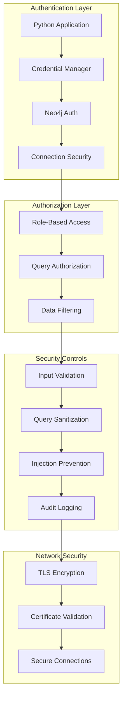

## 8. Performance and Scalability Architecture

### Python Performance Optimization Strategies

1. **Connection Pool Management**
   - Intelligent connection pooling with configurable limits
   - Connection health monitoring and automatic recovery
   - Session lifecycle management and cleanup
   - Resource optimization for high-concurrency applications

2. **Query Optimization Patterns**
   - Parameter-based query execution to leverage query cache
   - Batch operations using UNWIND for bulk processing
   - Index-aware query planning and execution
   - Result streaming for large dataset handling

3. **Caching Architecture**
   - Multi-level caching with Redis and in-memory stores
   - Query result caching with intelligent invalidation
   - Connection caching for session reuse
   - Schema caching for metadata operations

4. **Scalability Features**
   - Horizontal scaling with read replicas
   - Load balancing across Neo4j cluster nodes
   - Async processing for non-blocking operations
   - Microservice architecture patterns

### Performance Monitoring and Observability

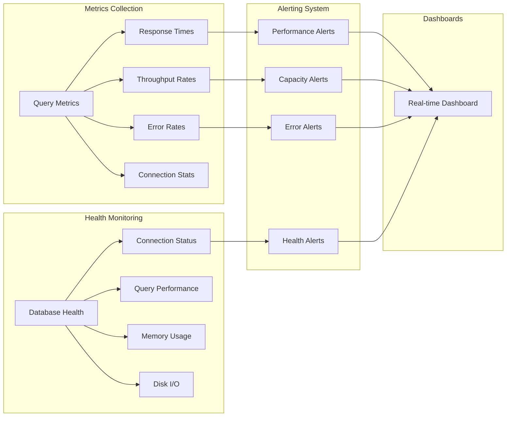

## 9. Integration Patterns and Use Cases

### Common Graph Application Patterns

1. **Social Network Analysis**
   - "Find mutual connections between users"
   - "Analyze influence propagation through social graphs"
   - "Detect communities and clustering in social networks"

2. **Recommendation Systems**
   - "Recommend products based on user behavior patterns"
   - "Find similar users with graph-based collaborative filtering"
   - "Discover trending items through graph traversal"

3. **Fraud Detection and Analysis**
   - "Identify suspicious transaction patterns in financial networks"
   - "Detect account takeover through behavioral graph analysis"
   - "Find organized fraud rings through relationship analysis"

4. **Knowledge Graphs and Semantic Search**
   - "Build and query enterprise knowledge graphs"
   - "Implement semantic search with graph-based relevance"
   - "Create intelligent question-answering systems"

### Advanced Graph Use Case Scenarios

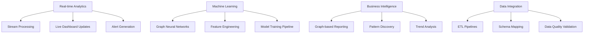

## 10. Development and Testing Architecture

### Python Development Workflow

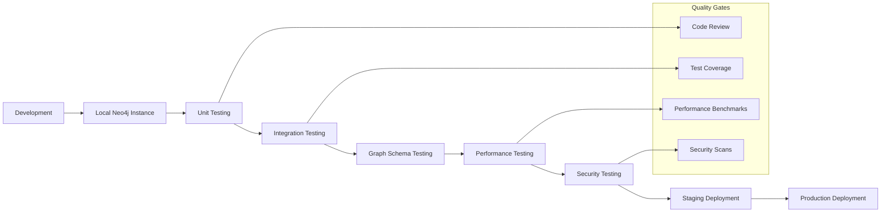

### Testing Strategies

1. **Unit Testing Patterns**
   - Mock Neo4j connections for isolated testing
   - Test graph model validation and business logic
   - Verify query generation and parameter binding
   - Test error handling and edge cases

2. **Integration Testing**
   - Use testcontainers for containerized Neo4j testing
   - Test complete query execution workflows
   - Verify transaction handling and rollback scenarios
   - Test connection pool behavior under load

3. **Performance Testing**
   - Benchmark query execution times
   - Test connection pool scalability
   - Measure memory usage and resource consumption
   - Validate caching effectiveness

## Core Principles for System Architecture, Integrity, and AI Collaboration

1. **Graph-First Design**: Architecture decisions prioritize graph modeling and relationship-based thinking
2. **Driver Best Practices**: Follow official Neo4j Python driver recommendations and patterns
3. **Performance Evidence**: All performance optimizations backed by benchmarks and profiling
4. **Security Integration**: Built-in security considerations including authentication and query validation
5. **Scalability Planning**: Design for horizontal scaling and high-availability deployments
6. **Documentation Integrity**: Maintain CLAUDE.md and AGENTS.md alignment with implementation
7. **Technical Merit**: Justify all architectural decisions with graph database best practices

## Architectural Diagrams and Flows

### Primary Architecture Flow
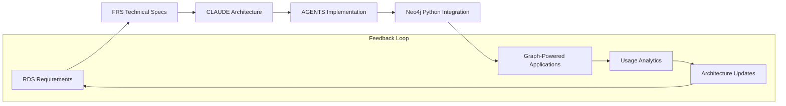

### Graph Data Flow Architecture
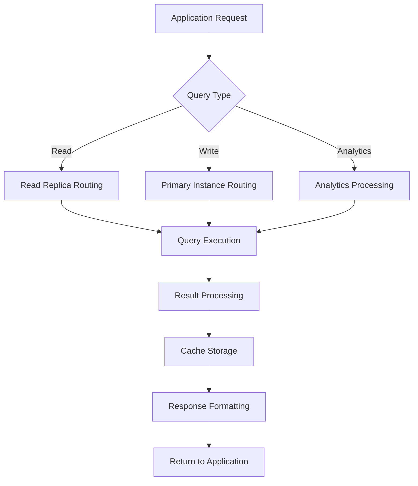

## File Encoding Standards
**All documentation files, including `AGENTS.md` and any files generated or modified by AI, MUST be in UTF-8 encoding.**

## Implementation Status and Next Steps

**Current Implementation Status**:
- ⏳ Template creation in progress
- ⏳ Core Neo4j Python architecture definition complete
- ⏳ Integration patterns defined
- ⏳ Performance optimization strategies ready

**Immediate Next Steps**:
1. Complete AGENTS.md implementation guidelines
2. Generate FRS.md technical specifications
3. Set up Python project with Neo4j driver integration
4. Implement graph service layer with repository patterns
5. Create comprehensive testing framework
6. Add authentication, caching, and monitoring layers
7. Implement performance optimization and scaling features

**Architecture Evolution Timeline**:
- **Phase 1** (Current): Core architecture and Python templates
- **Phase 2** (Next 30 days): Basic Neo4j driver integration
- **Phase 3** (Next 60 days): Advanced graph operations and optimization
- **Phase 4** (Next 90 days): Production features and enterprise patterns

---

**Prime Directive**: Always ensure seamless integration between Neo4j graph database and Python applications while leveraging graph-first thinking for optimal relationship-based data modeling and querying.

Built with ❤️ using the Architect Crew methodology and Neo4j graph database excellence.