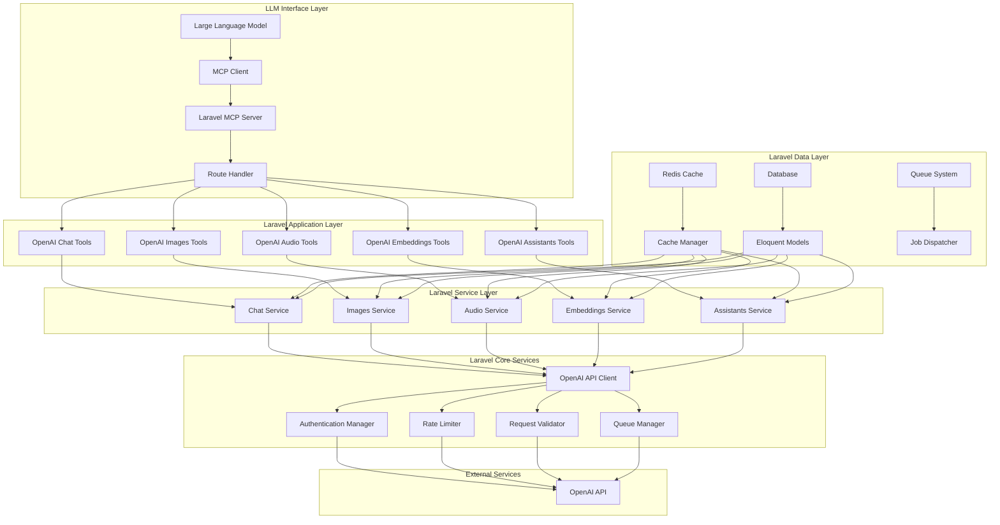
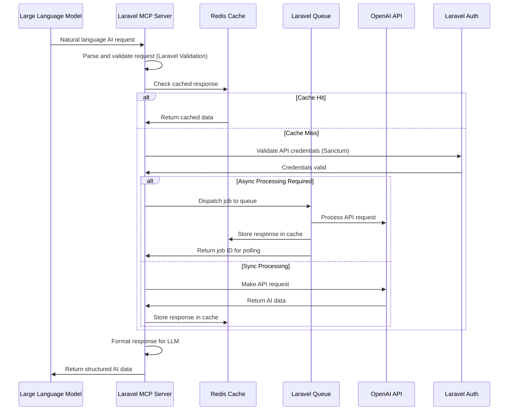
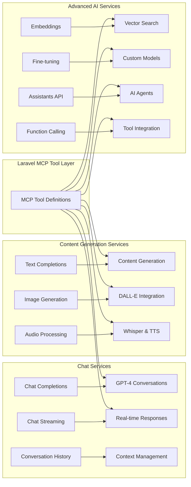
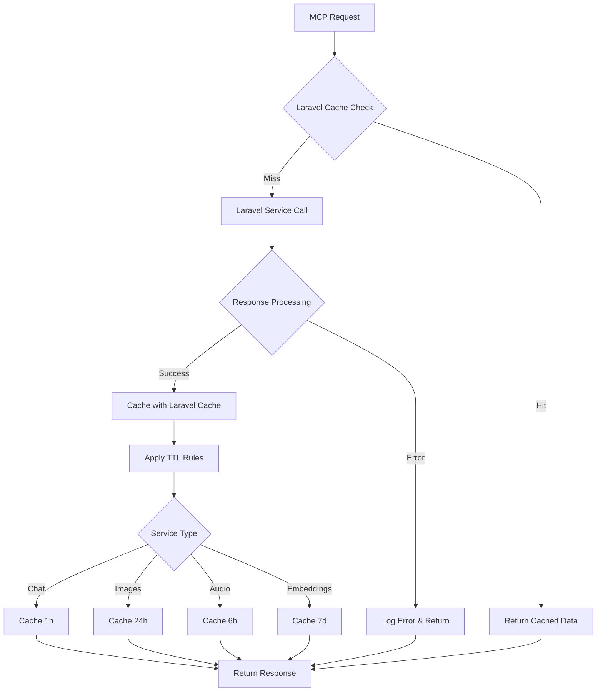
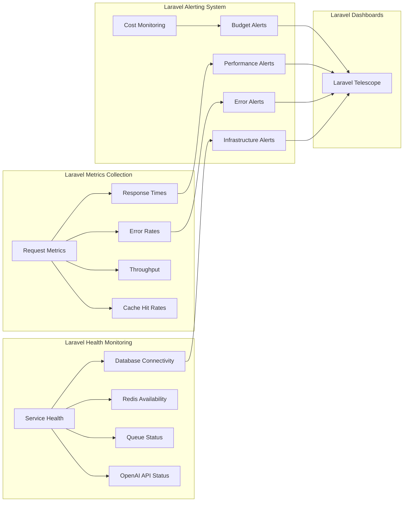
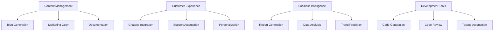
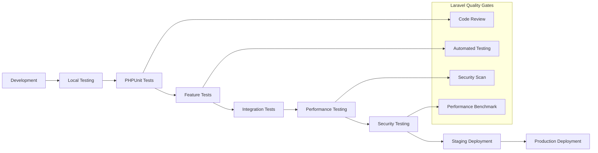
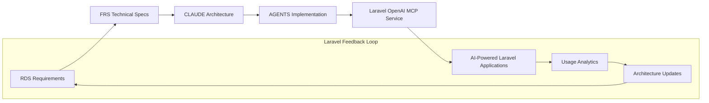
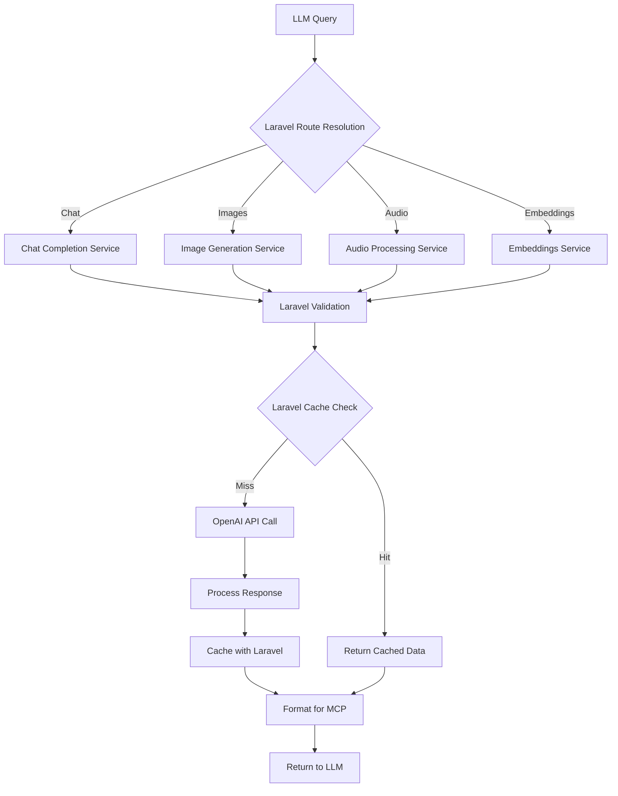

# CLAUDE.md - OpenAI API Laravel MCP Service Architecture Definition & AI Collaboration Guide

**Version**: {{claudeVersion}}  
**Date**: {{date}}  
**Generated from**: RDS.md requirements analysis  
**Technology Stack**: OpenAI API + Laravel + Model Context Protocol + PHP

This file defines the comprehensive architecture of the OpenAI API Laravel MCP service solution. It aligns with the Architect Crew methodology, where:
- **`docs/RDS.md`** outlines the **functional requirements** and user needs.
- **`docs/FRS.md`** provides the **detailed technical specifications**, including all UML diagrams (Mermaid) and specific implementation blueprints.
- **`CLAUDE.md`** (this file) instructs Claude (and similar AI) on how to interpret these documents, contribute to the architecture, and ensure `AGENTS.md` is correctly aligned.
- **`AGENTS.md`** provides specific, actionable instructions for AI agents performing implementation tasks.

## 1. From RDS → FRS Validation

**Source**: `docs/RDS.md` (What & Why)  
**Ensure**: Every RDS requirement appears in FRS diagrams/contracts.

{{rdsToFrsValidation}}

## 2. OpenAI API Laravel MCP Service Architectural Overview

{{openaiLaravelMcpArchitecturalOverview}}

### Core Integration Principles

1. **AI-Powered Laravel Services**
   - Comprehensive OpenAI API integration for all AI services
   - Natural language interfaces for complex AI workflows
   - Real-time AI processing with Laravel queues and jobs
   - Context-aware AI responses with conversation management

2. **Model Context Protocol Integration**
   - Standardized tool definitions for LLM interaction
   - Type-safe parameter validation using Laravel validation
   - Efficient request/response handling with Laravel caching
   - Seamless integration with Claude Desktop and other MCP clients

3. **Production-Ready Laravel Architecture**
   - Scalable Laravel application with Octane support
   - Comprehensive error handling and retry logic
   - Performance optimization with Redis caching and queues
   - Security features including Sanctum authentication

4. **Enterprise Laravel Framework**
   - Modular architecture following Laravel conventions
   - Service providers and dependency injection
   - Configurable rate limiting and quota management
   - Comprehensive monitoring and logging with Laravel tools

## 3. System Architecture Layers



### Laravel Service Integration Flow



## 4. Laravel Framework Integration Patterns

### OpenAI API Service Architecture



## 5. Laravel MCP Tool Architecture

### Core MCP Tools for OpenAI Services

1. **Chat Completion Tools**
   - `openai_chat_completion`: Generate conversational responses with GPT models
   - `openai_chat_streaming`: Stream real-time chat responses
   - `openai_conversation_history`: Manage conversation context and history
   - `openai_system_prompt`: Configure system prompts and behavior

2. **Content Generation Tools**
   - `openai_text_completion`: Generate text completions
   - `openai_image_generation`: Create images with DALL-E models
   - `openai_image_variation`: Generate image variations
   - `openai_image_edit`: Edit existing images with AI

3. **Audio Processing Tools**
   - `openai_audio_transcription`: Transcribe audio with Whisper
   - `openai_audio_translation`: Translate audio to English
   - `openai_text_to_speech`: Convert text to speech
   - `openai_audio_analysis`: Analyze audio content

4. **Embeddings and Search Tools**
   - `openai_create_embeddings`: Generate text embeddings
   - `openai_similarity_search`: Find similar content using embeddings
   - `openai_semantic_search`: Perform semantic search queries
   - `openai_cluster_content`: Cluster content by similarity

5. **Advanced AI Tools**
   - `openai_create_assistant`: Create AI assistants
   - `openai_run_assistant`: Execute assistant conversations
   - `openai_function_calling`: Execute functions through AI
   - `openai_fine_tune_model`: Fine-tune custom models

## 6. Laravel Data Architecture and Caching Strategy

### Laravel Caching Architecture



### Laravel Data Flow Architecture

```mermaid
graph LR
    subgraph "Laravel Request Processing"
        A[MCP Request] --> B[Laravel Middleware]
        B --> C[Route Resolution]
        C --> D[Controller Action]
    end
    
    subgraph "Laravel Service Resolution"
        D --> E[Service Container]
        E --> F[OpenAI Service]
        F --> G[API Client Factory]
    end
    
    subgraph "Laravel External Integration"
        G --> H[Rate Limiting Check]
        H --> I[Authentication (Sanctum)]
        I --> J[OpenAI API Call]
        J --> K[Response Processing]
    end
    
    subgraph "Laravel Response Enhancement"
        K --> L[Data Transformation]
        L --> M[Cache Storage (Redis)]
        M --> N[Response Validation]
        N --> O[MCP-Formatted Output]
    end
```

## 7. Laravel Security and Authentication Architecture

### Laravel Security Framework

```mermaid
graph TB
    subgraph "Laravel Authentication Layer"
        A[MCP Client Request] --> B[Laravel Sanctum Auth]
        B --> C[API Key Validation]
        C --> D[Rate Limit Middleware]
        D --> E[Request Authorization]
    end
    
    subgraph "Laravel Security Controls"
        E --> F[Laravel Validation]
        F --> G[CSRF Protection]
        G --> H[XSS Prevention]
        H --> I[Request Size Limits]
    end
    
    subgraph "Laravel API Management"
        I --> J[OpenAI API Key Management]
        J --> K[Usage Tracking (Eloquent)]
        K --> L[Cost Monitoring]
        L --> M[Quota Management]
    end
    
    subgraph "Laravel Monitoring"
        M --> N[Laravel Logging]
        N --> O[Error Tracking]
        O --> P[Performance Metrics]
        P --> Q[Security Alerts]
    end
```

## 8. Laravel Performance and Scalability Architecture

### Laravel Performance Optimization Strategies

1. **Intelligent Caching with Laravel**
   - Multi-tiered caching with Redis and database
   - Laravel cache tags for organized invalidation
   - Predictive cache warming with scheduled jobs
   - Cache invalidation strategies with events

2. **Laravel Queue Optimization**
   - Async processing for long-running AI requests
   - Priority queues for different request types
   - Failed job handling and retry logic
   - Queue monitoring and scaling

3. **Laravel Resource Management**
   - Connection pooling with database
   - Memory usage monitoring with Laravel Telescope
   - CPU utilization optimization
   - File storage optimization with Laravel Storage

4. **Laravel Scalability Features**
   - Horizontal scaling with Laravel Octane
   - Auto-scaling based on queue depth
   - Database read replicas support
   - Microservice architecture readiness

### Laravel Monitoring and Observability



## 9. Laravel Integration Patterns and Use Cases

### Common Laravel Integration Patterns

1. **AI-Powered Content Management**
   - "Generate blog post about Laravel best practices"
   - "Create product descriptions for e-commerce items"
   - "Summarize user feedback and reviews"

2. **Customer Service Automation**
   - "Analyze customer support tickets and suggest responses"
   - "Generate FAQ responses based on documentation"
   - "Create personalized email responses"

3. **Business Intelligence and Analytics**
   - "Analyze sales data and generate insights"
   - "Create executive summaries from reports"
   - "Generate data visualizations descriptions"

4. **Educational and Training Content**
   - "Create Laravel tutorial content"
   - "Generate coding examples and explanations"
   - "Assess code quality and provide feedback"

### Advanced Laravel Use Case Scenarios



## 10. Laravel Development and Deployment Architecture

### Laravel Development Workflow



### Laravel Deployment Strategies

1. **Laravel Octane Deployment**
   - High-performance deployment with Swoole/RoadRunner
   - Persistent application state for better performance
   - WebSocket support for real-time features
   - Concurrent request handling for MCP SSE

2. **Containerized Laravel Deployment**
   - Docker containers with PHP-FPM and Nginx
   - Laravel scheduler and queue workers
   - Health checks and auto-restart capabilities
   - Rolling updates with zero downtime

3. **Cloud Native Laravel Architecture**
   - Support for AWS, Google Cloud, Azure
   - Serverless deployment options with Laravel Vapor
   - Auto-scaling based on demand
   - CDN integration for asset delivery

4. **Laravel Monitoring and Maintenance**
   - Real-time performance monitoring with Telescope
   - Automated error detection with Bugsnag/Sentry
   - Proactive maintenance with scheduled commands
   - Capacity planning and optimization

## Core Principles for System Architecture, Integrity, and AI Collaboration

1. **Laravel Convention Adherence**: Maintain consistency with Laravel framework patterns and best practices
2. **Methodological Rigor**: Use Laravel's testing framework and validation for all AI services
3. **Evidence-Based Performance**: All performance claims backed by Laravel benchmarks and profiling
4. **Dependency Management**: Careful evaluation of OpenAI API quotas and Laravel package dependencies
5. **Security First**: Integral security using Laravel Sanctum, validation, and middleware
6. **Documentation Integrity**: Maintain CLAUDE.md and AGENTS.md alignment with Laravel implementation
7. **Technical Merit**: Justify all architectural decisions with Laravel community standards and AI service requirements

## Architectural Diagrams and Flows

### Primary Architecture Flow


### Laravel MCP Tool Interaction Flow


## File Encoding Standards
**All documentation files, including `AGENTS.md` and any files generated or modified by AI, MUST be in UTF-8 encoding.**

## Implementation Status and Next Steps

**Current Implementation Status**:
- ⏳ Template creation in progress
- ⏳ Core Laravel architecture definition complete
- ⏳ OpenAI integration patterns defined
- ⏳ MCP tool specifications ready

**Immediate Next Steps**:
1. Complete AGENTS.md implementation guidelines
2. Generate FRS.md technical specifications
3. Set up Laravel project with OpenAI and MCP packages
4. Implement OpenAI service wrappers with Laravel patterns
5. Create Laravel MCP server with tool definitions
6. Add authentication, caching, and security layers
7. Implement comprehensive testing with Laravel framework

**Architecture Evolution Timeline**:
- **Phase 1** (Current): Core architecture and Laravel templates
- **Phase 2** (Next 30 days): Basic OpenAI API integration with Laravel
- **Phase 3** (Next 60 days): Advanced MCP tools and Laravel optimization
- **Phase 4** (Next 90 days): Performance optimization and production features

---

**Prime Directive**: Always ensure seamless integration between OpenAI API services and Model Context Protocol while leveraging Laravel's powerful framework features for scalable, maintainable, and secure AI-powered applications.

Built with ❤️ using the Architect Crew methodology and Laravel framework excellence.