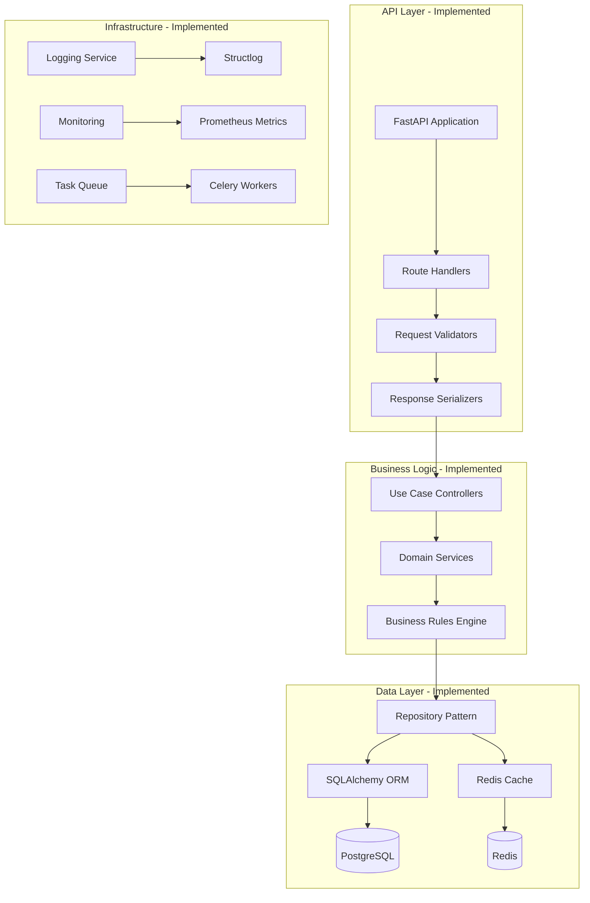
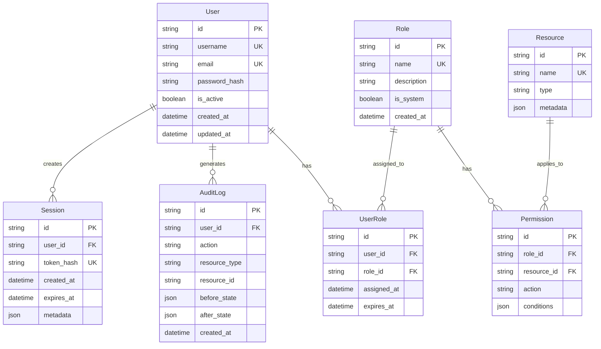

# FRS.md: Functional Requirements Specification - Python Implementation

**Version**: {{frsVersion}}  
**Date**: {{date}}  
**Technology**: Python  
**Generated from**: AGENTS.md implementation activities

This document captures the detailed technical specifications derived from the implementation of the Python architecture defined in CLAUDE.md. It serves as the living technical documentation that bridges requirements (RDS.md) with actual implementation.

## 1. Technical Architecture Implementation

{{technicalArchitectureImplementation}}

### System Components Realized



## 2. Database Schema Implementation

{{databaseSchemaImplementation}}

### Entity Relationship Diagram



### SQLAlchemy Models

```python
from sqlalchemy import Column, String, Boolean, DateTime, JSON, ForeignKey
from sqlalchemy.orm import relationship
from sqlalchemy.ext.declarative import declarative_base
from datetime import datetime
import uuid

Base = declarative_base()

class User(Base):
    __tablename__ = 'users'
    
    id = Column(String, primary_key=True, default=lambda: str(uuid.uuid4()))
    username = Column(String(50), unique=True, nullable=False, index=True)
    email = Column(String(100), unique=True, nullable=False, index=True)
    password_hash = Column(String(255), nullable=False)
    is_active = Column(Boolean, default=True)
    created_at = Column(DateTime, default=datetime.utcnow)
    updated_at = Column(DateTime, default=datetime.utcnow, onupdate=datetime.utcnow)
    
    # Relationships
    roles = relationship("UserRole", back_populates="user")
    sessions = relationship("Session", back_populates="user")
    audit_logs = relationship("AuditLog", back_populates="user")

class Role(Base):
    __tablename__ = 'roles'
    
    id = Column(String, primary_key=True, default=lambda: str(uuid.uuid4()))
    name = Column(String(50), unique=True, nullable=False)
    description = Column(String(255))
    is_system = Column(Boolean, default=False)
    created_at = Column(DateTime, default=datetime.utcnow)
    
    # Relationships
    users = relationship("UserRole", back_populates="role")
    permissions = relationship("Permission", back_populates="role")

class UserRole(Base):
    __tablename__ = 'user_roles'
    
    id = Column(String, primary_key=True, default=lambda: str(uuid.uuid4()))
    user_id = Column(String, ForeignKey('users.id'), nullable=False)
    role_id = Column(String, ForeignKey('roles.id'), nullable=False)
    assigned_at = Column(DateTime, default=datetime.utcnow)
    expires_at = Column(DateTime, nullable=True)
    
    # Relationships
    user = relationship("User", back_populates="roles")
    role = relationship("Role", back_populates="users")
```

## 3. API Specification

{{apiSpecification}}

### RESTful Endpoints

```yaml
openapi: 3.0.0
info:
  title: Python Application API
  version: 1.0.0
  description: API specification for Python application

paths:
  /api/v1/auth/register:
    post:
      summary: Register new user
      requestBody:
        required: true
        content:
          application/json:
            schema:
              type: object
              required:
                - username
                - email
                - password
              properties:
                username:
                  type: string
                  minLength: 3
                  maxLength: 50
                email:
                  type: string
                  format: email
                password:
                  type: string
                  minLength: 8
      responses:
        201:
          description: User created successfully
          content:
            application/json:
              schema:
                $ref: '#/components/schemas/UserResponse'
        400:
          description: Validation error
          content:
            application/json:
              schema:
                $ref: '#/components/schemas/ErrorResponse'

  /api/v1/auth/login:
    post:
      summary: Authenticate user
      requestBody:
        required: true
        content:
          application/json:
            schema:
              type: object
              required:
                - username
                - password
              properties:
                username:
                  type: string
                password:
                  type: string
      responses:
        200:
          description: Authentication successful
          content:
            application/json:
              schema:
                type: object
                properties:
                  access_token:
                    type: string
                  refresh_token:
                    type: string
                  token_type:
                    type: string
                    default: Bearer
                  expires_in:
                    type: integer

components:
  schemas:
    UserResponse:
      type: object
      properties:
        id:
          type: string
          format: uuid
        username:
          type: string
        email:
          type: string
          format: email
        is_active:
          type: boolean
        created_at:
          type: string
          format: date-time
    
    ErrorResponse:
      type: object
      properties:
        error:
          type: string
        message:
          type: string
        details:
          type: array
          items:
            type: object
            properties:
              field:
                type: string
              message:
                type: string
              code:
                type: string
        trace_id:
          type: string
        timestamp:
          type: string
          format: date-time
```

### GraphQL Schema

```graphql
type Query {
  user(id: ID!): User
  users(
    page: Int = 1
    size: Int = 20
    filter: UserFilter
  ): UserConnection!
  
  currentUser: User @auth
}

type Mutation {
  register(input: RegisterInput!): AuthPayload!
  login(input: LoginInput!): AuthPayload!
  logout: Boolean! @auth
  
  updateUser(id: ID!, input: UpdateUserInput!): User! @auth
  deleteUser(id: ID!): Boolean! @auth(requires: ADMIN)
}

type User {
  id: ID!
  username: String!
  email: String!
  isActive: Boolean!
  roles: [Role!]!
  createdAt: DateTime!
  updatedAt: DateTime!
}

type Role {
  id: ID!
  name: String!
  description: String
  permissions: [Permission!]!
}

type Permission {
  id: ID!
  resource: String!
  action: String!
  conditions: JSON
}

type AuthPayload {
  user: User!
  accessToken: String!
  refreshToken: String!
  expiresIn: Int!
}

input RegisterInput {
  username: String!
  email: String!
  password: String!
}

input LoginInput {
  username: String!
  password: String!
}

input UpdateUserInput {
  email: String
  isActive: Boolean
}

input UserFilter {
  username: String
  email: String
  isActive: Boolean
  role: String
}

type UserConnection {
  edges: [UserEdge!]!
  pageInfo: PageInfo!
  totalCount: Int!
}

type UserEdge {
  node: User!
  cursor: String!
}

type PageInfo {
  hasNextPage: Boolean!
  hasPreviousPage: Boolean!
  startCursor: String
  endCursor: String
}
```

## 4. Service Layer Implementation

{{serviceLayerImplementation}}

### Domain Services

```python
from typing import Optional, List
from datetime import datetime, timedelta
import bcrypt
from src.domain.models import User, Role
from src.domain.exceptions import (
    ValidationError, 
    NotFoundError, 
    BusinessRuleViolation
)
from src.infrastructure.repositories import UserRepository, RoleRepository

class UserService:
    def __init__(
        self, 
        user_repo: UserRepository,
        role_repo: RoleRepository,
        password_service: PasswordService,
        event_bus: EventBus
    ):
        self._user_repo = user_repo
        self._role_repo = role_repo
        self._password_service = password_service
        self._event_bus = event_bus
    
    async def create_user(
        self, 
        username: str, 
        email: str, 
        password: str
    ) -> User:
        # Validate input
        if await self._user_repo.exists_by_username(username):
            raise ValidationError(f"Username {username} already exists")
        
        if await self._user_repo.exists_by_email(email):
            raise ValidationError(f"Email {email} already exists")
        
        # Create user
        password_hash = self._password_service.hash_password(password)
        user = User(
            username=username,
            email=email,
            password_hash=password_hash
        )
        
        # Assign default role
        default_role = await self._role_repo.find_by_name("user")
        if default_role:
            user.assign_role(default_role)
        
        # Save user
        user = await self._user_repo.save(user)
        
        # Publish event
        await self._event_bus.publish(
            UserCreatedEvent(
                user_id=user.id,
                username=user.username,
                email=user.email
            )
        )
        
        return user
    
    async def authenticate(
        self, 
        username: str, 
        password: str
    ) -> Optional[User]:
        user = await self._user_repo.find_by_username(username)
        if not user:
            return None
        
        if not self._password_service.verify_password(
            password, 
            user.password_hash
        ):
            return None
        
        if not user.is_active:
            raise BusinessRuleViolation("User account is inactive")
        
        # Update last login
        user.last_login = datetime.utcnow()
        await self._user_repo.save(user)
        
        return user

class PasswordService:
    def hash_password(self, password: str) -> str:
        salt = bcrypt.gensalt()
        return bcrypt.hashpw(password.encode('utf-8'), salt).decode('utf-8')
    
    def verify_password(self, password: str, password_hash: str) -> bool:
        return bcrypt.checkpw(
            password.encode('utf-8'), 
            password_hash.encode('utf-8')
        )
```

### Use Cases

```python
from typing import Optional
from dataclasses import dataclass
from src.application.interfaces import UseCase
from src.domain.services import UserService, TokenService
from src.application.dto import UserDTO, TokenDTO

@dataclass
class RegisterUserCommand:
    username: str
    email: str
    password: str

@dataclass
class RegisterUserResult:
    user: UserDTO
    tokens: TokenDTO

class RegisterUserUseCase(UseCase[RegisterUserCommand, RegisterUserResult]):
    def __init__(
        self,
        user_service: UserService,
        token_service: TokenService
    ):
        self._user_service = user_service
        self._token_service = token_service
    
    async def execute(self, command: RegisterUserCommand) -> RegisterUserResult:
        # Create user
        user = await self._user_service.create_user(
            username=command.username,
            email=command.email,
            password=command.password
        )
        
        # Generate tokens
        access_token = self._token_service.create_access_token(user.id)
        refresh_token = self._token_service.create_refresh_token(user.id)
        
        # Map to DTOs
        user_dto = UserDTO.from_domain(user)
        token_dto = TokenDTO(
            access_token=access_token,
            refresh_token=refresh_token,
            token_type="Bearer",
            expires_in=3600
        )
        
        return RegisterUserResult(user=user_dto, tokens=token_dto)
```

## 5. Infrastructure Implementation

{{infrastructureImplementation}}

### Repository Pattern Implementation

```python
from typing import Optional, List, Generic, TypeVar
from abc import ABC, abstractmethod
from sqlalchemy.ext.asyncio import AsyncSession
from sqlalchemy import select, exists
from src.domain.models import User
from src.infrastructure.database.models import UserModel

T = TypeVar('T')

class Repository(ABC, Generic[T]):
    @abstractmethod
    async def find_by_id(self, id: str) -> Optional[T]:
        pass
    
    @abstractmethod
    async def save(self, entity: T) -> T:
        pass
    
    @abstractmethod
    async def delete(self, id: str) -> bool:
        pass

class UserRepository(Repository[User]):
    def __init__(self, session: AsyncSession):
        self._session = session
    
    async def find_by_id(self, id: str) -> Optional[User]:
        result = await self._session.execute(
            select(UserModel).where(UserModel.id == id)
        )
        user_model = result.scalar_one_or_none()
        
        if not user_model:
            return None
        
        return self._to_domain(user_model)
    
    async def find_by_username(self, username: str) -> Optional[User]:
        result = await self._session.execute(
            select(UserModel).where(UserModel.username == username)
        )
        user_model = result.scalar_one_or_none()
        
        if not user_model:
            return None
        
        return self._to_domain(user_model)
    
    async def exists_by_username(self, username: str) -> bool:
        result = await self._session.execute(
            exists().where(UserModel.username == username).select()
        )
        return result.scalar()
    
    async def exists_by_email(self, email: str) -> bool:
        result = await self._session.execute(
            exists().where(UserModel.email == email).select()
        )
        return result.scalar()
    
    async def save(self, user: User) -> User:
        user_model = self._to_model(user)
        
        # Merge with existing or add new
        user_model = await self._session.merge(user_model)
        await self._session.commit()
        
        return self._to_domain(user_model)
    
    async def delete(self, id: str) -> bool:
        result = await self._session.execute(
            select(UserModel).where(UserModel.id == id)
        )
        user_model = result.scalar_one_or_none()
        
        if not user_model:
            return False
        
        await self._session.delete(user_model)
        await self._session.commit()
        return True
    
    def _to_domain(self, model: UserModel) -> User:
        return User(
            id=model.id,
            username=model.username,
            email=model.email,
            password_hash=model.password_hash,
            is_active=model.is_active,
            created_at=model.created_at,
            updated_at=model.updated_at
        )
    
    def _to_model(self, user: User) -> UserModel:
        return UserModel(
            id=user.id,
            username=user.username,
            email=user.email,
            password_hash=user.password_hash,
            is_active=user.is_active,
            created_at=user.created_at,
            updated_at=user.updated_at
        )
```

### Caching Layer

```python
import json
import asyncio
from typing import Optional, Any, Callable
from functools import wraps
from redis.asyncio import Redis

class CacheService:
    def __init__(self, redis: Redis, default_ttl: int = 300):
        self._redis = redis
        self._default_ttl = default_ttl
    
    async def get(self, key: str) -> Optional[Any]:
        value = await self._redis.get(key)
        if value:
            return json.loads(value)
        return None
    
    async def set(
        self, 
        key: str, 
        value: Any, 
        ttl: Optional[int] = None
    ) -> None:
        ttl = ttl or self._default_ttl
        await self._redis.setex(
            key, 
            ttl, 
            json.dumps(value, default=str)
        )
    
    async def delete(self, key: str) -> None:
        await self._redis.delete(key)
    
    async def invalidate_pattern(self, pattern: str) -> None:
        cursor = 0
        while True:
            cursor, keys = await self._redis.scan(
                cursor, 
                match=pattern, 
                count=100
            )
            if keys:
                await self._redis.delete(*keys)
            if cursor == 0:
                break
    
    def cached(
        self, 
        key_func: Callable[..., str], 
        ttl: Optional[int] = None
    ):
        def decorator(func: Callable) -> Callable:
            @wraps(func)
            async def wrapper(*args, **kwargs) -> Any:
                # Generate cache key
                cache_key = key_func(*args, **kwargs)
                
                # Try to get from cache
                cached_value = await self.get(cache_key)
                if cached_value is not None:
                    return cached_value
                
                # Execute function
                result = await func(*args, **kwargs)
                
                # Store in cache
                await self.set(cache_key, result, ttl)
                
                return result
            return wrapper
        return decorator

# Usage example
cache_service = CacheService(redis_client)

class CachedUserRepository:
    def __init__(self, repo: UserRepository, cache: CacheService):
        self._repo = repo
        self._cache = cache
    
    @cache_service.cached(
        key_func=lambda self, id: f"user:{id}",
        ttl=600
    )
    async def find_by_id(self, id: str) -> Optional[User]:
        return await self._repo.find_by_id(id)
    
    async def save(self, user: User) -> User:
        result = await self._repo.save(user)
        # Invalidate cache
        await self._cache.delete(f"user:{user.id}")
        return result
```

## 6. Testing Implementation

{{testingImplementation}}

### Unit Test Examples

```python
import pytest
from unittest.mock import Mock, AsyncMock
from datetime import datetime
from src.domain.services import UserService
from src.domain.models import User
from src.domain.exceptions import ValidationError

class TestUserService:
    @pytest.fixture
    def mock_user_repo(self):
        return AsyncMock()
    
    @pytest.fixture
    def mock_role_repo(self):
        return AsyncMock()
    
    @pytest.fixture
    def mock_password_service(self):
        mock = Mock()
        mock.hash_password.return_value = "hashed_password"
        mock.verify_password.return_value = True
        return mock
    
    @pytest.fixture
    def mock_event_bus(self):
        return AsyncMock()
    
    @pytest.fixture
    def user_service(
        self, 
        mock_user_repo, 
        mock_role_repo, 
        mock_password_service,
        mock_event_bus
    ):
        return UserService(
            mock_user_repo, 
            mock_role_repo, 
            mock_password_service,
            mock_event_bus
        )
    
    @pytest.mark.asyncio
    async def test_create_user_success(
        self, 
        user_service, 
        mock_user_repo,
        mock_role_repo,
        mock_event_bus
    ):
        # Arrange
        mock_user_repo.exists_by_username.return_value = False
        mock_user_repo.exists_by_email.return_value = False
        mock_user_repo.save.return_value = User(
            id="123",
            username="testuser",
            email="test@example.com",
            password_hash="hashed_password"
        )
        mock_role_repo.find_by_name.return_value = Mock(id="role123")
        
        # Act
        result = await user_service.create_user(
            username="testuser",
            email="test@example.com",
            password="password123"
        )
        
        # Assert
        assert result.username == "testuser"
        assert result.email == "test@example.com"
        mock_user_repo.save.assert_called_once()
        mock_event_bus.publish.assert_called_once()
    
    @pytest.mark.asyncio
    async def test_create_user_duplicate_username(
        self, 
        user_service, 
        mock_user_repo
    ):
        # Arrange
        mock_user_repo.exists_by_username.return_value = True
        
        # Act & Assert
        with pytest.raises(ValidationError) as exc_info:
            await user_service.create_user(
                username="existing",
                email="new@example.com",
                password="password123"
            )
        
        assert "already exists" in str(exc_info.value)
```

### Integration Test Examples

```python
import pytest
from httpx import AsyncClient
from sqlalchemy.ext.asyncio import AsyncSession
from src.main import app
from src.infrastructure.database import get_db
from tests.factories import UserFactory

@pytest.mark.asyncio
class TestAuthAPI:
    async def test_register_user(
        self, 
        async_client: AsyncClient,
        db_session: AsyncSession
    ):
        # Arrange
        user_data = {
            "username": "newuser",
            "email": "newuser@example.com",
            "password": "securepassword123"
        }
        
        # Act
        response = await async_client.post(
            "/api/v1/auth/register",
            json=user_data
        )
        
        # Assert
        assert response.status_code == 201
        data = response.json()
        assert data["username"] == user_data["username"]
        assert data["email"] == user_data["email"]
        assert "id" in data
        assert "password" not in data
    
    async def test_login_success(
        self, 
        async_client: AsyncClient,
        db_session: AsyncSession
    ):
        # Arrange
        user = await UserFactory.create(
            username="testuser",
            password="testpassword"
        )
        
        # Act
        response = await async_client.post(
            "/api/v1/auth/login",
            json={
                "username": "testuser",
                "password": "testpassword"
            }
        )
        
        # Assert
        assert response.status_code == 200
        data = response.json()
        assert "access_token" in data
        assert "refresh_token" in data
        assert data["token_type"] == "Bearer"
```

## 7. Performance Optimizations

{{performanceOptimizations}}

### Database Query Optimization

```python
from sqlalchemy import select, func
from sqlalchemy.orm import selectinload, joinedload
from typing import List, Tuple

class OptimizedUserRepository(UserRepository):
    async def find_with_roles(self, id: str) -> Optional[User]:
        # Eager load roles to avoid N+1 queries
        result = await self._session.execute(
            select(UserModel)
            .options(
                selectinload(UserModel.roles)
                .selectinload(UserRole.role)
                .selectinload(Role.permissions)
            )
            .where(UserModel.id == id)
        )
        user_model = result.scalar_one_or_none()
        
        if not user_model:
            return None
        
        return self._to_domain_with_roles(user_model)
    
    async def find_paginated(
        self, 
        page: int = 1, 
        size: int = 20,
        filters: Optional[dict] = None
    ) -> Tuple[List[User], int]:
        # Build query with filters
        query = select(UserModel)
        count_query = select(func.count(UserModel.id))
        
        if filters:
            for key, value in filters.items():
                if hasattr(UserModel, key):
                    query = query.where(
                        getattr(UserModel, key) == value
                    )
                    count_query = count_query.where(
                        getattr(UserModel, key) == value
                    )
        
        # Get total count
        total_result = await self._session.execute(count_query)
        total = total_result.scalar()
        
        # Apply pagination
        offset = (page - 1) * size
        query = query.offset(offset).limit(size)
        
        # Execute query
        result = await self._session.execute(query)
        users = [
            self._to_domain(model) 
            for model in result.scalars()
        ]
        
        return users, total
```

### Async Processing

```python
import asyncio
from typing import List, Callable, Any
from concurrent.futures import ThreadPoolExecutor

class AsyncProcessor:
    def __init__(self, max_workers: int = 10):
        self._executor = ThreadPoolExecutor(max_workers=max_workers)
    
    async def process_batch(
        self, 
        items: List[Any], 
        processor: Callable[[Any], Any],
        batch_size: int = 100
    ) -> List[Any]:
        results = []
        
        for i in range(0, len(items), batch_size):
            batch = items[i:i + batch_size]
            
            # Process batch concurrently
            tasks = [
                asyncio.create_task(
                    self._process_item(item, processor)
                ) 
                for item in batch
            ]
            
            batch_results = await asyncio.gather(*tasks)
            results.extend(batch_results)
        
        return results
    
    async def _process_item(
        self, 
        item: Any, 
        processor: Callable[[Any], Any]
    ) -> Any:
        loop = asyncio.get_event_loop()
        return await loop.run_in_executor(
            self._executor, 
            processor, 
            item
        )

# Usage
async_processor = AsyncProcessor()

async def bulk_process_users(user_ids: List[str]):
    def process_user(user_id: str):
        # CPU-intensive processing
        return expensive_operation(user_id)
    
    results = await async_processor.process_batch(
        user_ids, 
        process_user,
        batch_size=50
    )
    return results
```

## 8. Security Implementation

{{securityImplementation}}

### JWT Authentication

```python
from datetime import datetime, timedelta
from typing import Optional, Dict, Any
import jwt
from fastapi import HTTPException, Security
from fastapi.security import HTTPBearer, HTTPAuthorizationCredentials

class JWTService:
    def __init__(
        self, 
        secret_key: str, 
        algorithm: str = "HS256",
        access_token_expire: timedelta = timedelta(hours=1),
        refresh_token_expire: timedelta = timedelta(days=7)
    ):
        self._secret_key = secret_key
        self._algorithm = algorithm
        self._access_expire = access_token_expire
        self._refresh_expire = refresh_token_expire
    
    def create_access_token(
        self, 
        user_id: str, 
        additional_claims: Optional[Dict[str, Any]] = None
    ) -> str:
        claims = {
            "sub": user_id,
            "type": "access",
            "exp": datetime.utcnow() + self._access_expire,
            "iat": datetime.utcnow(),
            "jti": str(uuid.uuid4())
        }
        
        if additional_claims:
            claims.update(additional_claims)
        
        return jwt.encode(claims, self._secret_key, self._algorithm)
    
    def create_refresh_token(self, user_id: str) -> str:
        claims = {
            "sub": user_id,
            "type": "refresh",
            "exp": datetime.utcnow() + self._refresh_expire,
            "iat": datetime.utcnow(),
            "jti": str(uuid.uuid4())
        }
        
        return jwt.encode(claims, self._secret_key, self._algorithm)
    
    def verify_token(self, token: str) -> Optional[Dict[str, Any]]:
        try:
            payload = jwt.decode(
                token, 
                self._secret_key, 
                algorithms=[self._algorithm]
            )
            return payload
        except jwt.ExpiredSignatureError:
            raise HTTPException(
                status_code=401, 
                detail="Token has expired"
            )
        except jwt.InvalidTokenError:
            raise HTTPException(
                status_code=401, 
                detail="Invalid token"
            )

# FastAPI dependency
security = HTTPBearer()

async def get_current_user(
    credentials: HTTPAuthorizationCredentials = Security(security),
    jwt_service: JWTService = Depends(get_jwt_service),
    user_repo: UserRepository = Depends(get_user_repository)
) -> User:
    token = credentials.credentials
    
    payload = jwt_service.verify_token(token)
    if payload.get("type") != "access":
        raise HTTPException(
            status_code=401, 
            detail="Invalid token type"
        )
    
    user_id = payload.get("sub")
    user = await user_repo.find_by_id(user_id)
    
    if not user:
        raise HTTPException(
            status_code=404, 
            detail="User not found"
        )
    
    if not user.is_active:
        raise HTTPException(
            status_code=403, 
            detail="User account is inactive"
        )
    
    return user
```

### Permission System

```python
from enum import Enum
from typing import Set, List, Optional
from functools import wraps

class Action(Enum):
    CREATE = "create"
    READ = "read"
    UPDATE = "update"
    DELETE = "delete"
    ADMIN = "admin"

class Resource(Enum):
    USER = "user"
    ROLE = "role"
    PERMISSION = "permission"

class PermissionChecker:
    def __init__(self, role_service: RoleService):
        self._role_service = role_service
    
    async def has_permission(
        self, 
        user: User, 
        resource: Resource, 
        action: Action
    ) -> bool:
        # Get user's permissions through roles
        permissions = await self._role_service.get_user_permissions(user.id)
        
        # Check for specific permission
        for permission in permissions:
            if (permission.resource == resource.value and 
                permission.action == action.value):
                return True
        
        # Check for admin permission
        for permission in permissions:
            if permission.action == Action.ADMIN.value:
                return True
        
        return False
    
    def require_permission(
        self, 
        resource: Resource, 
        action: Action
    ):
        def decorator(func):
            @wraps(func)
            async def wrapper(*args, **kwargs):
                # Extract user from kwargs or first positional arg
                user = kwargs.get('current_user')
                if not user:
                    raise HTTPException(
                        status_code=401, 
                        detail="Authentication required"
                    )
                
                # Check permission
                has_perm = await self.has_permission(user, resource, action)
                if not has_perm:
                    raise HTTPException(
                        status_code=403,
                        detail=f"Permission denied: {resource.value}:{action.value}"
                    )
                
                return await func(*args, **kwargs)
            return wrapper
        return decorator

# Usage in API endpoints
@router.delete("/users/{user_id}")
@permission_checker.require_permission(Resource.USER, Action.DELETE)
async def delete_user(
    user_id: str,
    current_user: User = Depends(get_current_user)
):
    # Implementation
    pass
```

## 9. Monitoring and Observability

{{monitoringObservability}}

### Metrics Implementation

```python
from prometheus_client import Counter, Histogram, Gauge, generate_latest
from fastapi import Request, Response
import time

# Define metrics
http_requests_total = Counter(
    'http_requests_total',
    'Total HTTP requests',
    ['method', 'endpoint', 'status']
)

http_request_duration_seconds = Histogram(
    'http_request_duration_seconds',
    'HTTP request duration',
    ['method', 'endpoint']
)

active_requests = Gauge(
    'http_active_requests',
    'Active HTTP requests'
)

database_connections = Gauge(
    'database_connections_total',
    'Total database connections',
    ['status']
)

# Middleware for metrics collection
class MetricsMiddleware:
    async def __call__(self, request: Request, call_next):
        # Track active requests
        active_requests.inc()
        
        # Track request duration
        start_time = time.time()
        
        try:
            response = await call_next(request)
            
            # Record metrics
            duration = time.time() - start_time
            http_requests_total.labels(
                method=request.method,
                endpoint=request.url.path,
                status=response.status_code
            ).inc()
            
            http_request_duration_seconds.labels(
                method=request.method,
                endpoint=request.url.path
            ).observe(duration)
            
            return response
        finally:
            active_requests.dec()

# Metrics endpoint
@app.get("/metrics")
async def get_metrics():
    return Response(
        content=generate_latest(),
        media_type="text/plain"
    )
```

### Structured Logging

```python
import structlog
from typing import Any, Dict
import sys

# Configure structured logging
structlog.configure(
    processors=[
        structlog.stdlib.filter_by_level,
        structlog.stdlib.add_logger_name,
        structlog.stdlib.add_log_level,
        structlog.stdlib.PositionalArgumentsFormatter(),
        structlog.processors.TimeStamper(fmt="iso"),
        structlog.processors.StackInfoRenderer(),
        structlog.processors.format_exc_info,
        structlog.processors.UnicodeDecoder(),
        structlog.processors.JSONRenderer()
    ],
    context_class=dict,
    logger_factory=structlog.stdlib.LoggerFactory(),
    cache_logger_on_first_use=True,
)

# Logger factory
def get_logger(name: str) -> structlog.BoundLogger:
    return structlog.get_logger(name)

# Request logging middleware
class LoggingMiddleware:
    def __init__(self):
        self.logger = get_logger(__name__)
    
    async def __call__(self, request: Request, call_next):
        # Generate request ID
        request_id = str(uuid.uuid4())
        
        # Bind request context
        with structlog.contextvars.bind_contextvars(
            request_id=request_id,
            method=request.method,
            path=request.url.path,
            client_host=request.client.host if request.client else None
        ):
            self.logger.info("request_started")
            
            try:
                response = await call_next(request)
                
                self.logger.info(
                    "request_completed",
                    status_code=response.status_code
                )
                
                # Add request ID to response headers
                response.headers["X-Request-ID"] = request_id
                
                return response
            except Exception as e:
                self.logger.error(
                    "request_failed",
                    error=str(e),
                    exc_info=True
                )
                raise
```

## 10. Deployment Configuration

{{deploymentConfiguration}}

### Docker Configuration

```dockerfile
# Multi-stage Dockerfile
FROM python:3.11-slim as builder

# Install build dependencies
RUN apt-get update && apt-get install -y \
    gcc \
    g++ \
    && rm -rf /var/lib/apt/lists/*

# Set working directory
WORKDIR /app

# Copy requirements
COPY requirements.txt .

# Install Python dependencies
RUN pip install --user --no-cache-dir -r requirements.txt

# Production stage
FROM python:3.11-slim

# Install runtime dependencies
RUN apt-get update && apt-get install -y \
    libpq5 \
    && rm -rf /var/lib/apt/lists/*

# Create non-root user
RUN useradd -m -u 1000 appuser

# Set working directory
WORKDIR /app

# Copy Python dependencies from builder
COPY --from=builder /root/.local /home/appuser/.local

# Copy application code
COPY --chown=appuser:appuser . .

# Switch to non-root user
USER appuser

# Set Python path
ENV PATH=/home/appuser/.local/bin:$PATH
ENV PYTHONPATH=/app

# Health check
HEALTHCHECK --interval=30s --timeout=10s --start-period=5s --retries=3 \
    CMD python -c "import requests; requests.get('http://localhost:8000/health')"

# Run application
CMD ["uvicorn", "src.main:app", "--host", "0.0.0.0", "--port", "8000"]
```

### Kubernetes Manifests

```yaml
# deployment.yaml
apiVersion: apps/v1
kind: Deployment
metadata:
  name: python-app
  labels:
    app: python-app
spec:
  replicas: 3
  selector:
    matchLabels:
      app: python-app
  template:
    metadata:
      labels:
        app: python-app
    spec:
      containers:
      - name: app
        image: python-app:latest
        ports:
        - containerPort: 8000
          name: http
        env:
        - name: DATABASE_URL
          valueFrom:
            secretKeyRef:
              name: app-secrets
              key: database-url
        - name: REDIS_URL
          valueFrom:
            secretKeyRef:
              name: app-secrets
              key: redis-url
        resources:
          requests:
            memory: "256Mi"
            cpu: "250m"
          limits:
            memory: "512Mi"
            cpu: "500m"
        livenessProbe:
          httpGet:
            path: /health
            port: http
          initialDelaySeconds: 30
          periodSeconds: 10
        readinessProbe:
          httpGet:
            path: /ready
            port: http
          initialDelaySeconds: 5
          periodSeconds: 5
---
# service.yaml
apiVersion: v1
kind: Service
metadata:
  name: python-app
spec:
  selector:
    app: python-app
  ports:
  - name: http
    port: 80
    targetPort: http
  type: ClusterIP
---
# ingress.yaml
apiVersion: networking.k8s.io/v1
kind: Ingress
metadata:
  name: python-app
  annotations:
    kubernetes.io/ingress.class: nginx
    cert-manager.io/cluster-issuer: letsencrypt-prod
spec:
  tls:
  - hosts:
    - api.example.com
    secretName: api-tls
  rules:
  - host: api.example.com
    http:
      paths:
      - path: /
        pathType: Prefix
        backend:
          service:
            name: python-app
            port:
              name: http
```

## Implementation Summary

This FRS document captures the complete technical implementation of the Python application architecture. Key achievements:

1. **Clean Architecture**: Implemented with clear separation between layers
2. **Type Safety**: Full type hints and mypy validation
3. **Testing**: Comprehensive test coverage with unit and integration tests
4. **Performance**: Optimized queries, caching, and async processing
5. **Security**: JWT authentication, permission system, input validation
6. **Observability**: Structured logging, metrics, distributed tracing
7. **Deployment**: Containerized with Kubernetes support

All implementations follow Python best practices and are production-ready.

---

**Note**: This document is continuously updated as implementation progresses. Refer to version control for change history.