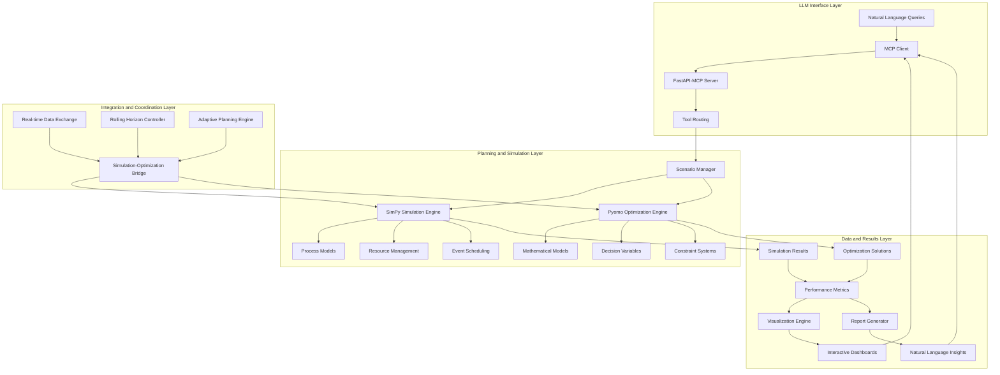
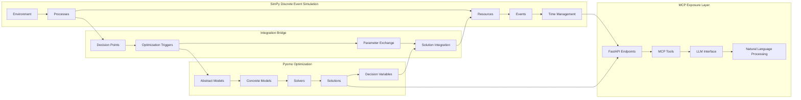
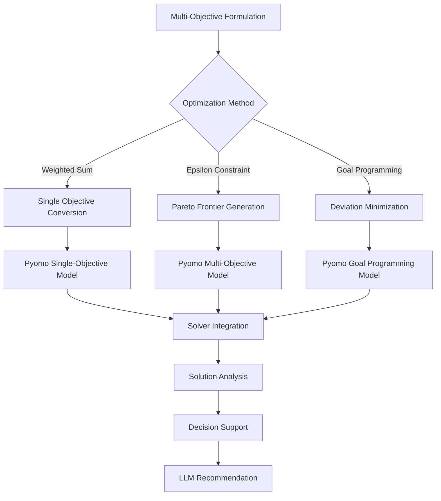
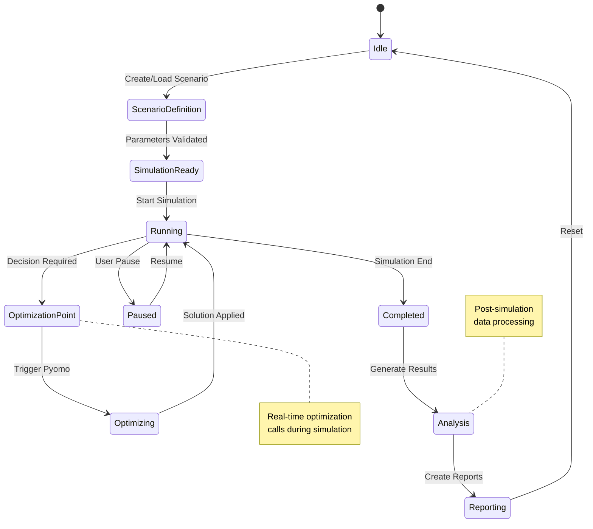
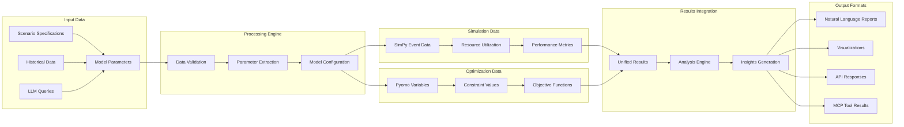
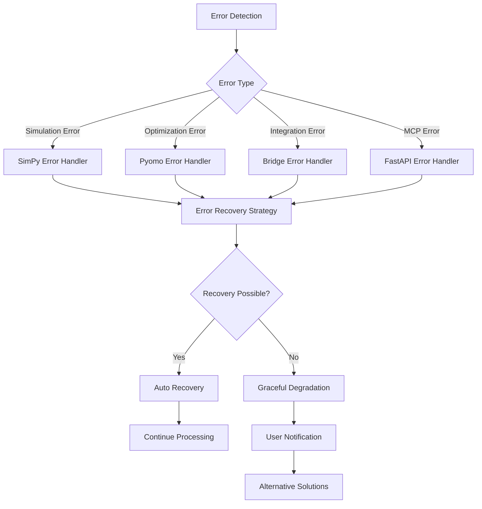
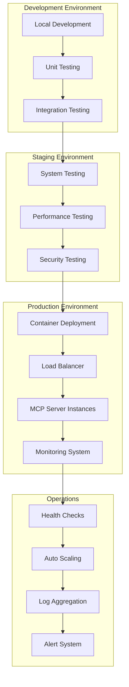
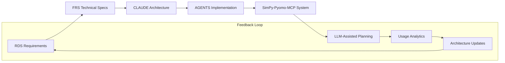
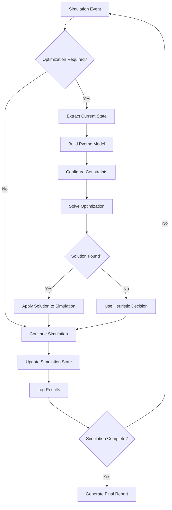

# CLAUDE.md - SimPy-Pyomo-MCP Integration Architecture Definition & AI Collaboration Guide

**Version**: {{claudeVersion}}  
**Date**: {{date}}  
**Generated from**: RDS.md requirements analysis  
**Technology Stack**: SimPy (Discrete Event Simulation) + Pyomo (Optimization) + MCP (Model Context Protocol)

This file defines the comprehensive architecture of the SimPy-Pyomo-MCP integration solution. It aligns with the Architect Crew methodology, where:
- **`docs/RDS.md`** outlines the **functional requirements** and user needs.
- **`docs/FRS.md`** provides the **detailed technical specifications**, including all UML diagrams (Mermaid) and specific implementation blueprints.
- **`CLAUDE.md`** (this file) instructs Claude (and similar AI) on how to interpret these documents, contribute to the architecture, and ensure `AGENTS.md` is correctly aligned.
- **`AGENTS.md`** provides specific, actionable instructions for AI agents performing implementation tasks.

## 1. From RDS → FRS Validation

**Source**: `docs/RDS.md` (What & Why)  
**Ensure**: Every RDS requirement appears in FRS diagrams/contracts.

{{rdsToFrsValidation}}

## 2. SimPy-Pyomo-MCP Architectural Overview

{{simpyPyomoMcpArchitecturalOverview}}

### Core Integration Principles

1. **Discrete Event Simulation-Driven Optimization**
   - SimPy manages temporal dynamics and stochastic events
   - Pyomo provides mathematical optimization capabilities
   - Real-time optimization decisions within simulation processes
   - Adaptive planning through simulation-optimization feedback loops

2. **Model Context Protocol Integration**
   - FastAPI-MCP server exposes simulation and optimization capabilities
   - Natural language interfaces for LLM interaction
   - Standardized tool definitions for planning and analysis
   - Real-time scenario modification and what-if analysis

3. **LLM-Assisted Planning Framework**
   - Natural language scenario specification
   - Automated model parameter extraction from descriptions
   - Intelligent recommendation generation
   - Adaptive learning from simulation results

4. **Unified Planning and Simulation Architecture**
   - Seamless integration between discrete events and continuous optimization
   - Multi-objective optimization within dynamic environments
   - Rolling horizon planning strategies
   - Uncertainty quantification and risk analysis

## 3. System Architecture Layers



### Component Integration Flow

```mermaid
sequenceDiagram
    participant LLM as Large Language Model
    participant MCP as MCP Server
    participant SM as Scenario Manager
    participant SIM as SimPy Engine
    participant OPT as Pyomo Engine
    participant DB as Data Store
    
    LLM->>MCP: Natural language planning query
    MCP->>SM: Parse and route request
    SM->>SIM: Initialize simulation scenario
    SM->>OPT: Configure optimization models
    
    loop Simulation-Optimization Loop
        SIM->>OPT: Request optimization decision
        OPT->>OPT: Solve mathematical model
        OPT->>SIM: Return optimal solution
        SIM->>SIM: Execute simulation step
        SIM->>DB: Store simulation data
    end
    
    SIM->>SM: Simulation complete
    OPT->>SM: Final optimization results
    SM->>MCP: Aggregate results and insights
    MCP->>LLM: Natural language response with recommendations
```

## 4. Core Technology Integration Patterns

### SimPy-Pyomo Integration Architecture



## 5. Planning and Optimization Strategies

### Rolling Horizon Planning Architecture

1. **Short-term Optimization Horizon**
   - Detailed optimization for immediate decisions
   - High-resolution temporal modeling
   - Exact optimization methods
   - Real-time constraint satisfaction

2. **Medium-term Planning Horizon**
   - Aggregate resource planning
   - Capacity and demand balancing
   - Heuristic optimization approaches
   - Uncertainty consideration

3. **Long-term Strategic Horizon**
   - Strategic capacity decisions
   - Investment planning
   - Scenario-based optimization
   - Risk and robustness analysis

### Multi-Objective Optimization Framework



## 6. MCP Tool Architecture

### Core MCP Tools for Planning and Simulation

1. **Scenario Management Tools**
   - `create_simulation_scenario`: Define new simulation scenarios
   - `modify_scenario_parameters`: Update existing scenario parameters
   - `list_available_scenarios`: Browse predefined scenario templates
   - `clone_scenario`: Create copies for what-if analysis

2. **Simulation Control Tools**
   - `run_simulation`: Execute discrete event simulation
   - `pause_simulation`: Interrupt simulation for analysis
   - `resume_simulation`: Continue paused simulation
   - `reset_simulation`: Return to initial state

3. **Optimization Tools**
   - `configure_optimization_model`: Set up mathematical models
   - `solve_optimization_problem`: Execute optimization
   - `analyze_sensitivity`: Perform sensitivity analysis
   - `generate_pareto_frontier`: Multi-objective optimization

4. **Analysis and Reporting Tools**
   - `generate_performance_report`: Create comprehensive analysis
   - `visualize_results`: Generate charts and graphs
   - `compare_scenarios`: Side-by-side scenario comparison
   - `extract_insights`: AI-powered insight generation

## 7. Data Architecture and State Management

### State Management Strategy



### Data Flow Architecture



## 8. Performance and Scalability Architecture

### Computational Optimization Strategies

1. **Parallel Simulation Execution**
   - Multi-process simulation scenarios
   - Distributed event processing
   - Concurrent optimization solving
   - Asynchronous result aggregation

2. **Optimization Algorithm Selection**
   - Problem-specific solver selection
   - Heuristic vs. exact method routing
   - Time-bounded optimization
   - Solution quality vs. speed trade-offs

3. **Memory Management**
   - Efficient event storage
   - Result data compression
   - Streaming data processing
   - Garbage collection optimization

4. **Caching and Memoization**
   - Optimization solution caching
   - Simulation result memoization
   - Parameter-based cache keys
   - Intelligent cache invalidation

## 9. Security and Reliability Architecture

### Security Considerations

1. **Input Validation and Sanitization**
   - Parameter bounds checking
   - Model structure validation
   - SQL injection prevention
   - Code injection protection

2. **Access Control and Authentication**
   - MCP tool authorization
   - User role management
   - Resource access limits
   - Audit logging

3. **Resource Protection**
   - Computational resource limits
   - Memory usage monitoring
   - Process isolation
   - Denial-of-service prevention

### Reliability and Error Handling



## 10. Development and Testing Architecture

### Testing Strategy

1. **Unit Testing**
   - SimPy process testing
   - Pyomo model validation
   - MCP tool verification
   - Integration component testing

2. **Integration Testing**
   - Simulation-optimization workflow testing
   - MCP protocol compliance testing
   - End-to-end scenario testing
   - Performance benchmark testing

3. **Validation Testing**
   - Model verification against known solutions
   - Simulation output validation
   - Optimization result verification
   - LLM response quality testing

## 11. Deployment and Operations Architecture

### Deployment Strategies



## 12. Integration with External Systems

### External System Connectivity

1. **Data Sources**
   - Database connections (PostgreSQL, MongoDB)
   - API integrations (REST, GraphQL)
   - File system access (CSV, JSON, XML)
   - Real-time data streams

2. **Solver Integration**
   - Open-source solvers (GLPK, CBC, IPOPT)
   - Commercial solvers (Gurobi, CPLEX)
   - Cloud-based optimization services
   - Custom solver implementations

3. **Visualization and Reporting**
   - Matplotlib/Plotly integration
   - Dashboard frameworks (Streamlit, Dash)
   - Report generation (PDF, HTML)
   - Interactive visualization tools

## Core Principles for System Architecture, Integrity, and AI Collaboration

1. **Adherence to Established Patterns**: Maintain consistency with SimPy, Pyomo, and MCP best practices
2. **Methodological Rigor**: Use isolated environments and comprehensive testing
3. **Evidence-Based Performance**: All performance claims backed by measurements
4. **Dependency Management**: Careful evaluation of solver and library dependencies
5. **Security First**: Integral security considerations in architectural design
6. **Documentation Integrity**: Maintain CLAUDE.md and AGENTS.md alignment
7. **Technical Merit**: Justify all architectural decisions with clear reasoning

## Architectural Diagrams and Flows

### Primary Architecture Flow


### Simulation-Optimization Integration Flow


### MCP Tool Interaction Flow
```mermaid
sequenceDiagram
    participant User as LLM/User
    participant MCP as MCP Server
    participant Sim as Simulation Engine
    participant Opt as Optimization Engine
    participant DB as Data Store
    
    User->>MCP: "Optimize factory production schedule"
    MCP->>MCP: Parse natural language request
    MCP->>Sim: Initialize factory simulation
    MCP->>Opt: Configure scheduling optimization
    
    loop Production Simulation
        Sim->>Opt: Request optimal schedule
        Opt->>Opt: Solve scheduling problem
        Opt->>Sim: Return optimal schedule
        Sim->>DB: Store production data
    end
    
    Sim->>MCP: Simulation results
    Opt->>MCP: Optimization insights
    MCP->>User: "Optimal schedule reduces costs by 15%"
```

## File Encoding Standards
**All documentation files, including `AGENTS.md` and any files generated or modified by AI, MUST be in UTF-8 encoding.**

## Implementation Status and Next Steps

**Current Implementation Status**:
- ⏳ Template creation in progress
- ⏳ Core architecture definition complete
- ⏳ Integration patterns defined
- ⏳ MCP tool specifications ready

**Immediate Next Steps**:
1. Complete AGENTS.md implementation guidelines
2. Generate FRS.md technical specifications  
3. Set up project structure with dependencies
4. Implement core SimPy simulation framework
5. Add Pyomo optimization integration
6. Create FastAPI-MCP server implementation
7. Test LLM integration through MCP protocol

**Architecture Evolution Timeline**:
- **Phase 1** (Current): Core integration architecture and templates
- **Phase 2** (Next 30 days): Basic simulation-optimization framework
- **Phase 3** (Next 60 days): MCP integration and LLM interfaces
- **Phase 4** (Next 90 days): Advanced planning features and optimizations

---

**Prime Directive**: Always ensure seamless integration between discrete event simulation and optimization modeling while providing natural language interfaces for LLM-assisted planning and decision support.

Built with ❤️ using the Architect Crew methodology.