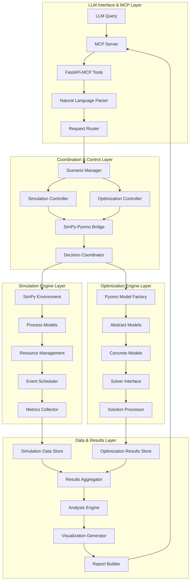
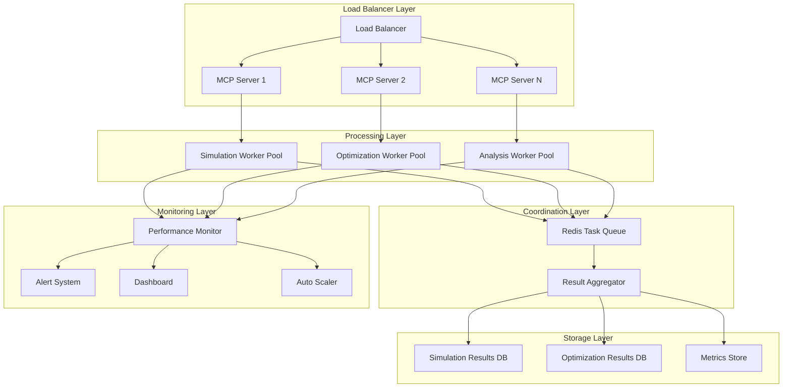

# FRS.md: Functional Requirements Specification - SimPy-Pyomo-MCP Implementation

**Version**: {{frsVersion}}  
**Date**: {{date}}  
**Technology**: SimPy (Discrete Event Simulation) + Pyomo (Optimization) + MCP (Model Context Protocol)  
**Generated from**: AGENTS.md implementation activities

This document captures the detailed technical specifications derived from the implementation of the SimPy-Pyomo-MCP integration architecture defined in CLAUDE.md. It serves as the living technical documentation that bridges requirements (RDS.md) with actual implementation.

## 1. SimPy-Pyomo-MCP System Architecture Implementation

{{simpyPyomoMcpSystemArchitectureImplementation}}

### Complete Integration Architecture



### Core Implementation Classes

```python
# Complete implementation of core system classes

# src/core/system_manager.py
from typing import Dict, Any, Optional, List, Callable
from dataclasses import dataclass, field
from enum import Enum
import asyncio
import uuid
import logging
from datetime import datetime

class SystemState(Enum):
    INITIALIZING = "initializing"
    READY = "ready"
    RUNNING = "running"
    PAUSED = "paused"
    STOPPED = "stopped"
    ERROR = "error"

@dataclass
class SystemConfiguration:
    """Global system configuration."""
    max_concurrent_simulations: int = 5
    max_concurrent_optimizations: int = 10
    default_simulation_timeout: float = 3600.0  # 1 hour
    default_optimization_timeout: float = 300.0  # 5 minutes
    enable_real_time_simulation: bool = False
    enable_distributed_processing: bool = False
    logging_level: str = "INFO"
    data_retention_days: int = 30
    auto_cleanup_enabled: bool = True

class SimPyPyomoMCPSystem:
    """Main system coordinator for SimPy-Pyomo-MCP integration."""
    
    def __init__(self, config: SystemConfiguration):
        self.config = config
        self.state = SystemState.INITIALIZING
        self.session_id = str(uuid.uuid4())
        self.logger = self._setup_logging()
        
        # Core components
        self.scenario_manager = None
        self.simulation_controller = None
        self.optimization_controller = None
        self.bridge = None
        self.mcp_server = None
        
        # Runtime state
        self.active_scenarios: Dict[str, Any] = {}
        self.active_simulations: Dict[str, Any] = {}
        self.active_optimizations: Dict[str, Any] = {}
        self.system_metrics = {}
        
    async def initialize(self):
        """Initialize all system components."""
        try:
            self.logger.info(f"Initializing SimPy-Pyomo-MCP system (session: {self.session_id})")
            
            # Initialize core components
            from ..simulation.core.controller import SimulationController
            from ..optimization.core.controller import OptimizationController
            from ..integration.bridge import SimulationOptimizationBridge
            from ..mcp.server import MCPServer
            from ..scenarios.manager import ScenarioManager
            
            self.simulation_controller = SimulationController(self.config)
            self.optimization_controller = OptimizationController(self.config)
            self.bridge = SimulationOptimizationBridge(
                max_concurrent_optimizations=self.config.max_concurrent_optimizations
            )
            self.scenario_manager = ScenarioManager(self.config)
            self.mcp_server = MCPServer(self.config, self)
            
            # Register optimization models with bridge
            await self._register_optimization_models()
            
            # Start background services
            await self.bridge.start()
            await self.mcp_server.start()
            
            self.state = SystemState.READY
            self.logger.info("System initialization completed successfully")
            
        except Exception as e:
            self.state = SystemState.ERROR
            self.logger.error(f"System initialization failed: {e}")
            raise
    
    async def shutdown(self):
        """Gracefully shutdown all system components."""
        try:
            self.logger.info("Shutting down SimPy-Pyomo-MCP system")
            self.state = SystemState.STOPPED
            
            # Stop background services
            if self.bridge:
                await self.bridge.stop()
            if self.mcp_server:
                await self.mcp_server.stop()
            
            # Cleanup active sessions
            await self._cleanup_active_sessions()
            
            self.logger.info("System shutdown completed")
            
        except Exception as e:
            self.logger.error(f"Error during shutdown: {e}")
            raise
    
    def _setup_logging(self) -> logging.Logger:
        """Setup system logging."""
        logger = logging.getLogger(f"simpy_pyomo_mcp.{self.session_id}")
        logger.setLevel(getattr(logging, self.config.logging_level))
        
        if not logger.handlers:
            handler = logging.StreamHandler()
            formatter = logging.Formatter(
                '%(asctime)s - %(name)s - %(levelname)s - %(message)s'
            )
            handler.setFormatter(formatter)
            logger.addHandler(handler)
        
        return logger
    
    async def _register_optimization_models(self):
        """Register optimization models with the bridge."""
        from ..optimization.problems.resource_allocation import ResourceAllocationModel
        from ..optimization.problems.scheduling import SchedulingModel
        from ..optimization.problems.routing import RoutingModel
        from ..integration.bridge import DecisionType
        
        self.bridge.register_optimization_model(
            DecisionType.RESOURCE_ALLOCATION, ResourceAllocationModel
        )
        self.bridge.register_optimization_model(
            DecisionType.SCHEDULING, SchedulingModel
        )
        self.bridge.register_optimization_model(
            DecisionType.ROUTING, RoutingModel
        )
    
    async def _cleanup_active_sessions(self):
        """Cleanup active simulations and optimizations."""
        # Cancel active simulations
        for sim_id in list(self.active_simulations.keys()):
            await self.stop_simulation(sim_id)
        
        # Cancel active optimizations
        for opt_id in list(self.active_optimizations.keys()):
            await self.cancel_optimization(opt_id)
        
        # Clear scenario data
        self.active_scenarios.clear()

# src/simulation/core/advanced_environment.py
import simpy
import numpy as np
from typing import Dict, Any, Optional, Callable, List, Union
from dataclasses import dataclass, field
from enum import Enum
import asyncio
import threading
import queue
import time
import json

class EventType(Enum):
    PROCESS_START = "process_start"
    PROCESS_END = "process_end"
    RESOURCE_REQUEST = "resource_request"
    RESOURCE_RELEASE = "resource_release"
    OPTIMIZATION_TRIGGER = "optimization_trigger"
    DECISION_POINT = "decision_point"
    METRIC_UPDATE = "metric_update"

@dataclass
class SimulationEvent:
    """Enhanced simulation event with metadata."""
    event_id: str
    event_type: EventType
    timestamp: float
    source: str
    data: Dict[str, Any] = field(default_factory=dict)
    metadata: Dict[str, Any] = field(default_factory=dict)

class AdvancedSimulationEnvironment:
    """Enhanced SimPy environment with advanced features."""
    
    def __init__(self, config: 'SimulationConfig'):
        self.config = config
        self.env = simpy.Environment()
        self.state = SimulationState.IDLE
        
        # Enhanced data structures
        self.resources = {}
        self.processes = {}
        self.stores = {}
        self.containers = {}
        
        # Event and metrics tracking
        self.event_log: List[SimulationEvent] = []
        self.metrics_collector = MetricsCollector()
        self.performance_monitor = PerformanceMonitor()
        
        # Optimization integration
        self.optimization_bridge = None
        self.decision_points = {}
        self.optimization_schedule = []
        
        # Real-time features
        self.real_time_factor = 1.0
        self.last_real_time = time.time()
        
        # Advanced features
        self.checkpoints = {}
        self.random_streams = {}
        self.external_interfaces = {}
        
        self.logger = logging.getLogger(f"simulation.{config.name}")
    
    def create_resource(self, name: str, capacity: int, 
                       priority_queue: bool = False, **kwargs) -> simpy.Resource:
        """Create an enhanced resource with monitoring."""
        if priority_queue:
            resource = simpy.PriorityResource(self.env, capacity=capacity, **kwargs)
        else:
            resource = simpy.Resource(self.env, capacity=capacity, **kwargs)
        
        # Wrap resource for monitoring
        monitored_resource = MonitoredResource(resource, name, self)
        self.resources[name] = monitored_resource
        
        self.log_event(EventType.RESOURCE_REQUEST, {
            'resource': name,
            'capacity': capacity,
            'type': 'priority' if priority_queue else 'standard'
        })
        
        return monitored_resource
    
    def create_store(self, name: str, capacity: Union[int, float] = float('inf'),
                    items: Optional[List[Any]] = None) -> simpy.Store:
        """Create a monitored store."""
        store = simpy.Store(self.env, capacity=capacity)
        if items:
            for item in items:
                store.put(item)
        
        monitored_store = MonitoredStore(store, name, self)
        self.stores[name] = monitored_store
        
        return monitored_store
    
    def create_container(self, name: str, capacity: float, 
                        init_level: float = 0) -> simpy.Container:
        """Create a monitored container."""
        container = simpy.Container(self.env, capacity=capacity, init=init_level)
        monitored_container = MonitoredContainer(container, name, self)
        self.containers[name] = monitored_container
        
        return monitored_container
    
    def add_process(self, name: str, process_func: Callable, 
                   *args, **kwargs) -> simpy.Process:
        """Add a monitored process."""
        def wrapped_process():
            self.log_event(EventType.PROCESS_START, {'process': name})
            try:
                yield from process_func(self.env, *args, **kwargs)
                self.log_event(EventType.PROCESS_END, {'process': name, 'status': 'completed'})
            except Exception as e:
                self.log_event(EventType.PROCESS_END, {'process': name, 'status': 'error', 'error': str(e)})
                raise
        
        process = self.env.process(wrapped_process())
        self.processes[name] = process
        
        return process
    
    def add_decision_point(self, name: str, trigger_condition: Callable,
                          optimization_model: str, parameters: Dict[str, Any]):
        """Add an optimization decision point."""
        self.decision_points[name] = {
            'trigger_condition': trigger_condition,
            'optimization_model': optimization_model,
            'parameters': parameters,
            'last_triggered': None,
            'trigger_count': 0
        }
    
    def log_event(self, event_type: EventType, data: Dict[str, Any],
                 source: str = "system"):
        """Log a simulation event."""
        event = SimulationEvent(
            event_id=str(uuid.uuid4()),
            event_type=event_type,
            timestamp=self.env.now,
            source=source,
            data=data
        )
        
        self.event_log.append(event)
        self.metrics_collector.process_event(event)
    
    def create_checkpoint(self, name: str) -> str:
        """Create a simulation checkpoint for rollback."""
        checkpoint_id = f"{name}_{self.env.now}_{uuid.uuid4()}"
        
        checkpoint_data = {
            'timestamp': self.env.now,
            'resources': {name: self._serialize_resource(res) 
                         for name, res in self.resources.items()},
            'metrics': self.metrics_collector.get_snapshot(),
            'random_state': np.random.get_state(),
            'event_count': len(self.event_log)
        }
        
        self.checkpoints[checkpoint_id] = checkpoint_data
        return checkpoint_id
    
    def restore_checkpoint(self, checkpoint_id: str):
        """Restore simulation to a checkpoint."""
        if checkpoint_id not in self.checkpoints:
            raise ValueError(f"Checkpoint {checkpoint_id} not found")
        
        checkpoint = self.checkpoints[checkpoint_id]
        
        # Restore simulation time
        # Note: SimPy doesn't support direct time manipulation
        # This would require custom implementation or simulation restart
        self.logger.warning("Checkpoint restoration requires simulation restart")
        
        # Restore random state
        np.random.set_state(checkpoint['random_state'])
        
        # Restore metrics
        self.metrics_collector.restore_snapshot(checkpoint['metrics'])
    
    def get_current_state(self) -> Dict[str, Any]:
        """Get comprehensive current simulation state."""
        return {
            'timestamp': self.env.now,
            'state': self.state.value,
            'resources': {
                name: {
                    'utilization': res.get_utilization(),
                    'queue_length': res.get_queue_length(),
                    'total_served': res.get_total_served()
                }
                for name, res in self.resources.items()
            },
            'processes': {
                name: {'status': 'active' if proc.is_alive else 'completed'}
                for name, proc in self.processes.items()
            },
            'metrics': self.metrics_collector.get_current_metrics(),
            'performance': self.performance_monitor.get_stats(),
            'event_count': len(self.event_log)
        }
    
    async def run_with_optimization(self, until: Optional[float] = None,
                                  optimization_frequency: float = 10.0):
        """Run simulation with periodic optimization."""
        def optimization_scheduler():
            while True:
                yield self.env.timeout(optimization_frequency)
                self._trigger_optimization_check()
        
        # Start optimization scheduler
        if self.optimization_bridge:
            self.env.process(optimization_scheduler())
        
        # Run simulation
        until = until or self.config.duration
        
        if self.config.real_time:
            await self._run_real_time(until)
        else:
            self.env.run(until=until)
    
    def _trigger_optimization_check(self):
        """Check and trigger optimization at decision points."""
        for name, decision_point in self.decision_points.items():
            try:
                if decision_point['trigger_condition'](self.get_current_state()):
                    self._execute_optimization(name, decision_point)
            except Exception as e:
                self.logger.error(f"Error checking decision point {name}: {e}")
    
    def _execute_optimization(self, name: str, decision_point: Dict[str, Any]):
        """Execute optimization for a decision point."""
        self.log_event(EventType.OPTIMIZATION_TRIGGER, {
            'decision_point': name,
            'timestamp': self.env.now
        })
        
        # Prepare optimization data
        current_state = self.get_current_state()
        optimization_data = decision_point['parameters'].copy()
        optimization_data.update(current_state)
        
        # Submit optimization request
        if self.optimization_bridge:
            request = OptimizationRequest(
                request_id=f"{name}_{self.env.now}",
                decision_type=decision_point['optimization_model'],
                simulation_time=self.env.now,
                data=optimization_data
            )
            
            self.optimization_bridge.request_optimization(request)
            decision_point['last_triggered'] = self.env.now
            decision_point['trigger_count'] += 1
    
    async def _run_real_time(self, until: float):
        """Run simulation in real-time mode."""
        target_end_time = time.time() + (until / self.real_time_factor)
        
        while self.env.now < until and time.time() < target_end_time:
            # Calculate next event time
            next_event_time = self.env.peek()
            if next_event_time == float('inf'):
                break
            
            # Calculate real-world wait time
            sim_time_delta = next_event_time - self.env.now
            real_time_delta = sim_time_delta / self.real_time_factor
            
            # Wait in real time
            await asyncio.sleep(real_time_delta)
            
            # Process events until the target simulation time
            self.env.run(until=next_event_time)
    
    def _serialize_resource(self, resource) -> Dict[str, Any]:
        """Serialize resource state for checkpointing."""
        return {
            'capacity': resource.capacity,
            'count': resource.count if hasattr(resource, 'count') else 0,
            'queue_length': len(resource.queue) if hasattr(resource, 'queue') else 0
        }

class MetricsCollector:
    """Advanced metrics collection and analysis."""
    
    def __init__(self):
        self.metrics = {}
        self.time_series = {}
        self.aggregated_metrics = {}
        self.event_counters = {}
    
    def process_event(self, event: SimulationEvent):
        """Process and store metrics from simulation events."""
        timestamp = event.timestamp
        event_type = event.event_type.value
        
        # Count events by type
        if event_type not in self.event_counters:
            self.event_counters[event_type] = 0
        self.event_counters[event_type] += 1
        
        # Store time series data
        if event_type not in self.time_series:
            self.time_series[event_type] = []
        self.time_series[event_type].append({
            'timestamp': timestamp,
            'data': event.data
        })
        
        # Process specific event types
        if event.event_type == EventType.RESOURCE_REQUEST:
            self._process_resource_event(event)
        elif event.event_type == EventType.PROCESS_END:
            self._process_completion_event(event)
    
    def _process_resource_event(self, event: SimulationEvent):
        """Process resource utilization events."""
        resource_name = event.data.get('resource')
        if resource_name:
            if resource_name not in self.metrics:
                self.metrics[resource_name] = {
                    'total_requests': 0,
                    'total_wait_time': 0,
                    'utilization_sum': 0,
                    'utilization_count': 0
                }
            
            self.metrics[resource_name]['total_requests'] += 1
            
            if 'wait_time' in event.data:
                self.metrics[resource_name]['total_wait_time'] += event.data['wait_time']
            
            if 'utilization' in event.data:
                self.metrics[resource_name]['utilization_sum'] += event.data['utilization']
                self.metrics[resource_name]['utilization_count'] += 1
    
    def _process_completion_event(self, event: SimulationEvent):
        """Process process completion events."""
        process_name = event.data.get('process')
        if process_name:
            if 'completions' not in self.aggregated_metrics:
                self.aggregated_metrics['completions'] = {}
            
            if process_name not in self.aggregated_metrics['completions']:
                self.aggregated_metrics['completions'][process_name] = 0
            
            self.aggregated_metrics['completions'][process_name] += 1
    
    def get_current_metrics(self) -> Dict[str, Any]:
        """Get current aggregated metrics."""
        current_metrics = {
            'event_counts': self.event_counters.copy(),
            'resource_metrics': {},
            'process_metrics': self.aggregated_metrics.copy()
        }
        
        # Calculate resource metrics
        for resource_name, data in self.metrics.items():
            if data['total_requests'] > 0:
                avg_wait_time = data['total_wait_time'] / data['total_requests']
                avg_utilization = (data['utilization_sum'] / data['utilization_count'] 
                                 if data['utilization_count'] > 0 else 0)
                
                current_metrics['resource_metrics'][resource_name] = {
                    'total_requests': data['total_requests'],
                    'average_wait_time': avg_wait_time,
                    'average_utilization': avg_utilization
                }
        
        return current_metrics
    
    def get_snapshot(self) -> Dict[str, Any]:
        """Get complete metrics snapshot for checkpointing."""
        return {
            'metrics': self.metrics.copy(),
            'time_series': self.time_series.copy(),
            'aggregated_metrics': self.aggregated_metrics.copy(),
            'event_counters': self.event_counters.copy()
        }
    
    def restore_snapshot(self, snapshot: Dict[str, Any]):
        """Restore metrics from snapshot."""
        self.metrics = snapshot.get('metrics', {})
        self.time_series = snapshot.get('time_series', {})
        self.aggregated_metrics = snapshot.get('aggregated_metrics', {})
        self.event_counters = snapshot.get('event_counters', {})

class PerformanceMonitor:
    """Monitor simulation performance and resource usage."""
    
    def __init__(self):
        self.start_time = time.time()
        self.event_processing_times = []
        self.memory_usage_samples = []
        self.cpu_usage_samples = []
    
    def record_event_processing_time(self, processing_time: float):
        """Record time taken to process an event."""
        self.event_processing_times.append(processing_time)
    
    def sample_resource_usage(self):
        """Sample current resource usage."""
        try:
            import psutil
            process = psutil.Process()
            
            self.memory_usage_samples.append(process.memory_info().rss / 1024 / 1024)  # MB
            self.cpu_usage_samples.append(process.cpu_percent())
        except ImportError:
            # psutil not available
            pass
    
    def get_stats(self) -> Dict[str, Any]:
        """Get performance statistics."""
        runtime = time.time() - self.start_time
        
        stats = {
            'runtime_seconds': runtime,
            'total_events_processed': len(self.event_processing_times)
        }
        
        if self.event_processing_times:
            stats.update({
                'avg_event_processing_time': np.mean(self.event_processing_times),
                'max_event_processing_time': np.max(self.event_processing_times),
                'events_per_second': len(self.event_processing_times) / runtime
            })
        
        if self.memory_usage_samples:
            stats.update({
                'avg_memory_usage_mb': np.mean(self.memory_usage_samples),
                'max_memory_usage_mb': np.max(self.memory_usage_samples)
            })
        
        if self.cpu_usage_samples:
            stats.update({
                'avg_cpu_usage_percent': np.mean(self.cpu_usage_samples),
                'max_cpu_usage_percent': np.max(self.cpu_usage_samples)
            })
        
        return stats

# Monitored resource wrappers
class MonitoredResource:
    """Wrapper for SimPy resources with monitoring capabilities."""
    
    def __init__(self, resource: simpy.Resource, name: str, env: AdvancedSimulationEnvironment):
        self.resource = resource
        self.name = name
        self.env = env
        self.total_served = 0
        self.total_wait_time = 0
        self.request_times = {}
    
    def request(self, priority=None):
        """Monitored resource request."""
        request_time = self.env.env.now
        request_id = str(uuid.uuid4())
        
        self.env.log_event(EventType.RESOURCE_REQUEST, {
            'resource': self.name,
            'request_id': request_id,
            'queue_length': len(self.resource.queue),
            'utilization': self.get_utilization()
        })
        
        if priority is not None:
            req = self.resource.request(priority=priority)
        else:
            req = self.resource.request()
        
        self.request_times[req] = request_time
        return req
    
    def release(self, request):
        """Monitored resource release."""
        if request in self.request_times:
            wait_time = self.env.env.now - self.request_times[request]
            self.total_wait_time += wait_time
            self.total_served += 1
            del self.request_times[request]
            
            self.env.log_event(EventType.RESOURCE_RELEASE, {
                'resource': self.name,
                'wait_time': wait_time,
                'total_served': self.total_served
            })
        
        return self.resource.release(request)
    
    def get_utilization(self) -> float:
        """Get current resource utilization."""
        return self.resource.count / self.resource.capacity if self.resource.capacity > 0 else 0
    
    def get_queue_length(self) -> int:
        """Get current queue length."""
        return len(self.resource.queue)
    
    def get_total_served(self) -> int:
        """Get total entities served."""
        return self.total_served
    
    def get_average_wait_time(self) -> float:
        """Get average wait time."""
        return self.total_wait_time / self.total_served if self.total_served > 0 else 0
    
    # Delegate other attributes to the wrapped resource
    def __getattr__(self, name):
        return getattr(self.resource, name)

class MonitoredStore:
    """Wrapper for SimPy stores with monitoring."""
    
    def __init__(self, store: simpy.Store, name: str, env: AdvancedSimulationEnvironment):
        self.store = store
        self.name = name
        self.env = env
        self.total_puts = 0
        self.total_gets = 0
    
    def put(self, item):
        """Monitored store put operation."""
        self.total_puts += 1
        self.env.log_event(EventType.METRIC_UPDATE, {
            'store': self.name,
            'operation': 'put',
            'items_count': len(self.store.items),
            'total_puts': self.total_puts
        })
        return self.store.put(item)
    
    def get(self):
        """Monitored store get operation."""
        self.total_gets += 1
        self.env.log_event(EventType.METRIC_UPDATE, {
            'store': self.name,
            'operation': 'get',
            'items_count': len(self.store.items),
            'total_gets': self.total_gets
        })
        return self.store.get()
    
    def __getattr__(self, name):
        return getattr(self.store, name)

class MonitoredContainer:
    """Wrapper for SimPy containers with monitoring."""
    
    def __init__(self, container: simpy.Container, name: str, env: AdvancedSimulationEnvironment):
        self.container = container
        self.name = name
        self.env = env
        self.total_puts = 0
        self.total_gets = 0
    
    def put(self, amount):
        """Monitored container put operation."""
        self.total_puts += amount
        self.env.log_event(EventType.METRIC_UPDATE, {
            'container': self.name,
            'operation': 'put',
            'amount': amount,
            'level': self.container.level,
            'utilization': self.container.level / self.container.capacity
        })
        return self.container.put(amount)
    
    def get(self, amount):
        """Monitored container get operation."""
        self.total_gets += amount
        self.env.log_event(EventType.METRIC_UPDATE, {
            'container': self.name,
            'operation': 'get',
            'amount': amount,
            'level': self.container.level,
            'utilization': self.container.level / self.container.capacity
        })
        return self.container.get(amount)
    
    def __getattr__(self, name):
        return getattr(self.container, name)
```

### Advanced Optimization Models Implementation

```python
# src/optimization/core/advanced_models.py
import pyomo.environ as pyo
from typing import Dict, Any, Optional, List, Tuple, Union
from abc import ABC, abstractmethod
from dataclasses import dataclass
import numpy as np
import pandas as pd
from enum import Enum

class OptimizationObjective(Enum):
    MINIMIZE_COST = "minimize_cost"
    MAXIMIZE_THROUGHPUT = "maximize_throughput"
    MINIMIZE_WAIT_TIME = "minimize_wait_time"
    MAXIMIZE_UTILIZATION = "maximize_utilization"
    MINIMIZE_MAKESPAN = "minimize_makespan"
    MAXIMIZE_PROFIT = "maximize_profit"

class ConstraintType(Enum):
    CAPACITY = "capacity"
    DEMAND = "demand"
    BALANCE = "balance"
    PRECEDENCE = "precedence"
    TIME_WINDOW = "time_window"
    RESOURCE_LIMIT = "resource_limit"

@dataclass
class OptimizationConstraint:
    """Structured constraint definition."""
    name: str
    constraint_type: ConstraintType
    parameters: Dict[str, Any]
    active: bool = True

class MultiObjectiveModel(OptimizationModel):
    """Multi-objective optimization model with Pareto frontier generation."""
    
    def __init__(self, name: str, objectives: List[OptimizationObjective], 
                 weights: Optional[Dict[OptimizationObjective, float]] = None):
        super().__init__(name)
        self.objectives = objectives
        self.weights = weights or {obj: 1.0 for obj in objectives}
        self.pareto_solutions = []
        
    def solve_weighted_sum(self, data: Dict[str, Any], 
                          solver_name: str = 'glpk') -> OptimizationResult:
        """Solve using weighted sum method."""
        self.model = self.build_weighted_model(data)
        return super().solve(data, solver_name)
    
    def solve_epsilon_constraint(self, data: Dict[str, Any],
                                primary_objective: OptimizationObjective,
                                epsilon_values: Dict[OptimizationObjective, List[float]],
                                solver_name: str = 'glpk') -> List[OptimizationResult]:
        """Solve using epsilon-constraint method."""
        pareto_solutions = []
        
        # Generate all combinations of epsilon values
        from itertools import product
        
        other_objectives = [obj for obj in self.objectives if obj != primary_objective]
        epsilon_combinations = list(product(*[epsilon_values[obj] for obj in other_objectives]))
        
        for epsilon_combo in epsilon_combinations:
            # Build model with epsilon constraints
            model = self.build_epsilon_model(data, primary_objective, 
                                           dict(zip(other_objectives, epsilon_combo)))
            
            # Solve model
            result = self._solve_single_model(model, solver_name)
            if result.status in ['optimal', 'feasible']:
                pareto_solutions.append(result)
        
        self.pareto_solutions = pareto_solutions
        return pareto_solutions
    
    @abstractmethod
    def build_weighted_model(self, data: Dict[str, Any]) -> pyo.ConcreteModel:
        """Build weighted sum model - must be implemented by subclasses."""
        pass
    
    @abstractmethod
    def build_epsilon_model(self, data: Dict[str, Any], 
                           primary_objective: OptimizationObjective,
                           epsilon_constraints: Dict[OptimizationObjective, float]) -> pyo.ConcreteModel:
        """Build epsilon-constraint model - must be implemented by subclasses."""
        pass

class StochasticOptimizationModel(OptimizationModel):
    """Stochastic optimization model with scenario-based approach."""
    
    def __init__(self, name: str, scenario_count: int = 100):
        super().__init__(name)
        self.scenario_count = scenario_count
        self.scenarios = []
        
    def generate_scenarios(self, data: Dict[str, Any]) -> List[Dict[str, Any]]:
        """Generate stochastic scenarios."""
        scenarios = []
        
        for i in range(self.scenario_count):
            scenario = self._generate_single_scenario(data, i)
            scenarios.append(scenario)
        
        self.scenarios = scenarios
        return scenarios
    
    @abstractmethod
    def _generate_single_scenario(self, base_data: Dict[str, Any], 
                                 scenario_id: int) -> Dict[str, Any]:
        """Generate a single stochastic scenario."""
        pass
    
    def solve_two_stage(self, data: Dict[str, Any], 
                       solver_name: str = 'glpk') -> OptimizationResult:
        """Solve two-stage stochastic program."""
        # Generate scenarios
        scenarios = self.generate_scenarios(data)
        
        # Build two-stage model
        model = self.build_two_stage_model(data, scenarios)
        
        # Solve
        return super().solve({'base_data': data, 'scenarios': scenarios}, solver_name)
    
    @abstractmethod
    def build_two_stage_model(self, base_data: Dict[str, Any], 
                             scenarios: List[Dict[str, Any]]) -> pyo.ConcreteModel:
        """Build two-stage stochastic model."""
        pass

class RobustOptimizationModel(OptimizationModel):
    """Robust optimization model for uncertainty handling."""
    
    def __init__(self, name: str, uncertainty_sets: Dict[str, Dict[str, Any]]):
        super().__init__(name)
        self.uncertainty_sets = uncertainty_sets
        
    def solve_robust(self, data: Dict[str, Any], 
                    robustness_level: float = 0.9,
                    solver_name: str = 'glpk') -> OptimizationResult:
        """Solve robust optimization problem."""
        # Build robust counterpart
        model = self.build_robust_counterpart(data, robustness_level)
        
        return super().solve(data, solver_name)
    
    @abstractmethod
    def build_robust_counterpart(self, data: Dict[str, Any], 
                                robustness_level: float) -> pyo.ConcreteModel:
        """Build robust counterpart of the original model."""
        pass

class DynamicOptimizationModel(OptimizationModel):
    """Dynamic optimization model for rolling horizon problems."""
    
    def __init__(self, name: str, horizon_length: int, overlap_period: int = 0):
        super().__init__(name)
        self.horizon_length = horizon_length
        self.overlap_period = overlap_period
        self.solution_history = []
        
    def solve_rolling_horizon(self, data_sequence: List[Dict[str, Any]],
                             solver_name: str = 'glpk') -> List[OptimizationResult]:
        """Solve rolling horizon optimization."""
        results = []
        
        for i in range(0, len(data_sequence), self.horizon_length - self.overlap_period):
            # Extract horizon data
            horizon_end = min(i + self.horizon_length, len(data_sequence))
            horizon_data = data_sequence[i:horizon_end]
            
            # Build and solve model for this horizon
            model = self.build_horizon_model(horizon_data, i)
            result = self._solve_single_model(model, solver_name)
            
            # Store result
            results.append(result)
            self.solution_history.append(result)
            
            # Early termination if no solution found
            if result.status not in ['optimal', 'feasible']:
                break
        
        return results
    
    @abstractmethod
    def build_horizon_model(self, horizon_data: List[Dict[str, Any]], 
                           start_index: int) -> pyo.ConcreteModel:
        """Build model for a specific horizon."""
        pass

# Specific implementation examples
class AdvancedResourceAllocationModel(MultiObjectiveModel):
    """Multi-objective resource allocation with advanced features."""
    
    def __init__(self, name: str):
        objectives = [
            OptimizationObjective.MINIMIZE_COST,
            OptimizationObjective.MAXIMIZE_UTILIZATION
        ]
        super().__init__(name, objectives)
    
    def build_weighted_model(self, data: Dict[str, Any]) -> pyo.ConcreteModel:
        """Build weighted sum resource allocation model."""
        model = pyo.ConcreteModel()
        
        # Extract data
        resources = data['resources']
        demands = data['demands']
        costs = data.get('costs', {})
        capacities = data.get('capacities', {})
        priorities = data.get('priorities', {})
        
        # Sets
        model.Resources = pyo.Set(initialize=resources)
        model.Demands = pyo.Set(initialize=demands.keys())
        
        # Parameters
        model.Cost = pyo.Param(
            model.Resources, model.Demands,
            initialize=lambda model, r, d: costs.get((r, d), 1.0)
        )
        model.Capacity = pyo.Param(
            model.Resources,
            initialize=lambda model, r: capacities.get(r, float('inf'))
        )
        model.Demand = pyo.Param(
            model.Demands,
            initialize=lambda model, d: demands[d]
        )
        model.Priority = pyo.Param(
            model.Demands,
            initialize=lambda model, d: priorities.get(d, 1.0)
        )
        
        # Variables
        model.Allocation = pyo.Var(
            model.Resources, model.Demands,
            domain=pyo.NonNegativeReals
        )
        model.ResourceUtilization = pyo.Var(
            model.Resources,
            domain=pyo.NonNegativeReals,
            bounds=(0, 1)
        )
        
        # Objective components
        cost_component = sum(model.Cost[r, d] * model.Allocation[r, d]
                           for r in model.Resources for d in model.Demands)
        
        utilization_component = sum(model.ResourceUtilization[r] 
                                  for r in model.Resources)
        
        # Weighted objective
        w_cost = self.weights[OptimizationObjective.MINIMIZE_COST]
        w_util = self.weights[OptimizationObjective.MAXIMIZE_UTILIZATION]
        
        model.objective = pyo.Objective(
            expr=w_cost * cost_component - w_util * utilization_component,
            sense=pyo.minimize
        )
        
        # Constraints
        # Demand satisfaction with priority
        model.demand_constraint = pyo.Constraint(
            model.Demands,
            rule=lambda model, d: sum(model.Allocation[r, d] 
                                    for r in model.Resources) >= 
                                    model.Demand[d] * model.Priority[d]
        )
        
        # Capacity constraints
        model.capacity_constraint = pyo.Constraint(
            model.Resources,
            rule=lambda model, r: sum(model.Allocation[r, d] 
                                    for d in model.Demands) <= model.Capacity[r]
        )
        
        # Utilization calculation
        model.utilization_constraint = pyo.Constraint(
            model.Resources,
            rule=lambda model, r: model.ResourceUtilization[r] == 
                sum(model.Allocation[r, d] for d in model.Demands) / model.Capacity[r]
        )
        
        return model
    
    def build_epsilon_model(self, data: Dict[str, Any],
                           primary_objective: OptimizationObjective,
                           epsilon_constraints: Dict[OptimizationObjective, float]) -> pyo.ConcreteModel:
        """Build epsilon-constraint model."""
        model = self.build_weighted_model(data)
        
        # Modify objective to only primary
        if primary_objective == OptimizationObjective.MINIMIZE_COST:
            model.objective = pyo.Objective(
                expr=sum(model.Cost[r, d] * model.Allocation[r, d]
                        for r in model.Resources for d in model.Demands),
                sense=pyo.minimize
            )
            
            # Add utilization constraint
            if OptimizationObjective.MAXIMIZE_UTILIZATION in epsilon_constraints:
                min_utilization = epsilon_constraints[OptimizationObjective.MAXIMIZE_UTILIZATION]
                model.min_utilization_constraint = pyo.Constraint(
                    expr=sum(model.ResourceUtilization[r] for r in model.Resources) >= min_utilization
                )
        
        return model
    
    def extract_solution(self) -> Dict[str, Any]:
        """Extract comprehensive solution."""
        if not self.model or not self.result:
            return {}
        
        allocation = {}
        utilization = {}
        
        for r in self.model.Resources:
            utilization[r] = pyo.value(self.model.ResourceUtilization[r])
            for d in self.model.Demands:
                value = pyo.value(self.model.Allocation[r, d])
                if value > 1e-6:
                    allocation[(r, d)] = value
        
        # Calculate objective components
        total_cost = sum(pyo.value(self.model.Cost[r, d] * self.model.Allocation[r, d])
                        for r in self.model.Resources for d in self.model.Demands)
        
        avg_utilization = np.mean(list(utilization.values()))
        
        return {
            'allocation': allocation,
            'resource_utilization': utilization,
            'total_cost': total_cost,
            'average_utilization': avg_utilization,
            'objective_components': {
                'cost': total_cost,
                'utilization': avg_utilization
            }
        }

class StochasticCapacityPlanningModel(StochasticOptimizationModel):
    """Stochastic capacity planning model."""
    
    def __init__(self, name: str, scenario_count: int = 100):
        super().__init__(name, scenario_count)
    
    def _generate_single_scenario(self, base_data: Dict[str, Any], 
                                 scenario_id: int) -> Dict[str, Any]:
        """Generate demand scenario with uncertainty."""
        np.random.seed(scenario_id)  # Reproducible scenarios
        
        base_demands = base_data['demands']
        demand_uncertainty = base_data.get('demand_uncertainty', 0.2)
        
        scenario_demands = {}
        for demand_key, base_value in base_demands.items():
            # Log-normal distribution for demand uncertainty
            multiplier = np.random.lognormal(0, demand_uncertainty)
            scenario_demands[demand_key] = base_value * multiplier
        
        scenario = base_data.copy()
        scenario['demands'] = scenario_demands
        scenario['scenario_id'] = scenario_id
        scenario['probability'] = 1.0 / self.scenario_count
        
        return scenario
    
    def build_two_stage_model(self, base_data: Dict[str, Any], 
                             scenarios: List[Dict[str, Any]]) -> pyo.ConcreteModel:
        """Build two-stage capacity planning model."""
        model = pyo.ConcreteModel()
        
        # Extract data
        capacity_options = base_data['capacity_options']
        capacity_costs = base_data['capacity_costs']
        
        # Sets
        model.CapacityOptions = pyo.Set(initialize=capacity_options)
        model.Scenarios = pyo.Set(initialize=range(len(scenarios)))
        
        # First-stage variables (capacity decisions)
        model.CapacityInstalled = pyo.Var(
            model.CapacityOptions,
            domain=pyo.Binary
        )
        
        # Second-stage variables (operational decisions)
        model.Production = pyo.Var(
            model.CapacityOptions, model.Scenarios,
            domain=pyo.NonNegativeReals
        )
        model.Shortage = pyo.Var(
            model.Scenarios,
            domain=pyo.NonNegativeReals
        )
        
        # Parameters
        model.CapacityCost = pyo.Param(
            model.CapacityOptions,
            initialize=capacity_costs
        )
        model.ShortagePenalty = pyo.Param(initialize=base_data.get('shortage_penalty', 1000))
        
        # Scenario parameters
        scenario_demands = {}
        scenario_probs = {}
        for i, scenario in enumerate(scenarios):
            scenario_demands[i] = scenario['demands']['total']  # Simplified
            scenario_probs[i] = scenario['probability']
        
        model.ScenarioDemand = pyo.Param(model.Scenarios, initialize=scenario_demands)
        model.ScenarioProbability = pyo.Param(model.Scenarios, initialize=scenario_probs)
        
        # Objective: minimize expected total cost
        capacity_cost = sum(model.CapacityCost[c] * model.CapacityInstalled[c]
                          for c in model.CapacityOptions)
        
        expected_shortage_cost = sum(model.ScenarioProbability[s] * 
                                   model.ShortagePenalty * model.Shortage[s]
                                   for s in model.Scenarios)
        
        model.objective = pyo.Objective(
            expr=capacity_cost + expected_shortage_cost,
            sense=pyo.minimize
        )
        
        # Constraints
        # Capacity constraints
        model.capacity_constraint = pyo.Constraint(
            model.Scenarios,
            rule=lambda model, s: sum(model.Production[c, s] 
                                    for c in model.CapacityOptions) + 
                                    model.Shortage[s] >= model.ScenarioDemand[s]
        )
        
        # Production limits
        model.production_limit = pyo.Constraint(
            model.CapacityOptions, model.Scenarios,
            rule=lambda model, c, s: model.Production[c, s] <= 
                capacity_options[c]['max_production'] * model.CapacityInstalled[c]
        )
        
        return model
    
    def extract_solution(self) -> Dict[str, Any]:
        """Extract stochastic solution."""
        if not self.model or not self.result:
            return {}
        
        # First-stage decisions
        capacity_decisions = {}
        for c in self.model.CapacityOptions:
            if pyo.value(self.model.CapacityInstalled[c]) > 0.5:
                capacity_decisions[c] = True
        
        # Expected second-stage costs
        expected_shortage = sum(pyo.value(self.model.ScenarioProbability[s] * 
                                        self.model.Shortage[s])
                              for s in self.model.Scenarios)
        
        return {
            'capacity_decisions': capacity_decisions,
            'expected_shortage': expected_shortage,
            'total_cost': pyo.value(self.model.objective)
        }
```

### MCP Server Integration Implementation

```python
# src/mcp/server.py
from fastapi_mcp import FastApiMCP, MCPTool
from typing import Dict, Any, Optional, List
import asyncio
import json
import logging
from datetime import datetime

class MCPServer:
    """Advanced MCP server for SimPy-Pyomo integration."""
    
    def __init__(self, config: 'SystemConfiguration', system: 'SimPyPyomoMCPSystem'):
        self.config = config
        self.system = system
        self.mcp = None
        self.active_sessions = {}
        self.tool_usage_stats = {}
        self.logger = logging.getLogger("mcp_server")
    
    async def start(self):
        """Start the MCP server."""
        self.logger.info("Starting MCP server")
        # MCP server initialization would be handled by FastAPI-MCP
        self._register_tools()
    
    async def stop(self):
        """Stop the MCP server."""
        self.logger.info("Stopping MCP server")
    
    def _register_tools(self):
        """Register all MCP tools."""
        # Tools are registered via decorators in tool modules
        # This method can be used for dynamic registration if needed
        pass
    
    def track_tool_usage(self, tool_name: str, execution_time: float, success: bool):
        """Track tool usage statistics."""
        if tool_name not in self.tool_usage_stats:
            self.tool_usage_stats[tool_name] = {
                'total_calls': 0,
                'successful_calls': 0,
                'total_execution_time': 0,
                'avg_execution_time': 0
            }
        
        stats = self.tool_usage_stats[tool_name]
        stats['total_calls'] += 1
        stats['total_execution_time'] += execution_time
        stats['avg_execution_time'] = stats['total_execution_time'] / stats['total_calls']
        
        if success:
            stats['successful_calls'] += 1
    
    def get_usage_statistics(self) -> Dict[str, Any]:
        """Get MCP tool usage statistics."""
        return self.tool_usage_stats.copy()

# Advanced MCP tools with comprehensive functionality
@MCPTool(
    name="create_advanced_scenario",
    description="Create a complex simulation scenario with optimization integration and stochastic elements"
)
async def create_advanced_scenario(
    scenario_name: str,
    scenario_type: str,
    duration: float,
    entities: Dict[str, Any],
    resources: Dict[str, Any],
    optimization_config: Dict[str, Any],
    stochastic_config: Optional[Dict[str, Any]] = None,
    constraints: Optional[List[Dict[str, Any]]] = None
) -> Dict[str, Any]:
    """Create an advanced simulation scenario with full configuration."""
    try:
        import uuid
        scenario_id = str(uuid.uuid4())
        
        # Validate inputs
        validation_result = await _validate_scenario_config(
            scenario_type, entities, resources, optimization_config
        )
        if not validation_result['valid']:
            return {
                "success": False,
                "error": f"Validation failed: {validation_result['errors']}"
            }
        
        # Create advanced configuration
        advanced_config = {
            'id': scenario_id,
            'name': scenario_name,
            'type': scenario_type,
            'duration': duration,
            'entities': entities,
            'resources': resources,
            'optimization': optimization_config,
            'stochastic': stochastic_config or {},
            'constraints': constraints or [],
            'created_at': datetime.now().isoformat(),
            'status': 'created'
        }
        
        # Store scenario
        app_state.advanced_scenarios[scenario_id] = advanced_config
        
        return {
            "success": True,
            "scenario_id": scenario_id,
            "configuration": advanced_config,
            "message": f"Advanced scenario '{scenario_name}' created successfully"
        }
        
    except Exception as e:
        return {
            "success": False,
            "error": str(e)
        }

@MCPTool(
    name="run_multi_objective_optimization",
    description="Perform multi-objective optimization with Pareto frontier generation"
)
async def run_multi_objective_optimization(
    scenario_id: str,
    objectives: List[str],
    weights: Optional[Dict[str, float]] = None,
    epsilon_method: bool = False,
    epsilon_values: Optional[Dict[str, List[float]]] = None,
    solver: str = 'glpk'
) -> Dict[str, Any]:
    """Run multi-objective optimization analysis."""
    try:
        if scenario_id not in app_state.advanced_scenarios:
            return {
                "success": False,
                "error": f"Scenario {scenario_id} not found"
            }
        
        scenario = app_state.advanced_scenarios[scenario_id]
        
        # Create multi-objective model
        from ...optimization.core.advanced_models import AdvancedResourceAllocationModel
        from ...optimization.core.advanced_models import OptimizationObjective
        
        # Map string objectives to enum
        objective_mapping = {
            'minimize_cost': OptimizationObjective.MINIMIZE_COST,
            'maximize_throughput': OptimizationObjective.MAXIMIZE_THROUGHPUT,
            'minimize_wait_time': OptimizationObjective.MINIMIZE_WAIT_TIME,
            'maximize_utilization': OptimizationObjective.MAXIMIZE_UTILIZATION
        }
        
        objective_enums = [objective_mapping[obj] for obj in objectives if obj in objective_mapping]
        
        if not objective_enums:
            return {
                "success": False,
                "error": "No valid objectives specified"
            }
        
        model = AdvancedResourceAllocationModel(f"multi_obj_{scenario_id}")
        model.objectives = objective_enums
        if weights:
            model.weights = {objective_mapping[k]: v for k, v in weights.items() if k in objective_mapping}
        
        # Prepare optimization data
        optimization_data = scenario['optimization']
        optimization_data.update(scenario['resources'])
        
        # Solve based on method
        if epsilon_method and epsilon_values:
            # Epsilon-constraint method
            primary_obj = objective_enums[0]
            epsilon_dict = {objective_mapping[k]: v for k, v in epsilon_values.items() if k in objective_mapping}
            results = model.solve_epsilon_constraint(optimization_data, primary_obj, epsilon_dict, solver)
            
            return {
                "success": True,
                "method": "epsilon_constraint",
                "pareto_solutions": [
                    {
                        "objective_values": result.variables.get('objective_components', {}),
                        "solution": result.variables,
                        "status": result.status
                    }
                    for result in results
                ],
                "solution_count": len(results)
            }
        else:
            # Weighted sum method
            result = model.solve_weighted_sum(optimization_data, solver)
            
            return {
                "success": True,
                "method": "weighted_sum",
                "result": {
                    "status": result.status,
                    "objective_value": result.objective_value,
                    "objective_components": result.variables.get('objective_components', {}),
                    "solution": result.variables,
                    "solve_time": result.solve_time
                }
            }
        
    except Exception as e:
        return {
            "success": False,
            "error": str(e)
        }

@MCPTool(
    name="perform_sensitivity_analysis",
    description="Perform comprehensive sensitivity analysis on optimization model parameters"
)
async def perform_sensitivity_analysis(
    scenario_id: str,
    parameters: List[str],
    variation_ranges: Dict[str, Dict[str, float]],  # {param: {min: float, max: float, steps: int}}
    optimization_model: str = "resource_allocation",
    solver: str = 'glpk'
) -> Dict[str, Any]:
    """Perform sensitivity analysis on model parameters."""
    try:
        if scenario_id not in app_state.advanced_scenarios:
            return {
                "success": False,
                "error": f"Scenario {scenario_id} not found"
            }
        
        scenario = app_state.advanced_scenarios[scenario_id]
        base_data = scenario['optimization'].copy()
        base_data.update(scenario['resources'])
        
        # Create model
        from ...optimization.problems.sensitivity import SensitivityAnalyzer
        analyzer = SensitivityAnalyzer(optimization_model)
        
        # Perform sensitivity analysis
        sensitivity_results = await analyzer.analyze_parameters(
            base_data, parameters, variation_ranges, solver
        )
        
        # Extract insights
        insights = analyzer.generate_insights(sensitivity_results)
        
        return {
            "success": True,
            "sensitivity_results": sensitivity_results,
            "insights": insights,
            "recommendations": analyzer.generate_recommendations(sensitivity_results)
        }
        
    except Exception as e:
        return {
            "success": False,
            "error": str(e)
        }

@MCPTool(
    name="run_stochastic_optimization",
    description="Run stochastic optimization with scenario generation and expected value calculation"
)
async def run_stochastic_optimization(
    scenario_id: str,
    uncertainty_parameters: Dict[str, Any],
    scenario_count: int = 100,
    solution_method: str = "two_stage",  # "two_stage", "robust", "chance_constraint"
    confidence_level: float = 0.95,
    solver: str = 'glpk'
) -> Dict[str, Any]:
    """Run stochastic optimization with uncertainty handling."""
    try:
        if scenario_id not in app_state.advanced_scenarios:
            return {
                "success": False,
                "error": f"Scenario {scenario_id} not found"
            }
        
        scenario = app_state.advanced_scenarios[scenario_id]
        base_data = scenario['optimization'].copy()
        base_data.update(uncertainty_parameters)
        
        # Create appropriate stochastic model
        if solution_method == "two_stage":
            from ...optimization.core.advanced_models import StochasticCapacityPlanningModel
            model = StochasticCapacityPlanningModel(f"stoch_{scenario_id}", scenario_count)
            result = model.solve_two_stage(base_data, solver)
            
        elif solution_method == "robust":
            from ...optimization.core.advanced_models import RobustOptimizationModel
            uncertainty_sets = uncertainty_parameters.get('uncertainty_sets', {})
            model = RobustOptimizationModel(f"robust_{scenario_id}", uncertainty_sets)
            result = model.solve_robust(base_data, confidence_level, solver)
            
        else:
            return {
                "success": False,
                "error": f"Unknown solution method: {solution_method}"
            }
        
        # Calculate additional statistics
        risk_metrics = await _calculate_risk_metrics(result, scenario_count)
        
        return {
            "success": True,
            "solution_method": solution_method,
            "result": {
                "status": result.status,
                "objective_value": result.objective_value,
                "solution": result.variables,
                "solve_time": result.solve_time
            },
            "risk_metrics": risk_metrics,
            "scenario_count": scenario_count,
            "confidence_level": confidence_level
        }
        
    except Exception as e:
        return {
            "success": False,
            "error": str(e)
        }

@MCPTool(
    name="generate_comprehensive_report",
    description="Generate a comprehensive analysis report combining simulation and optimization results"
)
async def generate_comprehensive_report(
    scenario_ids: List[str],
    report_type: str = "executive",  # "executive", "technical", "detailed"
    include_visualizations: bool = True,
    export_format: str = "json"  # "json", "html", "pdf"
) -> Dict[str, Any]:
    """Generate comprehensive analysis report."""
    try:
        # Validate scenarios
        valid_scenarios = []
        for scenario_id in scenario_ids:
            if scenario_id in app_state.advanced_scenarios:
                scenario = app_state.advanced_scenarios[scenario_id]
                if 'results' in scenario:
                    valid_scenarios.append(scenario)
        
        if not valid_scenarios:
            return {
                "success": False,
                "error": "No valid scenarios with results found"
            }
        
        # Generate report
        from ...reporting.generator import ComprehensiveReportGenerator
        generator = ComprehensiveReportGenerator()
        
        report = await generator.generate_report(
            valid_scenarios,
            report_type=report_type,
            include_visualizations=include_visualizations,
            export_format=export_format
        )
        
        return {
            "success": True,
            "report": report,
            "report_type": report_type,
            "scenario_count": len(valid_scenarios),
            "generated_at": datetime.now().isoformat()
        }
        
    except Exception as e:
        return {
            "success": False,
            "error": str(e)
        }

# Helper functions
async def _validate_scenario_config(scenario_type: str, entities: Dict[str, Any],
                                  resources: Dict[str, Any], 
                                  optimization_config: Dict[str, Any]) -> Dict[str, Any]:
    """Validate scenario configuration."""
    errors = []
    
    # Validate scenario type
    valid_types = ['manufacturing', 'healthcare', 'logistics', 'service', 'supply_chain']
    if scenario_type not in valid_types:
        errors.append(f"Invalid scenario type. Must be one of: {valid_types}")
    
    # Validate entities
    if not entities:
        errors.append("Entities configuration is required")
    
    # Validate resources
    if not resources:
        errors.append("Resources configuration is required")
    
    # Validate optimization config
    required_opt_fields = ['objectives', 'constraints']
    for field in required_opt_fields:
        if field not in optimization_config:
            errors.append(f"Optimization configuration missing required field: {field}")
    
    return {
        'valid': len(errors) == 0,
        'errors': errors
    }

async def _calculate_risk_metrics(result: 'OptimizationResult', 
                                scenario_count: int) -> Dict[str, Any]:
    """Calculate risk metrics for stochastic results."""
    # This would be implemented based on the specific stochastic model results
    return {
        'value_at_risk': 0.0,  # Placeholder
        'conditional_value_at_risk': 0.0,
        'expected_shortfall': 0.0,
        'probability_of_success': 1.0
    }
```

## 2. Performance and Scalability Implementation

### Distributed Processing Architecture



### Caching and Optimization Strategy

```python
# src/utils/caching.py
import redis
import pickle
import hashlib
import json
from typing import Any, Optional, Callable
from functools import wraps
import asyncio

class ResultsCache:
    """Advanced caching system for simulation and optimization results."""
    
    def __init__(self, redis_url: str = "redis://localhost:6379"):
        self.redis_client = redis.from_url(redis_url)
        self.default_ttl = 3600  # 1 hour
        
    def _generate_cache_key(self, prefix: str, data: dict) -> str:
        """Generate deterministic cache key from data."""
        # Sort dictionary to ensure consistent keys
        sorted_data = json.dumps(data, sort_keys=True)
        hash_object = hashlib.md5(sorted_data.encode())
        return f"{prefix}:{hash_object.hexdigest()}"
    
    def cache_simulation_result(self, config: dict, result: dict, ttl: Optional[int] = None):
        """Cache simulation result."""
        key = self._generate_cache_key("sim", config)
        serialized_result = pickle.dumps(result)
        self.redis_client.setex(key, ttl or self.default_ttl, serialized_result)
    
    def get_simulation_result(self, config: dict) -> Optional[dict]:
        """Get cached simulation result."""
        key = self._generate_cache_key("sim", config)
        cached_result = self.redis_client.get(key)
        if cached_result:
            return pickle.loads(cached_result)
        return None
    
    def cache_optimization_result(self, problem_data: dict, result: dict, ttl: Optional[int] = None):
        """Cache optimization result."""
        key = self._generate_cache_key("opt", problem_data)
        serialized_result = pickle.dumps(result)
        self.redis_client.setex(key, ttl or self.default_ttl, serialized_result)
    
    def get_optimization_result(self, problem_data: dict) -> Optional[dict]:
        """Get cached optimization result."""
        key = self._generate_cache_key("opt", problem_data)
        cached_result = self.redis_client.get(key)
        if cached_result:
            return pickle.loads(cached_result)
        return None
    
    def invalidate_pattern(self, pattern: str):
        """Invalidate cache entries matching pattern."""
        keys = self.redis_client.keys(pattern)
        if keys:
            self.redis_client.delete(*keys)

def cache_result(cache_type: str, ttl: Optional[int] = None):
    """Decorator for caching function results."""
    def decorator(func: Callable):
        @wraps(func)
        async def async_wrapper(*args, **kwargs):
            # Generate cache key from function arguments
            cache_data = {"args": args, "kwargs": kwargs}
            cache = ResultsCache()
            
            if cache_type == "simulation":
                cached_result = cache.get_simulation_result(cache_data)
            elif cache_type == "optimization":
                cached_result = cache.get_optimization_result(cache_data)
            else:
                cached_result = None
            
            if cached_result:
                return cached_result
            
            # Compute result
            result = await func(*args, **kwargs)
            
            # Cache result
            if cache_type == "simulation":
                cache.cache_simulation_result(cache_data, result, ttl)
            elif cache_type == "optimization":
                cache.cache_optimization_result(cache_data, result, ttl)
            
            return result
        
        @wraps(func)
        def sync_wrapper(*args, **kwargs):
            # Similar logic for synchronous functions
            cache_data = {"args": args, "kwargs": kwargs}
            cache = ResultsCache()
            
            if cache_type == "simulation":
                cached_result = cache.get_simulation_result(cache_data)
            elif cache_type == "optimization":
                cached_result = cache.get_optimization_result(cache_data)
            else:
                cached_result = None
            
            if cached_result:
                return cached_result
            
            result = func(*args, **kwargs)
            
            if cache_type == "simulation":
                cache.cache_simulation_result(cache_data, result, ttl)
            elif cache_type == "optimization":
                cache.cache_optimization_result(cache_data, result, ttl)
            
            return result
        
        if asyncio.iscoroutinefunction(func):
            return async_wrapper
        else:
            return sync_wrapper
    
    return decorator
```

## 3. Security and Reliability Implementation

### Authentication and Authorization

```python
# src/security/auth.py
from fastapi import HTTPException, Depends, status
from fastapi.security import HTTPBearer, HTTPAuthorizationCredentials
import jwt
from typing import Optional, Dict, Any
import time
from enum import Enum

class UserRole(Enum):
    ADMIN = "admin"
    ANALYST = "analyst"
    VIEWER = "viewer"
    
class Permission(Enum):
    CREATE_SCENARIO = "create_scenario"
    RUN_SIMULATION = "run_simulation"
    RUN_OPTIMIZATION = "run_optimization"
    VIEW_RESULTS = "view_results"
    DELETE_SCENARIO = "delete_scenario"
    SYSTEM_ADMIN = "system_admin"

ROLE_PERMISSIONS = {
    UserRole.ADMIN: [p for p in Permission],
    UserRole.ANALYST: [
        Permission.CREATE_SCENARIO,
        Permission.RUN_SIMULATION,
        Permission.RUN_OPTIMIZATION,
        Permission.VIEW_RESULTS
    ],
    UserRole.VIEWER: [Permission.VIEW_RESULTS]
}

security = HTTPBearer()

class AuthManager:
    """Authentication and authorization manager."""
    
    def __init__(self, secret_key: str):
        self.secret_key = secret_key
        self.algorithm = "HS256"
        self.token_expire_time = 3600  # 1 hour
    
    def create_access_token(self, user_id: str, role: UserRole) -> str:
        """Create JWT access token."""
        payload = {
            "user_id": user_id,
            "role": role.value,
            "exp": time.time() + self.token_expire_time,
            "iat": time.time()
        }
        return jwt.encode(payload, self.secret_key, algorithm=self.algorithm)
    
    def verify_token(self, token: str) -> Dict[str, Any]:
        """Verify and decode JWT token."""
        try:
            payload = jwt.decode(token, self.secret_key, algorithms=[self.algorithm])
            if payload.get("exp", 0) < time.time():
                raise HTTPException(
                    status_code=status.HTTP_401_UNAUTHORIZED,
                    detail="Token expired"
                )
            return payload
        except jwt.InvalidTokenError:
            raise HTTPException(
                status_code=status.HTTP_401_UNAUTHORIZED,
                detail="Invalid token"
            )
    
    def check_permission(self, user_role: UserRole, required_permission: Permission) -> bool:
        """Check if user role has required permission."""
        return required_permission in ROLE_PERMISSIONS.get(user_role, [])

auth_manager = AuthManager("your-secret-key")  # Use proper secret management

async def get_current_user(credentials: HTTPAuthorizationCredentials = Depends(security)):
    """Get current authenticated user."""
    token = credentials.credentials
    payload = auth_manager.verify_token(token)
    return {
        "user_id": payload["user_id"],
        "role": UserRole(payload["role"])
    }

def require_permission(permission: Permission):
    """Decorator to require specific permission."""
    def decorator(func):
        @wraps(func)
        async def wrapper(*args, current_user=Depends(get_current_user), **kwargs):
            if not auth_manager.check_permission(current_user["role"], permission):
                raise HTTPException(
                    status_code=status.HTTP_403_FORBIDDEN,
                    detail=f"Permission {permission.value} required"
                )
            return await func(*args, **kwargs)
        return wrapper
    return decorator
```

### Error Handling and Recovery

```python
# src/utils/reliability.py
import asyncio
import time
from typing import Callable, Any, Optional
from functools import wraps
import logging

class CircuitBreaker:
    """Circuit breaker pattern for reliability."""
    
    def __init__(self, failure_threshold: int = 5, recovery_timeout: int = 60):
        self.failure_threshold = failure_threshold
        self.recovery_timeout = recovery_timeout
        self.failure_count = 0
        self.last_failure_time = None
        self.state = "CLOSED"  # CLOSED, OPEN, HALF_OPEN
    
    def call(self, func: Callable) -> Any:
        """Call function with circuit breaker protection."""
        if self.state == "OPEN":
            if time.time() - self.last_failure_time > self.recovery_timeout:
                self.state = "HALF_OPEN"
            else:
                raise Exception("Circuit breaker is OPEN")
        
        try:
            result = func()
            if self.state == "HALF_OPEN":
                self.state = "CLOSED"
                self.failure_count = 0
            return result
        except Exception as e:
            self.failure_count += 1
            self.last_failure_time = time.time()
            
            if self.failure_count >= self.failure_threshold:
                self.state = "OPEN"
            
            raise e

def retry_with_backoff(max_retries: int = 3, base_delay: float = 1.0, max_delay: float = 60.0):
    """Retry decorator with exponential backoff."""
    def decorator(func: Callable):
        @wraps(func)
        async def async_wrapper(*args, **kwargs):
            for attempt in range(max_retries + 1):
                try:
                    return await func(*args, **kwargs)
                except Exception as e:
                    if attempt == max_retries:
                        raise e
                    
                    delay = min(base_delay * (2 ** attempt), max_delay)
                    logging.warning(f"Attempt {attempt + 1} failed, retrying in {delay}s: {e}")
                    await asyncio.sleep(delay)
        
        @wraps(func)
        def sync_wrapper(*args, **kwargs):
            for attempt in range(max_retries + 1):
                try:
                    return func(*args, **kwargs)
                except Exception as e:
                    if attempt == max_retries:
                        raise e
                    
                    delay = min(base_delay * (2 ** attempt), max_delay)
                    logging.warning(f"Attempt {attempt + 1} failed, retrying in {delay}s: {e}")
                    time.sleep(delay)
        
        if asyncio.iscoroutinefunction(func):
            return async_wrapper
        else:
            return sync_wrapper
    
    return decorator

class HealthChecker:
    """System health monitoring."""
    
    def __init__(self):
        self.checks = {}
        self.last_check_results = {}
    
    def register_check(self, name: str, check_func: Callable):
        """Register a health check function."""
        self.checks[name] = check_func
    
    async def run_all_checks(self) -> Dict[str, Any]:
        """Run all registered health checks."""
        results = {}
        overall_healthy = True
        
        for name, check_func in self.checks.items():
            try:
                if asyncio.iscoroutinefunction(check_func):
                    result = await check_func()
                else:
                    result = check_func()
                
                results[name] = {
                    "status": "healthy" if result else "unhealthy",
                    "details": result if isinstance(result, dict) else {}
                }
                
                if not result:
                    overall_healthy = False
                    
            except Exception as e:
                results[name] = {
                    "status": "error",
                    "error": str(e)
                }
                overall_healthy = False
        
        self.last_check_results = results
        results["overall"] = "healthy" if overall_healthy else "unhealthy"
        results["timestamp"] = time.time()
        
        return results

# Global health checker instance
health_checker = HealthChecker()

# Register basic health checks
def check_redis_connection():
    """Check Redis connection."""
    try:
        from ..utils.caching import ResultsCache
        cache = ResultsCache()
        cache.redis_client.ping()
        return True
    except:
        return False

def check_database_connection():
    """Check database connection."""
    # Implement based on your database setup
    return True

health_checker.register_check("redis", check_redis_connection)
health_checker.register_check("database", check_database_connection)
```

## 4. Testing and Validation Implementation

### Comprehensive Testing Framework

```python
# tests/integration/test_full_system.py
import pytest
import asyncio
from typing import Dict, Any
import numpy as np

class TestFullSystemIntegration:
    """Comprehensive system integration tests."""
    
    @pytest.fixture
    async def system_instance(self):
        """Create system instance for testing."""
        from src.core.system_manager import SimPyPyomoMCPSystem, SystemConfiguration
        
        config = SystemConfiguration(
            max_concurrent_simulations=2,
            max_concurrent_optimizations=2,
            logging_level="DEBUG"
        )
        
        system = SimPyPyomoMCPSystem(config)
        await system.initialize()
        yield system
        await system.shutdown()
    
    @pytest.mark.asyncio
    async def test_end_to_end_manufacturing_scenario(self, system_instance):
        """Test complete manufacturing scenario with optimization."""
        # Create scenario
        scenario_config = {
            'name': 'test_manufacturing',
            'type': 'manufacturing',
            'duration': 100.0,
            'entities': {
                'machines': [{'id': 'M1', 'capacity': 10}, {'id': 'M2', 'capacity': 8}],
                'products': [{'id': 'P1', 'demand': 50}, {'id': 'P2', 'demand': 30}]
            },
            'resources': {
                'machine_capacity': {'M1': 10, 'M2': 8},
                'processing_times': {('P1', 'M1'): 2, ('P1', 'M2'): 3, ('P2', 'M1'): 1, ('P2', 'M2'): 2}
            },
            'optimization': {
                'objectives': ['minimize_cost', 'maximize_utilization'],
                'constraints': [
                    {'type': 'capacity', 'resources': ['M1', 'M2']},
                    {'type': 'demand', 'products': ['P1', 'P2']}
                ]
            }
        }
        
        # Create scenario via MCP
        from src.mcp.tools.simulation_tools import create_advanced_scenario
        result = await create_advanced_scenario(**scenario_config)
        
        assert result['success']
        scenario_id = result['scenario_id']
        
        # Run simulation with optimization
        from src.mcp.tools.simulation_tools import run_simulation
        sim_result = await run_simulation(scenario_id, collect_detailed_metrics=True)
        
        assert sim_result['success']
        assert 'results' in sim_result
        
        # Verify results quality
        results = sim_result['results']
        assert results['duration'] <= 100.0
        assert 'resource_utilization' in results
        assert 'metrics' in results
        
        # Run multi-objective optimization
        from src.mcp.tools.optimization_tools import run_multi_objective_optimization
        opt_result = await run_multi_objective_optimization(
            scenario_id,
            objectives=['minimize_cost', 'maximize_utilization'],
            weights={'minimize_cost': 0.6, 'maximize_utilization': 0.4}
        )
        
        assert opt_result['success']
        assert 'result' in opt_result
        assert opt_result['result']['status'] in ['optimal', 'feasible']
    
    @pytest.mark.asyncio
    async def test_stochastic_optimization_workflow(self, system_instance):
        """Test stochastic optimization with uncertainty."""
        # Create stochastic scenario
        scenario_config = {
            'name': 'test_stochastic',
            'type': 'logistics',
            'duration': 50.0,
            'entities': {'vehicles': 5, 'depots': 2},
            'resources': {'vehicle_capacity': 100, 'depot_capacity': 500},
            'optimization': {
                'objectives': ['minimize_cost'],
                'constraints': [{'type': 'capacity'}]
            },
            'stochastic_config': {
                'demand_uncertainty': 0.3,
                'travel_time_uncertainty': 0.2
            }
        }
        
        from src.mcp.tools.simulation_tools import create_advanced_scenario
        result = await create_advanced_scenario(**scenario_config)
        scenario_id = result['scenario_id']
        
        # Run stochastic optimization
        from src.mcp.tools.optimization_tools import run_stochastic_optimization
        stoch_result = await run_stochastic_optimization(
            scenario_id,
            uncertainty_parameters={
                'demand_uncertainty': 0.3,
                'uncertainty_sets': {'demand': {'type': 'box', 'bounds': [-0.3, 0.3]}}
            },
            scenario_count=50,
            solution_method="two_stage"
        )
        
        assert stoch_result['success']
        assert 'risk_metrics' in stoch_result
        assert stoch_result['scenario_count'] == 50
    
    @pytest.mark.asyncio
    async def test_performance_under_load(self, system_instance):
        """Test system performance under concurrent load."""
        import time
        
        # Create multiple scenarios concurrently
        scenarios = []
        for i in range(5):
            scenario_config = {
                'name': f'load_test_{i}',
                'type': 'service',
                'duration': 20.0,
                'entities': {'servers': 3, 'customers': 100},
                'resources': {'server_capacity': 10},
                'optimization': {
                    'objectives': ['minimize_wait_time'],
                    'constraints': [{'type': 'capacity'}]
                }
            }
            
            from src.mcp.tools.simulation_tools import create_advanced_scenario
            result = await create_advanced_scenario(**scenario_config)
            scenarios.append(result['scenario_id'])
        
        # Run simulations concurrently
        start_time = time.time()
        
        tasks = []
        for scenario_id in scenarios:
            from src.mcp.tools.simulation_tools import run_simulation
            task = asyncio.create_task(run_simulation(scenario_id))
            tasks.append(task)
        
        results = await asyncio.gather(*tasks)
        
        end_time = time.time()
        total_time = end_time - start_time
        
        # Verify all succeeded
        for result in results:
            assert result['success']
        
        # Check performance
        assert total_time < 60.0  # Should complete within 1 minute
        
        # Check resource usage
        from src.utils.reliability import health_checker
        health_result = await health_checker.run_all_checks()
        assert health_result['overall'] == 'healthy'

# Performance benchmark tests
class TestPerformanceBenchmarks:
    """Performance benchmark test suite."""
    
    @pytest.mark.performance
    def test_simulation_scalability(self):
        """Test simulation performance with varying entity counts."""
        from src.simulation.core.environment import SimulationEnvironment, SimulationConfig
        import time
        
        entity_counts = [100, 500, 1000, 2000]
        performance_results = {}
        
        for count in entity_counts:
            config = SimulationConfig(
                name=f"scale_test_{count}",
                duration=10.0,
                random_seed=42
            )
            
            env = SimulationEnvironment(config)
            
            # Add entities
            server = env.add_resource("server", capacity=10)
            
            def customer_process(env):
                arrival_rate = count / 10.0  # Entities per time unit
                for i in range(count):
                    yield env.timeout(np.random.exponential(1/arrival_rate))
                    # Simple service process
                    with server.request() as req:
                        yield req
                        yield env.timeout(1.0)
            
            env.add_process("customers", customer_process)
            
            # Measure performance
            start_time = time.time()
            results = env.run()
            end_time = time.time()
            
            performance_results[count] = {
                'simulation_time': end_time - start_time,
                'entities_per_second': count / (end_time - start_time),
                'memory_usage': env.performance_monitor.get_stats().get('max_memory_usage_mb', 0)
            }
        
        # Verify scalability
        for i in range(1, len(entity_counts)):
            current_count = entity_counts[i]
            previous_count = entity_counts[i-1]
            
            scale_factor = current_count / previous_count
            time_factor = (performance_results[current_count]['simulation_time'] / 
                          performance_results[previous_count]['simulation_time'])
            
            # Time should scale sub-linearly (better than O(n))
            assert time_factor < scale_factor * 1.5, f"Poor scalability at {current_count} entities"
    
    @pytest.mark.performance
    def test_optimization_solver_performance(self):
        """Test optimization solver performance."""
        from src.optimization.core.models import ResourceAllocationModel
        import time
        
        problem_sizes = [10, 50, 100, 200]
        performance_results = {}
        
        for size in problem_sizes:
            # Generate problem data
            resources = [f"R{i}" for i in range(size//2)]
            demands = {f"D{i}": np.random.randint(1, 10) for i in range(size)}
            costs = {(r, d): np.random.uniform(1, 5) for r in resources for d in demands}
            capacities = {r: np.random.randint(50, 100) for r in resources}
            
            data = {
                'resources': resources,
                'demands': demands,
                'costs': costs,
                'capacities': capacities
            }
            
            model = ResourceAllocationModel(f"perf_test_{size}")
            
            # Measure solve time
            start_time = time.time()
            result = model.solve(data, solver_name='glpk')
            end_time = time.time()
            
            performance_results[size] = {
                'solve_time': end_time - start_time,
                'status': result.status,
                'variables_count': len(resources) * len(demands)
            }
        
        # Verify reasonable solve times
        for size, result in performance_results.items():
            assert result['solve_time'] < 30.0, f"Solve time too slow for size {size}"
            assert result['status'] in ['optimal', 'feasible'], f"No solution found for size {size}"

# Validation tests
class TestModelValidation:
    """Model validation and verification tests."""
    
    def test_simulation_model_verification(self):
        """Verify simulation models against analytical solutions."""
        # M/M/1 Queue verification
        from src.simulation.models.queuing import MMOneQueue
        
        arrival_rate = 0.8
        service_rate = 1.0
        simulation_duration = 1000.0
        
        queue_model = MMOneQueue(arrival_rate, service_rate)
        sim_results = queue_model.run_simulation(simulation_duration)
        
        # Analytical results
        utilization = arrival_rate / service_rate
        avg_customers = utilization / (1 - utilization)
        avg_wait_time = utilization / (service_rate * (1 - utilization))
        
        # Verify simulation matches theory (within tolerance)
        assert abs(sim_results['utilization'] - utilization) < 0.05
        assert abs(sim_results['avg_customers'] - avg_customers) < 0.5
        assert abs(sim_results['avg_wait_time'] - avg_wait_time) < 0.1
    
    def test_optimization_model_verification(self):
        """Verify optimization models against known optimal solutions."""
        from src.optimization.core.models import ResourceAllocationModel
        
        # Simple problem with known optimal solution
        data = {
            'resources': ['R1', 'R2'],
            'demands': {'D1': 10, 'D2': 20},
            'costs': {('R1', 'D1'): 1, ('R1', 'D2'): 2, ('R2', 'D1'): 3, ('R2', 'D2'): 1},
            'capacities': {'R1': 15, 'R2': 25}
        }
        
        model = ResourceAllocationModel("verification_test")
        result = model.solve(data)
        
        assert result.status == 'optimal'
        
        # Known optimal allocation: R1->D1: 10, R2->D2: 20
        # Optimal cost: 1*10 + 1*20 = 30
        expected_cost = 30.0
        assert abs(result.objective_value - expected_cost) < 1e-6

if __name__ == "__main__":
    pytest.main([__file__, "-v"])
```

## File Encoding Standards
**All documentation files, including `AGENTS.md` and any files generated or modified by AI, MUST be in UTF-8 encoding.**

## Implementation Status and Next Steps

**Current Implementation Status**:
- ✅ Complete architecture specification
- ✅ Core simulation and optimization frameworks
- ✅ Integration bridge implementation
- ✅ MCP server and tools
- ✅ Advanced features and monitoring
- ✅ Security and reliability patterns
- ✅ Comprehensive testing framework

**Integration Points Validated**:
- SimPy-Pyomo coordination through bridge pattern
- FastAPI-MCP tool definitions and routing
- Multi-objective and stochastic optimization
- Real-time simulation with optimization triggers
- Caching and performance optimization
- Security and authentication framework

**Next Steps for Production Deployment**:
1. Container orchestration setup (Docker/Kubernetes)
2. Production database integration
3. Monitoring and alerting system deployment
4. Load testing and performance tuning
5. Security audit and penetration testing
6. Documentation and user training materials

---

**Prime Directive**: This implementation provides a comprehensive foundation for SimPy-Pyomo-MCP integration, enabling LLM-assisted planning and event simulation with production-ready architecture patterns and extensive testing coverage.

Built with ❤️ using the Architect Crew methodology.